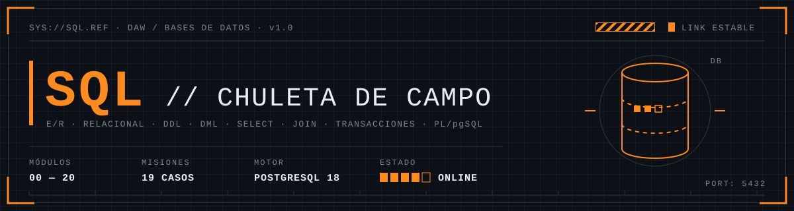
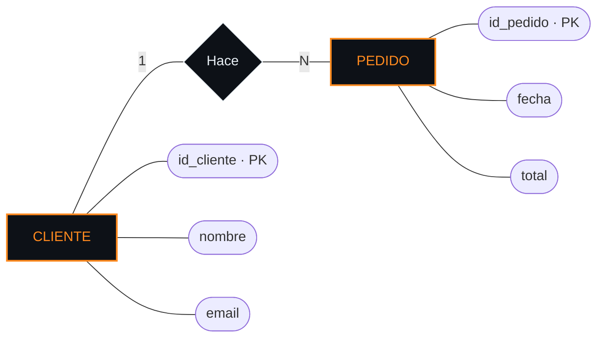
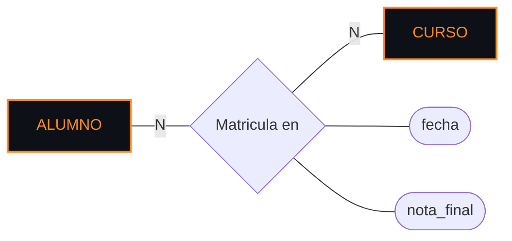
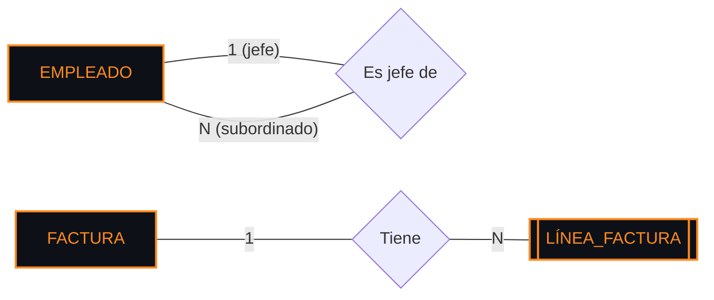
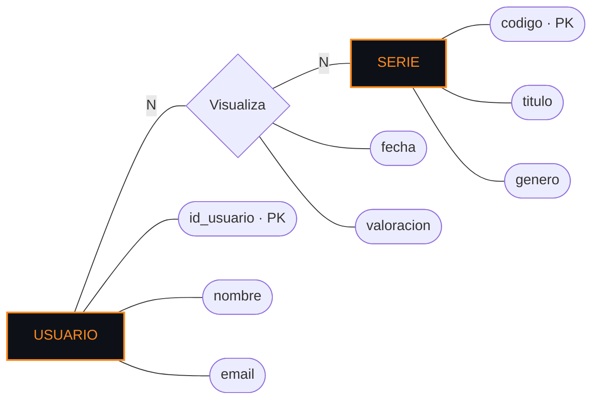
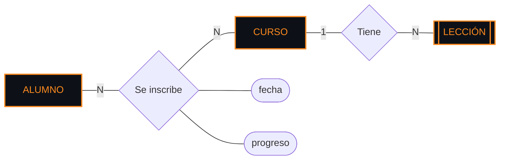

<p align="center">
  
</p>

<p align="center">
  
  
  
  
</p>

```text
> SYS://SQL.CHULETA ......................... v1.0
> USO ....................................... consulta rápida: Ctrl+F o índice
> CÓDIGO .................................... todo ejecutado en PostgreSQL real
> RESULTADOS ................................ copiados tal cual de la salida
> LEYENDA ................................... ▲ índice · ◂ anterior · ▸ siguiente
```

<a id="indice"></a>

## ⌖ ÍNDICE

| MOD | SECCIÓN | ACCESO DIRECTO |
|:---:|---|---|
| `DB` | [**BD de práctica**](#bd-practica) | [Cargarla](#bd-cargar) · [Diagrama](#bd-diagrama) |
| `00` | [**Conceptos base**](#mod-00) | [BD y SGBD](#sgbd) · [Cliente-servidor](#cliente-servidor) · [Jerarquía](#jerarquia) · [Sublenguajes SQL](#sublenguajes) |
| `01` | [**pgAdmin 4 y psql**](#mod-01) | [Interfaz](#pgadmin-interfaz) · [Query Tool](#query-tool) · [Atajos](#atajos) · [ERD Tool](#erd-tool) · [psql](#psql) |
| `02` | [**Modelo Entidad/Relación**](#mod-02) | [Elementos](#er-elementos) · [Atributos](#er-atributos) · [Cardinalidad](#er-cardinalidad) · [Participación](#er-participacion) · [Atributos de relación](#er-atributos-relacion) · [Casos especiales](#er-especiales) · [Método](#er-metodo) |
| `03` | [**Modelo relacional**](#mod-03) | [Vocabulario](#rel-vocabulario) · [Claves](#rel-claves) · [Notación](#rel-notacion) · [Paso E/R → tablas](#rel-paso) · [Ejemplo completo](#rel-ejemplo) |
| `04` | [**Normalización**](#mod-04) | [Para qué](#norm-para-que) · [1FN](#1fn) · [2FN](#2fn) · [3FN](#3fn) · [Resumen](#norm-resumen) |
| `05` | [**DDL: bases de datos y tablas**](#mod-05) | [Bases de datos](#ddl-database) · [Esquemas](#ddl-schema) · [CREATE TABLE](#ddl-create) · [ALTER TABLE](#ddl-alter) · [DROP / TRUNCATE](#ddl-drop) · [Script re-ejecutable](#ddl-script) |
| `06` | [**Tipos de datos**](#mod-06) | [Números](#tipos-numeros) · [Texto](#tipos-texto) · [Fechas](#tipos-fechas) · [Otros](#tipos-otros) · [¿Cuál elijo?](#tipos-elegir) |
| `07` | [**Restricciones**](#mod-07) | [Resumen](#restr-resumen) · [PRIMARY KEY](#restr-pk) · [IDENTITY](#restr-identity) · [FOREIGN KEY](#restr-fk) · [ON DELETE](#restr-on-delete) · [UNIQUE / NOT NULL / CHECK / DEFAULT](#restr-otras) · [ENUM](#restr-enum) · [Columnas generadas](#restr-generadas) · [Nombrarlas](#restr-nombres) |
| `08` | [**DML: INSERT, UPDATE, DELETE**](#mod-08) | [INSERT](#dml-insert) · [UPDATE](#dml-update) · [DELETE](#dml-delete) · [RETURNING](#dml-returning) · [UPSERT](#dml-upsert) · [Seguridad](#dml-seguridad) |
| `09` | [**SELECT básico**](#mod-09) | [Estructura](#sel-estructura) · [Orden de ejecución](#sel-orden) · [WHERE](#sel-where) · [LIKE](#sel-like) · [NULL](#sel-null) · [ORDER BY / LIMIT](#sel-order) · [DISTINCT](#sel-distinct) · [CASE](#sel-case) |
| `10` | [**Funciones**](#mod-10) | [Texto](#fn-texto) · [Números](#fn-numeros) · [Fechas](#fn-fechas) · [Conversión](#fn-conversion) |
| `11` | [**Agrupar y agregar**](#mod-11) | [Agregados](#agg-funciones) · [GROUP BY](#agg-group) · [HAVING](#agg-having) · [WHERE vs HAVING](#agg-where-having) |
| `12` | [**JOIN**](#mod-12) | [Tipos](#join-tipos) · [INNER](#join-inner) · [LEFT](#join-left) · [Buscar huérfanos](#join-huerfanos) · [Varias tablas](#join-varias) · [Self join](#join-self) · [¿Cuál elijo?](#join-elegir) |
| `13` | [**Subconsultas, CTE y conjuntos**](#mod-13) | [Escalares](#sub-escalar) · [IN / EXISTS](#sub-in-exists) · [En FROM](#sub-from) · [WITH](#sub-cte) · [UNION…](#sub-conjuntos) · [Ventana](#sub-ventana) |
| `14` | [**Vistas e índices**](#mod-14) | [Vistas](#vistas) · [Índices](#indices) · [EXPLAIN](#explain) |
| `15` | [**Transacciones**](#mod-15) | [ACID](#acid) · [BEGIN / COMMIT / ROLLBACK](#tx-comandos) · [En pgAdmin](#tx-pgadmin) |
| `16` | [**Usuarios y permisos**](#mod-16) | [Roles](#roles) · [GRANT / REVOKE](#grant) · [Privilegios](#privilegios) |
| `17` | [**Programación en la BD**](#mod-17) | [Funciones](#plpgsql-funciones) · [PL/pgSQL](#plpgsql-sintaxis) · [Procedimientos](#plpgsql-procedimientos) · [Triggers](#triggers) |
| `18` | [**Copias, importar y exportar**](#mod-18) | [Backup / Restore](#backup) · [CSV](#csv) |
| `19` | [**Errores frecuentes**](#mod-19) | [Tabla de diagnóstico](#errores-tabla) · [Leer un error](#errores-leer) |
| `20` | [**Misiones: casos reales**](#mod-20) | [Diseño](#mis-diseno) · [Consultas](#mis-consultas) · [Modificación](#mis-modificacion) |

---

<a id="bd-practica"></a>

## `DB` BD DE PRÁCTICA

Todos los ejemplos (salvo los de creación de tablas) usan **`tienda_online`**, una tienda en línea con clientes, productos, pedidos y empleados. Los datos incluyen a propósito casos "incómodos": clientes sin pedidos, productos que nunca se han vendido, una categoría vacía, teléfonos a `NULL`, pedidos sin empleado… Son justo los que hacen fallar las consultas mal planteadas.

<a id="bd-cargar"></a>

### ▸ Cargarla en pgAdmin

1. Query Tool sobre la BD `postgres` → `CREATE DATABASE tienda_online;` → `F5`.
2. Clic derecho en *Databases* → **Refresh**.
3. Clic derecho en `tienda_online` → **Query Tool** → abrir [`sql/tienda_online.sql`](sql/tienda_online.sql) (`Ctrl+O`) → `F5`.

El script empieza borrando todo, así que puedes **volver a ejecutarlo** cuando quieras dejar los datos como al principio (por ejemplo, después de practicar `DELETE`).

<a id="bd-diagrama"></a>

### ▸ Diagrama

```mermaid
erDiagram
    categorias ||--o{ productos : "clasifica"
    productos ||--o{ lineas_pedido : "aparece en"
    pedidos ||--|{ lineas_pedido : "contiene"
    clientes ||--o{ pedidos : "realiza"
    empleados |o--o{ pedidos : "gestiona"
    empleados |o--o{ empleados : "es jefe de"

    categorias {
        integer id_categoria PK
        varchar nombre UK
    }
    productos {
        integer id_producto PK
        integer id_categoria FK
        varchar nombre
        numeric precio
        integer stock
        boolean activo
        date fecha_alta
    }
    clientes {
        integer id_cliente PK
        varchar nombre
        varchar apellidos
        varchar email UK
        varchar ciudad "puede ser NULL"
        varchar telefono "puede ser NULL"
        date fecha_registro
    }
    empleados {
        integer id_empleado PK
        varchar nombre
        varchar puesto
        integer id_jefe FK "NULL = sin jefe"
        numeric salario
        date fecha_contrato
    }
    pedidos {
        integer id_pedido PK
        integer id_cliente FK
        integer id_empleado FK "NULL = venta web"
        timestamp fecha
        estado_pedido estado "enum"
        numeric gastos_envio
    }
    lineas_pedido {
        integer id_pedido PK,FK
        integer id_producto PK,FK
        integer cantidad
        numeric precio_unitario
        numeric subtotal "generada"
    }
```



| Tabla | Filas | Qué representa |
|---|:---:|---|
| `categorias` | 5 | *Gaming* no tiene productos |
| `productos` | 12 | *Hub USB-C* y *SSD externo* nunca se han vendido; la *Cafetera* está descatalogada (`activo = false`) |
| `clientes` | 8 | *Andrea* y *Diego* no han hecho pedidos; varios sin teléfono o ciudad |
| `empleados` | 5 | Jerarquía: Carmen → Tomás → Nuria, Iván; Carmen → Rosa |
| `pedidos` | 10 | Estados variados; 2 pedidos sin empleado (venta web) |
| `lineas_pedido` | 18 | Tabla intermedia N:M con `cantidad` y `precio_unitario` del momento de la venta |

<sub>[▲ ÍNDICE](#indice) · [MOD.00 ▸](#mod-00)</sub>

---

<a id="mod-00"></a>

## `00` CONCEPTOS BASE

```text
┌─[ MOD.00 ]─────────────────────────────────────────────── CONCEPTOS ─┐
│  BD · SGBD · cliente-servidor · sublenguajes                         │
└─────────────────────────────────────────────────────────── SYS.OK ───┘
```

<a id="sgbd"></a>

### ▸ BD, SGBD y compañía

| Término | Qué es | En tu entorno |
|---|---|---|
| **Base de datos (BD)** | Conjunto organizado de datos relacionados | `tienda_online`, `clinica_plus` |
| **SGBD** (gestor de bases de datos) | Software que guarda los datos, ejecuta SQL y controla accesos, usuarios y transacciones | **PostgreSQL** |
| **Cliente** | Programa que se conecta al SGBD para mandarle órdenes | **pgAdmin 4** (gráfico), **psql** (terminal), tu aplicación Java |
| **BD relacional** | Los datos se guardan en tablas relacionadas mediante claves | PostgreSQL, MySQL, Oracle, SQL Server |
| **SQL** | Lenguaje estándar para hablar con una BD relacional | `SELECT`, `CREATE TABLE`… |
| **NoSQL** | BD no basadas en tablas: documentos, clave-valor, grafos | MongoDB, Redis, Neo4j |

> [!NOTE]
> **pgAdmin no es la base de datos.** Es solo un cliente con ventanas. PostgreSQL funciona igual sin pgAdmin: es un servicio en segundo plano que escucha en el puerto **5432**.

<a id="cliente-servidor"></a>

### ▸ Arquitectura cliente-servidor

```text
 ┌──────────────┐   servidor · puerto · usuario · contraseña · BD   ┌──────────────────┐
 │  pgAdmin 4   │ ────────────────────────────────────────────────▶ │                  │
 │  psql        │            SQL  ───────────────────────▶          │   PostgreSQL     │
 │  App Java    │            ◀───────────────────────  filas        │   (servicio)     │
 └──────────────┘                                                   │   :5432          │
     CLIENTES                                                       └──────────────────┘
```

Para conectarse siempre hacen falta 5 datos: **servidor** (`localhost`), **puerto** (`5432`), **usuario** (`postgres`), **contraseña** y **base de datos**.

<a id="jerarquia"></a>

### ▸ Jerarquía de objetos

```text
Servidor (PostgreSQL 18)
└── Base de datos   (tienda_online)        ← siempre te conectas a UNA base de datos concreta
    └── Esquema      (public)               ← "carpeta"; toda BD nueva trae public
        ├── Tablas   (clientes, pedidos…)
        ├── Vistas
        ├── Funciones / procedimientos
        ├── Secuencias
        └── Tipos    (estado_pedido)
```

La BD **`postgres`** existe para que siempre haya una a la que conectarse: desde ella se crean y borran las demás bases de datos.

<a id="sublenguajes"></a>

### ▸ Sublenguajes de SQL

| Sublenguaje | Para qué | Sentencias | Módulo |
|---|---|---|---|
| **DDL** (Data Definition) | Definir la estructura | `CREATE`, `ALTER`, `DROP`, `TRUNCATE` | [05](#mod-05) · [07](#mod-07) |
| **DML** (Data Manipulation) | Modificar los datos | `INSERT`, `UPDATE`, `DELETE` | [08](#mod-08) |
| **DQL** (Data Query) | Consultar los datos | `SELECT` | [09](#mod-09) – [13](#mod-13) |
| **DCL** (Data Control) | Permisos | `GRANT`, `REVOKE` | [16](#mod-16) |
| **TCL** (Transaction Control) | Transacciones | `BEGIN`, `COMMIT`, `ROLLBACK` | [15](#mod-15) |

> [!TIP]
> SQL no distingue mayúsculas en palabras clave ni en nombres: `select`, `SELECT` y `Select` son iguales. La convención es **palabras clave en MAYÚSCULAS** y **nombres en minúsculas_con_guion_bajo** (`id_cliente`). Así lo verás en esta chuleta.

<sub>[▲ ÍNDICE](#indice) · [◂ DB](#bd-practica) · [MOD.01 ▸](#mod-01)</sub>

---

<a id="mod-01"></a>

## `01` PGADMIN 4 Y PSQL

```text
┌─[ MOD.01 ]─────────────────────────────────────────────── PGADMIN 4 ─┐
│  Object Explorer · Query Tool · ERD · psql                           │
└─────────────────────────────────────────────────────────── SYS.OK ───┘
```

<a id="pgadmin-interfaz"></a>

### ▸ Interfaz

| Zona | Para qué |
|---|---|
| **Object Explorer** (árbol izquierdo) | Navegar: *Servers → PostgreSQL 18 → Databases → tienda_online → Schemas → public → Tables* |
| **Query Tool** | Escribir y ejecutar SQL |
| **Data Output** (debajo del editor) | Resultado de la consulta en forma de tabla |
| **Messages** | Mensajes: filas afectadas, tiempo, errores |
| **Query History** | Consultas ejecutadas anteriormente |

> [!IMPORTANT]
> pgAdmin **no refresca solo** el árbol. Después de un `CREATE` o `DROP` hecho con SQL, clic derecho → **Refresh** (o `F5` con el árbol seleccionado) para ver el cambio.

<a id="query-tool"></a>

### ▸ Query Tool

- Se abre con clic derecho sobre una **base de datos** → *Query Tool*. La pestaña indica dónde estás: `bd/usuario@servidor` (por ejemplo `tienda_online/postgres@PostgreSQL 18`).
- **El SQL se ejecuta en la BD de esa pestaña.** Si creas tablas con la Query Tool abierta en `postgres`, se crean en `postgres`.
- `CREATE DATABASE` y `DROP DATABASE` se lanzan desde una Query Tool abierta en **otra** BD (normalmente `postgres`).
- Si seleccionas un trozo de código y pulsas `F5`, **solo se ejecuta lo seleccionado**. Así puedes tener un script largo y lanzar sentencia a sentencia.
- Si ejecutas varios `SELECT` a la vez, *Data Output* muestra solo el resultado del **último**.
- **Ver datos sin SQL:** clic derecho en la tabla → *View/Edit Data → All Rows*.
- **Ver el SQL que creó una tabla:** selecciona la tabla → pestaña **SQL** del panel derecho. Sirve para descubrir los nombres automáticos de las restricciones.

<a id="atajos"></a>

### ▸ Atajos de teclado

| Atajo | Dónde | Acción |
|---|---|---|
| `F5` | Query Tool | Ejecutar (todo o la selección) |
| `F7` / `Shift+F7` | Query Tool | `EXPLAIN` / `EXPLAIN ANALYZE` de la consulta |
| `F8` | Query Tool | Descargar el resultado como CSV |
| `Ctrl+/` | Query Tool | Comentar / descomentar líneas |
| `Ctrl+Espacio` | Query Tool | Autocompletar nombres de tablas y columnas |
| `Ctrl+O` / `Ctrl+S` | Query Tool | Abrir / guardar archivo `.sql` |
| `Ctrl+F` | Query Tool | Buscar |
| `F5` | Object Explorer | Refrescar el árbol |
| `Alt+Shift+Q` | Object Explorer | Abrir Query Tool en lo seleccionado |
| `Alt+Shift+D` | Object Explorer | Borrar el objeto seleccionado |

<sub>Se pueden cambiar en *File → Preferences → Keyboard shortcuts*.</sub>

<a id="erd-tool"></a>

### ▸ ERD Tool (diagramas → SQL)

Clic derecho en una BD → **ERD For Database**. Dibuja el diagrama de las tablas que ya existen. Desde cero, también se puede crear con *Tools → ERD Tool*.

| Acción | Cómo |
|---|---|
| Añadir tabla | Botón **+** o doble clic en el lienzo |
| Relación 1:N | Botón **1M**: elige la tabla y la columna local y la tabla y columna referenciada |
| Relación N:M | Botón **MM**: crea sola la tabla intermedia |
| Generar el SQL | Botón **Generate SQL**: abre una Query Tool con todos los `CREATE TABLE` |
| Guardar | Archivo `.pgerd` (solo lo abre pgAdmin) |

> [!TIP]
> El SQL que genera el ERD Tool es un buen modo de **comprobar tu script**: diseña con el diagrama, genera el SQL y compáralo con el tuyo.

<a id="psql"></a>

### ▸ psql (consola)

En pgAdmin: clic derecho en una BD → **PSQL Tool**. Los comandos con barra `\` son **solo de psql**: no funcionan en la Query Tool.

| Comando | Hace |
|---|---|
| `\l` | Listar bases de datos |
| `\c tienda_online` | Conectarse a otra BD |
| `\dt` | Listar tablas |
| `\d clientes` | Estructura de una tabla (columnas, restricciones, índices) |
| `\dT+` | Listar tipos (ENUM incluidos) |
| `\dv` · `\df` · `\du` · `\dn` | Vistas · funciones · usuarios · esquemas |
| `\i ruta/script.sql` | Ejecutar un archivo |
| `\x` | Alternar vista vertical (útil con tablas anchas) |
| `\q` | Salir |

<sub>[▲ ÍNDICE](#indice) · [◂ MOD.00](#mod-00) · [MOD.02 ▸](#mod-02)</sub>

---

<a id="mod-02"></a>

## `02` MODELO ENTIDAD/RELACIÓN

```text
┌─[ MOD.02 ]────────────────────────────────────────────── MODELO E/R ─┐
│  entidades · atributos · relaciones · cardinalidad                   │
└─────────────────────────────────────────────────────────── SYS.OK ───┘
```

El modelo E/R es el **plano** de la base de datos: se dibuja **antes** de escribir SQL, a partir del enunciado. No depende del SGBD.

<a id="er-elementos"></a>

### ▸ Elementos (notación Chen)

| Elemento | Qué es | Símbolo | Ejemplo |
|---|---|---|---|
| **Entidad** | Objeto o concepto del mundo real, con existencia propia, del que se guarda información | Rectángulo | `PACIENTE`, `PEDIDO` |
| **Atributo** | Característica que describe a una entidad | Óvalo | `nombre`, `fecha` |
| **Clave primaria** | Atributo (o combinación) que identifica **de forma única** cada instancia | Óvalo con el nombre **subrayado** | `DNI`, `id_pedido` |
| **Relación** | Vínculo con significado entre entidades, normalmente un **verbo** | Rombo | *Hace*, *Atiende*, *Matricula* |
| **Cardinalidad** | Cuántas instancias de una entidad se asocian con cuántas de la otra | `1` / `N` en las líneas | `1:N` |



<sub>"Un cliente **hace** N pedidos; cada pedido lo hace 1 cliente".</sub>

<a id="er-atributos"></a>

### ▸ Tipos de atributo

| Tipo | Qué es | Ejemplo | Cómo pasa a tablas |
|---|---|---|---|
| **Simple** | Un único valor indivisible | `dni` | Una columna |
| **Compuesto** | Se divide en partes | `dirección` = calle + número + CP + ciudad | Una columna por parte |
| **Multivaluado** | Puede tener varios valores | `teléfonos` de un cliente | **Tabla aparte** con FK |
| **Derivado** | Se calcula a partir de otros | `edad` (de `fecha_nacimiento`), `total` (de las líneas) | Normalmente no se guarda: se calcula en la consulta |
| **Opcional** | Puede no tener valor | `teléfono` | Columna que admite `NULL` |

<a id="er-cardinalidad"></a>

### ▸ Cardinalidad

| Tipo | Se lee | Ejemplo real | Pregunta para detectarla |
|:---:|---|---|---|
| **1:1** | Cada A con una B como máximo, y al revés | Empleado — *tiene* — Puesto de parking | ¿Un A puede tener varias B? No. ¿Una B varios A? No |
| **1:N** | Cada A con muchas B; cada B con una sola A | Editorial — *publica* — Libro | ¿Un libro tiene varias editoriales? No. ¿Una editorial varios libros? Sí |
| **N:M** | Cada A con muchas B y cada B con muchas A | Alumno — *se matricula en* — Curso | Las dos preguntas responden **sí** |

> [!TIP]
> **Truco de las dos preguntas:** pregunta en los dos sentidos *"¿uno de estos puede tener varios de aquellos?"*. Dos "no" → `1:1`. Un "sí" → `1:N`. Dos "sí" → `N:M`.

<a id="er-participacion"></a>

### ▸ Participación: (mínimo, máximo)

La cardinalidad dice el **máximo**. La participación añade el **mínimo**: si es **obligatorio** (1) u **opcional** (0) estar relacionado. Se escribe `(mín, máx)` junto a cada entidad.

| Frase del enunciado | Participación |
|---|---|
| "Un cliente **puede** hacer varios pedidos" | `(0,N)`: puede no tener ninguno |
| "El taller **solo da de alta** a un propietario **cuando trae al menos un** vehículo" | `(1,N)`: mínimo uno |
| "Cada pedido pertenece a **un único** cliente" | `(1,1)`: exactamente uno |
| "Un producto **puede no haberse vendido nunca**" | `(0,N)` |


<sub>Se lee cruzando el rombo: "un PEDIDO lo hace mínimo 1 y máximo 1 CLIENTE"; "un CLIENTE hace mínimo 0 y máximo N PEDIDOS".</sub>

> [!NOTE]
> Hay varias notaciones y cambia en qué lado se escribe cada `(mín, máx)`. Usa la de tu profesor: en tus apuntes la cardinalidad aparece como `1` y `N` en los extremos de la relación. En SQL, el mínimo se traduce a `NOT NULL` (obligatorio) o a permitir `NULL` (opcional) en la clave foránea.

<a id="er-atributos-relacion"></a>

### ▸ Atributos de relación

En una relación **N:M**, a veces hay datos que no son ni de una entidad ni de la otra, sino **del vínculo**. Ninguno de esos atributos es clave primaria.

| Caso | Entidades | Atributos **de la relación** |
|---|---|---|
| Matrícula en una academia | ALUMNO — CURSO | `fecha`, `nota_final` |
| Línea de pedido | PEDIDO — PRODUCTO | `cantidad`, `precio_unitario` |
| Reparto de una película | PELÍCULA — ACTOR | `personaje` |
| Consulta médica | MÉDICO — PACIENTE | `fecha`, `diagnóstico` |



<sub>La nota no es "del alumno" (tiene una por curso) ni "del curso" (tiene una por alumno): es de la matrícula.</sub>

<a id="er-especiales"></a>

### ▸ Casos especiales

| Caso | Qué es | Ejemplo | Cómo se representa |
|---|---|---|---|
| **Entidad débil** | Solo existe si existe otra (la fuerte) y se identifica con ayuda de su clave | `LÍNEA_FACTURA` depende de `FACTURA`; `HABITACIÓN` de `HOTEL` | Doble rectángulo y rombo doble |
| **Relación reflexiva** | Una entidad se relaciona consigo misma | `EMPLEADO` *es jefe de* `EMPLEADO` | Las dos líneas del rombo van a la misma entidad |
| **Relación ternaria** | Relación entre tres entidades a la vez | `PROFESOR` *imparte* `ASIGNATURA` en `AULA` | Rombo con tres líneas |
| **Generalización (ES-UN)** | Una entidad general y subtipos con atributos propios | `PERSONA` → `ALUMNO`, `PROFESOR` | Triángulo `ES-UN` |



<a id="er-metodo"></a>

### ▸ Método para pasar de enunciado a diagrama

| Paso | Qué buscar en el texto | Ejemplo: *"Una tienda guarda de cada cliente su id, nombre y email. Un cliente puede hacer varios pedidos; cada pedido es de un único cliente. Del pedido interesa la fecha y el total."* |
|:---:|---|---|
| 1 | **Sustantivos con datos propios** → entidades | CLIENTE, PEDIDO |
| 2 | **"De cada X se guarda…"** → atributos | cliente: id, nombre, email · pedido: id, fecha, total |
| 3 | Lo que identifica de forma única → clave primaria | `id_cliente`, `id_pedido` |
| 4 | **Verbos que unen entidades** → relaciones | *hace* |
| 5 | **"varios", "uno solo", "al menos uno", "puede no"** → cardinalidad y participación | "varios pedidos" + "un único cliente" → `1:N` |
| 6 | **"De cada [vínculo] interesa…"** → atributos de relación | (no hay en este ejemplo) |

<sub>[▲ ÍNDICE](#indice) · [◂ MOD.01](#mod-01) · [MOD.03 ▸](#mod-03)</sub>

---

<a id="mod-03"></a>

## `03` MODELO RELACIONAL

```text
┌─[ MOD.03 ]─────────────────────────────────────── MODELO RELACIONAL ─┐
│  tablas · claves · paso desde E/R                                    │
└─────────────────────────────────────────────────────────── SYS.OK ───┘
```

<a id="rel-vocabulario"></a>

### ▸ Vocabulario

| Teoría | Práctica | Ejemplo |
|---|---|---|
| Relación | **Tabla** | `clientes` |
| Tupla | **Fila** (registro) | Lucía, Fernández Gil… |
| Atributo | **Columna** (campo) | `email` |
| Dominio | **Tipo** y valores permitidos | `VARCHAR(100)`, `CHECK (precio > 0)` |
| Grado | Número de columnas | `clientes` tiene grado 7 |
| Cardinalidad (de la tabla) | Número de filas | `clientes` tiene 8 |

<a id="rel-claves"></a>

### ▸ Claves

| Clave | Qué es | Ejemplo en `clientes` |
|---|---|---|
| **Superclave** | Cualquier conjunto de columnas que identifica una fila | `(id_cliente, nombre)` |
| **Candidata** | Superclave mínima (no le sobra ninguna columna) | `id_cliente`, `email` |
| **Primaria (PK)** | La candidata elegida como identificador oficial | `id_cliente` |
| **Alternativa** | Candidata no elegida → se declara `UNIQUE` | `email` |
| **Foránea (FK)** | Columna que apunta a la PK de otra tabla (o de la misma) | `pedidos.id_cliente → clientes.id_cliente` |
| **Natural** | Dato real que ya identifica | DNI, ISBN, matrícula |
| **Artificial / subrogada** | Número sin significado generado por la BD | `id_cliente` con `IDENTITY` |

> [!TIP]
> **¿Clave natural o artificial?** En la práctica se usa casi siempre una **artificial** (`id_… INTEGER GENERATED ALWAYS AS IDENTITY`) y la natural se declara `UNIQUE`. El DNI puede cambiar (o no existir, como en un bebé) y es largo para repetirlo como FK en otras tablas. Así lo hacen tus scripts: `id_paciente` como PK y `dni UNIQUE`.

<a id="rel-notacion"></a>

### ▸ Notación textual

```text
CLIENTES (id_cliente, nombre, email)                       PK subrayada (aquí: primera columna)
PEDIDOS  (id_pedido, fecha, total, id_cliente*)            FK con * o en cursiva
           id_cliente → CLIENTES
```

<a id="rel-paso"></a>

### ▸ Paso de E/R a tablas: reglas

| En el E/R | En el modelo relacional | Ejemplo |
|---|---|---|
| **Entidad** | Tabla con sus atributos; la clave pasa a PK | `CLIENTE` → `clientes` |
| **Relación 1:N** | La PK del lado **1** viaja como **FK al lado N** | `pedidos.id_cliente` |
| **Relación 1:1** | FK en **cualquiera** de los lados (mejor en el opcional) + `UNIQUE` | `plazas_parking.id_empleado UNIQUE` |
| **Relación N:M** | **Tabla nueva** con las dos FK + los atributos de la relación | `lineas_pedido (id_pedido, id_producto, cantidad, precio_unitario)` |
| **Atributo multivaluado** | Tabla nueva con FK a la entidad | `telefonos_cliente (id_cliente, telefono)` |
| **Atributo compuesto** | Una columna por componente | `calle`, `numero`, `cp`, `ciudad` |
| **Atributo derivado** | No se guarda (se calcula) o columna generada | `edad`, `subtotal` |
| **Entidad débil** | Tabla cuya PK incluye la FK a la fuerte | `lineas_factura (id_factura, num_linea, …)` |
| **Reflexiva 1:N** | FK a la propia tabla | `empleados.id_jefe → empleados` |
| **Participación obligatoria (1,…)** en el lado N | FK `NOT NULL` | `pedidos.id_cliente NOT NULL` |
| **Participación opcional (0,…)** en el lado N | FK que admite `NULL` | `pedidos.id_empleado` |

**Tabla intermedia N:M: dos formas válidas de definir la PK**

| Opción | Definición | Cuándo |
|---|---|---|
| **A · PK compuesta** | `PRIMARY KEY (id_pedido, id_producto)` | Lo más directo: la pareja no se puede repetir. Así está `lineas_pedido` |
| **B · id propio + UNIQUE** | `id_detalle … IDENTITY PRIMARY KEY` y `UNIQUE (id_pedido, id_libro)` | Si otras tablas tienen que apuntar a la línea o se prefiere una PK simple. Así están tus `detalle_pedidos` y `citas` |
| B sin `UNIQUE` | Solo `id` propio | Cuando la pareja **sí** se puede repetir: un médico atiende al mismo paciente en fechas distintas |

<a id="rel-ejemplo"></a>

### ▸ Ejemplo completo: de enunciado a tablas

> *Una plataforma de streaming registra qué series ha visto cada usuario. De cada usuario se guarda un identificador, nombre y email. De cada serie, un código, título y género. Un usuario puede ver varias series y una serie puede ser vista por varios usuarios. De cada visualización interesa la fecha y la valoración.*

**1 · E/R**



**2 · Relacional**

```text
USUARIOS        (id_usuario, nombre, email)
SERIES          (codigo, titulo, genero)
VISUALIZACIONES (id_visualizacion, id_usuario*, codigo_serie*, fecha, valoracion)
```

<sub>Se usa un id propio en `visualizaciones` porque un usuario puede volver a ver la misma serie otro día.</sub>

**3 · SQL**

```sql
CREATE TABLE usuarios (
    id_usuario  INTEGER GENERATED ALWAYS AS IDENTITY PRIMARY KEY,
    nombre      VARCHAR(100) NOT NULL,
    email       VARCHAR(100) NOT NULL UNIQUE
);

CREATE TABLE series (
    codigo  VARCHAR(10) PRIMARY KEY,                -- clave natural: la da la plataforma
    titulo  VARCHAR(150) NOT NULL,
    genero  VARCHAR(30)
);

CREATE TABLE visualizaciones (
    id_visualizacion  INTEGER GENERATED ALWAYS AS IDENTITY PRIMARY KEY,
    id_usuario        INTEGER NOT NULL REFERENCES usuarios (id_usuario),
    codigo_serie      VARCHAR(10) NOT NULL REFERENCES series (codigo),
    fecha             DATE NOT NULL DEFAULT CURRENT_DATE,
    valoracion        SMALLINT CHECK (valoracion BETWEEN 1 AND 5)
);
```

<sub>[▲ ÍNDICE](#indice) · [◂ MOD.02](#mod-02) · [MOD.04 ▸](#mod-04)</sub>

---

<a id="mod-04"></a>

## `04` NORMALIZACIÓN

```text
┌─[ MOD.04 ]─────────────────────────────────────────── NORMALIZACIÓN ─┐
│  1FN · 2FN · 3FN · eliminar redundancia                              │
└─────────────────────────────────────────────────────────── SYS.OK ───┘
```

<a id="norm-para-que"></a>

### ▸ Para qué sirve

Normalizar es reorganizar las tablas para que **cada dato esté guardado en un solo sitio**. Así se evitan las **anomalías**:

| Anomalía | Qué pasa si el dato está repetido |
|---|---|
| De **actualización** | Cambias la ciudad de un cliente en una fila y se te olvida en las otras 20 → datos contradictorios |
| De **inserción** | No puedes dar de alta un producto hasta que alguien lo compre (porque solo existe dentro de los pedidos) |
| De **borrado** | Borras el único pedido de un cliente y desaparecen también sus datos |

**Tabla de partida (sin normalizar):**

| id_pedido | fecha | cliente | ciudad_cliente | productos |
|---|---|---|---|---|
| 1 | 2026-01-15 | Lucía | Madrid | Portátil (649), Ratón (99) |
| 3 | 2026-03-22 | Lucía | Madrid | Auriculares (329) |

<a id="1fn"></a>

### ▸ 1FN: valores atómicos

> **Cada celda guarda un solo valor** (nada de listas) y no hay grupos repetidos (`producto1`, `producto2`, `producto3`…).

| id_pedido | id_producto | fecha | cliente | ciudad_cliente | producto | precio |
|---|---|---|---|---|---|---|
| 1 | 1 | 2026-01-15 | Lucía | Madrid | Portátil | 649 |
| 1 | 4 | 2026-01-15 | Lucía | Madrid | Ratón | 99 |
| 3 | 6 | 2026-03-22 | Lucía | Madrid | Auriculares | 329 |

<sub>PK: `(id_pedido, id_producto)`. Ya es 1FN, pero la fecha y Lucía se repiten.</sub>

<a id="2fn"></a>

### ▸ 2FN: nada depende de solo una parte de la clave

> 1FN + cada columna depende de **toda** la PK, no de una parte. **Solo puede fallar con PK compuesta.**

- `fecha`, `cliente` y `ciudad_cliente` dependen solo de `id_pedido` → se van a **PEDIDOS**.
- `producto` depende solo de `id_producto` → se va a **PRODUCTOS**.
- `precio` (el de la venta) sí depende de las dos → se queda en **LÍNEAS**.

```text
PEDIDOS   (id_pedido, fecha, cliente, ciudad_cliente)
PRODUCTOS (id_producto, nombre)
LINEAS    (id_pedido*, id_producto*, precio)
```

<a id="3fn"></a>

### ▸ 3FN: nada depende de otra columna que no sea la clave

> 2FN + ninguna columna depende de **otra columna no clave** (dependencia transitiva).

`ciudad_cliente` depende del cliente, no del pedido (`id_pedido → cliente → ciudad`) → se va a **CLIENTES**.

```text
CLIENTES  (id_cliente, nombre, ciudad)
PEDIDOS   (id_pedido, fecha, id_cliente*)
PRODUCTOS (id_producto, nombre)
LINEAS    (id_pedido*, id_producto*, precio)
```

<sub>Es justo la estructura de `tienda_online`.</sub>

<a id="norm-resumen"></a>

### ▸ Resumen

| Forma | Regla en una frase | Señal de que no se cumple |
|---|---|---|
| **1FN** | Una celda = un valor | Comas dentro de una celda, columnas `telefono1`, `telefono2` |
| **2FN** | Todo depende de **toda** la clave | Con PK compuesta, una columna que se repite cada vez que se repite **una** de las partes |
| **3FN** | Todo depende **solo** de la clave | Una columna que se puede deducir de otra que no es la PK (`cp → ciudad`) |
| **FNBC** | Todo determinante es clave candidata | Casos raros; con 3FN bien hecha casi siempre se cumple |

> [!TIP]
> Regla para recordarlo: cada columna depende de **la clave** (1FN), de **toda la clave** (2FN) y de **nada más que la clave** (3FN).

> [!NOTE]
> A veces se **desnormaliza** a propósito por rendimiento o por historia: `lineas_pedido.precio_unitario` repite el precio del producto, pero guarda el del **momento de la venta**, que puede no coincidir con el actual.

<sub>[▲ ÍNDICE](#indice) · [◂ MOD.03](#mod-03) · [MOD.05 ▸](#mod-05)</sub>

---

<a id="mod-05"></a>

## `05` DDL: BASES DE DATOS Y TABLAS

```text
┌─[ MOD.05 ]───────────────────────────────────────────────────── DDL ─┐
│  CREATE · ALTER · DROP · TRUNCATE                                    │
└─────────────────────────────────────────────────────────── SYS.OK ───┘
```

<a id="ddl-database"></a>

### ▸ Bases de datos

```sql
-- Desde una Query Tool abierta en OTRA base de datos (normalmente postgres)
CREATE DATABASE vuelos;

DROP DATABASE vuelos;
DROP DATABASE IF EXISTS vuelos;                -- no da error si no existe
DROP DATABASE vuelos WITH (FORCE);             -- cierra las conexiones abiertas y la borra

ALTER DATABASE vuelos RENAME TO aerolinea;
```

> [!WARNING]
> - `CREATE DATABASE` y `DROP DATABASE` **no se pueden ejecutar dentro de una transacción** ni seleccionados junto con otras sentencias del script. Lánzalos solos.
> - No puedes borrar la BD en la que estás conectado (*"no se puede eliminar la base de datos activa"*) → cambia de Query Tool a `postgres`.
> - Si alguna pestaña de pgAdmin sigue conectada, el `DROP` falla con *"la base de datos «x» está siendo utilizada por otros usuarios"* → `WITH (FORCE)` o clic derecho → *Disconnect from database*.

<a id="ddl-schema"></a>

### ▸ Esquemas

Un esquema es una carpeta dentro de la BD. Toda BD nueva trae `public` y, si no indicas otro, todo se crea allí.

```sql
CREATE SCHEMA ventas;
CREATE TABLE ventas.facturas (id INTEGER PRIMARY KEY);   -- esquema.tabla
DROP SCHEMA ventas CASCADE;                              -- borra el esquema y todo lo que contiene
```

<a id="ddl-create"></a>

### ▸ CREATE TABLE

```sql
CREATE TABLE nombre_tabla (
    columna1  TIPO  [restricciones],
    columna2  TIPO  [restricciones],
    ...
    [restricciones de tabla]        -- las que afectan a varias columnas
);                                  -- ✖ sin coma después de la última línea
```

```sql
-- Mascotas de una clínica veterinaria
CREATE TABLE mascotas (
    id_mascota        INTEGER GENERATED ALWAYS AS IDENTITY PRIMARY KEY,
    nombre            VARCHAR(50)  NOT NULL,
    especie           VARCHAR(40)  NOT NULL,
    fecha_nacimiento  DATE,
    peso_kg           NUMERIC(4,1) CHECK (peso_kg > 0),     -- 999.9 como máximo
    vacunada          BOOLEAN NOT NULL DEFAULT FALSE
);

CREATE TABLE IF NOT EXISTS mascotas (id INTEGER);   -- si ya existe, solo da un aviso
```

**Crear una tabla a partir de una consulta** (copia estructura y datos, **pero no las restricciones**):

```sql
CREATE TABLE clientes_madrid AS
SELECT id_cliente, nombre, email FROM clientes WHERE ciudad = 'Madrid';

SELECT * FROM clientes_madrid;
```
<sub>▸ RESULTADO</sub>

```text
 id_cliente | nombre |           email            
------------+--------+----------------------------
          1 | Lucía  | lucia.fernandez@correo.com
          3 | Elena  | elena.navarro@correo.com
          8 | Diego  | diego.santos@correo.com
```

<a id="ddl-alter"></a>

### ▸ ALTER TABLE

```sql
-- Columnas
ALTER TABLE alumnos ADD COLUMN email VARCHAR(100);
ALTER TABLE alumnos ADD COLUMN activo BOOLEAN NOT NULL DEFAULT TRUE;  -- las filas existentes reciben TRUE
ALTER TABLE alumnos RENAME COLUMN email TO correo_electronico;
ALTER TABLE alumnos ALTER COLUMN nombre TYPE VARCHAR(100);           -- cambiar el tipo
ALTER TABLE alumnos ALTER COLUMN nota TYPE INTEGER USING nota::INTEGER; -- cambiar tipo convirtiendo los datos
ALTER TABLE alumnos DROP COLUMN correo_electronico;

-- Valores por defecto y NOT NULL
ALTER TABLE alumnos ALTER COLUMN nota SET DEFAULT 0;
ALTER TABLE alumnos ALTER COLUMN nota DROP DEFAULT;
ALTER TABLE alumnos ALTER COLUMN nombre SET NOT NULL;     -- falla si ya hay algún NULL
ALTER TABLE alumnos ALTER COLUMN nombre DROP NOT NULL;

-- Restricciones
ALTER TABLE alumnos ADD CONSTRAINT ck_alumnos_nota CHECK (nota BETWEEN 0 AND 10);
ALTER TABLE alumnos ADD CONSTRAINT uq_alumnos_nombre UNIQUE (nombre);
ALTER TABLE alumnos DROP CONSTRAINT uq_alumnos_nombre;

-- La tabla
ALTER TABLE alumnos RENAME TO info_alumnos;
```

Para añadir una **clave foránea** a una tabla que ya existe:

```sql
ALTER TABLE alumnos
    ADD CONSTRAINT fk_alumnos_cursos FOREIGN KEY (id_curso) REFERENCES cursos (id_curso);
```

<a id="ddl-drop"></a>

### ▸ DROP, TRUNCATE y DELETE

```sql
DROP TABLE alumnos;                       -- borra la tabla (estructura + datos)
DROP TABLE IF EXISTS alumnos;             -- sin error si no existe
DROP TABLE alumnos CASCADE;               -- borra también las FK de otras tablas que apuntan a ella
TRUNCATE TABLE alumnos;                   -- vacía la tabla, deja la estructura
TRUNCATE TABLE alumnos RESTART IDENTITY;  -- vacía y reinicia los id a 1
```

| Quiero… | Uso | Estructura | Datos | `WHERE` | Reinicia ids |
|---|---|:---:|:---:|:---:|:---:|
| Borrar algunas filas | `DELETE FROM … WHERE …` | se queda | algunas | ✔ | ✖ |
| Vaciar la tabla | `TRUNCATE` | se queda | todas | ✖ | con `RESTART IDENTITY` |
| Eliminar la tabla | `DROP TABLE` | desaparece | todas | ✖ | — |

Una tabla referenciada por otra **no se puede borrar** mientras exista la FK:

```sql
DROP TABLE clientes;
```
<sub>✖ RESPUESTA DE POSTGRESQL</sub>

```text
ERROR:  no se puede eliminar tabla clientes porque otros objetos dependen de él
DETAIL:  restricción «pedidos_id_cliente_fkey» en tabla pedidos depende de tabla clientes
HINT:  Use DROP ... CASCADE para eliminar además los objetos dependientes.
```

<a id="ddl-script"></a>

### ▸ Script re-ejecutable

Patrón para poder lanzar el mismo `.sql` las veces que quieras (como `tienda_online.sql`):

```sql
-- 1. Borrar en orden INVERSO a la creación (primero las tablas "hijas", que tienen FK)
DROP TABLE IF EXISTS lineas_pedido;
DROP TABLE IF EXISTS pedidos;
DROP TABLE IF EXISTS clientes;
DROP TYPE  IF EXISTS estado_pedido;        -- los tipos después de las tablas que los usan

-- 2. Crear en orden: primero las tablas "padre" (a las que otras apuntan)
CREATE TYPE estado_pedido AS ENUM (...);
CREATE TABLE clientes (...);
CREATE TABLE pedidos (...);                -- tiene FK a clientes
CREATE TABLE lineas_pedido (...);          -- tiene FK a pedidos

-- 3. Insertar en el mismo orden que la creación
-- 4. SELECT de comprobación
```

> [!TIP]
> **Orden de creación = orden de las flechas al revés**: una tabla solo puede crearse cuando ya existen todas las tablas a las que apuntan sus FK. Para borrar, al contrario.
> Alternativa rápida: `DROP TABLE IF EXISTS a, b, c CASCADE;` borra todas sin preocuparte del orden.

<sub>[▲ ÍNDICE](#indice) · [◂ MOD.04](#mod-04) · [MOD.06 ▸](#mod-06)</sub>

---

<a id="mod-06"></a>

## `06` TIPOS DE DATOS

```text
┌─[ MOD.06 ]────────────────────────────────────────── TIPOS DE DATOS ─┐
│  números · texto · fechas · boolean · otros                          │
└─────────────────────────────────────────────────────────── SYS.OK ───┘
```

<a id="tipos-numeros"></a>

### ▸ Números

| Tipo | Rango / precisión | Uso típico |
|---|---|---|
| `SMALLINT` | 2 bytes · ±32 767 | Planta, jornada, edad, valoración 1-5 |
| **`INTEGER`** (`INT`) | 4 bytes · ±2 147 483 647 | **Por defecto**: ids, cantidades, stock |
| `BIGINT` | 8 bytes · ±9,2 × 10¹⁸ | Reproducciones, visitas, cosas que superan los 2 100 millones |
| **`NUMERIC(p,s)`** = `DECIMAL(p,s)` | Exacto. `p` dígitos en total, `s` decimales | **Dinero**, notas, pesos, medidas con decimales fijos |
| `REAL` / `DOUBLE PRECISION` | Aproximados (como `float`/`double` en Java) | Datos científicos o de sensores donde no importa el último decimal |

> [!IMPORTANT]
> `NUMERIC(6,2)` → **6 dígitos en total, 2 de ellos decimales** → máximo `9999.99`.
> Para un saldo de "varios millones con céntimos": `NUMERIC(12,2)` (hasta 9 999 999 999.99).

```sql
SELECT 12345.67::NUMERIC(6,2);
```
<sub>✖ RESPUESTA DE POSTGRESQL</sub>

```text
ERROR:  desbordamiento de campo numeric
DETAIL:  Un campo con precisión 6, escala 2 debe redondear a un valor absoluto menor que 10^4.
```

<a id="tipos-texto"></a>

### ▸ Texto

| Tipo | Qué hace | Uso típico |
|---|---|---|
| `VARCHAR(n)` | Hasta `n` caracteres. Da error si se pasa | Nombres, emails, direcciones |
| `CHAR(n)` | **Exactamente** `n`: si falta, rellena con espacios | Códigos de longitud fija: DNI (9), IBAN (24), aeropuerto (3) |
| `TEXT` | Sin límite | Descripciones, sinopsis, crónicas, comentarios |

Un *cast* explícito a `VARCHAR(n)` recorta en silencio:

```sql
SELECT 'Teclado mecánico Keychron'::VARCHAR(10) AS recortado;
```
<sub>▸ RESULTADO</sub>

```text
 recortado  
------------
 Teclado me
```

Pero **insertar** un texto demasiado largo en una columna da error:

```sql
INSERT INTO prueba (codigo) VALUES ('IB34567');
```
<sub>✖ RESPUESTA DE POSTGRESQL</sub>

```text
ERROR:  el valor es demasiado largo para el tipo character varying(5)
```

> [!TIP]
> Teléfonos, códigos postales, DNI, IBAN o números de tarjeta van como **texto**, aunque solo tengan cifras: no se suman ni se restan, y como número perderían los ceros iniciales (`'08001'` → `8001`) y el `+34`.

<a id="tipos-fechas"></a>

### ▸ Fechas y horas

| Tipo | Formato | Ejemplo | Uso |
|---|---|---|---|
| `DATE` | `'AAAA-MM-DD'` | `'2026-10-03'` | Nacimiento, alta, fecha de matrícula |
| `TIME` | `'HH:MM[:SS]'` | `'09:30'` | Hora de inicio de una clase |
| `TIMESTAMP` | `'AAAA-MM-DD HH:MM:SS'` | `'2026-10-03 14:05:00'` | Momento exacto: pedido, lectura de un sensor |
| `TIMESTAMPTZ` | Con zona horaria | `'2026-10-03 14:05:00+02'` | Apps con usuarios en varios países |
| `INTERVAL` | Duración | `'2 hours 30 minutes'`, `'7 days'` | Sumar o restar tiempo |

| Valor actual | Devuelve |
|---|---|
| `CURRENT_DATE` | Fecha de hoy (`DATE`) |
| `CURRENT_TIME` | Hora actual |
| `CURRENT_TIMESTAMP` = `now()` | Fecha y hora actuales |

<a id="tipos-otros"></a>

### ▸ Otros

| Tipo | Qué guarda | Ejemplo |
|---|---|---|
| `BOOLEAN` | `TRUE` / `FALSE` / `NULL` | `vacunada`, `activo`, `teletrabaja` |
| `ENUM` (propio) | Lista cerrada de valores | `estado_pedido` → [MOD.07](#restr-enum) |
| `UUID` | Identificador universal de 128 bits | `gen_random_uuid()`; en PG 18 también `uuidv7()` (ordenado por tiempo) |
| `JSONB` | Documento JSON (estilo NoSQL dentro de PostgreSQL) | Preferencias de usuario, datos de una API |
| `tipo[]` | Array | `TEXT[]` para etiquetas: `'{oferta,nuevo}'` |
| `SERIAL` | **Antiguo**: entero autoincremental | Hoy se usa `GENERATED … AS IDENTITY` → [MOD.07](#restr-identity) |

<a id="tipos-elegir"></a>

### ▸ ¿Cuál elijo? (casos reales)

| Dato | Tipo | Por qué |
|---|---|---|
| Nombre de mascota (hasta 50) | `VARCHAR(50)` | Longitud variable con límite |
| Peso en kg con un decimal | `NUMERIC(4,1)` | Decimales exactos; hasta 999,9 kg |
| ¿Vacunada? | `BOOLEAN` | Sí/no |
| Descripción larga de un producto | `TEXT` | Sin límite |
| Precio con céntimos | `NUMERIC(8,2)` | Dinero → exacto, nunca `REAL` |
| Unidades en almacén | `INTEGER` | Entero, puede ser grande |
| DNI (siempre 9) | `CHAR(9)` o `VARCHAR(9)` + `CHECK (char_length(dni) = 9)` | Longitud fija; texto por la letra |
| Salario mensual con céntimos | `NUMERIC(8,2)` | Dinero |
| Código de grupo (siempre 5: `DAM1A`) | `CHAR(5)` | Longitud fija |
| Día de la semana | `SMALLINT` (1-7) con `CHECK`, o `ENUM` | Lista cerrada |
| Hora de inicio / fin de clase | `TIME` | Solo hora |
| Nota media de 0 a 10 con decimales | `NUMERIC(4,2)` + `CHECK (nota BETWEEN 0 AND 10)` | Hasta 10,00 |
| Reproducciones (miles de millones) | `BIGINT` | No cabe en `INTEGER` |
| Teléfono móvil, código postal | `VARCHAR(15)`, `CHAR(5)` | Texto: no se opera y conserva ceros y `+34` |
| Fecha y hora exacta de una lectura | `TIMESTAMP` | Fecha + hora |
| Temperatura con 2 decimales (bajo cero) | `NUMERIC(5,2)` | Admite negativos: -99,99 a 999,99 |
| Humedad en % sin decimales | `SMALLINT` + `CHECK (humedad BETWEEN 0 AND 100)` | Entero pequeño |
| Código de vuelo (hasta 7: `IB3456`) | `VARCHAR(7)` | Variable con límite |
| Aeropuerto (3 letras: `MAD`) | `CHAR(3)` | Fijo |
| IBAN España (24) | `CHAR(24)` | Fijo |
| Saldo (negativo, varios millones) | `NUMERIC(12,2)` | Dinero grande con signo |
| Nº total de movimientos de una cuenta | `BIGINT` o `INTEGER` | Depende del volumen esperado |

<sub>[▲ ÍNDICE](#indice) · [◂ MOD.05](#mod-05) · [MOD.07 ▸](#mod-07)</sub>

---

<a id="mod-07"></a>

## `07` RESTRICCIONES (CONSTRAINTS)

```text
┌─[ MOD.07 ]─────────────────────────────────────────── RESTRICCIONES ─┐
│  PK · FK · UNIQUE · NOT NULL · CHECK · DEFAULT                       │
└─────────────────────────────────────────────────────────── SYS.OK ───┘
```

<a id="restr-resumen"></a>

### ▸ Resumen

| Restricción | Garantiza que… | Ejemplo |
|---|---|---|
| `PRIMARY KEY` | Cada fila se identifica de forma única. Implica `NOT NULL` + `UNIQUE` | `id_cliente INTEGER PRIMARY KEY` |
| `FOREIGN KEY` / `REFERENCES` | El valor existe en la tabla referenciada | `id_cliente INTEGER REFERENCES clientes (id_cliente)` |
| `UNIQUE` | No se repite (pero admite varios `NULL`) | `email VARCHAR(100) UNIQUE` |
| `NOT NULL` | Siempre tiene valor | `nombre VARCHAR(50) NOT NULL` |
| `CHECK` | Se cumple una condición | `CHECK (precio > 0)` |
| `DEFAULT` | Si no se indica valor, se pone este (no es restricción, pero va en el mismo sitio) | `DEFAULT CURRENT_DATE` |

**A nivel de columna o de tabla:**

```sql
CREATE TABLE reservas (
    id_reserva  INTEGER GENERATED ALWAYS AS IDENTITY PRIMARY KEY,  -- nivel columna
    id_sala     INTEGER NOT NULL,
    fecha       DATE NOT NULL,
    hora_ini    TIME NOT NULL,
    hora_fin    TIME NOT NULL,
    UNIQUE (id_sala, fecha, hora_ini),          -- nivel tabla: afecta a VARIAS columnas
    CHECK (hora_fin > hora_ini)                  -- nivel tabla: compara dos columnas
);
```

<a id="restr-pk"></a>

### ▸ PRIMARY KEY

```sql
id_cliente INTEGER PRIMARY KEY                       -- simple
PRIMARY KEY (id_pedido, id_producto)                  -- compuesta (al final, a nivel de tabla)
```

```sql
INSERT INTO lineas_pedido (id_pedido, id_producto, cantidad, precio_unitario)
VALUES (1, 1, 3, 649.00);
```
<sub>✖ RESPUESTA DE POSTGRESQL</sub>

```text
ERROR:  llave duplicada viola restricción de unicidad «lineas_pedido_pkey»
DETAIL:  Ya existe la llave (id_pedido, id_producto)=(1, 1).
```

<a id="restr-identity"></a>

### ▸ Autonumérico: IDENTITY

| Forma | Si en el INSERT das tú el id… | Uso |
|---|---|---|
| `GENERATED ALWAYS AS IDENTITY` | **Error** (salvo `OVERRIDING SYSTEM VALUE`) | **Recomendada**: la BD siempre manda |
| `GENERATED BY DEFAULT AS IDENTITY` | Lo acepta | Importar datos que ya traen id |
| `SERIAL` | Lo acepta | Forma antigua; la verás en ejemplos viejos |

```sql
INSERT INTO categorias (id_categoria, nombre) VALUES (10, 'Libros');
```
<sub>✖ RESPUESTA DE POSTGRESQL</sub>

```text
ERROR:  no se puede insertar un valor no-predeterminado en la columna «id_categoria»
DETAIL:  La columna "id_categoria" es una columna de identidad definida como GENERATED ALWAYS.
HINT:  Use OVERRIDING SYSTEM VALUE para controlar manualmente.
```

> [!NOTE]
> Los números de un `IDENTITY` **no se reutilizan**: si borras el id 5 o un `INSERT` falla, ese número se pierde y quedan "huecos". Es normal; un id no tiene que ser correlativo.

<a id="restr-fk"></a>

### ▸ FOREIGN KEY

```sql
-- Forma corta (a nivel de columna)
id_cliente INTEGER NOT NULL REFERENCES clientes (id_cliente)

-- Forma larga (a nivel de tabla, con nombre)
CONSTRAINT fk_pedidos_clientes FOREIGN KEY (id_cliente) REFERENCES clientes (id_cliente)
```

La FK impide **insertar** algo que apunte a un valor que no existe…

```sql
INSERT INTO pedidos (id_cliente) VALUES (99);
```
<sub>✖ RESPUESTA DE POSTGRESQL</sub>

```text
ERROR:  inserción o actualización en la tabla «pedidos» viola la llave foránea «pedidos_id_cliente_fkey»
DETAIL:  La llave (id_cliente)=(99) no está presente en la tabla «clientes».
```

…y **borrar** algo a lo que otros apuntan:

```sql
DELETE FROM clientes WHERE id_cliente = 1;
```
<sub>✖ RESPUESTA DE POSTGRESQL</sub>

```text
ERROR:  update o delete en «clientes» viola la llave foránea «pedidos_id_cliente_fkey» en la tabla «pedidos»
DETAIL:  La llave (id_cliente)=(1) todavía es referida desde la tabla «pedidos».
```

> [!TIP]
> `NOT NULL` en la FK = participación **obligatoria** (todo pedido tiene cliente). Sin `NOT NULL` = **opcional** (un pedido puede no tener empleado asignado).

<a id="restr-on-delete"></a>

### ▸ ON DELETE / ON UPDATE: qué pasa con los "hijos"

| Opción | Al borrar el padre… | Ejemplo real |
|---|---|---|
| `NO ACTION` / `RESTRICT` (por defecto) | **Error** si tiene hijos | No borrar un cliente con pedidos |
| `CASCADE` | Se borran también los hijos | Borrar un pedido → se borran sus líneas |
| `SET NULL` | Los hijos quedan con la FK a `NULL` | Despedir a un empleado → sus pedidos quedan sin empleado |
| `SET DEFAULT` | Los hijos toman el valor por defecto | Poco habitual |

En `tienda_online`, `lineas_pedido` tiene `ON DELETE CASCADE` hacia `pedidos`:

```sql
SELECT COUNT(*) AS lineas_antes FROM lineas_pedido WHERE id_pedido = 8;
DELETE FROM pedidos WHERE id_pedido = 8;
SELECT COUNT(*) AS lineas_despues FROM lineas_pedido WHERE id_pedido = 8;
```
<sub>▸ RESULTADO</sub>

```text
 lineas_antes 
--------------
            3

 lineas_despues 
----------------
              0
```

Y `pedidos.id_empleado` tiene `ON DELETE SET NULL`:

```sql
DELETE FROM empleados WHERE id_empleado = 4;
SELECT id_pedido, id_empleado FROM pedidos WHERE id_pedido IN (3, 4, 8, 10);
```
<sub>▸ RESULTADO</sub>

```text
 id_pedido | id_empleado 
-----------+-------------
         3 |      [null]
         4 |      [null]
         8 |      [null]
        10 |      [null]
```

<a id="restr-otras"></a>

### ▸ UNIQUE, NOT NULL, CHECK y DEFAULT

```sql
INSERT INTO clientes (nombre, apellidos, email) VALUES ('Ana', 'Ruiz', 'lucia.fernandez@correo.com');
```
<sub>✖ RESPUESTA DE POSTGRESQL</sub>

```text
ERROR:  llave duplicada viola restricción de unicidad «clientes_email_key»
DETAIL:  Ya existe la llave (email)=(lucia.fernandez@correo.com).
```

```sql
INSERT INTO clientes (nombre, email) VALUES ('Ana', 'ana@correo.com');
```
<sub>✖ RESPUESTA DE POSTGRESQL</sub>

```text
ERROR:  el valor nulo en la columna «apellidos» de la relación «clientes» viola la restricción “not-null”
DETAIL:  La fila que falla contiene (9, Ana, null, ana@correo.com, null, null, 2026-10-03).
```

```sql
UPDATE productos SET stock = -1 WHERE id_producto = 1;
```
<sub>✖ RESPUESTA DE POSTGRESQL</sub>

```text
ERROR:  el nuevo registro para la relación «productos» viola la restricción «check» «productos_stock_check»
DETAIL:  La fila que falla contiene (1, 1, Portátil Lenovo IdeaPad 5, 649.00, -1, t, 2025-10-01).
```

**CHECK útiles:**

```sql
CHECK (precio > 0)
CHECK (nota BETWEEN 0 AND 10)
CHECK (char_length(dni) = 9)                     -- longitud exacta
CHECK (char_length(isbn) IN (10, 13))
CHECK (dni ~ '^[0-9]{8}[A-Z]$')                  -- formato con expresión regular: 8 cifras + letra
CHECK (email LIKE '%_@_%._%')                    -- formato mínimo de email
CHECK (fecha_entrega >= fecha_pedido)            -- comparar columnas (nivel tabla)
CHECK (fecha_nacimiento > '1900-01-01')
CHECK (estado IN ('activo', 'baja', 'pendiente'))  -- lista cerrada sin ENUM
```

> [!NOTE]
> Un `CHECK` con `NULL` **se da por bueno**: `CHECK (precio > 0)` deja insertar `precio = NULL`. Si debe tener valor, añade también `NOT NULL`.

**DEFAULT** se aplica si omites la columna o escribes la palabra `DEFAULT`:

```sql
INSERT INTO productos (id_categoria, nombre, precio)
VALUES (5, 'Mando inalámbrico', 59.90)
RETURNING id_producto, stock, activo, fecha_alta = CURRENT_DATE AS alta_hoy;
```
<sub>▸ RESULTADO</sub>

```text
 id_producto | stock | activo | alta_hoy 
-------------+-------+--------+----------
          13 |     0 | t      | t
```

<a id="restr-enum"></a>

### ▸ ENUM: lista cerrada de valores

```sql
CREATE TYPE talla AS ENUM ('XS', 'S', 'M', 'L', 'XL');

CREATE TABLE camisetas (
    id     INTEGER GENERATED ALWAYS AS IDENTITY PRIMARY KEY,
    talla  talla NOT NULL DEFAULT 'M'
);

ALTER TYPE talla ADD VALUE 'XXL';                  -- añadir un valor al final
ALTER TYPE talla ADD VALUE 'XXS' BEFORE 'XS';      -- o en una posición
```

```sql
UPDATE pedidos SET estado = 'devuelto' WHERE id_pedido = 1;
```
<sub>✖ RESPUESTA DE POSTGRESQL</sub>

```text
ERROR:  la sintaxis de entrada no es válida para el enum estado_pedido: «devuelto»
LINE 1: UPDATE pedidos SET estado = 'devuelto' WHERE id_pedido = 1;
                                    ^
```

| | `ENUM` | `CHECK (x IN (…))` | Tabla aparte + FK |
|---|---|---|---|
| Añadir un valor | `ALTER TYPE … ADD VALUE` | Cambiar el CHECK | `INSERT` |
| Quitar un valor | Difícil (recrear el tipo) | Cambiar el CHECK | `DELETE` |
| Orden propio (`ORDER BY`) | ✔ el de la definición | ✖ alfabético | Con una columna `orden` |
| Ideal para | Estados fijos que casi no cambian | Listas cortas y simples | Listas que el usuario puede ampliar (categorías) |

> [!WARNING]
> El tipo se crea **antes** que la tabla que lo usa y se borra **después** (`DROP TYPE IF EXISTS …`). Si el script se re-ejecuta y el `DROP TYPE` no está en la limpieza → `ERROR: ya existe un tipo «…»`.

<a id="restr-generadas"></a>

### ▸ Columnas generadas

Una columna que **se calcula sola** a partir de otras de la misma fila. No se puede escribir en ella.

```sql
SELECT id_pedido, id_producto, cantidad, precio_unitario, subtotal
FROM lineas_pedido
WHERE id_pedido = 8;
```
<sub>▸ RESULTADO</sub>

```text
 id_pedido | id_producto | cantidad | precio_unitario | subtotal 
-----------+-------------+----------+-----------------+----------
         8 |           1 |        1 |          629.00 |   629.00
         8 |           6 |        1 |          349.00 |   349.00
         8 |           4 |        2 |           99.00 |   198.00
```

```sql
subtotal NUMERIC(10,2) GENERATED ALWAYS AS (cantidad * precio_unitario) STORED
```

| Modo | Qué hace |
|---|---|
| `STORED` | Se calcula al insertar o modificar y **se guarda** en disco |
| `VIRTUAL` (PostgreSQL 18) | Se calcula **al consultar**, no ocupa espacio. **En PG 18 es el modo por defecto** si no escribes nada |

<a id="restr-nombres"></a>

### ▸ Nombrar las restricciones

Si no les das nombre, PostgreSQL inventa uno (`productos_stock_check`, `clientes_email_key`, `pedidos_id_cliente_fkey`). Ponerles nombre hace los errores más legibles y facilita borrarlas.

```sql
CREATE TABLE empleados_demo (
    id_empleado  INTEGER GENERATED ALWAYS AS IDENTITY,
    dni          CHAR(9) NOT NULL,
    salario      NUMERIC(8,2) NOT NULL,
    id_jefe      INTEGER,
    CONSTRAINT pk_empleados_demo PRIMARY KEY (id_empleado),
    CONSTRAINT uq_empleados_demo_dni UNIQUE (dni),
    CONSTRAINT ck_empleados_demo_salario CHECK (salario >= 1184),
    CONSTRAINT fk_empleados_demo_jefe FOREIGN KEY (id_jefe) REFERENCES empleados_demo (id_empleado)
);
```

| Prefijo habitual | Restricción |
|---|---|
| `pk_tabla` | Primary key |
| `fk_tabla_referenciada` | Foreign key |
| `uq_tabla_columna` | Unique |
| `ck_tabla_columna` | Check |

<sub>[▲ ÍNDICE](#indice) · [◂ MOD.06](#mod-06) · [MOD.08 ▸](#mod-08)</sub>

---

<a id="mod-08"></a>

## `08` DML: INSERT, UPDATE, DELETE

```text
┌─[ MOD.08 ]───────────────────────────────────────────────────── DML ─┐
│  INSERT · UPDATE · DELETE · RETURNING · UPSERT                       │
└─────────────────────────────────────────────────────────── SYS.OK ───┘
```

<a id="dml-insert"></a>

### ▸ INSERT

```sql
-- Una fila, indicando las columnas (recomendado: no depende del orden de la tabla)
INSERT INTO categorias (nombre) VALUES ('Fotografía');

-- Varias filas de una vez
INSERT INTO clientes (nombre, apellidos, email, ciudad) VALUES
('Laura', 'Pérez Sanz', 'laura.perez@correo.com', 'Zaragoza'),
('Hugo',  'Gil Marín',  'hugo.gil@correo.com',    NULL);        -- NULL explícito

-- DEFAULT explícito (como hiciste en urban_fit)
INSERT INTO pedidos (id_cliente, id_empleado, estado) VALUES (3, 2, DEFAULT);

-- Copiar filas desde una consulta (INSERT ... SELECT)
CREATE TABLE productos_agotados (id_producto INTEGER, nombre VARCHAR(100));
INSERT INTO productos_agotados (id_producto, nombre)
SELECT id_producto, nombre FROM productos WHERE stock = 0;
```

| Regla | Detalle |
|---|---|
| Texto y fechas | Entre **comillas simples**: `'Madrid'`, `'2026-10-03'`. Las dobles `"…"` son para **nombres** de columnas o tablas |
| Comilla dentro de un texto | Se duplica: `'L''Oréal'` |
| Números y booleanos | Sin comillas: `19.99`, `TRUE` |
| Decimales | Con **punto**: `19.99` (no `19,99`) |
| Columnas omitidas | Reciben su `DEFAULT` o `NULL` |
| Columna `GENERATED ALWAYS` | No se incluye en la lista |

<a id="dml-update"></a>

### ▸ UPDATE

```sql
UPDATE tabla
SET columna1 = valor1, columna2 = valor2
WHERE condición;
```

```sql
-- Subir un 10 % los productos de Audio y ver el resultado
UPDATE productos
SET precio = ROUND(precio * 1.10, 2)
WHERE id_categoria = 3
RETURNING id_producto, nombre, precio;
```
<sub>▸ RESULTADO</sub>

```text
 id_producto |           nombre            | precio 
-------------+-----------------------------+--------
           6 | Auriculares Sony WH-1000XM5 | 383.90
           7 | Altavoz JBL Flip 6          | 130.90
           8 | Micrófono USB               |  76.89
```

```sql
UPDATE clientes SET telefono = '655000111', ciudad = 'Madrid' WHERE id_cliente = 7;   -- varias columnas
UPDATE productos SET stock = stock - 1 WHERE id_producto = 4;                        -- a partir del valor actual
UPDATE productos SET activo = FALSE WHERE stock = 0 AND activo;                      -- condición compuesta
UPDATE clientes SET telefono = NULL WHERE id_cliente = 3;                            -- vaciar un campo
```

**UPDATE con datos de otra tabla** (`FROM`):

```sql
-- Marcar como enviados los pedidos pendientes de clientes de Madrid
UPDATE pedidos p
SET estado = 'enviado'
FROM clientes c
WHERE p.id_cliente = c.id_cliente
  AND c.ciudad = 'Madrid'
  AND p.estado = 'pendiente'
RETURNING p.id_pedido, c.nombre, p.estado;
```
<sub>▸ RESULTADO</sub>

```text
 id_pedido | nombre | estado  
-----------+--------+---------
         9 | Lucía  | enviado
```

<a id="dml-delete"></a>

### ▸ DELETE

```sql
DELETE FROM tabla WHERE condición;
```

```sql
-- Borrar los clientes que nunca han hecho un pedido
DELETE FROM clientes
WHERE id_cliente NOT IN (SELECT id_cliente FROM pedidos)
RETURNING id_cliente, nombre;
```
<sub>▸ RESULTADO</sub>

```text
 id_cliente | nombre 
------------+--------
          7 | Andrea
          8 | Diego
```

> [!IMPORTANT]
> **Orden de borrado con FK:** primero los "hijos" y luego los "padres" (como hiciste en `urban_fit`: primero sesiones, luego socios y entrenadores). Si no, salta la FK → [MOD.07 · ON DELETE](#restr-on-delete).

<a id="dml-returning"></a>

### ▸ RETURNING: ver lo que acabas de cambiar

Funciona con `INSERT`, `UPDATE` y `DELETE`. Muy útil para saber el **id generado**:

```sql
INSERT INTO clientes (nombre, apellidos, email, ciudad)
VALUES ('Irene', 'Soto Vega', 'irene.soto@correo.com', 'Granada')
RETURNING id_cliente, fecha_registro;
```
<sub>▸ RESULTADO</sub>

```text
 id_cliente | fecha_registro 
------------+----------------
          9 | 2026-10-03
```

<sub>En PostgreSQL 18 también puedes pedir el valor anterior y el nuevo en un `UPDATE`: `RETURNING old.precio, new.precio`.</sub>

<a id="dml-upsert"></a>

### ▸ UPSERT: insertar o actualizar si ya existe

```sql
INSERT INTO categorias (nombre) VALUES ('Audio'), ('Libros')
ON CONFLICT (nombre) DO NOTHING                -- si ya existe, la ignora sin error
RETURNING id_categoria, nombre;
```
<sub>▸ RESULTADO</sub>

```text
 id_categoria | nombre 
--------------+--------
            7 | Libros
```

```sql
INSERT INTO inventario (id_producto, unidades) VALUES (1, 5), (2, 8)
ON CONFLICT (id_producto)
DO UPDATE SET unidades = inventario.unidades + EXCLUDED.unidades   -- EXCLUDED = la fila que intentabas insertar
RETURNING *;
```
<sub>▸ RESULTADO</sub>

```text
 id_producto | unidades 
-------------+----------
           1 |       15
           2 |        8
```

<a id="dml-seguridad"></a>

### ▸ Seguridad: antes de un UPDATE o DELETE

> [!CAUTION]
> **Un `UPDATE` o `DELETE` sin `WHERE` afecta a TODAS las filas.** pgAdmin no pregunta: lo hace.

| Hábito | Cómo |
|---|---|
| 1. Probar el `WHERE` con un `SELECT` | `SELECT * FROM clientes WHERE …` → ¿salen las filas que quiero? Luego cambias `SELECT *` por `DELETE` |
| 2. Hacerlo dentro de una transacción | `BEGIN;` → `DELETE …;` → comprobar → `COMMIT;` o `ROLLBACK;` → [MOD.15](#mod-15) |
| 3. Usar `RETURNING` | Ves exactamente qué filas cambiaron |
| 4. Filtrar por la PK si es una sola fila | `WHERE id_cliente = 7` en vez de `WHERE nombre = 'Andrea'` (puede haber dos) |

<sub>[▲ ÍNDICE](#indice) · [◂ MOD.07](#mod-07) · [MOD.09 ▸](#mod-09)</sub>

---

<a id="mod-09"></a>

## `09` SELECT BÁSICO

```text
┌─[ MOD.09 ]────────────────────────────────────────────────── SELECT ─┐
│  columnas · filtros · NULL · orden · CASE                            │
└─────────────────────────────────────────────────────────── SYS.OK ───┘
```

<a id="sel-estructura"></a>

### ▸ Estructura

```sql
SELECT    columnas / expresiones        -- 5. qué columnas mostrar
FROM      tabla(s)                      -- 1. de dónde
WHERE     condición sobre filas         -- 2. qué filas
GROUP BY  columnas                      -- 3. cómo agrupar
HAVING    condición sobre grupos        -- 4. qué grupos
ORDER BY  columnas [ASC | DESC]         -- 6. orden
LIMIT     n OFFSET m;                   -- 7. cuántas filas
```

```sql
SELECT nombre,
       precio,
       precio * 1.21 AS precio_con_iva,         -- columna calculada con alias
       'EUR' AS moneda                          -- constante
FROM productos
WHERE id_categoria = 2;
```
<sub>▸ RESULTADO</sub>

```text
            nombre            | precio | precio_con_iva | moneda 
------------------------------+--------+----------------+--------
 Teclado mecánico Keychron K2 |  89.99 |       108.8879 | EUR
 Ratón Logitech MX Master 3S  |  99.00 |       119.7900 | EUR
 Webcam Full HD               |  45.50 |        55.0550 | EUR
 Hub USB-C 7 en 1             |  39.90 |        48.2790 | EUR
```

| Detalle | Ejemplo |
|---|---|
| Todas las columnas | `SELECT *` (cómodo para explorar; en código, mejor nombrarlas) |
| Alias de columna | `precio * 1.21 AS precio_con_iva` (el `AS` es opcional) |
| Alias con espacios o mayúsculas | Comillas dobles: `AS "Precio final"` |
| Alias de tabla | `FROM productos p` → luego `p.nombre` |
| Concatenar texto | `nombre \|\| ' ' \|\| apellidos` |

<a id="sel-orden"></a>

### ▸ Orden de ejecución (por qué a veces "no existe" el alias)

```text
  Se ESCRIBE:   SELECT → FROM → WHERE → GROUP BY → HAVING → ORDER BY → LIMIT
  Se EJECUTA:   FROM → WHERE → GROUP BY → HAVING → SELECT → ORDER BY → LIMIT
                                                     ▲
                                  aquí nacen los alias: WHERE no los conoce, ORDER BY sí
```

```sql
SELECT nombre, precio * 1.21 AS con_iva FROM productos WHERE con_iva > 300;
```
<sub>✖ RESPUESTA DE POSTGRESQL</sub>

```text
ERROR:  no existe la columna «con_iva»
LINE 1: ...re, precio * 1.21 AS con_iva FROM productos WHERE con_iva > ...
                                                             ^
```

<sub>Solución: repetir la expresión en el `WHERE` (`WHERE precio * 1.21 > 300`) o usar una subconsulta. En `ORDER BY con_iva` sí funciona.</sub>

<a id="sel-where"></a>

### ▸ Operadores de WHERE

| Operador | Significado | Ejemplo |
|---|---|---|
| `=` `<>` `!=` | Igual / distinto | `ciudad = 'Madrid'`, `estado <> 'cancelado'` |
| `>` `<` `>=` `<=` | Comparación (números, fechas, texto) | `fecha >= '2026-06-01'` |
| `BETWEEN a AND b` | Entre a y b, **ambos incluidos** | `precio BETWEEN 50 AND 100` |
| `IN (…)` | En una lista | `estado IN ('pendiente', 'enviado')` |
| `NOT IN (…)` | Fuera de una lista | `id_categoria NOT IN (4, 5)` |
| `LIKE` / `ILIKE` | Patrón de texto (`ILIKE` ignora mayúsculas) | `nombre ILIKE '%usb%'` |
| `IS NULL` / `IS NOT NULL` | Sin valor / con valor | `telefono IS NULL` |
| `AND` `OR` `NOT` | Combinar condiciones | `stock > 0 AND activo` |

```sql
SELECT nombre, precio, stock
FROM productos
WHERE precio BETWEEN 50 AND 150
  AND stock > 0
  AND id_categoria IN (2, 3)
ORDER BY precio;
```
<sub>▸ RESULTADO</sub>

```text
            nombre            | precio | stock 
------------------------------+--------+-------
 Micrófono USB                |  69.90 |     4
 Teclado mecánico Keychron K2 |  89.99 |    25
 Ratón Logitech MX Master 3S  |  99.00 |    30
 Altavoz JBL Flip 6           | 119.00 |    15
```

> [!WARNING]
> **`AND` va antes que `OR`.** `WHERE ciudad = 'Madrid' OR ciudad = 'Sevilla' AND telefono IS NULL` se lee como `Madrid OR (Sevilla AND sin teléfono)`. Usa paréntesis: `WHERE (ciudad = 'Madrid' OR ciudad = 'Sevilla') AND telefono IS NULL`, o mejor `ciudad IN ('Madrid', 'Sevilla')`.

> [!TIP]
> **Fechas con hora y `BETWEEN`:** `fecha BETWEEN '2026-09-01' AND '2026-09-30'` sobre un `TIMESTAMP` **excluye** lo ocurrido el día 30 después de las 00:00. Más seguro: `fecha >= '2026-09-01' AND fecha < '2026-10-01'`.

<a id="sel-like"></a>

### ▸ LIKE: patrones de texto

| Comodín | Significa | Patrón | Encuentra |
|:---:|---|---|---|
| `%` | Cero o más caracteres | `'Mon%'` | Empieza por *Mon* |
| `%` | | `'%USB%'` | Contiene *USB* |
| `%` | | `'%@gmail.com'` | Termina en *@gmail.com* |
| `_` | Exactamente un carácter | `'_____'` | Exactamente 5 caracteres |
| `_` | | `'2026-0_-%'` | Meses 01 a 09 de 2026 (en texto) |

```sql
SELECT nombre FROM productos WHERE nombre ILIKE '%usb%' OR nombre LIKE 'Port%';
```
<sub>▸ RESULTADO</sub>

```text
          nombre           
---------------------------
 Portátil Lenovo IdeaPad 5
 Micrófono USB
 Hub USB-C 7 en 1
```

<a id="sel-null"></a>

### ▸ NULL: el valor "desconocido"

`NULL` no es `0` ni `''`: significa **"no se sabe"**. Cualquier comparación con `NULL` da `NULL` (ni verdadero ni falso), así que la fila no sale.

```sql
SELECT COUNT(*) AS con_igual_null    FROM clientes WHERE telefono = NULL;   -- ✖ siempre 0
SELECT COUNT(*) AS con_is_null       FROM clientes WHERE telefono IS NULL;  -- ✔
```
<sub>▸ RESULTADO</sub>

```text
 con_igual_null 
----------------
              0

 con_is_null 
-------------
           3
```

| Para… | Usa |
|---|---|
| Filtrar sin valor / con valor | `IS NULL` / `IS NOT NULL` |
| Sustituir `NULL` por otro valor al mostrar | `COALESCE(telefono, 'sin teléfono')` |
| Convertir un valor en `NULL` | `NULLIF(stock, 0)` → `NULL` si es 0 (evita dividir entre 0) |
| Comparar admitiendo `NULL` | `a IS DISTINCT FROM b` |

```sql
SELECT nombre,
       COALESCE(ciudad, '—') AS ciudad,
       COALESCE(telefono, 'sin teléfono') AS telefono
FROM clientes
WHERE ciudad IS NULL OR telefono IS NULL;
```
<sub>▸ RESULTADO</sub>

```text
 nombre |  ciudad   |   telefono   
--------+-----------+--------------
 Marcos | Barcelona | sin teléfono
 Sara   | Sevilla   | sin teléfono
 Andrea | —         | sin teléfono
```

> [!NOTE]
> En operaciones, `NULL` "contagia": `5 + NULL` = `NULL`, `'Hola ' || NULL` = `NULL`. Para concatenar con nulos usa `CONCAT('Hola ', NULL)`, que los trata como texto vacío.

<a id="sel-order"></a>

### ▸ ORDER BY, LIMIT y OFFSET

```sql
SELECT nombre, precio
FROM productos
ORDER BY precio DESC          -- DESC = de mayor a menor (ASC es el de por defecto)
LIMIT 3;                      -- el top 3
```
<sub>▸ RESULTADO</sub>

```text
           nombre            | precio 
-----------------------------+--------
 Portátil Lenovo IdeaPad 5   | 649.00
 Auriculares Sony WH-1000XM5 | 349.00
 Monitor LG 27" 4K           | 329.90
```

| Ejemplo | Hace |
|---|---|
| `ORDER BY ciudad, apellidos` | Por ciudad y, si empatan, por apellidos |
| `ORDER BY fecha DESC` | Lo más reciente primero |
| `ORDER BY ciudad NULLS LAST` | Los `NULL` al final (en `ASC` van al final por defecto; en `DESC`, al principio) |
| `ORDER BY 2` | Por la 2.ª columna del `SELECT` (cómodo, pero menos legible) |
| `LIMIT 10 OFFSET 20` | Filas 21 a 30 → **paginación**: página `n` = `OFFSET (n - 1) * 10` |
| `FETCH FIRST 3 ROWS ONLY` | Equivalente estándar de `LIMIT 3` |

<a id="sel-distinct"></a>

### ▸ DISTINCT: quitar duplicados

```sql
SELECT DISTINCT ciudad FROM clientes ORDER BY ciudad;
```
<sub>▸ RESULTADO</sub>

```text
  ciudad   
-----------
 Barcelona
 Bilbao
 Madrid
 Sevilla
 Valencia
 [null]
```

<sub>`DISTINCT` afecta a **la combinación** de todas las columnas del `SELECT`: `SELECT DISTINCT ciudad, nombre` quita filas con la misma ciudad **y** el mismo nombre.</sub>

<a id="sel-case"></a>

### ▸ CASE: el if/else de SQL

```sql
SELECT nombre,
       stock,
       CASE
           WHEN stock = 0   THEN 'AGOTADO'
           WHEN stock < 5   THEN 'Últimas unidades'
           WHEN stock < 20  THEN 'Disponible'
           ELSE 'Stock alto'
       END AS estado_stock
FROM productos
ORDER BY stock
LIMIT 6;
```
<sub>▸ RESULTADO</sub>

```text
           nombre            | stock |   estado_stock   
-----------------------------+-------+------------------
 Webcam Full HD              |     0 | AGOTADO
 Robot aspirador             |     3 | Últimas unidades
 Micrófono USB               |     4 | Últimas unidades
 Cafetera espresso           |     6 | Disponible
 Monitor LG 27" 4K           |     7 | Disponible
 Auriculares Sony WH-1000XM5 |     9 | Disponible
```

<sub>Se evalúa de arriba abajo y se queda con el primer `WHEN` que cumple (como un `if / else if`). Sin `ELSE`, lo que no cumple nada queda `NULL`.</sub>

<sub>[▲ ÍNDICE](#indice) · [◂ MOD.08](#mod-08) · [MOD.10 ▸](#mod-10)</sub>

---

<a id="mod-10"></a>

## `10` FUNCIONES

```text
┌─[ MOD.10 ]─────────────────────────────────────────────── FUNCIONES ─┐
│  texto · números · fechas · conversión                               │
└─────────────────────────────────────────────────────────── SYS.OK ───┘
```

<sub>Puedes probar cualquier función sin tabla: `SELECT upper('hola');`</sub>

<a id="fn-texto"></a>

### ▸ Texto

| Función | Ejemplo | Resultado |
|---|---|---|
| `upper(t)` / `lower(t)` | `upper('madrid')` | `MADRID` |
| `initcap(t)` | `initcap('lucía fernández')` | `Lucía Fernández` |
| `length(t)` = `char_length(t)` | `length('Keychron')` | `8` |
| `t1 \|\| t2` | `'DAW' \|\| '-' \|\| 1` | `DAW-1` (con `NULL` → `NULL`) |
| `concat(t1, t2, …)` | `concat('Hola ', NULL, 'Ana')` | `Hola Ana` (ignora `NULL`) |
| `concat_ws(sep, …)` | `concat_ws(', ', 'Madrid', 'España')` | `Madrid, España` |
| `substring(t, desde, cuántos)` | `substring('PostgreSQL', 1, 4)` | `Post` (empieza en **1**, no en 0) |
| `left(t, n)` / `right(t, n)` | `right('12345678Z', 1)` | `Z` |
| `position(sub IN t)` | `position('@' IN 'ana@mail.com')` | `4` (0 si no está) |
| `split_part(t, sep, n)` | `split_part('ana@mail.com', '@', 2)` | `mail.com` |
| `trim(t)` / `ltrim` / `rtrim` | `trim('  hola  ')` | `hola` |
| `replace(t, a, b)` | `replace('a-b-c', '-', '/')` | `a/b/c` |
| `lpad(t, n, relleno)` | `lpad('7', 3, '0')` | `007` |
| `repeat(t, n)` | `repeat('*', 4)` | `****` |
| `reverse(t)` | `reverse('abc')` | `cba` |
| `t ~ 'regex'` | `'12345678Z' ~ '^[0-9]{8}[A-Z]$'` | `true` |

```sql
SELECT upper(apellidos) || ', ' || nombre                AS ficha,
       split_part(email, '@', 1)                          AS usuario,
       left(nombre, 1) || '. ' || split_part(apellidos, ' ', 1) AS firma,
       'PED-' || lpad(id_cliente::TEXT, 4, '0')           AS codigo
FROM clientes
LIMIT 3;
```
<sub>▸ RESULTADO</sub>

```text
        ficha         |     usuario     |    firma     |  codigo  
----------------------+-----------------+--------------+----------
 FERNÁNDEZ GIL, Lucía | lucia.fernandez | L. Fernández | PED-0001
 RUIZ TORRES, Marcos  | marcos.ruiz     | M. Ruiz      | PED-0002
 NAVARRO PINTO, Elena | elena.navarro   | E. Navarro   | PED-0003
```

<a id="fn-numeros"></a>

### ▸ Números

| Función / operador | Ejemplo | Resultado |
|---|---|---|
| `+ - * /` | `7 / 2` · `7 / 2.0` | `3` · `3.5000000000000000` (**entero / entero = entero**, como en Java) |
| `%` o `mod(a, b)` | `17 % 5` | `2` |
| `round(n, d)` | `round(19.456, 2)` · `round(2.5)` | `19.46` · `3` |
| `trunc(n, d)` | `trunc(19.459, 1)` | `19.4` |
| `ceil(n)` / `floor(n)` | `ceil(4.1)` · `floor(4.9)` | `5` · `4` |
| `abs(n)` | `abs(-3)` | `3` |
| `power(b, e)` / `sqrt(n)` | `power(2, 10)` | `1024` |
| `random()` | `floor(random() * 6 + 1)` | Entero de 1 a 6 |
| `greatest(…)` / `least(…)` | `greatest(3, 9, 4)` | `9` |

```sql
SELECT nombre,
       precio,
       round(precio * 1.21, 2)   AS con_iva,
       round(precio * 0.85, 2)   AS con_descuento_15,
       ceil(precio / 12)         AS cuota_12_meses
FROM productos
WHERE id_categoria = 1;
```
<sub>▸ RESULTADO</sub>

```text
          nombre           | precio | con_iva | con_descuento_15 | cuota_12_meses 
---------------------------+--------+---------+------------------+----------------
 Portátil Lenovo IdeaPad 5 | 649.00 |  785.29 |           551.65 |             55
 Monitor LG 27" 4K         | 329.90 |  399.18 |           280.42 |             28
 SSD externo 1 TB          | 109.00 |  131.89 |            92.65 |             10
```

<a id="fn-fechas"></a>

### ▸ Fechas

| Función / operación | Ejemplo | Resultado |
|---|---|---|
| `CURRENT_DATE` · `now()` | — | Hoy · ahora |
| `fecha + n` (DATE) | `DATE '2026-10-03' + 30` | `2026-11-02` |
| `fecha + INTERVAL` | `TIMESTAMP '2026-10-03 10:00' + INTERVAL '2 hours'` | `2026-10-03 12:00:00` |
| `fecha2 - fecha1` (DATE) | `DATE '2026-12-25' - DATE '2026-10-03'` | `83` (días) |
| `age(f2, f1)` / `age(f)` | `age(DATE '2026-10-03', DATE '1990-05-14')` | `36 years 4 mons 19 days` |
| `EXTRACT(campo FROM f)` | `EXTRACT(YEAR FROM fecha)` | `2026`. Campos: `YEAR`, `MONTH`, `DAY`, `HOUR`, `DOW` (0 = domingo), `QUARTER` |
| `date_trunc('unidad', f)` | `date_trunc('month', TIMESTAMP '2026-10-03 14:05')` | `2026-10-01 00:00:00` |
| `to_char(f, formato)` | `to_char(DATE '2026-10-03', 'DD/MM/YYYY')` | `03/10/2026` |

**Formatos de `to_char`:** `DD` día · `MM` mes · `YYYY` año · `HH24:MI:SS` hora · `TMDay` nombre del día · `TMMonth` nombre del mes (el prefijo `TM` lo traduce al idioma del servidor).

```sql
SELECT id_pedido,
       to_char(fecha, 'DD/MM/YYYY HH24:MI')        AS fecha_es,
       to_char(fecha, 'TMDay DD "de" TMMonth')     AS fecha_texto,
       EXTRACT(MONTH FROM fecha)                   AS mes,
       DATE '2026-10-03' - fecha::DATE             AS dias_hasta_3_oct
FROM pedidos
WHERE id_pedido IN (1, 6, 10);
```
<sub>▸ RESULTADO</sub>

```text
 id_pedido |     fecha_es     |        fecha_texto         | mes | dias_hasta_3_oct 
-----------+------------------+----------------------------+-----+------------------
         1 | 15/01/2026 10:23 | Jueves 15 de Enero         |   1 |              261
         6 | 18/06/2026 16:30 | Jueves 18 de Junio         |   6 |              107
        10 | 30/09/2026 13:20 | Miércoles 30 de Septiembre |   9 |                3
```

```sql
-- Antigüedad de cada empleado a fecha 3 de octubre de 2026
SELECT nombre,
       fecha_contrato,
       age(DATE '2026-10-03', fecha_contrato)                         AS antiguedad,
       EXTRACT(YEAR FROM age(DATE '2026-10-03', fecha_contrato))      AS anios_completos
FROM empleados
ORDER BY fecha_contrato;
```
<sub>▸ RESULTADO</sub>

```text
    nombre    | fecha_contrato |       antiguedad       | anios_completos 
--------------+----------------+------------------------+-----------------
 Carmen Rojas | 2019-03-01     | 7 years 7 mons 2 days  |               7
 Tomás Vidal  | 2021-06-15     | 5 years 3 mons 18 days |               5
 Nuria Pons   | 2023-01-09     | 3 years 8 mons 25 days |               3
 Iván Lara    | 2024-09-02     | 2 years 1 mon 1 day    |               2
 Rosa Gil     | 2025-02-17     | 1 year 7 mons 14 days  |               1
```

<a id="fn-conversion"></a>

### ▸ Conversión de tipos

| Forma | Ejemplo | Resultado |
|---|---|---|
| `CAST(x AS tipo)` (estándar SQL) | `CAST('42' AS INTEGER)` | `42` |
| `x::tipo` (atajo de PostgreSQL) | `'2026-10-03'::DATE` | `2026-10-03` |
| Número → texto con formato | `to_char(1234.5, 'FM9G999D00')` | `1.234,50` (según idioma del servidor) |
| Texto → fecha con formato | `to_date('03/10/2026', 'DD/MM/YYYY')` | `2026-10-03` |
| Texto → número con formato | `to_number('1.234,50', '9G999D99')` | `1234.50` |
| Entero → decimal para dividir | `total::NUMERIC / n` | Evita la división entera |

```sql
SELECT 'doce'::INTEGER;
```
<sub>✖ RESPUESTA DE POSTGRESQL</sub>

```text
ERROR:  la sintaxis de entrada no es válida para tipo integer: «doce»
LINE 1: SELECT 'doce'::INTEGER;
               ^
```

<sub>[▲ ÍNDICE](#indice) · [◂ MOD.09](#mod-09) · [MOD.11 ▸](#mod-11)</sub>

---

<a id="mod-11"></a>

## `11` AGRUPAR Y AGREGAR

```text
┌─[ MOD.11 ]─────────────────────────────────────────────── AGREGADOS ─┐
│  COUNT · SUM · AVG · GROUP BY · HAVING                               │
└─────────────────────────────────────────────────────────── SYS.OK ───┘
```

<a id="agg-funciones"></a>

### ▸ Funciones de agregado

Convierten **muchas filas en un único valor**.

| Función | Devuelve | Con `NULL` |
|---|---|---|
| `COUNT(*)` | Número de **filas** | Las cuenta |
| `COUNT(columna)` | Filas donde la columna **no es `NULL`** | Las ignora |
| `COUNT(DISTINCT columna)` | Valores distintos | Los ignora |
| `SUM(col)` | Suma | Ignora los `NULL` |
| `AVG(col)` | Media | Ignora los `NULL` (no cuentan como 0) |
| `MIN(col)` / `MAX(col)` | Mínimo / máximo (números, fechas, texto) | Ignora los `NULL` |
| `string_agg(col, sep)` | Une textos en uno | — |

```sql
SELECT COUNT(*)                 AS clientes,
       COUNT(telefono)          AS con_telefono,
       COUNT(DISTINCT ciudad)   AS ciudades_distintas,
       MIN(fecha_registro)      AS primer_registro,
       MAX(fecha_registro)      AS ultimo_registro
FROM clientes;
```
<sub>▸ RESULTADO</sub>

```text
 clientes | con_telefono | ciudades_distintas | primer_registro | ultimo_registro 
----------+--------------+--------------------+-----------------+-----------------
        8 |            5 |                  5 | 2025-11-03      | 2026-09-01
```

<a id="agg-group"></a>

### ▸ GROUP BY: un resultado por grupo

```sql
SELECT estado,
       COUNT(*)                     AS pedidos,
       SUM(gastos_envio)            AS total_envios
FROM pedidos
GROUP BY estado
ORDER BY pedidos DESC;
```
<sub>▸ RESULTADO</sub>

```text
  estado   | pedidos | total_envios 
-----------+---------+--------------
 entregado |       5 |         9.98
 enviado   |       2 |         0.00
 pendiente |       2 |         4.99
 cancelado |       1 |         4.99
```

```text
  pedidos                 GROUP BY estado                         SELECT estado, COUNT(*)
  1 entregado ─┐
  2 entregado ─┤
  3 entregado ─┼────▶  grupo «entregado» (5 filas)  ─────▶  entregado │ 5
  4 entregado ─┤
  6 entregado ─┘
  7 enviado   ─┬────▶  grupo «enviado»   (2 filas)  ─────▶  enviado   │ 2
  8 enviado   ─┘
  5 cancelado ──────▶  grupo «cancelado» (1 fila)   ─────▶  cancelado │ 1
```

> [!IMPORTANT]
> **Regla de oro:** toda columna del `SELECT` que **no** esté dentro de una función de agregado **tiene que estar en el `GROUP BY`**.

```sql
SELECT ciudad, nombre, COUNT(*) FROM clientes GROUP BY ciudad;
```
<sub>✖ RESPUESTA DE POSTGRESQL</sub>

```text
ERROR:  la columna «clientes.nombre» debe aparecer en la cláusula GROUP BY o ser usada en una función de agregación
LINE 1: SELECT ciudad, nombre, COUNT(*) FROM clientes GROUP BY ciuda...
                       ^
```

**Agrupar por varias columnas y por expresiones:**

```sql
SELECT EXTRACT(MONTH FROM p.fecha) AS mes,
       COUNT(DISTINCT p.id_pedido) AS pedidos,
       SUM(l.subtotal)             AS facturado
FROM pedidos p
JOIN lineas_pedido l ON l.id_pedido = p.id_pedido
WHERE p.estado <> 'cancelado'
GROUP BY EXTRACT(MONTH FROM p.fecha)
ORDER BY mes;
```
<sub>▸ RESULTADO</sub>

```text
 mes | pedidos | facturado 
-----+---------+-----------
   1 |       1 |    748.00
   2 |       1 |    180.99
   3 |       1 |    329.00
   4 |       1 |    754.80
   6 |       1 |    307.90
   7 |       1 |    279.49
   8 |       1 |   1176.00
   9 |       2 |    358.90
```

<a id="agg-having"></a>

### ▸ HAVING: filtrar grupos

```sql
-- Ciudades con más de un cliente
SELECT ciudad, COUNT(*) AS clientes
FROM clientes
GROUP BY ciudad
HAVING COUNT(*) > 1;
```
<sub>▸ RESULTADO</sub>

```text
 ciudad | clientes 
--------+----------
 Madrid |        3
```

```sql
-- Productos vendidos en más de 2 pedidos, con todas sus cantidades
SELECT id_producto,
       COUNT(*)                                    AS en_pedidos,
       SUM(cantidad)                               AS unidades,
       string_agg(cantidad::TEXT, ' + ' ORDER BY id_pedido) AS detalle
FROM lineas_pedido
GROUP BY id_producto
HAVING COUNT(*) > 2;
```
<sub>▸ RESULTADO</sub>

```text
 id_producto | en_pedidos | unidades |  detalle  
-------------+------------+----------+-----------
           3 |          3 |        4 | 1 + 1 + 2
           4 |          3 |        4 | 1 + 1 + 2
```

**Contar con condición** (`FILTER`, propio de PostgreSQL):

```sql
SELECT COUNT(*)                                        AS total,
       COUNT(*) FILTER (WHERE estado = 'entregado')    AS entregados,
       COUNT(*) FILTER (WHERE id_empleado IS NULL)     AS venta_web
FROM pedidos;
```
<sub>▸ RESULTADO</sub>

```text
 total | entregados | venta_web 
-------+------------+-----------
    10 |          5 |         2
```

<a id="agg-where-having"></a>

### ▸ WHERE vs HAVING

| | `WHERE` | `HAVING` |
|---|---|---|
| Filtra | **Filas**, antes de agrupar | **Grupos**, después de agrupar |
| Puede usar agregados (`COUNT`, `SUM`…) | ✖ | ✔ |
| Ejemplo | `WHERE estado <> 'cancelado'` | `HAVING SUM(subtotal) > 1000` |

<sub>Si una condición se puede poner en `WHERE`, ponla en `WHERE`: se descartan filas antes de agrupar y es más rápido.</sub>

<sub>[▲ ÍNDICE](#indice) · [◂ MOD.10](#mod-10) · [MOD.12 ▸](#mod-12)</sub>

---

<a id="mod-12"></a>

## `12` JOIN

```text
┌─[ MOD.12 ]──────────────────────────────────────────────────── JOIN ─┐
│  INNER · LEFT · RIGHT · FULL · CROSS · SELF                          │
└─────────────────────────────────────────────────────────── SYS.OK ───┘
```

Un `JOIN` combina filas de dos tablas usando la relación entre ellas (normalmente **FK = PK**).

<a id="join-tipos"></a>

### ▸ Tipos

```text
  clientes (izquierda)      pedidos (derecha)        INNER JOIN    LEFT JOIN
  ─────────────────────     ─────────────────        ──────────    ─────────────────
  Lucía   ───────────────▶  1, 3, 9                  ✔ 3 filas     ✔ 3 filas
  Marcos  ───────────────▶  2, 10                    ✔ 2 filas     ✔ 2 filas
  …                         …                        …             …
  Andrea  ───────────────▶  (ninguno)                ✖ no sale     ✔ 1 fila con NULL
  Diego   ───────────────▶  (ninguno)                ✖ no sale     ✔ 1 fila con NULL
```

| JOIN | Devuelve | Sin pareja… | Pregunta típica |
|---|---|---|---|
| `INNER JOIN` (o solo `JOIN`) | Solo filas con pareja en las dos tablas | Desaparecen | "Pedidos **con** su cliente" |
| `LEFT JOIN` | Todas las de la izquierda + su pareja | Columnas de la derecha a `NULL` | "**Todos** los clientes, tengan o no pedidos" |
| `RIGHT JOIN` | Todas las de la derecha + su pareja | Columnas de la izquierda a `NULL` | Igual que LEFT con las tablas al revés (se usa poco) |
| `FULL JOIN` | Todas de las dos | `NULL` en el lado que falte | Comparar dos listados |
| `CROSS JOIN` | Todas las combinaciones (A × B) | — | Generar combinaciones: tallas × colores |

<a id="join-inner"></a>

### ▸ INNER JOIN

```sql
SELECT p.id_pedido,
       p.fecha::DATE   AS fecha,
       c.nombre || ' ' || c.apellidos AS cliente,
       p.estado
FROM pedidos p
INNER JOIN clientes c ON c.id_cliente = p.id_cliente
WHERE p.estado = 'entregado'
ORDER BY p.fecha;
```
<sub>▸ RESULTADO</sub>

```text
 id_pedido |   fecha    |       cliente       |  estado   
-----------+------------+---------------------+-----------
         1 | 2026-01-15 | Lucía Fernández Gil | entregado
         2 | 2026-02-03 | Marcos Ruiz Torres  | entregado
         3 | 2026-03-22 | Lucía Fernández Gil | entregado
         4 | 2026-04-10 | Elena Navarro Pinto | entregado
         6 | 2026-06-18 | Sara Molina Vidal   | entregado
```

| Detalle | Por qué |
|---|---|
| Alias `p`, `c` | Escribir menos y evitar ambigüedad |
| `c.id_cliente`, `p.estado` | Si una columna existe en las dos tablas (`id_cliente`), hay que indicar de cuál; si no, error *"la referencia a la columna «id_cliente» es ambigua"* |
| `ON c.id_cliente = p.id_cliente` | La condición de unión: **FK = PK** |
| `USING (id_cliente)` | Atajo cuando la columna se llama igual en las dos tablas: `JOIN clientes USING (id_cliente)` |

<a id="join-left"></a>

### ▸ LEFT JOIN

```sql
-- Todos los clientes con su número de pedidos (también los que tienen 0)
SELECT c.nombre,
       COUNT(p.id_pedido) AS pedidos          -- COUNT(columna) no cuenta los NULL → 0
FROM clientes c
LEFT JOIN pedidos p ON p.id_cliente = c.id_cliente
GROUP BY c.id_cliente, c.nombre
ORDER BY pedidos DESC, c.nombre;
```
<sub>▸ RESULTADO</sub>

```text
 nombre | pedidos 
--------+---------
 Lucía  |       3
 Elena  |       2
 Marcos |       2
 Javier |       1
 Pablo  |       1
 Sara   |       1
 Andrea |       0
 Diego  |       0
```

> [!WARNING]
> Con `LEFT JOIN`, usa `COUNT(p.id_pedido)` y no `COUNT(*)`: `COUNT(*)` contaría la fila de Andrea con `NULL` como 1 pedido.

> [!CAUTION]
> **Filtrar la tabla de la derecha en el `WHERE` convierte el LEFT JOIN en un INNER JOIN.** `LEFT JOIN pedidos p … WHERE p.estado = 'entregado'` elimina a los clientes sin pedidos (su `estado` es `NULL`). Si quieres conservarlos, pon el filtro en el `ON`: `LEFT JOIN pedidos p ON p.id_cliente = c.id_cliente AND p.estado = 'entregado'`.

<a id="join-huerfanos"></a>

### ▸ Buscar "huérfanos": filas SIN pareja

Patrón: `LEFT JOIN` + `WHERE derecha.pk IS NULL`.

```sql
-- Productos que nunca se han vendido
SELECT pr.id_producto, pr.nombre
FROM productos pr
LEFT JOIN lineas_pedido l ON l.id_producto = pr.id_producto
WHERE l.id_producto IS NULL;
```
<sub>▸ RESULTADO</sub>

```text
 id_producto |      nombre      
-------------+------------------
          11 | Hub USB-C 7 en 1
          12 | SSD externo 1 TB
```

```sql
-- Categorías sin productos
SELECT cat.nombre
FROM categorias cat
LEFT JOIN productos pr ON pr.id_categoria = cat.id_categoria
WHERE pr.id_producto IS NULL;
```
<sub>▸ RESULTADO</sub>

```text
 nombre 
--------
 Gaming
```

<a id="join-varias"></a>

### ▸ Varias tablas (cruzar una N:M)

Para ir de `pedidos` a `productos` hay que pasar por la tabla intermedia `lineas_pedido`:

```sql
SELECT p.id_pedido,
       c.nombre       AS cliente,
       pr.nombre      AS producto,
       l.cantidad,
       l.subtotal
FROM pedidos p
JOIN clientes c       ON c.id_cliente  = p.id_cliente
JOIN lineas_pedido l  ON l.id_pedido   = p.id_pedido
JOIN productos pr     ON pr.id_producto = l.id_producto
WHERE p.id_pedido IN (1, 8)
ORDER BY p.id_pedido, l.subtotal DESC;
```
<sub>▸ RESULTADO</sub>

```text
 id_pedido | cliente |          producto           | cantidad | subtotal 
-----------+---------+-----------------------------+----------+----------
         1 | Lucía   | Portátil Lenovo IdeaPad 5   |        1 |   649.00
         1 | Lucía   | Ratón Logitech MX Master 3S |        1 |    99.00
         8 | Pablo   | Portátil Lenovo IdeaPad 5   |        1 |   629.00
         8 | Pablo   | Auriculares Sony WH-1000XM5 |        1 |   349.00
         8 | Pablo   | Ratón Logitech MX Master 3S |        2 |   198.00
```

> [!TIP]
> Con `N` tablas necesitas `N - 1` condiciones de unión. Si te falta alguna, el resultado se multiplica (producto cartesiano) y los totales salen inflados.

<a id="join-self"></a>

### ▸ Self join: una tabla consigo misma

Para relaciones **reflexivas**: la misma tabla con dos alias distintos.

```sql
SELECT e.nombre  AS empleado,
       e.puesto,
       COALESCE(j.nombre, '— (sin jefe)') AS jefe
FROM empleados e
LEFT JOIN empleados j ON j.id_empleado = e.id_jefe     -- LEFT: la directora no tiene jefe
ORDER BY e.id_empleado;
```
<sub>▸ RESULTADO</sub>

```text
   empleado   |       puesto        |     jefe     
--------------+---------------------+--------------
 Carmen Rojas | Directora           | — (sin jefe)
 Tomás Vidal  | Jefe de ventas      | Carmen Rojas
 Nuria Pons   | Comercial           | Tomás Vidal
 Iván Lara    | Comercial           | Tomás Vidal
 Rosa Gil     | Atención al cliente | Carmen Rojas
```

<a id="join-elegir"></a>

### ▸ ¿Cuál elijo?

| Necesito… | JOIN |
|---|---|
| Datos que **sí** están relacionados (pedidos con su cliente) | `INNER JOIN` |
| **Todos** los de una tabla, aunque no tengan relación (clientes y sus pedidos, si tienen) | `LEFT JOIN` |
| Los que **no** tienen relación (clientes sin pedidos) | `LEFT JOIN` + `WHERE … IS NULL` (o `NOT EXISTS`, [MOD.13](#sub-in-exists)) |
| Contar relacionados incluyendo los ceros | `LEFT JOIN` + `COUNT(columna_derecha)` |
| Una tabla relacionada consigo misma (jefe, categoría padre) | Self join con dos alias |
| Todas las combinaciones posibles | `CROSS JOIN` |

<sub>[▲ ÍNDICE](#indice) · [◂ MOD.11](#mod-11) · [MOD.13 ▸](#mod-13)</sub>

---

<a id="mod-13"></a>

## `13` SUBCONSULTAS, CTE Y CONJUNTOS

```text
┌─[ MOD.13 ]──────────────────────────────────────────── SUBCONSULTAS ─┐
│  IN · EXISTS · WITH · UNION · ventana                                │
└─────────────────────────────────────────────────────────── SYS.OK ───┘
```

Una subconsulta es un `SELECT` dentro de otra sentencia, entre paréntesis.

<a id="sub-escalar"></a>

### ▸ Subconsulta escalar (devuelve un solo valor)

```sql
-- Productos más caros que la media
SELECT nombre, precio
FROM productos
WHERE precio > (SELECT AVG(precio) FROM productos)
ORDER BY precio DESC;
```
<sub>▸ RESULTADO</sub>

```text
           nombre            | precio 
-----------------------------+--------
 Portátil Lenovo IdeaPad 5   | 649.00
 Auriculares Sony WH-1000XM5 | 349.00
 Monitor LG 27" 4K           | 329.90
 Robot aspirador             | 279.00
```

```sql
-- Cada producto comparado con la media de SU categoría (subconsulta correlacionada)
SELECT pr.nombre,
       pr.precio,
       (SELECT round(AVG(p2.precio), 2)
        FROM productos p2
        WHERE p2.id_categoria = pr.id_categoria) AS media_categoria
FROM productos pr
WHERE pr.id_categoria = 3;
```
<sub>▸ RESULTADO</sub>

```text
           nombre            | precio | media_categoria 
-----------------------------+--------+-----------------
 Auriculares Sony WH-1000XM5 | 349.00 |          179.30
 Altavoz JBL Flip 6          | 119.00 |          179.30
 Micrófono USB               |  69.90 |          179.30
```

<sub>**Correlacionada** = usa una columna de la consulta de fuera (`pr.id_categoria`), así que se recalcula para cada fila.</sub>

<a id="sub-in-exists"></a>

### ▸ IN, NOT IN, EXISTS y NOT EXISTS

```sql
-- Clientes que han comprado algún producto de Audio
SELECT nombre, apellidos
FROM clientes
WHERE id_cliente IN (
    SELECT p.id_cliente
    FROM pedidos p
    JOIN lineas_pedido l ON l.id_pedido = p.id_pedido
    JOIN productos pr    ON pr.id_producto = l.id_producto
    WHERE pr.id_categoria = 3
);
```
<sub>▸ RESULTADO</sub>

```text
 nombre |   apellidos   
--------+---------------
 Pablo  | Herrero Lago
 Lucía  | Fernández Gil
 Sara   | Molina Vidal
 Marcos | Ruiz Torres
```

```sql
-- Clientes sin ningún pedido (alternativa al LEFT JOIN ... IS NULL)
SELECT c.nombre, c.apellidos
FROM clientes c
WHERE NOT EXISTS (
    SELECT 1 FROM pedidos p WHERE p.id_cliente = c.id_cliente
);
```
<sub>▸ RESULTADO</sub>

```text
 nombre |  apellidos  
--------+-------------
 Diego  | Santos Vera
 Andrea | Campos Ríos
```

> [!CAUTION]
> **`NOT IN` con `NULL` = 0 filas.** Si la subconsulta devuelve algún `NULL`, `NOT IN` no encuentra nada (comparar con `NULL` es "desconocido"). Con `NOT EXISTS` no pasa:

```sql
-- Empleados que no gestionan ningún pedido (pedidos.id_empleado tiene NULL)
SELECT 'NOT IN' AS metodo, COUNT(*) AS empleados
FROM empleados WHERE id_empleado NOT IN (SELECT id_empleado FROM pedidos)
UNION ALL
SELECT 'NOT EXISTS', COUNT(*)
FROM empleados e WHERE NOT EXISTS (SELECT 1 FROM pedidos p WHERE p.id_empleado = e.id_empleado);
```
<sub>▸ RESULTADO</sub>

```text
   metodo   | empleados 
------------+-----------
 NOT IN     |         0
 NOT EXISTS |         3
```

| Operador | Uso |
|---|---|
| `IN (subconsulta)` | El valor está en la lista que devuelve la subconsulta |
| `EXISTS (subconsulta)` | La subconsulta devuelve **al menos una fila** (no importa qué columnas: se suele poner `SELECT 1`) |
| `> ALL (subconsulta)` | Mayor que **todos** los valores |
| `> ANY (subconsulta)` | Mayor que **alguno** |

<a id="sub-from"></a>

### ▸ Subconsulta en FROM (tabla derivada)

```sql
-- Media de pedidos por cliente (solo entre los que han comprado)
SELECT round(AVG(num_pedidos), 2) AS media_pedidos_por_cliente
FROM (
    SELECT id_cliente, COUNT(*) AS num_pedidos
    FROM pedidos
    GROUP BY id_cliente
) AS resumen;                      -- en FROM la subconsulta necesita alias
```
<sub>▸ RESULTADO</sub>

```text
 media_pedidos_por_cliente 
---------------------------
                      1.67
```

<a id="sub-cte"></a>

### ▸ WITH (CTE): consultas por pasos con nombre

Igual que una subconsulta en `FROM`, pero se escribe **antes** y se lee de arriba abajo. Ideal cuando una consulta tiene varios pasos.

```sql
WITH totales AS (                           -- paso 1: total de cada pedido
    SELECT p.id_pedido, p.id_cliente,
           SUM(l.subtotal) + p.gastos_envio AS total
    FROM pedidos p
    JOIN lineas_pedido l ON l.id_pedido = p.id_pedido
    WHERE p.estado <> 'cancelado'
    GROUP BY p.id_pedido, p.id_cliente, p.gastos_envio
),
por_cliente AS (                            -- paso 2: gasto por cliente
    SELECT id_cliente, SUM(total) AS gastado, COUNT(*) AS pedidos
    FROM totales
    GROUP BY id_cliente
)
SELECT c.nombre, pc.pedidos, pc.gastado     -- paso 3: añadir el nombre
FROM por_cliente pc
JOIN clientes c ON c.id_cliente = pc.id_cliente
ORDER BY pc.gastado DESC;
```
<sub>▸ RESULTADO</sub>

```text
 nombre | pedidos | gastado 
--------+---------+---------
 Lucía  |       3 | 1196.00
 Pablo  |       1 | 1176.00
 Elena  |       2 | 1034.29
 Marcos |       2 |  430.87
 Sara   |       1 |  312.89
```

<a id="sub-conjuntos"></a>

### ▸ UNION, INTERSECT, EXCEPT

Combinan **resultados** de dos `SELECT` con el **mismo número de columnas y tipos compatibles**.

| Operador | Devuelve |
|---|---|
| `UNION` | Filas de los dos, **sin duplicados** |
| `UNION ALL` | Filas de los dos, **con duplicados** (más rápido) |
| `INTERSECT` | Filas que están en **los dos** |
| `EXCEPT` | Filas del primero que **no** están en el segundo |

```sql
-- Ciudades con clientes que NO tienen ningún pedido entregado
SELECT ciudad FROM clientes WHERE ciudad IS NOT NULL
EXCEPT
SELECT c.ciudad FROM clientes c JOIN pedidos p ON p.id_cliente = c.id_cliente
WHERE p.estado = 'entregado';
```
<sub>▸ RESULTADO</sub>

```text
  ciudad  
----------
 Bilbao
 Valencia
```

<a id="sub-ventana"></a>

### ▸ Funciones de ventana (avanzado)

Calculan sobre un grupo de filas **sin juntarlas en una**: cada fila conserva su detalle.

```sql
SELECT cat.nombre AS categoria,
       pr.nombre  AS producto,
       pr.precio,
       RANK() OVER (PARTITION BY pr.id_categoria ORDER BY pr.precio DESC) AS puesto_en_categoria,
       round(AVG(pr.precio) OVER (PARTITION BY pr.id_categoria), 2)       AS media_categoria
FROM productos pr
JOIN categorias cat ON cat.id_categoria = pr.id_categoria
WHERE pr.id_categoria IN (1, 3)
ORDER BY categoria, puesto_en_categoria;
```
<sub>▸ RESULTADO</sub>

```text
  categoria  |          producto           | precio | puesto_en_categoria | media_categoria 
-------------+-----------------------------+--------+---------------------+-----------------
 Audio       | Auriculares Sony WH-1000XM5 | 349.00 |                   1 |          179.30
 Audio       | Altavoz JBL Flip 6          | 119.00 |                   2 |          179.30
 Audio       | Micrófono USB               |  69.90 |                   3 |          179.30
 Informática | Portátil Lenovo IdeaPad 5   | 649.00 |                   1 |          362.63
 Informática | Monitor LG 27" 4K           | 329.90 |                   2 |          362.63
 Informática | SSD externo 1 TB            | 109.00 |                   3 |          362.63
```

| Función | Hace |
|---|---|
| `ROW_NUMBER()` | 1, 2, 3… sin empates |
| `RANK()` / `DENSE_RANK()` | Puesto con empates (1, 1, 3 / 1, 1, 2) |
| `SUM(x) OVER (ORDER BY fecha)` | Total acumulado |
| `LAG(x)` / `LEAD(x)` | Valor de la fila anterior / siguiente |
| `PARTITION BY` | Reinicia el cálculo para cada grupo (como `GROUP BY`, pero sin juntar filas) |

<sub>[▲ ÍNDICE](#indice) · [◂ MOD.12](#mod-12) · [MOD.14 ▸](#mod-14)</sub>

---

<a id="mod-14"></a>

## `14` VISTAS E ÍNDICES

```text
┌─[ MOD.14 ]──────────────────────────────────────── VISTAS / ÍNDICES ─┐
│  CREATE VIEW · CREATE INDEX · EXPLAIN                                │
└─────────────────────────────────────────────────────────── SYS.OK ───┘
```

<a id="vistas"></a>

### ▸ Vistas

Una vista es una **consulta guardada con nombre** que se usa como si fuera una tabla. No guarda datos: cada vez que la consultas, ejecuta su `SELECT`.

```sql
CREATE VIEW v_pedidos_resumen AS
SELECT p.id_pedido,
       c.nombre || ' ' || c.apellidos   AS cliente,
       p.fecha::DATE                    AS fecha,
       p.estado,
       SUM(l.subtotal) + p.gastos_envio AS total
FROM pedidos p
JOIN clientes c      ON c.id_cliente = p.id_cliente
JOIN lineas_pedido l ON l.id_pedido  = p.id_pedido
GROUP BY p.id_pedido, c.nombre, c.apellidos;

-- Se consulta como una tabla
SELECT * FROM v_pedidos_resumen WHERE total > 600 ORDER BY total DESC;
```
<sub>▸ RESULTADO</sub>

```text
 id_pedido |       cliente       |   fecha    |  estado   |  total  
-----------+---------------------+------------+-----------+---------
         8 | Pablo Herrero Lago  | 2026-08-27 | enviado   | 1176.00
         4 | Elena Navarro Pinto | 2026-04-10 | entregado |  754.80
         1 | Lucía Fernández Gil | 2026-01-15 | entregado |  748.00
```

| Sentencia | Hace |
|---|---|
| `CREATE VIEW nombre AS SELECT …` | Crear |
| `CREATE OR REPLACE VIEW nombre AS …` | Crear o sustituir (solo si se mantienen las columnas existentes) |
| `DROP VIEW [IF EXISTS] nombre` | Borrar |
| `CREATE MATERIALIZED VIEW …` | Vista que **sí guarda** el resultado; se actualiza con `REFRESH MATERIALIZED VIEW` |

**Para qué sirven:** simplificar consultas que repites mucho, ocultar columnas a ciertos usuarios (solo das permiso sobre la vista) y dar a la aplicación una "tabla" estable aunque cambie el diseño interno.

<a id="indices"></a>

### ▸ Índices

Un índice es como el **índice alfabético de un libro**: permite encontrar filas sin leer toda la tabla. Acelera las búsquedas, pero ocupa espacio y hace un poco más lentos los `INSERT` y `UPDATE`.

```sql
CREATE INDEX idx_pedidos_fecha ON pedidos (fecha);
CREATE INDEX idx_clientes_ciudad_apellidos ON clientes (ciudad, apellidos);   -- compuesto
CREATE UNIQUE INDEX uq_productos_nombre ON productos (lower(nombre));          -- único y sin distinguir mayúsculas
DROP INDEX idx_pedidos_fecha;
```

| ¿Crear índice? | Caso |
|---|---|
| **Ya existe** (automático) | Columnas `PRIMARY KEY` y `UNIQUE` |
| ✔ Sí | **Claves foráneas** (PostgreSQL no las indexa solo y se usan en cada `JOIN`) |
| ✔ Sí | Columnas muy usadas en `WHERE`, `ORDER BY` o `JOIN` en tablas grandes |
| ✖ No | Tablas pequeñas, columnas con pocos valores distintos (`activo`), tablas con muchísimas escrituras |

<a id="explain"></a>

### ▸ EXPLAIN: cómo ejecuta la consulta

```sql
EXPLAIN SELECT * FROM pedidos WHERE fecha >= '2026-09-01';          -- plan estimado (F7 en pgAdmin)
EXPLAIN ANALYZE SELECT * FROM pedidos WHERE fecha >= '2026-09-01';  -- la ejecuta y da tiempos reales (Shift+F7)
```

| En el plan | Significa |
|---|---|
| `Seq Scan` | Lee **toda** la tabla, fila a fila (normal en tablas pequeñas) |
| `Index Scan` / `Index Only Scan` | Usa un índice |
| `Hash Join` / `Nested Loop` / `Merge Join` | Estrategias para unir tablas |
| `cost=0.00..1.12` | Coste estimado (unidades internas: compáralo entre versiones de una misma consulta) |

<sub>pgAdmin dibuja el plan de forma gráfica en la pestaña **Explain** del panel de resultados.</sub>

<sub>[▲ ÍNDICE](#indice) · [◂ MOD.13](#mod-13) · [MOD.15 ▸](#mod-15)</sub>

---

<a id="mod-15"></a>

## `15` TRANSACCIONES

```text
┌─[ MOD.15 ]─────────────────────────────────────────── TRANSACCIONES ─┐
│  ACID · BEGIN · COMMIT · ROLLBACK                                    │
└─────────────────────────────────────────────────────────── SYS.OK ───┘
```

Una transacción agrupa varias sentencias en un **todo o nada**. Ejemplo clásico: una transferencia bancaria (restar de una cuenta **y** sumar en otra). Si falla la segunda, la primera no debe quedar hecha.

<a id="acid"></a>

### ▸ ACID

| Propiedad | Significa | Ejemplo |
|---|---|---|
| **A**tomicidad | Se hace todo o nada | La transferencia no se queda a medias |
| **C**onsistencia | Se pasa de un estado válido a otro válido | Ninguna restricción queda violada |
| a**I**slamiento | Las transacciones simultáneas no se pisan | Dos compras a la vez del último producto no lo dejan en stock -1 |
| **D**urabilidad | Lo confirmado sobrevive a un fallo | Tras el `COMMIT`, aunque se vaya la luz, el pedido sigue ahí |

<a id="tx-comandos"></a>

### ▸ BEGIN, COMMIT, ROLLBACK y SAVEPOINT

```sql
BEGIN;                                            -- empieza la transacción
    UPDATE productos SET stock = stock - 1 WHERE id_producto = 4;
    INSERT INTO pedidos (id_cliente) VALUES (3);
    -- ... comprobar con SELECT que todo está bien ...
COMMIT;                                           -- confirma: los cambios son definitivos
-- o
ROLLBACK;                                         -- deshace TODO desde el BEGIN
```

```sql
BEGIN;
    DELETE FROM lineas_pedido WHERE id_pedido = 10;
    SAVEPOINT antes_de_borrar_pedido;              -- punto intermedio
    DELETE FROM pedidos WHERE id_pedido = 10;
    ROLLBACK TO SAVEPOINT antes_de_borrar_pedido;  -- deshace solo hasta el savepoint
COMMIT;                                            -- confirma el borrado de las líneas
```

**Si una sentencia falla dentro de una transacción, todo lo que venga después se ignora** hasta que hagas `ROLLBACK`:

```sql
INSERT INTO pedidos (id_cliente) VALUES (99);     -- falla la FK
SELECT COUNT(*) FROM pedidos;                     -- ya no se ejecuta
```
<sub>✖ RESPUESTA DE POSTGRESQL</sub>

```text
ERROR:  inserción o actualización en la tabla «pedidos» viola la llave foránea «pedidos_id_cliente_fkey»
DETAIL:  La llave (id_cliente)=(99) no está presente en la tabla «clientes».
ERROR:  transacción abortada, las órdenes serán ignoradas hasta el fin de bloque de transacción
```

<a id="tx-pgadmin"></a>

### ▸ Transacciones en pgAdmin

| Concepto | Detalle |
|---|---|
| **Auto commit** (activado por defecto) | Cada sentencia se confirma sola en cuanto se ejecuta. Solo hay transacción si escribes `BEGIN` |
| Desactivarlo | Desplegable junto al botón ▶ de la Query Tool → *Auto commit?*. Entonces **todo** queda pendiente hasta que pulses *Commit* o escribas `COMMIT` |
| Indicador | Si hay una transacción abierta, la Query Tool lo indica y al cerrar la pestaña pregunta si confirmar o deshacer |
| Error *"transacción abortada"* | Ejecuta `ROLLBACK;` y vuelve a empezar |

> [!TIP]
> **Modo seguro para practicar `UPDATE` y `DELETE`:** escribe `BEGIN;` delante, ejecuta, mira el resultado con un `SELECT` y termina con `ROLLBACK;`. La BD queda como estaba. Así se han probado todos los ejemplos de esta chuleta.

<sub>[▲ ÍNDICE](#indice) · [◂ MOD.14](#mod-14) · [MOD.16 ▸](#mod-16)</sub>

---

<a id="mod-16"></a>

## `16` USUARIOS Y PERMISOS

```text
┌─[ MOD.16 ]───────────────────────────────────────────────────── DCL ─┐
│  roles · GRANT · REVOKE                                              │
└─────────────────────────────────────────────────────────── SYS.OK ───┘
```

<a id="roles"></a>

### ▸ Roles (usuarios y grupos)

En PostgreSQL, usuarios y grupos son lo mismo: **roles**. Un rol con `LOGIN` puede conectarse (es un usuario); sin `LOGIN`, se usa como grupo.

```sql
CREATE ROLE ventas_lectura;                                       -- grupo (sin login)
CREATE ROLE ana WITH LOGIN PASSWORD 'Cambiar.2026';               -- usuario
CREATE USER pedro WITH PASSWORD 'Cambiar.2026';                   -- CREATE USER = CREATE ROLE … LOGIN

GRANT ventas_lectura TO ana;                                      -- ana entra en el grupo
ALTER ROLE ana WITH PASSWORD 'Otra.Clave.2026';                   -- cambiar contraseña
ALTER ROLE pedro VALID UNTIL '2026-12-31';                        -- caducidad
ALTER ROLE ana CREATEDB;                                          -- permiso para crear bases de datos

REVOKE ventas_lectura FROM ana;
DROP ROLE pedro;
```

<sub>En pgAdmin: *Login/Group Roles* en el árbol, o clic derecho en la BD → **Grant Wizard**.</sub>

<a id="grant"></a>

### ▸ GRANT y REVOKE

```sql
CREATE ROLE ana WITH LOGIN PASSWORD 'Cambiar.2026';

GRANT CONNECT ON DATABASE tienda_online TO ana;               -- poder conectarse
GRANT USAGE ON SCHEMA public TO ana;                          -- poder "entrar" en el esquema
GRANT SELECT ON clientes, pedidos TO ana;                     -- leer dos tablas
GRANT SELECT, INSERT, UPDATE ON productos TO ana;             -- varias acciones
GRANT UPDATE (stock) ON productos TO ana;                     -- solo una columna
GRANT SELECT ON ALL TABLES IN SCHEMA public TO ana;           -- todas las tablas actuales
```

```sql
REVOKE INSERT, UPDATE ON productos FROM ana;                   -- quitar permisos
REVOKE ALL ON productos FROM ana;                              -- quitar todos
```

<a id="privilegios"></a>

### ▸ Privilegios

| Privilegio | Permite | Sobre |
|---|---|---|
| `SELECT` | Leer | Tablas, vistas, columnas |
| `INSERT` / `UPDATE` / `DELETE` | Modificar datos | Tablas, columnas (`INSERT`, `UPDATE`) |
| `TRUNCATE` | Vaciar | Tablas |
| `REFERENCES` | Crear FK que apunten a la tabla | Tablas |
| `USAGE` | Usar | Esquemas, secuencias, tipos |
| `CONNECT` | Conectarse | Bases de datos |
| `CREATE` | Crear objetos dentro | Bases de datos, esquemas |
| `EXECUTE` | Ejecutar | Funciones y procedimientos |
| `ALL` | Todos los anteriores que apliquen | — |

> [!TIP]
> **Principio de mínimo privilegio:** cada usuario solo con lo que necesita. Una aplicación web no debería conectarse como `postgres` (superusuario), sino con un rol que solo tenga `SELECT`, `INSERT`, `UPDATE` y `DELETE` sobre sus tablas.

<sub>[▲ ÍNDICE](#indice) · [◂ MOD.15](#mod-15) · [MOD.17 ▸](#mod-17)</sub>

---

<a id="mod-17"></a>

## `17` PROGRAMACIÓN EN LA BD

```text
┌─[ MOD.17 ]──────────────────────────────────────────────── PL/pgSQL ─┐
│  funciones · procedimientos · triggers                               │
└─────────────────────────────────────────────────────────── SYS.OK ───┘
```

> [!NOTE]
> Suele ser la **última unidad** del módulo. El cuerpo de una función va entre `$$ … $$` (dos símbolos de dólar), que hacen de comillas y evitan escapar las `'` de dentro.

<a id="plpgsql-funciones"></a>

### ▸ Funciones

**Función en SQL puro** (una sola consulta):

```sql
CREATE OR REPLACE FUNCTION precio_con_iva(precio NUMERIC, iva NUMERIC DEFAULT 21)
RETURNS NUMERIC
LANGUAGE sql
AS $$
    SELECT round(precio * (1 + iva / 100), 2);
$$;

SELECT nombre, precio, precio_con_iva(precio) AS pvp, precio_con_iva(precio, 10) AS pvp_reducido
FROM productos WHERE id_producto IN (1, 7);
```
<sub>▸ RESULTADO</sub>

```text
          nombre           | precio |  pvp   | pvp_reducido 
---------------------------+--------+--------+--------------
 Portátil Lenovo IdeaPad 5 | 649.00 | 785.29 |       713.90
 Altavoz JBL Flip 6        | 119.00 | 143.99 |       130.90
```

**Función en PL/pgSQL** (variables, `IF`, errores):

```sql
CREATE OR REPLACE FUNCTION total_pedido(p_id_pedido INTEGER)
RETURNS NUMERIC
LANGUAGE plpgsql
AS $$
DECLARE
    v_lineas  NUMERIC;
    v_envio   NUMERIC;
BEGIN
    SELECT gastos_envio INTO v_envio FROM pedidos WHERE id_pedido = p_id_pedido;

    IF NOT FOUND THEN                                 -- FOUND = la última consulta devolvió algo
        RAISE EXCEPTION 'El pedido % no existe', p_id_pedido;
    END IF;

    SELECT COALESCE(SUM(subtotal), 0) INTO v_lineas
    FROM lineas_pedido WHERE id_pedido = p_id_pedido;

    RETURN v_lineas + v_envio;
END;
$$;

SELECT id_pedido, total_pedido(id_pedido) AS total FROM pedidos WHERE id_pedido <= 3;
```
<sub>▸ RESULTADO</sub>

```text
 id_pedido | total  
-----------+--------
         1 | 748.00
         2 | 185.98
         3 | 329.00
```

```sql
SELECT total_pedido(999);
```
<sub>✖ RESPUESTA DE POSTGRESQL</sub>

```text
ERROR:  El pedido 999 no existe
```

**Función que devuelve una tabla:**

```sql
CREATE OR REPLACE FUNCTION pedidos_de_cliente(p_email VARCHAR)
RETURNS TABLE (id_pedido INTEGER, fecha DATE, estado estado_pedido)
LANGUAGE sql
AS $$
    SELECT p.id_pedido, p.fecha::DATE, p.estado
    FROM pedidos p
    JOIN clientes c ON c.id_cliente = p.id_cliente
    WHERE c.email = p_email
    ORDER BY p.fecha;
$$;

SELECT * FROM pedidos_de_cliente('lucia.fernandez@correo.com');
```
<sub>▸ RESULTADO</sub>

```text
 id_pedido |   fecha    |  estado   
-----------+------------+-----------
         1 | 2026-01-15 | entregado
         3 | 2026-03-22 | entregado
         9 | 2026-09-14 | pendiente
```

<a id="plpgsql-sintaxis"></a>

### ▸ Sintaxis de PL/pgSQL

| Elemento | Sintaxis |
|---|---|
| Declarar variables | `DECLARE v_total NUMERIC := 0; v_nombre VARCHAR(50);` |
| Variable del tipo de una columna | `v_precio productos.precio%TYPE;` |
| Variable para una fila entera | `v_prod productos%ROWTYPE;` → `v_prod.nombre` |
| Asignar | `v_total := v_total + 1;` |
| Guardar el resultado de una consulta | `SELECT precio INTO v_precio FROM productos WHERE …;` |
| Condicional | `IF … THEN … ELSIF … THEN … ELSE … END IF;` |
| Bucle con contador | `FOR i IN 1..10 LOOP … END LOOP;` |
| Recorrer una consulta | `FOR v_fila IN SELECT … LOOP … END LOOP;` |
| Mientras | `WHILE condición LOOP … END LOOP;` |
| Mensaje informativo | `RAISE NOTICE 'Stock: %', v_stock;` (cada `%` se sustituye por un valor) |
| Lanzar error (cancela todo) | `RAISE EXCEPTION 'Sin stock para %', v_nombre;` |
| Capturar errores | `BEGIN … EXCEPTION WHEN unique_violation THEN … END;` |
| Devolver | `RETURN valor;` |

> [!TIP]
> Prefijos habituales para no confundir nombres: `p_` para parámetros y `v_` para variables. Si un parámetro se llama igual que una columna (`id_pedido`), PostgreSQL no sabe a cuál te refieres y da error de ambigüedad.

<a id="plpgsql-procedimientos"></a>

### ▸ Procedimientos

Como una función, pero **no devuelve valor**, se ejecuta con `CALL` y puede hacer `COMMIT` dentro. Se usan para **operaciones** completas.

```sql
CREATE OR REPLACE PROCEDURE reponer_stock(p_id_producto INTEGER, p_unidades INTEGER)
LANGUAGE plpgsql
AS $$
DECLARE
    v_nombre productos.nombre%TYPE;
BEGIN
    IF p_unidades <= 0 THEN
        RAISE EXCEPTION 'Las unidades deben ser positivas (recibido: %)', p_unidades;
    END IF;

    UPDATE productos SET stock = stock + p_unidades
    WHERE id_producto = p_id_producto
    RETURNING nombre INTO v_nombre;

    RAISE NOTICE 'Repuestas % unidades de %', p_unidades, v_nombre;
END;
$$;

CALL reponer_stock(5, 20);
SELECT nombre, stock FROM productos WHERE id_producto = 5;
```
<sub>▸ RESULTADO</sub>

```text
     nombre     | stock 
----------------+-------
 Webcam Full HD |    20

NOTICE:  Repuestas 20 unidades de Webcam Full HD
```

<sub>El `RAISE NOTICE` aparece en la pestaña **Messages** de pgAdmin, no en *Data Output*.</sub>

| | Función | Procedimiento |
|---|---|---|
| Se invoca con | `SELECT función(…)` (dentro de consultas) | `CALL procedimiento(…)` |
| Devuelve | Un valor, una fila o una tabla | Nada (o parámetros `INOUT`) |
| `COMMIT` / `ROLLBACK` dentro | ✖ | ✔ |
| Uso típico | Cálculos reutilizables | Procesos: "registrar venta", "cerrar mes" |

<a id="triggers"></a>

### ▸ Triggers (disparadores)

Un trigger ejecuta una función **automáticamente** cuando ocurre un `INSERT`, `UPDATE` o `DELETE` en una tabla. Se crea en dos pasos: **función** `RETURNS trigger` + **CREATE TRIGGER**.

| Variable | Contiene |
|---|---|
| `NEW` | La fila nueva (en `INSERT` y `UPDATE`) |
| `OLD` | La fila anterior (en `UPDATE` y `DELETE`) |
| `TG_OP` | La operación: `'INSERT'`, `'UPDATE'`, `'DELETE'` |

| Momento | Uso | Debe devolver |
|---|---|---|
| `BEFORE` | Validar o modificar `NEW` antes de guardar | `NEW` (o `NULL` para cancelar esa fila) |
| `AFTER` | Reaccionar: actualizar otras tablas, auditar | Se ignora (`RETURN NULL`) |

**Caso real 1: descontar stock automáticamente al vender**

```sql
CREATE OR REPLACE FUNCTION fn_descontar_stock()
RETURNS trigger
LANGUAGE plpgsql
AS $$
BEGIN
    UPDATE productos SET stock = stock - NEW.cantidad
    WHERE id_producto = NEW.id_producto;
    RETURN NEW;
END;
$$;

CREATE TRIGGER tr_lineas_descontar_stock
AFTER INSERT ON lineas_pedido
FOR EACH ROW
EXECUTE FUNCTION fn_descontar_stock();

-- Prueba: el ratón tiene 30 unidades; se venden 3
INSERT INTO lineas_pedido (id_pedido, id_producto, cantidad, precio_unitario) VALUES (9, 4, 3, 99.00);
SELECT nombre, stock FROM productos WHERE id_producto = 4;
```
<sub>▸ RESULTADO</sub>

```text
           nombre            | stock 
-----------------------------+-------
 Ratón Logitech MX Master 3S |    27
```

```sql
-- Y si no hay stock suficiente, el CHECK (stock >= 0) bloquea la venta entera
INSERT INTO lineas_pedido (id_pedido, id_producto, cantidad, precio_unitario) VALUES (9, 9, 5, 279.00);
```
<sub>✖ RESPUESTA DE POSTGRESQL</sub>

```text
ERROR:  el nuevo registro para la relación «productos» viola la restricción «check» «productos_stock_check»
DETAIL:  La fila que falla contiene (9, 4, Robot aspirador, 279.00, -2, t, 2026-02-01).
```

**Caso real 2: historial de cambios de precio (auditoría)**

```sql
CREATE TABLE historial_precios (
    id_cambio       INTEGER GENERATED ALWAYS AS IDENTITY PRIMARY KEY,
    id_producto     INTEGER NOT NULL REFERENCES productos (id_producto),
    precio_anterior NUMERIC(8,2),
    precio_nuevo    NUMERIC(8,2),
    cambiado_por    TEXT DEFAULT current_user,
    cambiado_en     TIMESTAMP DEFAULT now()
);

CREATE OR REPLACE FUNCTION fn_auditar_precio()
RETURNS trigger
LANGUAGE plpgsql
AS $$
BEGIN
    IF NEW.precio IS DISTINCT FROM OLD.precio THEN          -- solo si el precio cambia
        INSERT INTO historial_precios (id_producto, precio_anterior, precio_nuevo)
        VALUES (OLD.id_producto, OLD.precio, NEW.precio);
    END IF;
    RETURN NEW;
END;
$$;

CREATE TRIGGER tr_productos_auditar_precio
AFTER UPDATE OF precio ON productos
FOR EACH ROW
EXECUTE FUNCTION fn_auditar_precio();

UPDATE productos SET precio = 79.99 WHERE id_producto = 3;
UPDATE productos SET stock = 40 WHERE id_producto = 3;      -- no toca el precio: no se audita
SELECT id_producto, precio_anterior, precio_nuevo, cambiado_por FROM historial_precios;
```
<sub>▸ RESULTADO</sub>

```text
 id_producto | precio_anterior | precio_nuevo | cambiado_por 
-------------+-----------------+--------------+--------------
           3 |           89.99 |        79.99 | postgres
```

| Sentencia | Hace |
|---|---|
| `DROP TRIGGER nombre ON tabla;` | Borrar un trigger |
| `ALTER TABLE tabla DISABLE TRIGGER nombre;` | Desactivarlo temporalmente (`ENABLE` para reactivarlo) |
| `DROP FUNCTION nombre(tipos);` | Borrar una función (hay que indicar los tipos de los parámetros) |

<sub>En pgAdmin: *Schemas → public → Functions / Procedures / Trigger Functions*, y dentro de cada tabla, *Triggers*.</sub>

<sub>[▲ ÍNDICE](#indice) · [◂ MOD.16](#mod-16) · [MOD.18 ▸](#mod-18)</sub>

---

<a id="mod-18"></a>

## `18` COPIAS, IMPORTAR Y EXPORTAR

```text
┌─[ MOD.18 ]──────────────────────────────────────────── BACKUP / CSV ─┐
│  pg_dump · pg_restore · COPY · Import/Export                         │
└─────────────────────────────────────────────────────────── SYS.OK ───┘
```

<a id="backup"></a>

### ▸ Copias de seguridad

**Desde pgAdmin:**

| Acción | Cómo |
|---|---|
| Copia de una BD | Clic derecho en la BD → **Backup…** → nombre de archivo y formato |
| Restaurar | Crear una BD vacía → clic derecho → **Restore…** → elegir el archivo |
| Copia de una sola tabla | Clic derecho en la tabla → **Backup…** |

| Formato | Archivo | Se restaura con | Para qué |
|---|---|---|---|
| **Plain** | `.sql` legible | Abrirlo en la Query Tool o `psql -f` | Ver o editar el SQL, subirlo a GitHub |
| **Custom** | `.backup` comprimido | **Restore…** de pgAdmin o `pg_restore` | Copias habituales: permite restaurar solo una parte |
| **Tar** / **Directory** | `.tar` / carpeta | `pg_restore` | Bases de datos grandes |

**Desde la terminal** (las herramientas están en la carpeta `bin` de PostgreSQL):

```bash
pg_dump -U postgres -d tienda_online -f tienda_online.sql             # copia en SQL plano
pg_dump -U postgres -d tienda_online -Fc -f tienda_online.backup      # formato custom
pg_dump -U postgres -d tienda_online --schema-only -f estructura.sql  # solo estructura (CREATE TABLE…)
pg_dump -U postgres -d tienda_online --data-only -f datos.sql         # solo datos (INSERT/COPY)
pg_dump -U postgres -d tienda_online -t clientes -f clientes.sql      # una sola tabla

psql -U postgres -d tienda_restaurada -f tienda_online.sql            # restaurar un .sql
pg_restore -U postgres -d tienda_restaurada tienda_online.backup      # restaurar un custom
```

<a id="csv"></a>

### ▸ Importar y exportar CSV

**Desde pgAdmin:** clic derecho en la tabla → **Import/Export Data…** → elegir *Import* o *Export*, el archivo, formato `csv`, marcar **Header** si la primera fila tiene los nombres de columna y elegir el delimitador (`,` o `;`).

**Con SQL:**

```sql
-- Exportar el resultado de una consulta (aquí a la pantalla; con un archivo: TO '/ruta/archivo.csv')
COPY (SELECT id_cliente, nombre, ciudad FROM clientes WHERE ciudad = 'Madrid')
TO STDOUT WITH (FORMAT csv, HEADER, DELIMITER ';');
```
<sub>▸ RESULTADO</sub>

```text
id_cliente;nombre;ciudad
1;Lucía;Madrid
3;Elena;Madrid
8;Diego;Madrid
```

```sql
-- Importar un CSV a una tabla que ya existe (las columnas, en el orden del archivo)
COPY clientes (nombre, apellidos, email, ciudad)
FROM 'C:/datos/clientes.csv' WITH (FORMAT csv, HEADER, DELIMITER ';', ENCODING 'UTF8');
```

> [!WARNING]
> `COPY … FROM 'ruta'` lee el archivo **desde el servidor** (necesita permisos de superusuario y una ruta que el servicio de PostgreSQL pueda leer). Desde tu equipo es más cómodo el diálogo **Import/Export** de pgAdmin o `\copy` en psql, que leen el archivo **del cliente**. Si Excel guardó el CSV con `;` y en ANSI, indica `DELIMITER ';'` y `ENCODING 'WIN1252'`.

<sub>[▲ ÍNDICE](#indice) · [◂ MOD.17](#mod-17) · [MOD.19 ▸](#mod-19)</sub>

---

<a id="mod-19"></a>

## `19` ERRORES FRECUENTES

```text
┌─[ MOD.19 ]───────────────────────────────────────────────── ERRORES ─┐
│  diagnóstico rápido · SQLSTATE                                       │
└─────────────────────────────────────────────────────────── SYS.OK ───┘
```

<a id="errores-tabla"></a>

### ▸ Tabla de diagnóstico

Mensajes tal y como los muestra PostgreSQL en español. Si tu instalación está en inglés, el **código SQLSTATE** es el mismo.

| Código | Mensaje (resumido) | Causa habitual | Solución |
|---|---|---|---|
| `42601` | error de sintaxis en o cerca de «…» | Falta o sobra una coma (sobre todo **después de la última columna** de un `CREATE TABLE`), paréntesis o `;` | Mira la palabra que indica el mensaje **y la línea anterior** |
| `42P01` | no existe la relación «x» | Tabla mal escrita, o Query Tool abierta en **otra BD** | Comprueba la pestaña `bd/usuario@servidor` |
| `42703` | no existe la columna «x» | Nombre mal escrito, alias usado en `WHERE`, o **comillas dobles** en un texto (`"Madrid"` → busca una columna llamada Madrid) | Textos con comillas **simples** |
| `42702` | la referencia a la columna «x» es ambigua | Columna presente en dos tablas del `JOIN` | Prefijo: `c.id_cliente` |
| `42803` | la columna «t.x» debe aparecer en la cláusula GROUP BY o ser usada en una función de agregación | Columna en el `SELECT` que ni se agrupa ni se agrega | Añádela al `GROUP BY` |
| `42P07` / `42710` | la relación «x» ya existe / ya existe un tipo «x» | Ejecutar dos veces el script | `DROP … IF EXISTS` al inicio, o `CREATE … IF NOT EXISTS` |
| `23505` | llave duplicada viola restricción de unicidad «…» | Valor repetido en una `PRIMARY KEY` o `UNIQUE` | Revisa el dato; si es un script, quizá ya lo insertaste |
| `23503` | inserción o actualización en la tabla «x» viola la llave foránea «…» | La FK apunta a un id que no existe | Inserta primero el "padre" |
| `23503` | update o delete en «x» viola la llave foránea «…» | Borrar un "padre" que tiene "hijos" | Borra primero los hijos, o usa `ON DELETE CASCADE` / `SET NULL` |
| `23502` | el valor nulo en la columna «x» … viola la restricción "not-null" | Falta un dato obligatorio | Inclúyelo en el `INSERT` o dale un `DEFAULT` |
| `23514` | el nuevo registro … viola la restricción «check» «…» | El dato no cumple el `CHECK` | El `DETAIL` muestra la fila que falla |
| `22P02` | la sintaxis de entrada no es válida para tipo integer / enum… | Texto donde va un número, o valor no incluido en el `ENUM` | Revisa el tipo y los valores permitidos |
| `22001` | el valor es demasiado largo para el tipo character varying(n) | Texto más largo que el `VARCHAR(n)` | Amplía la columna o recorta el dato |
| `22003` | desbordamiento de campo numeric | Número que no cabe en `NUMERIC(p,s)` o `SMALLINT` | Más precisión: `NUMERIC(10,2)` |
| `22008` / `22007` | valor de hora/fecha fuera de rango / la sintaxis de entrada no es válida para tipo date | Fecha imposible (`'2026-02-30'`) o formato no reconocido | Formato `'AAAA-MM-DD'` |
| `22012` | división por cero | Dividir entre 0 | `x / NULLIF(y, 0)` |
| `428C9` | no se puede insertar un valor no-predeterminado en la columna «id» | Dar valor a una columna `GENERATED ALWAYS` | Quítala del `INSERT` |
| `25P02` | transacción abortada, las órdenes serán ignoradas… | Un error previo dentro de un `BEGIN` | `ROLLBACK;` |
| `55006` | la base de datos «x» está siendo utilizada por otros usuarios | `DROP DATABASE` con conexiones abiertas | `DROP DATABASE x WITH (FORCE);` |
| `2BP01` | no se puede eliminar tabla «x» porque otros objetos dependen de él | `DROP TABLE` de una tabla referenciada | Borra antes las dependientes o `CASCADE` |

<a id="errores-leer"></a>

### ▸ Cómo leer un error

```text
ERROR:  update o delete en «clientes» viola la llave foránea «pedidos_id_cliente_fkey» en la tabla «pedidos»
│        └─ QUÉ ha pasado                                    └─ QUÉ restricción (tabla_columna_tipo)
DETAIL:  La llave (id_cliente)=(1) todavía es referida desde la tabla «pedidos».
│        └─ el DATO concreto que lo provoca
LINE 1: …                                 ← (en errores de sintaxis) la línea y un ^ debajo del punto exacto
```

| Sufijo del nombre automático | Tipo de restricción |
|---|---|
| `_pkey` | Primary key |
| `_fkey` | Foreign key |
| `_key` | Unique |
| `_check` | Check |
| `_not_null` | Not null (PostgreSQL 18) |

<sub>[▲ ÍNDICE](#indice) · [◂ MOD.18](#mod-18) · [MOD.20 ▸](#mod-20)</sub>

---

<a id="mod-20"></a>

## `20` MISIONES: CASOS REALES

```text
┌─[ MOD.20 ]──────────────────────────────────────────────── MISIONES ─┐
│  diseño · consultas · modificación                                   │
└─────────────────────────────────────────────────────────── SYS.OK ───┘
```

Cada misión parte de una necesidad real. La solución está a la vista, ejecutada sobre `tienda_online` con su resultado y una tabla con las claves de por qué está hecha así.

| ID | Caso real | Conceptos |
|:---:|---|---|
| [D1](#d1) | Reservas de un hotel | 1:N, `CHECK` entre columnas, `UNIQUE` compuesto |
| [D2](#d2) | Plataforma de cursos online | N:M con atributos, entidad débil, PK compuesta |
| [D3](#d3) | Gestor de incidencias (bug tracker) | Dos FK a la misma tabla, `ENUM`, 1:N |
| [C01](#c01) | Catálogo de la web | `JOIN`, filtros, orden |
| [C02](#c02) | Buscador de productos | `ILIKE`, `OR`, paréntesis |
| [C03](#c03) | Alerta de reposición | `CASE`, cálculo |
| [C04](#c04) | Ticket de un pedido | N:M, `SUM`, subconsulta |
| [C05](#c05) | Ventas por categoría | `LEFT JOIN`, `COALESCE`, `GROUP BY` |
| [C06](#c06) | Top 3 clientes | CTE, `LIMIT` |
| [C07](#c07) | Clientes inactivos (marketing) | `LEFT JOIN`, `MAX`, `HAVING`, fechas |
| [C08](#c08) | Rendimiento de comerciales | `LEFT JOIN`, `FILTER` |
| [C09](#c09) | Ticket medio por mes | CTE, `date_trunc`, `to_char` |
| [C10](#c10) | Ventas con descuento | Comparar con el precio actual, porcentaje |
| [C11](#c11) | Producto estrella (con empates) | Subconsulta con `MAX` |
| [C12](#c12) | "Quien compró esto también compró…" | Self join de la tabla intermedia |
| [M1](#m1) | Subida de tarifas | `UPDATE` + `RETURNING` en transacción |
| [M2](#m2) | Registrar un pedido completo | Transacción, CTE con `INSERT … RETURNING` |
| [M3](#m3) | Descatalogar productos sin ventas | `UPDATE` con `NOT EXISTS` |
| [M4](#m4) | Derecho al olvido (RGPD) | Anonimizar en vez de borrar |

<a id="mis-diseno"></a>

### ▸ Diseño

<a id="d1"></a>

#### ◆ D1 · Reservas de un hotel

> **📡 Caso real:** un hotel guarda de cada cliente su DNI, nombre y email, y de cada habitación su número, tipo (individual, doble o suite) y precio por noche. Un cliente puede hacer varias reservas; cada reserva es de un cliente y una habitación, con fecha de entrada y de salida. La salida debe ser posterior a la entrada y no puede haber dos reservas de la misma habitación que empiecen el mismo día.

```text
CLIENTES     (id_cliente, dni, nombre, email)
HABITACIONES (numero, tipo, precio_noche)
RESERVAS     (id_reserva, id_cliente*, numero_habitacion*, fecha_entrada, fecha_salida)
```

```sql
CREATE TYPE tipo_habitacion AS ENUM ('individual', 'doble', 'suite');

CREATE TABLE clientes_hotel (
    id_cliente  INTEGER GENERATED ALWAYS AS IDENTITY PRIMARY KEY,
    dni         CHAR(9) NOT NULL UNIQUE,
    nombre      VARCHAR(100) NOT NULL,
    email       VARCHAR(100) UNIQUE
);

CREATE TABLE habitaciones (
    numero        SMALLINT PRIMARY KEY,                 -- clave natural: el número de la puerta
    tipo          tipo_habitacion NOT NULL,
    precio_noche  NUMERIC(6,2) NOT NULL CHECK (precio_noche > 0)
);

CREATE TABLE reservas (
    id_reserva         INTEGER GENERATED ALWAYS AS IDENTITY PRIMARY KEY,
    id_cliente         INTEGER  NOT NULL REFERENCES clientes_hotel (id_cliente),
    numero_habitacion  SMALLINT NOT NULL REFERENCES habitaciones (numero),
    fecha_entrada      DATE NOT NULL,
    fecha_salida       DATE NOT NULL,
    CONSTRAINT ck_reservas_fechas CHECK (fecha_salida > fecha_entrada),
    CONSTRAINT uq_reservas_habitacion_dia UNIQUE (numero_habitacion, fecha_entrada)
);
```

| Decisión | Por qué |
|---|---|
| `CHECK (fecha_salida > fecha_entrada)` a nivel de tabla | Compara **dos columnas**: no puede ir en la definición de una sola |
| `UNIQUE (numero_habitacion, fecha_entrada)` | La regla es sobre la **pareja**: la habitación se repite en muchas reservas y la fecha también, pero no juntas |
| `numero` como PK natural | El número de habitación es único, corto y no cambia |
| El precio total **no** se guarda | Es derivado: `(fecha_salida - fecha_entrada) * precio_noche` |

<sub>Esto no impide reservas **solapadas** que empiecen en días distintos (del 1 al 5 y del 3 al 7). PostgreSQL lo resuelve con restricciones de exclusión y, en la versión 18, con `WITHOUT OVERLAPS`, pero es avanzado.</sub>

<sub>[▲ ÍNDICE](#indice) · [◂ MISIONES](#mod-20) · [D2 ▸](#d2)</sub>

<a id="d2"></a>

#### ◆ D2 · Plataforma de cursos online

> **📡 Caso real:** de cada alumno se guarda email y nombre; de cada curso, título y precio. Cada curso se divide en lecciones numeradas (1, 2, 3…) con título y duración en minutos; la lección 1 del curso A y la lección 1 del curso B son distintas. Un alumno se inscribe en varios cursos y un curso tiene muchos alumnos; de cada inscripción interesa la fecha y el porcentaje de progreso.



```sql
CREATE TABLE alumnos (
    id_alumno  INTEGER GENERATED ALWAYS AS IDENTITY PRIMARY KEY,
    email      VARCHAR(100) NOT NULL UNIQUE,
    nombre     VARCHAR(100) NOT NULL
);

CREATE TABLE cursos (
    id_curso  INTEGER GENERATED ALWAYS AS IDENTITY PRIMARY KEY,
    titulo    VARCHAR(150) NOT NULL,
    precio    NUMERIC(6,2) NOT NULL DEFAULT 0 CHECK (precio >= 0)    -- 0 = gratuito
);

-- Entidad débil: la lección solo existe dentro de su curso
CREATE TABLE lecciones (
    id_curso     INTEGER  NOT NULL REFERENCES cursos (id_curso) ON DELETE CASCADE,
    num_leccion  SMALLINT NOT NULL CHECK (num_leccion > 0),
    titulo       VARCHAR(150) NOT NULL,
    minutos      SMALLINT NOT NULL CHECK (minutos > 0),
    PRIMARY KEY (id_curso, num_leccion)
);

-- N:M con atributos de la relación
CREATE TABLE inscripciones (
    id_alumno  INTEGER NOT NULL REFERENCES alumnos (id_alumno),
    id_curso   INTEGER NOT NULL REFERENCES cursos (id_curso),
    fecha      DATE NOT NULL DEFAULT CURRENT_DATE,
    progreso   SMALLINT NOT NULL DEFAULT 0 CHECK (progreso BETWEEN 0 AND 100),
    PRIMARY KEY (id_alumno, id_curso)
);
```

| Decisión | Por qué |
|---|---|
| `PRIMARY KEY (id_curso, num_leccion)` | Entidad débil: `num_leccion` solo es único **dentro** de su curso |
| `ON DELETE CASCADE` en `lecciones` | Sin curso, sus lecciones no tienen sentido |
| `inscripciones` sin `ON DELETE CASCADE` | Borrar un curso con alumnos inscritos debe dar error: es una decisión de negocio, no un efecto secundario |
| PK compuesta en `inscripciones` | Un alumno no se inscribe dos veces en el mismo curso |
| `progreso` en la relación | No es del alumno (tiene uno por curso) ni del curso (uno por alumno) |

<sub>[▲ ÍNDICE](#indice) · [◂ D1](#d1) · [D3 ▸](#d3)</sub>

<a id="d3"></a>

#### ◆ D3 · Gestor de incidencias (bug tracker)

> **📡 Caso real:** un equipo de desarrollo registra incidencias. Cada incidencia tiene título, descripción, prioridad (1 a 4), estado (abierta, en curso, resuelta, cerrada) y fecha de creación. La **reporta** un usuario y puede estar **asignada** a otro (o a nadie todavía). Los usuarios pueden añadir comentarios a una incidencia.

```sql
CREATE TYPE estado_incidencia AS ENUM ('abierta', 'en_curso', 'resuelta', 'cerrada');

CREATE TABLE usuarios_equipo (
    id_usuario  INTEGER GENERATED ALWAYS AS IDENTITY PRIMARY KEY,
    nombre      VARCHAR(100) NOT NULL,
    email       VARCHAR(100) NOT NULL UNIQUE,
    rol         VARCHAR(30)  NOT NULL CHECK (rol IN ('dev', 'qa', 'pm'))
);

CREATE TABLE incidencias (
    id_incidencia  INTEGER GENERATED ALWAYS AS IDENTITY PRIMARY KEY,
    titulo         VARCHAR(200) NOT NULL,
    descripcion    TEXT,
    prioridad      SMALLINT NOT NULL DEFAULT 3 CHECK (prioridad BETWEEN 1 AND 4),
    estado         estado_incidencia NOT NULL DEFAULT 'abierta',
    creada_en      TIMESTAMP NOT NULL DEFAULT now(),
    id_reportador  INTEGER NOT NULL REFERENCES usuarios_equipo (id_usuario),
    id_asignado    INTEGER REFERENCES usuarios_equipo (id_usuario) ON DELETE SET NULL
);

CREATE TABLE comentarios (
    id_comentario  INTEGER GENERATED ALWAYS AS IDENTITY PRIMARY KEY,
    id_incidencia  INTEGER NOT NULL REFERENCES incidencias (id_incidencia) ON DELETE CASCADE,
    id_usuario     INTEGER NOT NULL REFERENCES usuarios_equipo (id_usuario),
    texto          TEXT NOT NULL,
    escrito_en     TIMESTAMP NOT NULL DEFAULT now()
);
```

| Decisión | Por qué |
|---|---|
| Dos FK a `usuarios_equipo` | Son **dos relaciones distintas** (reporta y está asignada) con la misma entidad. Al consultar, se hace `JOIN` dos veces con alias distintos |
| `id_reportador NOT NULL`, `id_asignado` opcional | Toda incidencia la reporta alguien; puede no estar asignada todavía |
| `ON DELETE SET NULL` en `id_asignado` | Si alguien deja el equipo, sus incidencias vuelven a estar sin asignar |
| `prioridad` con `CHECK` y no `ENUM` | Es un número que se ordena y compara (`prioridad <= 2` = urgentes) |

```sql
-- Consulta típica: cada incidencia con quién la reportó y a quién está asignada
SELECT i.id_incidencia, i.titulo,
       r.nombre AS reportada_por,
       COALESCE(a.nombre, 'sin asignar') AS asignada_a
FROM incidencias i
JOIN usuarios_equipo r      ON r.id_usuario = i.id_reportador
LEFT JOIN usuarios_equipo a ON a.id_usuario = i.id_asignado;
```

<sub>[▲ ÍNDICE](#indice) · [◂ D2](#d2) · [C01 ▸](#c01)</sub>

<a id="mis-consultas"></a>

### ▸ Consultas

<a id="c01"></a>

#### ◆ C01 · Catálogo de la web

> **📡 Caso real:** la página de la tienda solo muestra productos **activos** y **con stock**, agrupados por categoría y del más barato al más caro.

```sql
SELECT cat.nombre AS categoria,
       pr.nombre  AS producto,
       pr.precio
FROM productos pr
JOIN categorias cat ON cat.id_categoria = pr.id_categoria
WHERE pr.activo
  AND pr.stock > 0
ORDER BY cat.nombre, pr.precio;
```
<sub>▸ RESULTADO</sub>

```text
  categoria  |           producto           | precio 
-------------+------------------------------+--------
 Audio       | Micrófono USB                |  69.90
 Audio       | Altavoz JBL Flip 6           | 119.00
 Audio       | Auriculares Sony WH-1000XM5  | 349.00
 Hogar       | Robot aspirador              | 279.00
 Informática | SSD externo 1 TB             | 109.00
 Informática | Monitor LG 27" 4K            | 329.90
 Informática | Portátil Lenovo IdeaPad 5    | 649.00
 Periféricos | Hub USB-C 7 en 1             |  39.90
 Periféricos | Teclado mecánico Keychron K2 |  89.99
 Periféricos | Ratón Logitech MX Master 3S  |  99.00
```

| Clave | Por qué |
|---|---|
| `WHERE pr.activo` | Una columna `BOOLEAN` ya es una condición; no hace falta `= TRUE` |
| `JOIN` y no `LEFT JOIN` | Todo producto tiene categoría (`NOT NULL`), y las categorías vacías no interesan en el catálogo |

<sub>[▲ ÍNDICE](#indice) · [◂ D3](#d3) · [C02 ▸](#c02)</sub>

<a id="c02"></a>

#### ◆ C02 · Buscador de productos

> **📡 Caso real:** el usuario filtra por "conectividad y almacenamiento": productos cuyo nombre contenga *usb* o *ssd* (sin importar mayúsculas), pero **solo** activos y de menos de 120 €.

```sql
SELECT nombre, precio
FROM productos
WHERE (nombre ILIKE '%usb%' OR nombre ILIKE '%ssd%')
  AND activo
  AND precio < 120;
```
<sub>▸ RESULTADO</sub>

```text
      nombre      | precio 
------------------+--------
 Micrófono USB    |  69.90
 Hub USB-C 7 en 1 |  39.90
 SSD externo 1 TB | 109.00
```

| Clave | Por qué |
|---|---|
| Paréntesis alrededor del `OR` | Sin ellos, `AND` se evalúa primero: `usb OR (ssd AND activo AND precio < 120)`. Los que tienen *usb* saldrían sin comprobar si están activos ni el precio |
| `ILIKE` | Encuentra `USB`, `usb`, `Usb`… |

<sub>[▲ ÍNDICE](#indice) · [◂ C01](#c01) · [C03 ▸](#c03)</sub>

<a id="c03"></a>

#### ◆ C03 · Alerta de reposición

> **📡 Caso real:** el almacén quiere la lista de productos activos con menos de 5 unidades, indicando cuántas pedir al proveedor para llegar a 10 y la urgencia.

```sql
SELECT nombre,
       stock,
       10 - stock AS unidades_a_pedir,
       CASE WHEN stock = 0 THEN 'URGENTE' ELSE 'Normal' END AS prioridad
FROM productos
WHERE activo AND stock < 5
ORDER BY stock, nombre;
```
<sub>▸ RESULTADO</sub>

```text
     nombre      | stock | unidades_a_pedir | prioridad 
-----------------+-------+------------------+-----------
 Webcam Full HD  |     0 |               10 | URGENTE
 Robot aspirador |     3 |                7 | Normal
 Micrófono USB   |     4 |                6 | Normal
```

<sub>[▲ ÍNDICE](#indice) · [◂ C02](#c02) · [C04 ▸](#c04)</sub>

<a id="c04"></a>

#### ◆ C04 · Ticket de un pedido

> **📡 Caso real:** el cliente abre "Mis pedidos" → pedido 8. Se muestran las líneas y el total (productos + envío).

```sql
SELECT pr.nombre          AS producto,
       l.cantidad,
       l.precio_unitario,
       l.subtotal
FROM lineas_pedido l
JOIN productos pr ON pr.id_producto = l.id_producto
WHERE l.id_pedido = 8
ORDER BY l.subtotal DESC;

SELECT SUM(l.subtotal)                    AS productos,
       p.gastos_envio                     AS envio,
       SUM(l.subtotal) + p.gastos_envio   AS total
FROM pedidos p
JOIN lineas_pedido l ON l.id_pedido = p.id_pedido
WHERE p.id_pedido = 8
GROUP BY p.id_pedido;
```
<sub>▸ RESULTADO</sub>

```text
          producto           | cantidad | precio_unitario | subtotal 
-----------------------------+----------+-----------------+----------
 Portátil Lenovo IdeaPad 5   |        1 |          629.00 |   629.00
 Auriculares Sony WH-1000XM5 |        1 |          349.00 |   349.00
 Ratón Logitech MX Master 3S |        2 |           99.00 |   198.00

 productos | envio |  total  
-----------+-------+---------
   1176.00 |  0.00 | 1176.00
```

| Clave | Por qué |
|---|---|
| `l.precio_unitario` y no `pr.precio` | El ticket muestra el precio **al que se vendió**, no el actual |
| `GROUP BY p.id_pedido` permite usar `p.gastos_envio` | Al agrupar por la **PK**, PostgreSQL sabe que el resto de columnas de esa tabla tienen un único valor |

<sub>[▲ ÍNDICE](#indice) · [◂ C03](#c03) · [C05 ▸](#c05)</sub>

<a id="c05"></a>

#### ◆ C05 · Ventas por categoría

> **📡 Caso real:** el informe mensual de dirección: unidades y facturación por categoría, **sin** pedidos cancelados, e incluyendo las categorías que no han vendido nada (para verlas en 0).

```sql
WITH lineas_validas AS (                     -- 1. primero, solo las líneas de pedidos NO cancelados
    SELECT l.id_producto, l.cantidad, l.subtotal
    FROM lineas_pedido l
    JOIN pedidos p ON p.id_pedido = l.id_pedido
    WHERE p.estado <> 'cancelado'
)
SELECT cat.nombre                     AS categoria,   -- 2. después, todas las categorías
       COALESCE(SUM(lv.cantidad), 0)  AS unidades,
       COALESCE(SUM(lv.subtotal), 0)  AS facturado
FROM categorias cat
LEFT JOIN productos pr       ON pr.id_categoria = cat.id_categoria
LEFT JOIN lineas_validas lv  ON lv.id_producto = pr.id_producto
GROUP BY cat.id_categoria, cat.nombre
ORDER BY facturado DESC;
```
<sub>▸ RESULTADO</sub>

```text
  categoria  | unidades | facturado 
-------------+----------+-----------
 Informática |        4 |   1937.80
 Audio       |        7 |   1174.80
 Periféricos |       10 |    832.98
 Hogar       |        1 |    189.50
 Gaming      |        0 |         0
```

| Clave | Por qué |
|---|---|
| `LEFT JOIN` en toda la cadena | Si uno solo fuera `INNER`, *Gaming* desaparecería |
| Filtrar los cancelados **antes**, en la CTE | Si se filtra en un `WHERE` al final (`WHERE p.estado <> 'cancelado'`), se pierden las filas con `NULL`, y con ellas las categorías sin ventas: el `LEFT JOIN` se convierte en `INNER` ([MOD.12](#join-left)) |
| `COALESCE(SUM(…), 0)` | `SUM` de nada da `NULL`; el informe debe mostrar `0` |

<sub>[▲ ÍNDICE](#indice) · [◂ C04](#c04) · [C06 ▸](#c06)</sub>

<a id="c06"></a>

#### ◆ C06 · Top 3 clientes

> **📡 Caso real:** marketing quiere enviar un cupón a los 3 clientes que más han gastado (pedidos no cancelados, incluyendo envío).

```sql
WITH gasto_pedido AS (
    SELECT p.id_pedido, p.id_cliente,
           SUM(l.subtotal) + p.gastos_envio AS total
    FROM pedidos p
    JOIN lineas_pedido l ON l.id_pedido = p.id_pedido
    WHERE p.estado <> 'cancelado'
    GROUP BY p.id_pedido
)
SELECT c.nombre || ' ' || c.apellidos AS cliente,
       c.email,
       SUM(g.total)                   AS gastado
FROM gasto_pedido g
JOIN clientes c ON c.id_cliente = g.id_cliente
GROUP BY c.id_cliente
ORDER BY gastado DESC
LIMIT 3;
```
<sub>▸ RESULTADO</sub>

```text
       cliente       |           email            | gastado 
---------------------+----------------------------+---------
 Lucía Fernández Gil | lucia.fernandez@correo.com | 1196.00
 Pablo Herrero Lago  | pablo.herrero@correo.com   | 1176.00
 Elena Navarro Pinto | elena.navarro@correo.com   | 1034.29
```

| Clave | Por qué |
|---|---|
| Primero el total por **pedido** (CTE) | Si se suman los gastos de envío directamente en un `JOIN` con las líneas, se repiten una vez por cada línea |
| `ORDER BY … DESC LIMIT 3` | El "top N" clásico |

<sub>[▲ ÍNDICE](#indice) · [◂ C05](#c05) · [C07 ▸](#c07)</sub>

<a id="c07"></a>

#### ◆ C07 · Clientes inactivos (campaña de reactivación)

> **📡 Caso real:** a fecha 3 de octubre de 2026, buscar los clientes que **nunca** han comprado o cuyo último pedido fue hace más de 90 días.

```sql
SELECT c.nombre,
       c.email,
       MAX(p.fecha)::DATE                               AS ultimo_pedido,
       DATE '2026-10-03' - MAX(p.fecha)::DATE           AS dias_sin_comprar
FROM clientes c
LEFT JOIN pedidos p ON p.id_cliente = c.id_cliente
GROUP BY c.id_cliente
HAVING MAX(p.fecha) IS NULL
    OR MAX(p.fecha) < DATE '2026-10-03' - 90
ORDER BY ultimo_pedido NULLS FIRST;
```
<sub>▸ RESULTADO</sub>

```text
 nombre |          email           | ultimo_pedido | dias_sin_comprar 
--------+--------------------------+---------------+------------------
 Andrea | andrea.campos@correo.com | [null]        |           [null]
 Diego  | diego.santos@correo.com  | [null]        |           [null]
 Javier | javier.ortega@correo.com | 2026-05-05    |              151
 Sara   | sara.molina@correo.com   | 2026-06-18    |              107
 Elena  | elena.navarro@correo.com | 2026-07-02    |               93
```

| Clave | Por qué |
|---|---|
| `HAVING` y no `WHERE` | La condición es sobre `MAX(p.fecha)`, un agregado |
| `MAX(p.fecha) IS NULL` | Clientes sin pedidos (gracias al `LEFT JOIN`) |
| `DATE '2026-10-03'` | Fecha fija para que el ejemplo dé siempre lo mismo; en la vida real: `CURRENT_DATE` |

<sub>[▲ ÍNDICE](#indice) · [◂ C06](#c06) · [C08 ▸](#c08)</sub>

<a id="c08"></a>

#### ◆ C08 · Rendimiento de los comerciales

> **📡 Caso real:** el jefe de ventas quiere, por empleado, cuántos pedidos ha gestionado, cuántos acabaron entregados y cuánto suman, incluidos los empleados sin pedidos.

```sql
SELECT e.nombre,
       e.puesto,
       COUNT(DISTINCT p.id_pedido)                                        AS pedidos,
       COUNT(DISTINCT p.id_pedido) FILTER (WHERE p.estado = 'entregado')  AS entregados,
       COALESCE(SUM(l.subtotal) FILTER (WHERE p.estado <> 'cancelado'), 0) AS facturado
FROM empleados e
LEFT JOIN pedidos p       ON p.id_empleado = e.id_empleado
LEFT JOIN lineas_pedido l ON l.id_pedido = p.id_pedido
GROUP BY e.id_empleado
ORDER BY facturado DESC;
```
<sub>▸ RESULTADO</sub>

```text
    nombre    |       puesto        | pedidos | entregados | facturado 
--------------+---------------------+---------+------------+-----------
 Iván Lara    | Comercial           |       4 |          2 |   2499.70
 Nuria Pons   | Comercial           |       4 |          2 |   1208.48
 Carmen Rojas | Directora           |       0 |          0 |         0
 Tomás Vidal  | Jefe de ventas      |       0 |          0 |         0
 Rosa Gil     | Atención al cliente |       0 |          0 |         0
```

| Clave | Por qué |
|---|---|
| `COUNT(DISTINCT p.id_pedido)` | Al unir con las líneas, cada pedido aparece una vez **por línea**; sin `DISTINCT` se contaría de más |
| `FILTER (WHERE …)` | Varios recuentos con condiciones distintas en una sola consulta |

<sub>[▲ ÍNDICE](#indice) · [◂ C07](#c07) · [C09 ▸](#c09)</sub>

<a id="c09"></a>

#### ◆ C09 · Ticket medio por mes

> **📡 Caso real:** evolución mensual del importe medio por pedido (sin cancelados ni envío).

```sql
WITH totales AS (
    SELECT p.id_pedido,
           date_trunc('month', p.fecha) AS mes,
           SUM(l.subtotal)              AS total
    FROM pedidos p
    JOIN lineas_pedido l ON l.id_pedido = p.id_pedido
    WHERE p.estado <> 'cancelado'
    GROUP BY p.id_pedido
)
SELECT to_char(mes, 'YYYY-MM')   AS mes,
       COUNT(*)                  AS pedidos,
       round(AVG(total), 2)      AS ticket_medio
FROM totales
GROUP BY mes
ORDER BY mes;
```
<sub>▸ RESULTADO</sub>

```text
   mes   | pedidos | ticket_medio 
---------+---------+--------------
 2026-01 |       1 |       748.00
 2026-02 |       1 |       180.99
 2026-03 |       1 |       329.00
 2026-04 |       1 |       754.80
 2026-06 |       1 |       307.90
 2026-07 |       1 |       279.49
 2026-08 |       1 |      1176.00
 2026-09 |       2 |       179.45
```

| Clave | Por qué |
|---|---|
| Media sobre los **totales por pedido** | `AVG(l.subtotal)` directamente daría la media por **línea**, no por pedido |
| `date_trunc('month', …)` | Agrupa por mes **y año**. Con `EXTRACT(MONTH …)` se mezclarían eneros de años distintos |

<sub>[▲ ÍNDICE](#indice) · [◂ C08](#c08) · [C10 ▸](#c10)</sub>

<a id="c10"></a>

#### ◆ C10 · Ventas con descuento

> **📡 Caso real:** detectar las líneas vendidas por debajo del precio actual del producto y qué descuento supusieron.

```sql
SELECT l.id_pedido,
       pr.nombre,
       pr.precio                                                   AS precio_actual,
       l.precio_unitario                                           AS precio_vendido,
       round((pr.precio - l.precio_unitario) * 100 / pr.precio, 1) AS descuento_pct
FROM lineas_pedido l
JOIN productos pr ON pr.id_producto = l.id_producto
WHERE l.precio_unitario < pr.precio
ORDER BY descuento_pct DESC;
```
<sub>▸ RESULTADO</sub>

```text
 id_pedido |            nombre            | precio_actual | precio_vendido | descuento_pct 
-----------+------------------------------+---------------+----------------+---------------
         3 | Auriculares Sony WH-1000XM5  |        349.00 |         329.00 |           5.7
        10 | Teclado mecánico Keychron K2 |         89.99 |          85.00 |           5.5
         4 | Ratón Logitech MX Master 3S  |         99.00 |          95.00 |           4.0
         8 | Portátil Lenovo IdeaPad 5    |        649.00 |         629.00 |           3.1
```

<sub>[▲ ÍNDICE](#indice) · [◂ C09](#c09) · [C11 ▸](#c11)</sub>

<a id="c11"></a>

#### ◆ C11 · Producto estrella (con empates)

> **📡 Caso real:** el producto con más unidades vendidas. Si hay empate, deben salir **todos** los empatados.

```sql
WITH unidades AS (
    SELECT id_producto, SUM(cantidad) AS total_unidades
    FROM lineas_pedido
    GROUP BY id_producto
)
SELECT pr.nombre, u.total_unidades
FROM unidades u
JOIN productos pr ON pr.id_producto = u.id_producto
WHERE u.total_unidades = (SELECT MAX(total_unidades) FROM unidades);
```
<sub>▸ RESULTADO</sub>

```text
            nombre            | total_unidades 
------------------------------+----------------
 Teclado mecánico Keychron K2 |              4
 Ratón Logitech MX Master 3S  |              4
```

| Clave | Por qué |
|---|---|
| `= (SELECT MAX(…))` en vez de `ORDER BY … LIMIT 1` | `LIMIT 1` elegiría **uno** de los empatados al azar |

<sub>[▲ ÍNDICE](#indice) · [◂ C10](#c10) · [C12 ▸](#c12)</sub>

<a id="c12"></a>

#### ◆ C12 · "Quien compró esto también compró…"

> **📡 Caso real:** el recomendador de la ficha de producto: parejas de productos que aparecen juntas en un mismo pedido.

```sql
SELECT p1.nombre AS producto,
       p2.nombre AS comprado_junto_con,
       COUNT(*)  AS veces
FROM lineas_pedido a
JOIN lineas_pedido b ON b.id_pedido = a.id_pedido
                    AND b.id_producto > a.id_producto       -- evita (A, A) y duplicados (A, B) / (B, A)
JOIN productos p1 ON p1.id_producto = a.id_producto
JOIN productos p2 ON p2.id_producto = b.id_producto
GROUP BY p1.nombre, p2.nombre
ORDER BY veces DESC, producto
LIMIT 5;
```
<sub>▸ RESULTADO</sub>

```text
          producto           |     comprado_junto_con      | veces 
-----------------------------+-----------------------------+-------
 Portátil Lenovo IdeaPad 5   | Ratón Logitech MX Master 3S |     2
 Altavoz JBL Flip 6          | Micrófono USB               |     1
 Monitor LG 27" 4K           | Ratón Logitech MX Master 3S |     1
 Portátil Lenovo IdeaPad 5   | Auriculares Sony WH-1000XM5 |     1
 Ratón Logitech MX Master 3S | Auriculares Sony WH-1000XM5 |     1
```

| Clave | Por qué |
|---|---|
| Self join de `lineas_pedido` | Se busca otra línea **del mismo pedido** |
| `b.id_producto > a.id_producto` | Con `<>` saldría cada pareja dos veces (A-B y B-A); con `>` solo una |

<sub>[▲ ÍNDICE](#indice) · [◂ C11](#c11) · [M1 ▸](#m1)</sub>

<a id="mis-modificacion"></a>

### ▸ Modificación de datos

<a id="m1"></a>

#### ◆ M1 · Subida de tarifas

> **📡 Caso real:** el proveedor de Periféricos sube precios: +5 % redondeado a 2 decimales, solo productos activos. Hay que ver el antes y el después antes de confirmar.

```sql
-- BEGIN;   ← en pgAdmin, empezar la transacción
UPDATE productos pr
SET precio = round(pr.precio * 1.05, 2)
FROM productos antes                                  -- la misma tabla, vista ANTES del cambio
WHERE antes.id_producto = pr.id_producto
  AND pr.id_categoria = (SELECT id_categoria FROM categorias WHERE nombre = 'Periféricos')
  AND pr.activo
RETURNING pr.nombre, antes.precio AS antes, pr.precio AS despues;
-- COMMIT;  ← si todo está bien  (o ROLLBACK; para deshacer)
```
<sub>▸ RESULTADO</sub>

```text
            nombre            | antes | despues 
------------------------------+-------+---------
 Teclado mecánico Keychron K2 | 89.99 |   94.49
 Ratón Logitech MX Master 3S  | 99.00 |  103.95
 Webcam Full HD               | 45.50 |   47.78
 Hub USB-C 7 en 1             | 39.90 |   41.90
```

| Clave | Por qué |
|---|---|
| Subconsulta para el `id_categoria` | No dependes de saber que Periféricos es el 2 |
| `FROM productos antes` | Una segunda copia de la tabla que conserva el precio anterior para el `RETURNING`. En PostgreSQL 18 basta con `RETURNING old.precio, new.precio` |
| `RETURNING` | Ves qué filas cambiaron sin otro `SELECT` |

<sub>[▲ ÍNDICE](#indice) · [◂ C12](#c12) · [M2 ▸](#m2)</sub>

<a id="m2"></a>

#### ◆ M2 · Registrar un pedido completo

> **📡 Caso real:** Diego compra 2 altavoces JBL. Hay que crear el pedido, su línea con el precio actual y descontar el stock, **todo o nada**.

```sql
-- BEGIN;
WITH nuevo_pedido AS (
    INSERT INTO pedidos (id_cliente, estado, gastos_envio)
    VALUES ((SELECT id_cliente FROM clientes WHERE email = 'diego.santos@correo.com'), 'pendiente', 4.99)
    RETURNING id_pedido
)
INSERT INTO lineas_pedido (id_pedido, id_producto, cantidad, precio_unitario)
SELECT np.id_pedido, pr.id_producto, 2, pr.precio
FROM nuevo_pedido np CROSS JOIN productos pr          -- una fila del pedido × el producto elegido
WHERE pr.nombre = 'Altavoz JBL Flip 6'
RETURNING id_pedido, id_producto, cantidad, subtotal;

UPDATE productos SET stock = stock - 2
WHERE nombre = 'Altavoz JBL Flip 6'
RETURNING nombre, stock;
-- COMMIT;
```
<sub>▸ RESULTADO</sub>

```text
 id_pedido | id_producto | cantidad | subtotal 
-----------+-------------+----------+----------
        11 |           7 |        2 |   238.00

       nombre       | stock 
--------------------+-------
 Altavoz JBL Flip 6 |    13
```

| Clave | Por qué |
|---|---|
| Transacción | Si falla el stock (no hay unidades → salta el `CHECK`), no debe quedar un pedido a medias |
| CTE con `INSERT … RETURNING` | Usa el `id_pedido` recién generado sin saberlo de antemano |
| `pr.precio` como `precio_unitario` | Se guarda el precio **del momento** |

<sub>En una aplicación real, el descuento de stock lo haría un trigger ([MOD.17](#triggers)) o el backend en Java.</sub>

<sub>[▲ ÍNDICE](#indice) · [◂ M1](#m1) · [M3 ▸](#m3)</sub>

<a id="m3"></a>

#### ◆ M3 · Descatalogar productos sin ventas

> **📡 Caso real:** retirar de la web los productos que llevan más de 90 días en catálogo (a 3 de octubre de 2026) y no se han vendido nunca.

```sql
UPDATE productos pr
SET activo = FALSE
WHERE pr.activo
  AND pr.fecha_alta < DATE '2026-10-03' - 90
  AND NOT EXISTS (SELECT 1 FROM lineas_pedido l WHERE l.id_producto = pr.id_producto)
RETURNING id_producto, nombre, fecha_alta;
```
<sub>▸ RESULTADO</sub>

```text
 id_producto |      nombre      | fecha_alta 
-------------+------------------+------------
          11 | Hub USB-C 7 en 1 | 2026-05-12
          12 | SSD externo 1 TB | 2026-06-30
```

| Clave | Por qué |
|---|---|
| `UPDATE activo = FALSE` y no `DELETE` | Se conserva la información; además, si tuviera ventas, la FK impediría borrarlo |
| `NOT EXISTS` | "Sin ventas" sin la trampa de `NOT IN` con `NULL` |

<sub>[▲ ÍNDICE](#indice) · [◂ M2](#m2) · [M4 ▸](#m4)</sub>

<a id="m4"></a>

#### ◆ M4 · Derecho al olvido (RGPD)

> **📡 Caso real:** Sara pide que se borren sus datos personales. No se puede borrar el cliente (sus pedidos deben conservarse para contabilidad), así que se **anonimiza**.

```sql
DELETE FROM clientes WHERE email = 'sara.molina@correo.com';
```
<sub>✖ RESPUESTA DE POSTGRESQL</sub>

```text
ERROR:  update o delete en «clientes» viola la llave foránea «pedidos_id_cliente_fkey» en la tabla «pedidos»
DETAIL:  La llave (id_cliente)=(5) todavía es referida desde la tabla «pedidos».
```

```sql
UPDATE clientes
SET nombre    = 'Anónimo',
    apellidos = '—',
    email     = 'anonimo' || id_cliente || '@borrado.invalid',
    telefono  = NULL,
    ciudad    = NULL
WHERE email = 'sara.molina@correo.com'
RETURNING *;
```
<sub>▸ RESULTADO</sub>

```text
 id_cliente | nombre  | apellidos |          email           | ciudad | telefono | fecha_registro 
------------+---------+-----------+--------------------------+--------+----------+----------------
          5 | Anónimo | —         | anonimo5@borrado.invalid | [null] | [null]   | 2026-03-11
```

| Clave | Por qué |
|---|---|
| La FK impide el `DELETE` | Y está bien que lo impida: los pedidos son documentos contables |
| `'anonimo' \|\| id_cliente \|\| '@…'` | `email` es `NOT NULL` y `UNIQUE`: cada anónimo necesita uno distinto |

<sub>[▲ ÍNDICE](#indice) · [◂ M3](#m3) · [MISIONES ▲](#mod-20)</sub>

---

```text
┌─[ FIN DE TRANSMISIÓN ]─────────────────────────────────────────────────┐
│  PostgreSQL · pgAdmin 4 · SQL ejecutado y comprobado                    │
└──────────────────────────────────────────────────────────── SYS.OK ───┘
```

<sub>[▲ VOLVER AL ÍNDICE](#indice)</sub>
