<p align="center">
  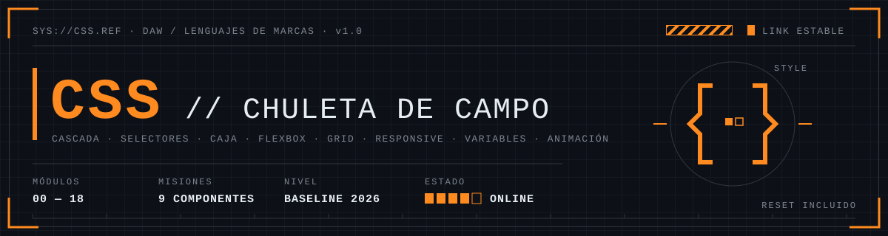
</p>

<p align="center">
  
  
  
  
</p>

```text
> SYS://CSS.CHULETA ......................... v1.0
> USO ....................................... consulta rápida: Ctrl+F o índice
> CAPTURAS .................................. cada ejemplo renderizado en Chromium
> VALIDACIÓN ................................ W3C (salvo container queries: el validador aún no las conoce)
> COMPATIBILIDAD ............................ 🟢 todos · 🟡 recién llegado · 🔴 aún no (datos Baseline oct. 2026)
> LEYENDA ................................... ▲ índice · ◂ anterior · ▸ siguiente
```

> [!NOTE]
> Es la compañera de la **chuleta HTML**. Las capturas parten de los estilos por defecto del navegador con una fuente sans-serif; lo que ves cambiar es exactamente lo que hace el CSS de cada ejemplo.

<a id="indice"></a>

## ⌖ ÍNDICE

| MOD | SECCIÓN | ACCESO DIRECTO |
|:---:|---|---|
| `00` | [**Fundamentos**](#mod-00) | [Sintaxis](#sintaxis) · [Dónde escribirlo](#donde) · [Cascada](#cascada) · [Especificidad](#especificidad) · [Herencia](#herencia) |
| `01` | [**Reset moderno**](#mod-01) | [El reset](#reset) · [Línea a línea](#reset-explicado) · [Antes y después](#reset-demo) · [Reset vs normalize](#reset-normalize) |
| `02` | [**Selectores**](#mod-02) | [Básicos](#sel-basicos) · [Combinadores](#combinadores) · [Atributos](#sel-atributos) · [Pseudoclases](#pseudoclases) · [nth-child](#nth-child) · [:is :where :has](#is-where-has) · [Pseudoelementos](#pseudoelementos) |
| `03` | [**Unidades y funciones**](#mod-03) | [Unidades](#unidades) · [¿Cuál elijo?](#unidades-elegir) · [calc · min · max · clamp](#funciones) |
| `04` | [**Color**](#mod-04) | [Formatos](#color-formatos) · [Transparencia](#transparencia) · [color-mix](#color-mix) · [Contraste](#contraste) |
| `05` | [**Modelo de caja**](#mod-05) | [Las 4 capas](#caja-capas) · [box-sizing](#box-sizing) · [margin y padding](#margin-padding) · [Colapso de márgenes](#colapso) · [display](#display) · [overflow](#overflow) · [Tamaños](#tamanos) |
| `06` | [**Tipografía**](#mod-06) | [Fuentes](#fuentes) · [@font-face](#font-face) · [Propiedades de texto](#texto-props) · [Cortar texto](#texto-cortar) |
| `07` | [**Fondos, bordes y efectos**](#mod-07) | [Fondos](#fondos) · [Degradados](#degradados) · [Bordes y radios](#bordes) · [Sombras](#sombras) · [Filtros](#filtros) · [object-fit](#object-fit) |
| `08` | [**Posicionamiento**](#mod-08) | [position](#position) · [z-index](#z-index) · [sticky](#sticky) |
| `09` | [**Flexbox**](#mod-09) | [Ejes](#flex-ejes) · [Contenedor](#flex-contenedor) · [Hijos](#flex-hijos) · [flex: 1](#flex-shorthand) · [Recetas](#flex-recetas) |
| `10` | [**Grid**](#mod-10) | [Columnas y filas](#grid-columnas) · [fr, repeat, minmax](#grid-fr) · [auto-fit](#grid-autofit) · [Áreas](#grid-areas) · [Colocar elementos](#grid-colocar) · [subgrid](#subgrid) |
| `11` | [**¿Flex o Grid? y centrar**](#mod-11) | [Decidir](#flex-o-grid) · [Todas las formas de centrar](#centrar) |
| `12` | [**Responsive**](#mod-12) | [Mobile-first](#mobile-first) · [Media queries](#media-queries) · [Puntos de corte](#breakpoints) · [Container queries](#container-queries) · [Preferencias del usuario](#preferencias) |
| `13` | [**Variables**](#mod-13) | [Definir y usar](#variables) · [Tokens de diseño](#tokens) · [Modo oscuro](#modo-oscuro) |
| `14` | [**Transiciones y animaciones**](#mod-14) | [transition](#transition) · [transform](#transform) · [@keyframes](#keyframes) · [Rendimiento](#anim-rendimiento) |
| `15` | [**Arquitectura**](#mod-15) | [BEM](#bem) · [Organizar archivos](#organizar) · [Orden de propiedades](#orden-propiedades) · [Nesting](#nesting) · [@layer](#layer) |
| `16` | [**CSS moderno**](#mod-16) | [Tabla de compatibilidad](#moderno-tabla) · [Ejemplos](#moderno-ejemplos) |
| `17` | [**Depurar**](#mod-17) | [DevTools](#devtools) · [¿Por qué no se aplica?](#no-se-aplica) · [Errores frecuentes](#errores) |
| `18` | [**Misiones: componentes reales**](#mod-18) | [M1](#m1) · [M2](#m2) · [M3](#m3) · [M4](#m4) · [M5](#m5) · [M6](#m6) · [M7](#m7) · [M8](#m8) · [M9](#m9) |

---

<a id="mod-00"></a>

## `00` FUNDAMENTOS

```text
┌─[ MOD.00 ]───────────────────────────────────────────── FUNDAMENTOS ─┐
│  sintaxis · cascada · especificidad · herencia                       │
└─────────────────────────────────────────────────────────── SYS.OK ───┘
```

<a id="sintaxis"></a>

### ▸ Sintaxis

```text
 selector          declaración
 ┌──┴──┐   ┌──────────┴──────────┐
 .boton  { background-color: #ff8a1f;  padding: 8px 16px; }
           └──────┬───────┘ └──┬──┘
              propiedad      valor
 └──────────────────── REGLA ─────────────────────────────┘
```

- Cada declaración termina en `;` (en la última es opcional, pero ponlo siempre).
- Comentarios: `/* así */` (no existe `//` en CSS).
- Si una propiedad o un valor están mal escritos, el navegador **ignora esa declaración** sin avisar → [MOD.17](#mod-17).

<a id="donde"></a>

### ▸ Dónde escribirlo

| Forma | Código | Cuándo |
|---|---|---|
| **Archivo externo** | `<link rel="stylesheet" href="css/estilos.css">` en el `<head>` | **Siempre** en proyectos: un archivo para todas las páginas, el navegador lo guarda en caché |
| Etiqueta `<style>` | `<style> p { color: red; } </style>` en el `<head>` | Pruebas rápidas, una página suelta |
| Atributo `style` | `<p style="color: red">` | Casi nunca: mezcla HTML y diseño, y gana a todo (difícil de sobrescribir) |

<a id="cascada"></a>

### ▸ La cascada: quién gana

Cuando varias reglas dan valor a la misma propiedad del mismo elemento, gana (de más a menos importante):

| # | Criterio | Ejemplo |
|:---:|---|---|
| 1 | **`!important`** | `color: red !important;` (evitar: rompe la cascada) |
| 2 | **Capa** (`@layer`): las capas declaradas después ganan, y el CSS sin capa gana a todas | → [MOD.15](#layer) |
| 3 | **Especificidad** del selector | `#menu a` gana a `.menu a`, que gana a `a` |
| 4 | **Orden**: a igual especificidad, gana **la que está más abajo** | Por eso el reset va primero y tus estilos después |

```html
<p class="aviso" id="principal">¿De qué color soy?</p>
```
```css
#principal { color: green; }   /* especificidad 1-0-0 → GANA */
.aviso     { color: blue; }    /* 0-1-0 */
p          { color: red; }     /* 0-0-1 */
p          { color: orange; }  /* 0-0-1, más abajo que la anterior: gana a la roja, pero no a las otras */
```

<sub>▸ RESULTADO</sub><br>
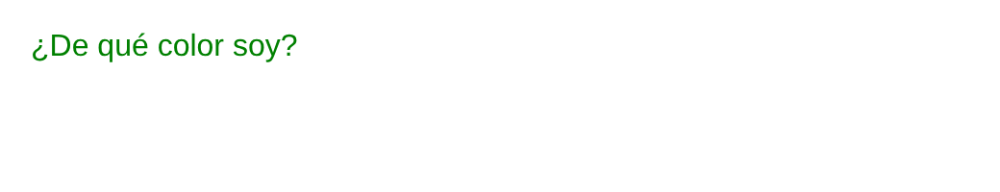


<a id="especificidad"></a>

### ▸ Especificidad

Se cuenta en tres columnas **(ID · CLASE · ELEMENTO)** y se comparan de izquierda a derecha: una sola ID gana a cualquier cantidad de clases.

| Selector | ID | Clase / atributo / pseudoclase | Elemento / pseudoelemento | Total |
|---|:---:|:---:|:---:|:---:|
| `*` | 0 | 0 | 0 | `0-0-0` |
| `li` | 0 | 0 | 1 | `0-0-1` |
| `ul li` | 0 | 0 | 2 | `0-0-2` |
| `.menu` | 0 | 1 | 0 | `0-1-0` |
| `.menu li:hover` | 0 | 2 | 1 | `0-2-1` |
| `a[href^="http"]` | 0 | 1 | 1 | `0-1-1` |
| `#cabecera .menu a` | 1 | 1 | 1 | `1-1-1` |
| `style="…"` (en el HTML) | — | — | — | Gana a cualquier selector |
| `:where(.menu) a` | 0 | 0 | 1 | `0-0-1` (`:where` vale **0**) |
| `:is(#a, .b) p` | 1 | 0 | 1 | `1-0-1` (`:is` vale lo de su argumento **más** específico) |

> [!TIP]
> Mantén la especificidad **baja y plana**: usa casi siempre **una clase** por selector (`.tarjeta__titulo`), que es lo que propone BEM. Evita los `id` para dar estilo y los selectores largos (`header nav ul li a`): luego cuesta mucho sobrescribirlos.

<sub>En VS Code, al pasar el ratón sobre un selector aparece su especificidad.</sub>

<a id="herencia"></a>

### ▸ Herencia

Algunas propiedades **pasan de padres a hijos** solas; otras no.

| Se heredan (sobre todo, las de **texto**) | No se heredan (las de **caja**) |
|---|---|
| `color`, `font-family`, `font-size`, `font-weight`, `line-height`, `text-align`, `letter-spacing`, `list-style`, `cursor`, `visibility` | `margin`, `padding`, `border`, `background`, `width`, `height`, `display`, `position`, `box-shadow`, `opacity` |

Por eso basta con poner la fuente en `body` para toda la página.

| Valor | Hace |
|---|---|
| `inherit` | Toma el valor del padre (aunque la propiedad no se herede) |
| `initial` | Valor inicial de la especificación (¡ojo! `display: initial` es `inline`) |
| `unset` | `inherit` si la propiedad se hereda; `initial` si no |
| `revert` | Vuelve al estilo por defecto del navegador |

<sub>[▲ ÍNDICE](#indice) · [MOD.01 ▸](#mod-01)</sub>

---

<a id="mod-01"></a>

## `01` RESET MODERNO

```text
┌─[ MOD.01 ]─────────────────────────────────────────────────── RESET ─┐
│  el primer archivo de cualquier proyecto                             │
└─────────────────────────────────────────────────────────── SYS.OK ───┘
```

Cada navegador aplica **estilos por defecto** (márgenes en `body` y `p`, tamaños de títulos, viñetas…), con pequeñas diferencias entre ellos. Un reset deja una base **predecible** sobre la que construir.

<a id="reset"></a>

### ▸ El reset (copiar en `css/reset.css`)

```css
/* =========================================================
   RESET MODERNO · basado en los de Josh W. Comeau y Andy Bell
   ========================================================= */

/* 1. Que width y height incluyan padding y borde */
*, *::before, *::after {
  box-sizing: border-box;
}

/* 2. Quitar los márgenes por defecto */
* {
  margin: 0;
}

/* 3. Evitar que el móvil agrande el texto al girar la pantalla */
html {
  -webkit-text-size-adjust: none;
  text-size-adjust: none;
}

/* 4. Body a toda la altura y texto más legible */
body {
  min-height: 100vh;
  line-height: 1.5;
  -webkit-font-smoothing: antialiased;
}

/* 5. Imágenes y medios: bloque y nunca más anchos que su contenedor */
img, picture, video, canvas, svg {
  display: block;
  max-width: 100%;
}
img {
  height: auto;
}

/* 6. Los controles de formulario heredan la fuente de la página */
input, button, textarea, select {
  font: inherit;
}

/* 7. Las palabras muy largas (URL, emails) se parten en vez de desbordar */
p, h1, h2, h3, h4, h5, h6 {
  overflow-wrap: break-word;
}

/* 8. Títulos con líneas más equilibradas */
h1, h2, h3, h4, h5, h6 {
  text-wrap: balance;
}

/* 9. Listas marcadas como lista "de diseño": sin viñetas ni sangría */
ul[role="list"], ol[role="list"] {
  list-style: none;
  padding: 0;
}

/* 10. Enlaces sin clase: mismo color que el texto y subrayado limpio */
a:not([class]) {
  color: currentColor;
  text-decoration-skip-ink: auto;
}

/* 11. Un textarea sin "rows" no queda diminuto */
textarea:not([rows]) {
  min-height: 10em;
}

/* 12. Al saltar a un #ancla, dejar aire por arriba (cabeceras fijas) */
:target {
  scroll-margin-block: 5ex;
}

/* 13. Desplazamiento suave, solo si el usuario no pidió reducir el movimiento */
@media (prefers-reduced-motion: no-preference) {
  html:focus-within {
    scroll-behavior: smooth;
  }
}

/* 14. Si el usuario pidió reducir el movimiento, sin animaciones */
@media (prefers-reduced-motion: reduce) {
  *, *::before, *::after {
    animation-duration: 0.01ms !important;
    animation-iteration-count: 1 !important;
    transition-duration: 0.01ms !important;
    scroll-behavior: auto !important;
  }
}
```

<a id="reset-explicado"></a>

### ▸ Línea a línea

| # | Regla | Por qué |
|:---:|---|---|
| 1 | `box-sizing: border-box` | Por defecto, `width: 300px` + `padding: 20px` mide **340 px**. Con `border-box`, mide 300 px: el padding va por dentro. Es la regla más importante del reset → [MOD.05](#box-sizing) |
| 2 | `margin: 0` | Quita los márgenes de `body`, `p`, `h1`, `ul`, `figure`… Así los márgenes son solo los que tú pongas |
| 3 | `text-size-adjust` | En móviles, al girar a horizontal, Safari agranda el texto por su cuenta |
| 4 | `min-height: 100vh` · `line-height: 1.5` | Base para pegar el footer abajo; 1.5 es el interlineado recomendado para leer (el defecto ronda 1.2) |
| 5 | `img { display: block; max-width: 100% }` | Elimina el **hueco bajo las imágenes** (son en línea) y evita que una foto grande rompa el diseño en móvil. `height: auto` mantiene la proporción aunque el HTML tenga `width` y `height` |
| 6 | `font: inherit` | Por defecto, `input` y `button` usan una fuente del sistema más pequeña |
| 7 | `overflow-wrap: break-word` | Una URL larga sin espacios se sale de la caja en móvil |
| 8 | `text-wrap: balance` | Evita títulos con una palabra sola en la última línea (🟡 Recién disponible (2024-05); donde no exista, no pasa nada) |
| 9 | `ul[role="list"]` | Quita viñetas **solo** a las listas que tú marques (menús, tarjetas). Quitarlas a todas con `ul { list-style: none }` hace que Safari deje de anunciarlas como lista; con `role="list"` se mantiene |
| 10 | `a:not([class])` | Los enlaces de texto heredan el color del párrafo; los que tienen clase (botones) los estilas tú |
| 11 | `textarea:not([rows])` | Sin `rows`, el textarea sería de 2 líneas |
| 12 | `scroll-margin-block` | Con una cabecera fija, el título destino de un `#ancla` queda tapado |
| 13-14 | `prefers-reduced-motion` | Hay personas a las que el movimiento les provoca mareo; el sistema operativo lo indica y la web lo respeta → [MOD.12](#preferencias) |

<a id="reset-demo"></a>

### ▸ Antes y después


<sub>▸ RESULTADO</sub><br>
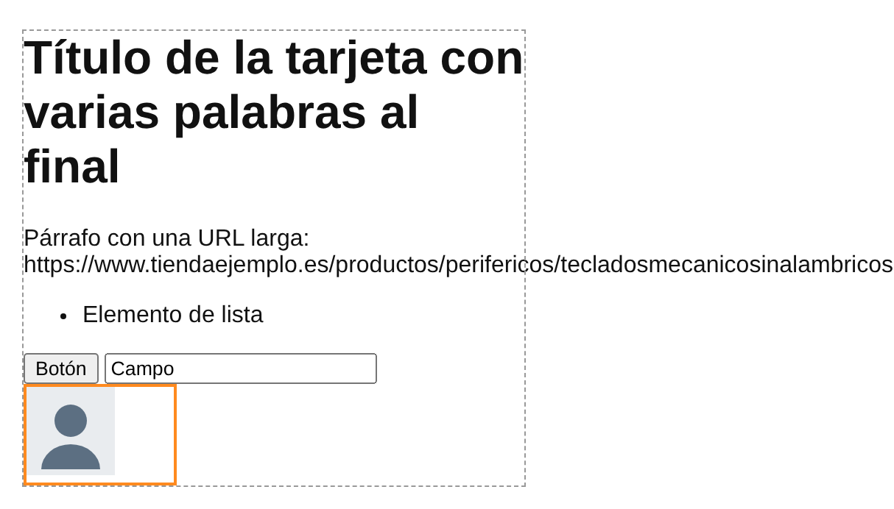


<sub>▲ **SIN RESET**: márgenes por defecto, la URL se sale de la caja, botón y campo con fuente pequeña y hueco bajo la imagen.</sub>


<sub>▸ RESULTADO</sub><br>
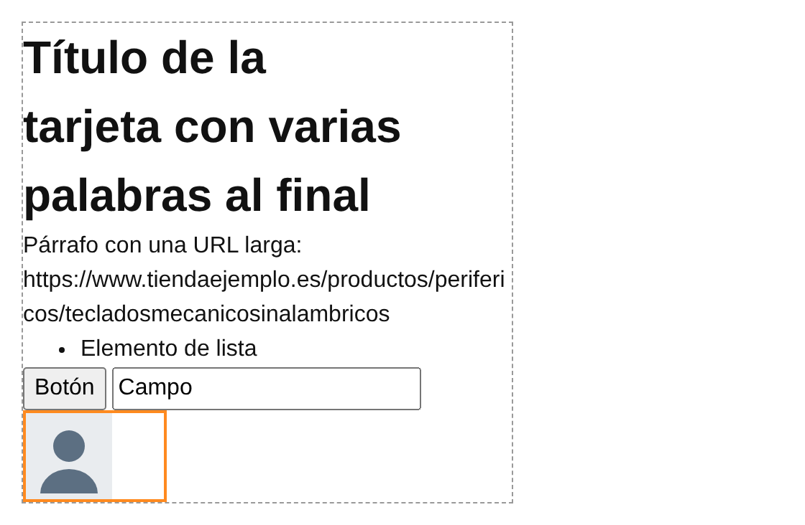


<sub>▲ **CON RESET**: sin márgenes heredados, la URL se parte, el título está equilibrado, los controles usan la fuente de la página y la imagen ya no deja hueco. Los márgenes los pondrás tú donde los quieras.</sub>

<a id="reset-normalize"></a>

### ▸ Reset frente a normalize

| | Reset (como el de arriba) | [normalize.css](https://necolas.github.io/normalize.css/) |
|---|---|---|
| Idea | **Borrar** los estilos por defecto y empezar casi de cero | **Igualar** los navegadores conservando los estilos por defecto útiles |
| Márgenes y títulos | Fuera | Se mantienen |
| Cuándo | Proyectos con diseño propio (lo habitual) | Documentos donde el aspecto por defecto ya vale |

**Dónde ponerlo:** el **primero** de tus CSS, para que tus estilos (que van después) ganen a igual especificidad:

```html
<link rel="stylesheet" href="css/reset.css">
<link rel="stylesheet" href="css/variables.css">
<link rel="stylesheet" href="css/estilos.css">
```

<sub>O con capas: `@layer reset, base, componentes;` → [MOD.15](#layer).</sub>

<sub>[▲ ÍNDICE](#indice) · [◂ MOD.00](#mod-00) · [MOD.02 ▸](#mod-02)</sub>

---

<a id="mod-02"></a>

## `02` SELECTORES

```text
┌─[ MOD.02 ]────────────────────────────────────────────── SELECTORES ─┐
│  combinadores · pseudoclases · :has · ::before                       │
└─────────────────────────────────────────────────────────── SYS.OK ───┘
```

<a id="sel-basicos"></a>

### ▸ Básicos

| Selector | Selecciona | Especificidad |
|---|---|:---:|
| `*` | Todo | `0-0-0` |
| `p` | Todos los `<p>` | `0-0-1` |
| `.tarjeta` | Elementos con `class="tarjeta"` | `0-1-0` |
| `.tarjeta.destacada` | Con **las dos** clases a la vez (sin espacio) | `0-2-0` |
| `#cabecera` | El elemento con `id="cabecera"` | `1-0-0` |
| `h1, h2, h3` | Grupo: cualquiera de ellos (la coma = "o") | La de cada uno |

<a id="combinadores"></a>

### ▸ Combinadores

| Selector | Selecciona | Ejemplo real |
|---|---|---|
| `A B` (espacio) | `B` **descendiente** de `A`, a cualquier profundidad | `.articulo a` → todos los enlaces del artículo |
| `A > B` | `B` **hijo directo** de `A` | `.menu > li` → solo el primer nivel del menú |
| `A + B` | `B` **justo después** de `A` (hermano siguiente) | `h2 + p` → el primer párrafo tras cada título |
| `A ~ B` | Todos los `B` hermanos **posteriores** a `A` | `input:checked ~ .panel` |

```html
<ul class="menu">
  <li>Inicio</li>
  <li>Productos
    <ul><li>Teclados</li><li>Ratones</li></ul>
  </li>
</ul>
<h2>Título</h2>
<p>Primer párrafo tras el título (h2 + p)</p>
<p>Segundo párrafo</p>
```
```css
.menu > li { color: #ff8a1f; font-weight: bold; }   /* solo el 1.er nivel */
.menu li li { color: #1f6feb; font-weight: normal; } /* los anidados */
h2 + p { background: #fff3e6; }
```

<sub>▸ RESULTADO</sub><br>
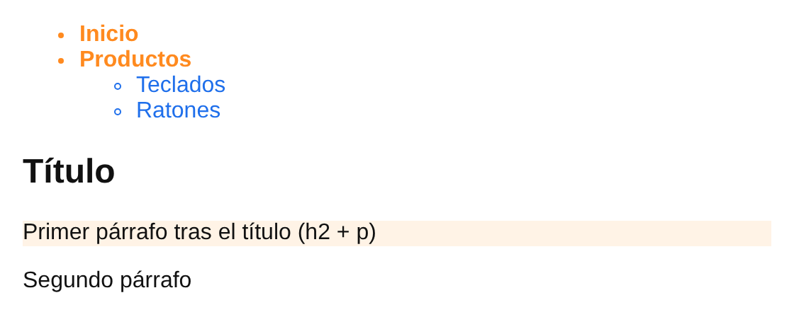


<a id="sel-atributos"></a>

### ▸ Por atributo

| Selector | Selecciona | Ejemplo |
|---|---|---|
| `[required]` | Tiene el atributo | `input[required]` |
| `[type="email"]` | Valor exacto | `input[type="email"]` |
| `[href^="https"]` | Empieza por | Enlaces externos |
| `[href$=".pdf"]` | Termina en | Enlaces a PDF (añadirles un icono) |
| `[class*="btn"]` | Contiene | Cualquier clase que contenga "btn" |
| `[lang\|="es"]` | Es `es` o empieza por `es-` | `es`, `es-ES`, `es-MX` |
| `[data-estado="agotado"]` | Atributos `data-*` | Productos agotados |

<a id="pseudoclases"></a>

### ▸ Pseudoclases (estados)

| Pseudoclase | Cuándo se aplica |
|---|---|
| `:hover` | El ratón está encima |
| `:focus` | Tiene el foco (clic o teclado) |
| `:focus-visible` | Tiene el foco **y** el navegador cree que debe verse (teclado). **Úsala para los contornos de foco** |
| `:focus-within` | Él **o algún hijo** tiene el foco (resaltar un formulario entero) |
| `:active` | Mientras se pulsa |
| `:visited` | Enlace ya visitado |
| `:checked` | Checkbox o radio marcado |
| `:disabled` / `:enabled` | Control desactivado / activado |
| `:required` / `:optional` | Campo obligatorio / opcional |
| `:valid` / `:invalid` | Valor válido / inválido (desde el principio) |
| `:user-invalid` | Inválido **después** de que el usuario lo toque (🟢 Disponible en todos (desde 2023)) |
| `:placeholder-shown` | Se ve el `placeholder` (campo vacío) |
| `:empty` | Sin hijos ni texto |
| `:target` | Es el destino del `#ancla` actual de la URL |
| `:not(X)` | **No** cumple X: `li:not(:last-child)` |
| `:first-child` / `:last-child` / `:only-child` | Primero / último / único hijo |
| `:first-of-type` / `:last-of-type` | Primero / último de su tipo entre sus hermanos |

```html
<button class="btn">Comprar</button>
```
```css
.btn {
  background: #ff8a1f; color: #000; border: 0; padding: 10px 20px;
  border-radius: 6px; cursor: pointer; font: inherit; font-weight: bold;
}
.btn:hover         { background: #ffa552; }
.btn:focus-visible { outline: 3px solid #1f6feb; outline-offset: 3px; }
```

<sub>▸ RESULTADO</sub><br>
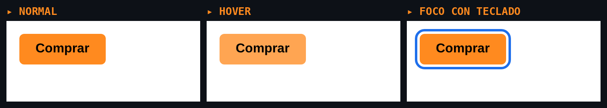


<a id="nth-child"></a>

### ▸ :nth-child(): fórmulas

| Selector | Selecciona | Uso |
|---|---|---|
| `:nth-child(3)` | El 3.º | — |
| `:nth-child(odd)` = `(2n+1)` | Impares: 1, 3, 5… | Filas cebra en tablas |
| `:nth-child(even)` = `(2n)` | Pares: 2, 4, 6… | — |
| `:nth-child(3n)` | 3, 6, 9… | El último de cada fila de 3 |
| `:nth-child(n+4)` | Del 4.º en adelante | Ocultar a partir del 4.º |
| `:nth-child(-n+3)` | Los 3 primeros | Destacar el top 3 |
| `:nth-last-child(2)` | El penúltimo | — |
| `:nth-child(2 of .destacado)` | El 2.º **de los que tienen** `.destacado` (🟢 Disponible en todos (desde 2023)) | — |

```html
<ol class="ranking">
  <li>Uno</li><li>Dos</li><li>Tres</li><li>Cuatro</li><li>Cinco</li><li>Seis</li>
</ol>
```
```css
.ranking li:nth-child(odd)   { background: #f1f3f5; }       /* cebra */
.ranking li:nth-child(-n+3)  { font-weight: bold; color: #c25e00; }  /* top 3 */
.ranking li:nth-child(n+5)   { opacity: 0.4; }               /* del 5.º en adelante */
```

<sub>▸ RESULTADO</sub><br>
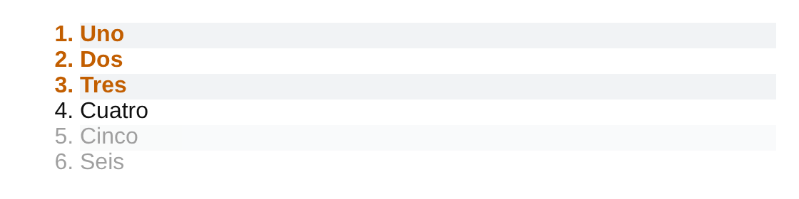


<a id="is-where-has"></a>

### ▸ :is(), :where() y :has()

| Pseudoclase | Hace | Especificidad | Compatibilidad |
|---|---|---|---|
| `:is(A, B) x` | Abrevia listas: `:is(header, footer) a` = `header a, footer a` | La del argumento más específico | 🟢 Disponible en todos (desde 2021) |
| `:where(A, B) x` | Igual que `:is`, pero **especificidad 0** (ideal para resets y estilos base fáciles de sobrescribir) | `0-0-0` | 🟢 Disponible en todos (desde 2021) |
| `A:has(B)` | **"Selector de padre"**: selecciona A **si contiene** B | La de su argumento | 🟢 Disponible en todos (desde 2023) |

```html
<article class="tarjeta"><h3>Sin imagen</h3><p>Solo texto.</p></article>
<article class="tarjeta"><h3>Con imagen</h3><p>La tarjeta cambia sola.</p></article>
<form class="campo"><label>Email <input type="email" value="esto-no-es-un-email"></label></form>
```
```css
.tarjeta { border: 2px solid #ccc; padding: 8px; margin-bottom: 8px; }
.tarjeta:has(img) { display: flex; gap: 12px; align-items: center; border-color: #ff8a1f; }
.tarjeta:has(img) h3 { margin: 0; }
.campo:has(input:invalid) { outline: 2px solid #d1242f; padding: 6px; }
```

<sub>▸ RESULTADO</sub><br>
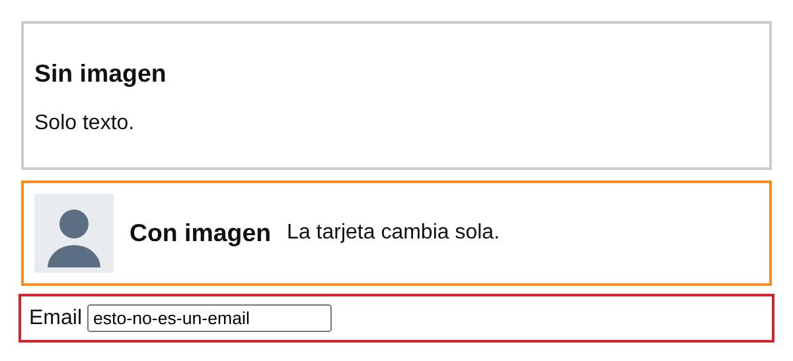


<sub>Sin `:has()`, esto necesitaba JavaScript o una clase extra puesta a mano en cada tarjeta.</sub>

<a id="pseudoelementos"></a>

### ▸ Pseudoelementos (`::`)

| Pseudoelemento | Qué es | Uso real |
|---|---|---|
| `::before` / `::after` | Un hijo "falso" al principio / final. **Necesita `content`** | Iconos, adornos, comillas, etiquetas "NUEVO" |
| `::placeholder` | El texto de ejemplo de un campo | Cambiar su color |
| `::marker` | La viñeta o el número de un `li` | Colorear viñetas |
| `::selection` | El texto seleccionado con el ratón | Color de marca |
| `::first-letter` / `::first-line` | Primera letra / línea | Capitular de revista |
| `::backdrop` | El fondo de un `dialog` modal o de la pantalla completa | Oscurecer el fondo |

```html
<p class="nuevo">Teclado mecánico K2</p>
<ul class="check"><li>Envío gratis</li><li>Devolución 30 días</li></ul>
<a class="externo" href="https://developer.mozilla.org/">MDN</a>
```
```css
.nuevo::after {
  content: "NUEVO"; margin-left: 8px; padding: 2px 6px;
  font-size: 0.7em; background: #ff8a1f; border-radius: 4px;
}
.check li::marker { content: "✔ "; color: #1a7f37; }
a[href^="http"]::after { content: " ↗"; }
```

<sub>▸ RESULTADO</sub><br>
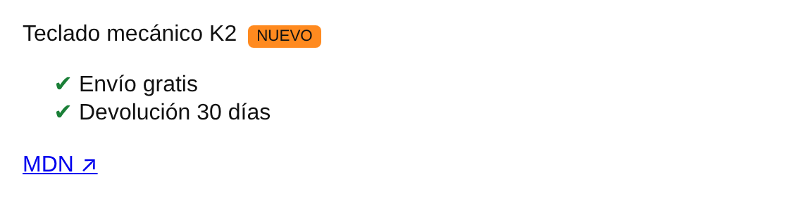


> [!NOTE]
> El texto de `content` **no es contenido real**: no se puede seleccionar y algunos lectores de pantalla no lo leen. Úsalo solo para adornos; la información importante va en el HTML.

<sub>[▲ ÍNDICE](#indice) · [◂ MOD.01](#mod-01) · [MOD.03 ▸](#mod-03)</sub>

---

<a id="mod-03"></a>

## `03` UNIDADES Y FUNCIONES

```text
┌─[ MOD.03 ]──────────────────────────────────────────────── UNIDADES ─┐
│  px · rem · em · % · vw · fr · clamp                                 │
└─────────────────────────────────────────────────────────── SYS.OK ───┘
```

<a id="unidades"></a>

### ▸ Unidades

| Unidad | Relativa a | Ejemplo | Ojo |
|---|---|---|---|
| `px` | Nada (absoluta) | `border: 1px` | No escala si el usuario sube el tamaño de letra del navegador |
| **`rem`** | Tamaño de fuente de la **raíz** (`html`, normalmente 16 px) | `font-size: 1.25rem` = 20 px | Estable: no depende de dónde esté el elemento |
| `em` | Tamaño de fuente **del propio elemento** (o del padre, en `font-size`) | `padding: 0.5em 1em` | **Se acumula** al anidar: `1.2em` dentro de `1.2em` = 1,44 |
| `%` | El **padre** (ancho, alto…) | `width: 50%` | `height: 50%` no funciona si el padre no tiene altura definida |
| `vw` / `vh` | 1 % del ancho / alto de la ventana | `height: 100vh` | En móvil, `100vh` no descuenta la barra del navegador |
| `dvh` / `svh` / `lvh` | Alto de la ventana dinámico / pequeño / grande | `min-height: 100dvh` | Arreglan el problema de `vh` en móvil (🟢 Disponible en todos (desde 2022)) |
| `ch` | Ancho del carácter "0" de la fuente | `max-width: 65ch` | Ideal para limitar el ancho de líneas de texto |
| `fr` | Fracción del espacio libre (**solo en Grid**) | `1fr 2fr` | → [MOD.10](#grid-fr) |
| sin unidad | — | `line-height: 1.5` | En `line-height`, sin unidad = multiplica el tamaño de letra de cada elemento |

```html
<div class="em">em: nivel 1 <div class="em">nivel 2 <div class="em">nivel 3</div></div></div>
<div class="rem">rem: nivel 1 <div class="rem">nivel 2 <div class="rem">nivel 3</div></div></div>
```
```css
.em  { font-size: 1.2em; }    /* se acumula: 1,2 → 1,44 → 1,73 */
.rem { font-size: 1.2rem; }   /* siempre 1,2 × 16 px = 19,2 px */
```

<sub>▸ RESULTADO</sub><br>
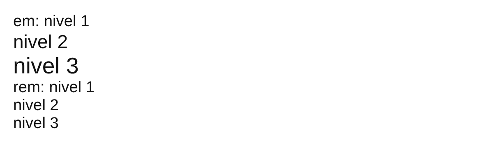


<a id="unidades-elegir"></a>

### ▸ ¿Cuál elijo?

| Para | Unidad | Por qué |
|---|---|---|
| Tamaños de **letra** | `rem` | Respeta el tamaño de letra que elija el usuario en su navegador (accesibilidad) |
| **Padding** de botones o etiquetas | `em` | Crece con el tamaño del texto del propio botón |
| Márgenes y separaciones generales | `rem` | Coherentes en toda la página |
| **Bordes** y sombras finas | `px` | Una línea de 1 px debe ser de 1 px |
| Ancho de columnas | `%`, `fr` o Flex / Grid | Se adaptan al espacio |
| Ancho máximo de un texto | `ch` (`60-75ch`) | Líneas cómodas de leer |
| Secciones a pantalla completa | `dvh` / `svh` | Funcionan bien en móvil |

<a id="funciones"></a>

### ▸ calc(), min(), max() y clamp()

| Función | Hace | Ejemplo |
|---|---|---|
| `calc()` | Operaciones mezclando unidades | `width: calc(100% - 2rem);` · `height: calc(100dvh - 60px);` |
| `min(a, b)` | El **menor** de los valores | `width: min(100%, 1200px);` = "todo el ancho, pero como mucho 1200 px" |
| `max(a, b)` | El **mayor** | `padding: max(1rem, 3vw);` = "3 % del ancho, pero como poco 1rem" |
| `clamp(mín, ideal, máx)` | El ideal, **limitado** entre un mínimo y un máximo | `font-size: clamp(1.5rem, 4vw, 3rem);` → tipografía fluida |

```css
/* Contenedor centrado típico: hasta 1200 px, con 1rem de margen en pantallas pequeñas */
.contenedor {
  width: min(100% - 2rem, 1200px);
  margin-inline: auto;
}

/* Título que crece con la pantalla sin media queries: entre 1,75rem y 3,5rem */
h1 { font-size: clamp(1.75rem, 1rem + 4vw, 3.5rem); }
```

```html
<h1 class="fluido">Título fluido con clamp()</h1>
```
```css
.fluido { font-size: clamp(1.5rem, 1rem + 4vw, 3.5rem); margin: 0; }
```

<sub>▸ RESULTADO</sub><br>
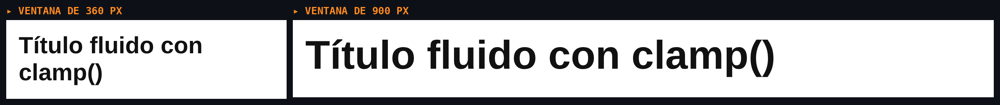


<sub>[▲ ÍNDICE](#indice) · [◂ MOD.02](#mod-02) · [MOD.04 ▸](#mod-04)</sub>

---

<a id="mod-04"></a>

## `04` COLOR

```text
┌─[ MOD.04 ]─────────────────────────────────────────────────── COLOR ─┐
│  hex · rgb · hsl · oklch · color-mix · contraste                     │
└─────────────────────────────────────────────────────────── SYS.OK ───┘
```

<a id="color-formatos"></a>

### ▸ Formatos

| Formato | Ejemplo | Cuándo |
|---|---|---|
| Nombre | `red`, `tomato`, `transparent`, `currentColor` | Pruebas; `currentColor` = el `color` del texto actual |
| Hexadecimal | `#ff8a1f` · `#f81` (abreviado) · `#ff8a1f80` (con transparencia) | El más habitual: lo da cualquier herramienta de diseño |
| `rgb()` | `rgb(255 138 31)` · `rgb(255 138 31 / 50%)` | Cuando necesitas transparencia |
| `hsl()` | `hsl(28 100% 56%)` → tono, saturación, luminosidad | **Variaciones** de un color: misma `h`, cambiar la `l` |
| `oklch()` | `oklch(75% 0.17 55)` → luminosidad, croma, tono | Paletas **coherentes**: misma luminosidad percibida en tonos distintos (🟢 Disponible en todos (desde 2023)) |

<sub>La sintaxis moderna separa con espacios y pone la transparencia tras `/`. La antigua `rgba(255, 138, 31, 0.5)` sigue funcionando.</sub>

```html
<div class="paleta">
  <span style="--l: 25%"></span><span style="--l: 40%"></span><span style="--l: 56%"></span>
  <span style="--l: 70%"></span><span style="--l: 85%"></span><span style="--l: 95%"></span>
</div>
```
```css
.paleta { display: flex; gap: 6px; }
.paleta span { width: 70px; height: 50px; border-radius: 6px;
               background: hsl(28 100% var(--l)); }   /* mismo tono, distinta luminosidad */
```

<sub>▸ RESULTADO</sub><br>
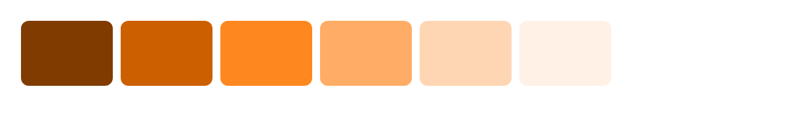


<a id="transparencia"></a>

### ▸ Transparencia: opacity frente a color con alfa

```html
<div class="fondo">
  <div class="caja opacity">opacity: 0.5</div>
  <div class="caja alfa">rgb(… / 50%)</div>
</div>
```
```css
.fondo { display: flex; gap: 12px; padding: 12px; background: url("recursos/paisaje.svg") center / cover; }
.caja { padding: 16px; font-weight: bold; color: #000; }
.opacity { background: #fff; opacity: 0.5; }           /* TODO transparente: el texto también */
.alfa    { background: rgb(255 255 255 / 50%); }       /* solo el fondo */
```

<sub>▸ RESULTADO</sub><br>
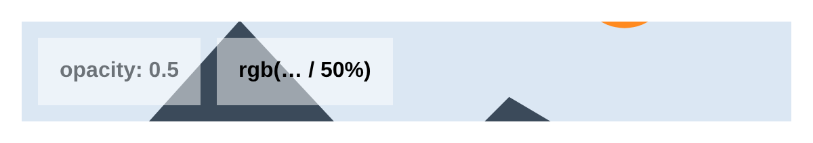


<sub>`opacity` afecta al elemento **y a todo su contenido**. Para un fondo semitransparente con texto opaco, usa un color con alfa.</sub>

<a id="color-mix"></a>

### ▸ color-mix(): mezclar colores

🟢 Disponible en todos (desde 2023)

```css
:root { --marca: #ff8a1f; }
.boton:hover   { background: color-mix(in oklch, var(--marca), black 15%); }  /* 15 % más oscuro */
.etiqueta      { background: color-mix(in oklch, var(--marca), white 80%); }  /* versión muy clara */
.borde-suave   { border-color: color-mix(in srgb, var(--marca) 40%, transparent); }
```

<a id="contraste"></a>

### ▸ Contraste (accesibilidad)

| Texto | Contraste mínimo (WCAG AA) |
|---|---|
| Normal | **4,5 : 1** |
| Grande (≥ 24 px, o ≥ 18,7 px en negrita) | **3 : 1** |
| Iconos y bordes de controles | **3 : 1** |

<sub>Cómo medirlo: DevTools → selecciona el texto → en el selector de color aparece "Contrast ratio". El gris claro sobre blanco (`#999` sobre `#fff` = 2,8 : 1) **no pasa**.</sub>

<sub>[▲ ÍNDICE](#indice) · [◂ MOD.03](#mod-03) · [MOD.05 ▸](#mod-05)</sub>

---

<a id="mod-05"></a>

## `05` MODELO DE CAJA

```text
┌─[ MOD.05 ]────────────────────────────────────────── MODELO DE CAJA ─┐
│  content · padding · border · margin · display                       │
└─────────────────────────────────────────────────────────── SYS.OK ───┘
```

<a id="caja-capas"></a>

### ▸ Las 4 capas

```text
┌───────────────────────── margin ──────────────────────────┐   ← espacio FUERA (transparente)
│  ┌────────────────────── border ───────────────────────┐  │   ← el borde
│  │  ┌─────────────────── padding ───────────────────┐  │  │   ← espacio DENTRO (toma el fondo)
│  │  │                                               │  │  │
│  │  │                  CONTENIDO                    │  │  │   ← width × height
│  │  │                                               │  │  │
│  │  └───────────────────────────────────────────────┘  │  │
│  └─────────────────────────────────────────────────────┘  │
└───────────────────────────────────────────────────────────┘
```

<sub>En DevTools (pestaña *Computed*) aparece este mismo dibujo con los valores reales de cada elemento.</sub>

<a id="box-sizing"></a>

### ▸ box-sizing

```html
<div class="caja content">content-box: 300 + 40 + 10 = 350 px</div>
<div class="caja border">border-box: 300 px en total</div>
```
```css
.caja { width: 300px; padding: 20px; border: 5px solid #ff8a1f; margin-bottom: 10px; background: #fff3e6; }
.content { box-sizing: content-box; }   /* el de por defecto */
.border  { box-sizing: border-box; }    /* el del reset */
```

<sub>▸ RESULTADO</sub><br>
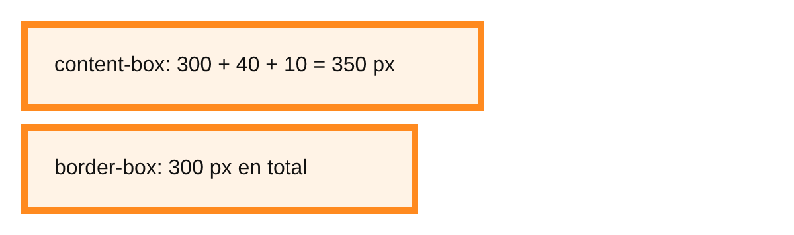


<a id="margin-padding"></a>

### ▸ margin y padding: valores abreviados

| Escritura | Significa |
|---|---|
| `padding: 10px` | Los 4 lados |
| `padding: 10px 20px` | Arriba/abajo · izquierda/derecha |
| `padding: 10px 20px 30px` | Arriba · izquierda/derecha · abajo |
| `padding: 10px 20px 30px 40px` | Arriba · derecha · abajo · izquierda (**sentido de las agujas del reloj**) |
| `margin-inline: auto` | Izquierda y derecha automáticos → **centra** un bloque con ancho |
| `padding-block: 1rem` | Arriba y abajo |
| `margin-top: -10px` | Los márgenes pueden ser **negativos** (el padding no) |

<sub>`inline` = eje del texto (horizontal en español) y `block` = eje en que se apilan los bloques (vertical). Son las **propiedades lógicas**: funcionan también en idiomas que se escriben de derecha a izquierda.</sub>

<a id="colapso"></a>

### ▸ Colapso de márgenes

Los márgenes **verticales** de dos bloques seguidos **no se suman**: se queda el mayor.

```html
<p class="a">margin-bottom: 30px</p>
<p class="b">margin-top: 20px → la separación es 30 px, no 50</p>
```
```css
p { margin: 0; background: #fff3e6; outline: 1px solid #ff8a1f; }
.a { margin-bottom: 30px; }
.b { margin-top: 20px; }
```

<sub>▸ RESULTADO</sub><br>
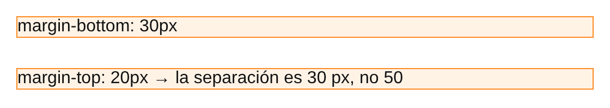


| Cuándo colapsan | Cuándo **no** |
|---|---|
| Hermanos verticales; padre e hijo (el margen del primer hijo "se escapa" por arriba del padre) | Dentro de un contenedor **flex** o **grid**; si el padre tiene `padding`, `border` o `display: flow-root`; márgenes horizontales |

> [!TIP]
> Para separar elementos dentro de un contenedor, usa **`gap`** en flex o grid en vez de márgenes: no colapsa ni deja margen sobrante en el último.

<a id="display"></a>

### ▸ display

| Valor | Hace |
|---|---|
| `block` | Bloque: línea propia, todo el ancho, acepta tamaño |
| `inline` | En línea: fluye con el texto, ignora `width`/`height` |
| `inline-block` | En línea pero acepta tamaño |
| `flex` | El elemento es bloque y sus **hijos** se colocan en fila o columna → [MOD.09](#mod-09) |
| `grid` | Sus hijos se colocan en una rejilla → [MOD.10](#mod-10) |
| `inline-flex` / `inline-grid` | Lo mismo, pero el contenedor es en línea |
| `none` | No se muestra ni ocupa espacio (lo ignora también el lector de pantalla) |
| `contents` | El elemento "desaparece" y sus hijos pasan a ser hijos de su padre |
| `flow-root` | Bloque que contiene sus hijos flotantes y evita el colapso de márgenes |

| Ocultar con… | ¿Ocupa espacio? | ¿Lo lee el lector de pantalla? | ¿Recibe clics? |
|---|:---:|:---:|:---:|
| `display: none` | ✖ | ✖ | ✖ |
| `visibility: hidden` | ✔ | ✖ | ✖ |
| `opacity: 0` | ✔ | ✔ | ✔ |
| Clase `.sr-only` (ver abajo) | ✖ | ✔ | — |

```css
/* Oculto a la vista pero leído por lectores de pantalla (texto de iconos, títulos de apoyo) */
.sr-only {
  position: absolute; width: 1px; height: 1px; padding: 0; margin: -1px;
  overflow: hidden; clip-path: inset(50%); white-space: nowrap; border: 0;
}
```

<a id="overflow"></a>

### ▸ overflow: cuando el contenido no cabe

| Valor | Hace |
|---|---|
| `visible` | Se sale de la caja (por defecto) |
| `hidden` | Se recorta |
| `auto` | Barra de desplazamiento **solo si hace falta** |
| `scroll` | Barra siempre |
| `clip` | Recorta como `hidden`, sin permitir scroll ni por código |
| `overflow-x` / `overflow-y` | Por eje: `overflow-x: auto` en tablas anchas en móvil |

<a id="tamanos"></a>

### ▸ Tamaños

| Propiedad | Para qué |
|---|---|
| `width` / `height` | Tamaño fijo (con cuidado: el contenido puede no caber) |
| `max-width` | **Límite**: `max-width: 100%` en imágenes, `max-width: 65ch` en texto |
| `min-height` | Altura mínima que crece si hace falta (mejor que `height` en cajas con texto) |
| `aspect-ratio` | Proporción: `aspect-ratio: 16 / 9` en vídeos y tarjetas (🟢 Disponible en todos (desde 2021)) |
| `width: fit-content` | Lo que mida el contenido |

<sub>[▲ ÍNDICE](#indice) · [◂ MOD.04](#mod-04) · [MOD.06 ▸](#mod-06)</sub>

---

<a id="mod-06"></a>

## `06` TIPOGRAFÍA

```text
┌─[ MOD.06 ]────────────────────────────────────────────── TIPOGRAFÍA ─┐
│  fuentes · @font-face · line-height · ellipsis                       │
└─────────────────────────────────────────────────────────── SYS.OK ───┘
```

<a id="fuentes"></a>

### ▸ Fuentes

```css
body {
  font-family: "Inter", system-ui, -apple-system, "Segoe UI", Roboto, sans-serif;  /* lista de respaldo */
  font-size: 1rem;           /* 16 px */
  font-weight: 400;          /* 400 normal · 700 negrita · 100-900 */
  line-height: 1.5;          /* sin unidad */
}

code { font-family: ui-monospace, "Cascadia Code", Consolas, monospace; }
```

<sub>La lista se lee de izquierda a derecha: si no tiene la primera, prueba la siguiente. Termina siempre con una genérica (`sans-serif`, `serif`, `monospace`).</sub>

<a id="font-face"></a>

### ▸ Fuentes propias: Google Fonts o @font-face

```html
<!-- Opción 1: Google Fonts (en el <head>, antes de tu CSS) -->
<link rel="preconnect" href="https://fonts.googleapis.com">
<link rel="preconnect" href="https://fonts.gstatic.com" crossorigin>
<link href="https://fonts.googleapis.com/css2?family=Inter:wght@400;700&display=swap" rel="stylesheet">
```

```css
/* Opción 2: archivo propio (descargado en /fonts), sin depender de Google */
@font-face {
  font-family: "Inter";
  src: url("../fonts/inter-variable.woff2") format("woff2");
  font-weight: 100 900;        /* fuente variable: todos los pesos en un archivo */
  font-display: swap;          /* muestra el texto con la de respaldo mientras carga */
}
```

<sub>Usa formato **`.woff2`** (el más ligero). Alojar la fuente tú mismo evita enviar datos de tus visitantes a Google (RGPD).</sub>

<a id="texto-props"></a>

### ▸ Propiedades de texto

| Propiedad | Valores típicos |
|---|---|
| `font-style` | `normal`, `italic` |
| `text-align` | `left`, `center`, `right`, `justify` (evitar en web: deja huecos) |
| `text-transform` | `uppercase`, `lowercase`, `capitalize` |
| `text-decoration` | `none` (quitar el subrayado de enlaces), `underline`; `text-underline-offset: 3px` |
| `letter-spacing` | `0.05em` (aire en mayúsculas pequeñas) |
| `text-shadow` | `0 2px 4px rgb(0 0 0 / 40%)` |
| `white-space` | `nowrap` (no partir la línea), `pre-line` (respetar los saltos de línea) |
| `text-wrap` | `balance` (títulos), `pretty` (párrafos: evita una palabra sola al final, 🔴 Aún no en todos los navegadores) |
| `hyphens` | `auto` (guiones al partir palabras; necesita `lang` en el HTML) |
| `font-variant-numeric` | `tabular-nums` (cifras del mismo ancho: precios y tablas alineadas) |

<a id="texto-cortar"></a>

### ▸ Cortar texto con puntos suspensivos

```html
<p class="una-linea">Auriculares inalámbricos con cancelación de ruido y 30 horas de batería</p>
<p class="varias-lineas">Auriculares inalámbricos con cancelación activa de ruido, 30 horas de batería, carga rápida USB-C y multipunto para dos dispositivos a la vez.</p>
```
```css
p { width: 300px; border: 1px solid #ccc; padding: 0 4px; }
.una-linea {                       /* 1 línea */
  white-space: nowrap; overflow: hidden; text-overflow: ellipsis;
}
.varias-lineas {                   /* N líneas */
  display: -webkit-box; -webkit-box-orient: vertical;
  -webkit-line-clamp: 2; overflow: hidden;
}
```

<sub>▸ RESULTADO</sub><br>
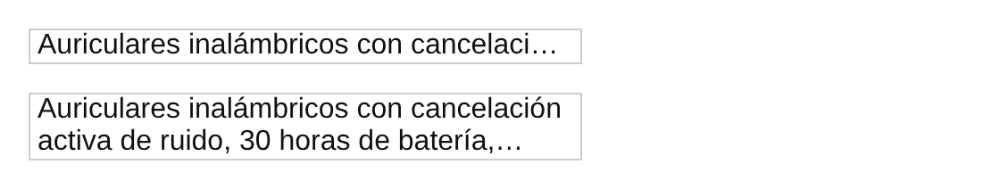


<sub>[▲ ÍNDICE](#indice) · [◂ MOD.05](#mod-05) · [MOD.07 ▸](#mod-07)</sub>

---

<a id="mod-07"></a>

## `07` FONDOS, BORDES Y EFECTOS

```text
┌─[ MOD.07 ]──────────────────────────────────────── FONDOS / EFECTOS ─┐
│  background · gradientes · sombras · filtros                         │
└─────────────────────────────────────────────────────────── SYS.OK ───┘
```

<a id="fondos"></a>

### ▸ Fondos

```css
.hero {
  background-color: #0d1117;                        /* se ve mientras carga la imagen o si falla */
  background-image: url("../img/hero.webp");
  background-size: cover;                           /* cubrir la caja, recortando lo que sobre */
  background-position: center;
  background-repeat: no-repeat;
}

/* Abreviado: color imagen posición / tamaño repetición */
.hero { background: #0d1117 url("../img/hero.webp") center / cover no-repeat; }
```

| `background-size` | Hace |
|---|---|
| `cover` | Cubre toda la caja (recorta) |
| `contain` | Cabe entera (pueden quedar huecos) |
| `100% auto` | Todo el ancho, alto proporcional |

<sub>La ruta de `url()` es **relativa al archivo CSS**, no al HTML: desde `css/estilos.css` es `../img/…`.</sub>

<a id="degradados"></a>

### ▸ Degradados

```html
<div class="muestras">
  <div class="lineal">linear</div><div class="radial">radial</div>
  <div class="conico">conic</div><div class="rayas">rayas</div>
</div>
```
```css
.muestras { display: flex; gap: 8px; }
.muestras div { width: 140px; height: 90px; border-radius: 8px; display: grid; place-items: center;
                color: #fff; font-weight: bold; text-shadow: 0 1px 2px #000; }
.lineal { background: linear-gradient(135deg, #ff8a1f, #7a2e9e); }
.radial { background: radial-gradient(circle at 30% 30%, #ffd08a, #c25e00); }
.conico { background: conic-gradient(#ff8a1f 0 40%, #1f6feb 40% 75%, #1a7f37 75%); }
.rayas  { background: repeating-linear-gradient(45deg, #0d1117 0 10px, #ff8a1f 10px 20px); }
```

<sub>▸ RESULTADO</sub><br>
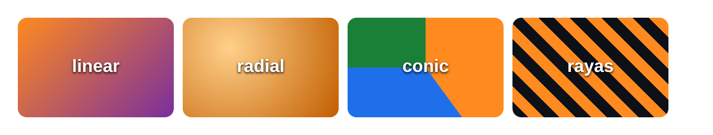


<sub>Superponer un degradado oscuro sobre una foto para que se lea el texto: `background: linear-gradient(rgb(0 0 0 / 60%), rgb(0 0 0 / 20%)), url("foto.webp") center / cover;`</sub>

<a id="bordes"></a>

### ▸ Bordes y radios

| Código | Hace |
|---|---|
| `border: 2px solid #ff8a1f` | Grosor, estilo (`solid`, `dashed`, `dotted`), color |
| `border-bottom: 1px solid #ddd` | Solo un lado |
| `border-radius: 8px` | Esquinas redondeadas |
| `border-radius: 50%` | Círculo (si la caja es cuadrada) |
| `border-radius: 999px` | Forma de "píldora" |
| `outline: 2px solid; outline-offset: 2px` | Contorno que **no ocupa espacio** (para el foco) |

<a id="sombras"></a>

### ▸ Sombras

```html
<div class="sombras">
  <div class="s1">suave</div><div class="s2">elevada</div><div class="s3">interior</div>
</div>
```
```css
.sombras { display: flex; gap: 24px; padding: 16px; background: #f6f8fa; }
.sombras div { width: 140px; height: 80px; background: #fff; border-radius: 8px; display: grid; place-items: center; }
.s1 { box-shadow: 0 1px 3px rgb(0 0 0 / 15%); }
.s2 { box-shadow: 0 10px 25px -5px rgb(0 0 0 / 25%), 0 4px 6px -4px rgb(0 0 0 / 10%); }
.s3 { box-shadow: inset 0 2px 6px rgb(0 0 0 / 25%); }
```

<sub>▸ RESULTADO</sub><br>
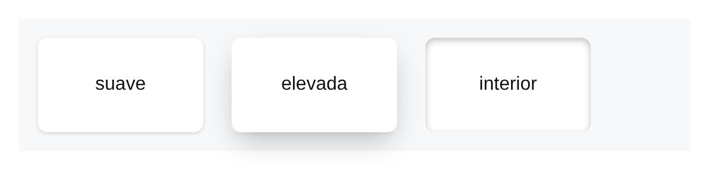


<sub>`box-shadow: desplazamiento-x desplazamiento-y desenfoque expansión color`. Se pueden encadenar varias con comas.</sub>

<a id="filtros"></a>

### ▸ Filtros

| Propiedad | Ejemplo | Uso |
|---|---|---|
| `filter` | `grayscale(100%)`, `blur(4px)`, `brightness(0.7)`, `drop-shadow(0 2px 4px #0006)` | Logos en gris que se colorean al pasar el ratón |
| `backdrop-filter` | `blur(10px)` | Efecto "cristal" de lo que hay **detrás** (menús, modales) (🟡 Recién disponible (2024-09)) |
| `mix-blend-mode` | `multiply` | Mezclar una imagen con el fondo |

<a id="object-fit"></a>

### ▸ object-fit: imágenes que encajan en una caja

```html
<div class="fotos">
  <figure><figcaption>fill (deforma)</figcaption></figure>
  <figure><figcaption>cover (recorta)</figcaption></figure>
  <figure><figcaption>contain (cabe entera)</figcaption></figure>
</div>
```
```css
.fotos { display: flex; gap: 12px; }
.fotos figure { margin: 0; }
.fotos img { width: 160px; height: 160px; background: #e9ecef; border: 1px solid #ccc; }
.fill    { object-fit: fill; }
.cover   { object-fit: cover; }
.contain { object-fit: contain; }
```

<sub>▸ RESULTADO</sub><br>
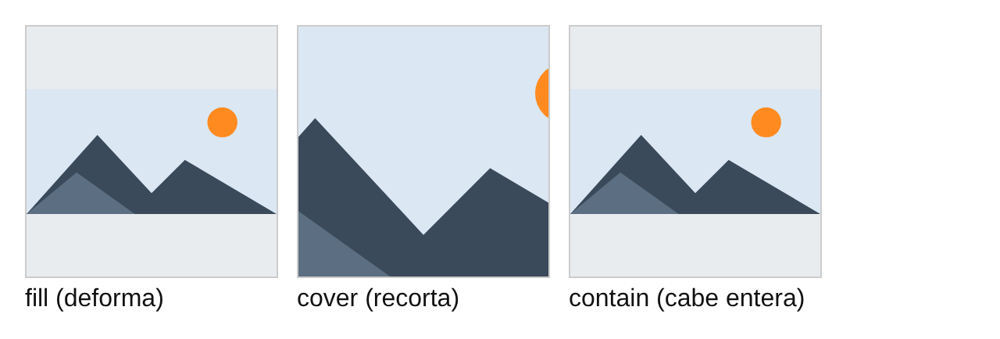


<sub>Imprescindible en galerías y tarjetas: todas las fotos del mismo tamaño aunque los originales tengan proporciones distintas. `object-position` elige qué parte se ve.</sub>

<sub>[▲ ÍNDICE](#indice) · [◂ MOD.06](#mod-06) · [MOD.08 ▸](#mod-08)</sub>

---

<a id="mod-08"></a>

## `08` POSICIONAMIENTO

```text
┌─[ MOD.08 ]───────────────────────────────────────── POSICIONAMIENTO ─┐
│  relative · absolute · fixed · sticky · z-index                      │
└─────────────────────────────────────────────────────────── SYS.OK ───┘
```

<a id="position"></a>

### ▸ position

| Valor | Se coloca respecto a… | ¿Deja su hueco? | Uso real |
|---|---|:---:|---|
| `static` | Flujo normal (por defecto); `top`/`left` no hacen nada | ✔ | — |
| `relative` | **Su propia posición** normal | ✔ | Moverlo un poco, y sobre todo **ser referencia** de sus hijos `absolute` |
| `absolute` | El **ancestro posicionado** más cercano (el primero que no sea `static`) | ✖ | Insignias, botón de cerrar en una esquina, texto sobre una imagen |
| `fixed` | La **ventana** (no se mueve al hacer scroll) | ✖ | Botón "subir", barra de cookies, chat |
| `sticky` | Fluye normal hasta llegar a un punto y entonces se "pega" | ✔ | Cabecera o columna que se queda fija al hacer scroll |

```html
<article class="tarjeta">
  
  <span class="insignia">-20 %</span>
  <button class="cerrar" aria-label="Quitar de favoritos">×</button>
  <h3>Auriculares Sony</h3>
</article>
```
```css
.tarjeta  { position: relative; width: 240px; border: 1px solid #ccc; }   /* referencia */
.tarjeta img { display: block; width: 100%; height: auto; }
.tarjeta h3 { margin: 8px; }
.insignia { position: absolute; top: 8px; left: 8px;
            background: #d1242f; color: #fff; padding: 2px 8px; border-radius: 4px; font-weight: bold; }
.cerrar   { position: absolute; top: 8px; right: 8px; width: 32px; height: 32px; border-radius: 50%;
            border: 0; background: #fff; font-size: 20px; cursor: pointer; }
```

<sub>▸ RESULTADO</sub><br>
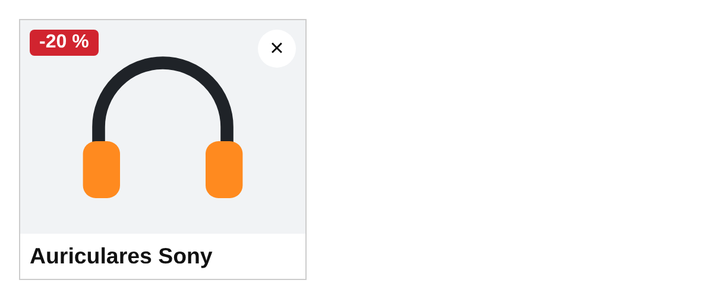


> [!IMPORTANT]
> Un `absolute` busca hacia arriba el **primer ancestro con `position` distinta de `static`**. Si no lo encuentra, se coloca respecto a la página entera y acaba en la esquina de la ventana. Patrón: **padre `relative` + hijo `absolute`**.

| Propiedad | Ejemplo |
|---|---|
| `top` / `right` / `bottom` / `left` | `top: 0; right: 0;` → esquina superior derecha |
| `inset` | `inset: 0;` = los cuatro a 0 → cubre al padre entero (capas sobre imágenes) |
| Centrar un `absolute` | `inset: 0; margin: auto;` (con ancho y alto) o `top: 50%; left: 50%; translate: -50% -50%;` |

<a id="z-index"></a>

### ▸ z-index: quién va encima

- Solo funciona en elementos **posicionados** (`relative`, `absolute`, `fixed`, `sticky`) o hijos de flex o grid.
- Mayor número = más arriba, **pero solo dentro de su mismo contexto de apilamiento**.

> [!WARNING]
> **"Mi `z-index: 9999` no se pone encima."** Algunas propiedades crean un **contexto de apilamiento** nuevo (`opacity` menor que 1, `transform`, `filter`, `position` con `z-index`, `isolation: isolate`). Los hijos de ese elemento compiten solo entre ellos: un hijo con `z-index: 9999` nunca supera a un elemento de fuera que esté por encima de su padre.

Escala recomendada (en variables, para no inventar números):

```css
:root {
  --z-desplegable: 100;
  --z-cabecera: 200;
  --z-modal: 300;
  --z-aviso: 400;
}
```

<a id="sticky"></a>

### ▸ sticky

```css
.cabecera {
  position: sticky;
  top: 0;              /* OBLIGATORIO: a qué distancia del borde se pega */
  z-index: var(--z-cabecera);
  background: #fff;    /* si no, el contenido se ve por debajo al hacer scroll */
}
```

<sub>`sticky` deja de funcionar si algún ancestro tiene `overflow: hidden` o `auto`, o si el padre mide lo mismo que el elemento (no tiene recorrido).</sub>

<sub>[▲ ÍNDICE](#indice) · [◂ MOD.07](#mod-07) · [MOD.09 ▸](#mod-09)</sub>

---

<a id="mod-09"></a>

## `09` FLEXBOX

```text
┌─[ MOD.09 ]───────────────────────────────────────────────── FLEXBOX ─┐
│  una dimensión · ejes · justify · align · gap                        │
└─────────────────────────────────────────────────────────── SYS.OK ───┘
```

Flexbox coloca los **hijos** de un contenedor en **una dimensión**: en fila o en columna.

<a id="flex-ejes"></a>

### ▸ Los dos ejes

```text
 flex-direction: row (por defecto)                 flex-direction: column
 ──────────── EJE PRINCIPAL ───────────▶           │ ┌──────┐
 ┌──────┐ ┌──────┐ ┌──────┐            │           │ │  1   │  EJE
 │  1   │ │  2   │ │  3   │  EJE       │ PRINCIPAL │ └──────┘  CRUZADO
 └──────┘ └──────┘ └──────┘  CRUZADO   ▼           │ ┌──────┐ ──────▶
                                                   │ │  2   │
 justify-content → eje principal                   ▼ └──────┘
 align-items     → eje cruzado
```

> [!TIP]
> **Regla para no liarse:** `justify-content` trabaja en el sentido de `flex-direction`; `align-items`, en el perpendicular. Si cambias a `column`, se "intercambian".

<a id="flex-contenedor"></a>

### ▸ Propiedades del contenedor

| Propiedad | Valores | Hace |
|---|---|---|
| `display` | `flex` | Activa flexbox en los **hijos** |
| `flex-direction` | `row` · `column` · `row-reverse` · `column-reverse` | Sentido del eje principal |
| `flex-wrap` | `nowrap` (defecto) · `wrap` | Si no caben, ¿pasan a otra línea? |
| `justify-content` | `flex-start` · `center` · `flex-end` · `space-between` · `space-around` · `space-evenly` | Reparto en el eje **principal** |
| `align-items` | `stretch` (defecto) · `flex-start` · `center` · `flex-end` · `baseline` | Alineación en el eje **cruzado** |
| `align-content` | Igual que `justify-content` | Reparto de las **líneas** cuando hay `wrap` |
| `gap` | `1rem` · `1rem 2rem` | Separación entre hijos (🟢 Disponible en todos (desde 2021)) |

```html
<p>justify-content: flex-start</p>  <div class="fila" style="justify-content: flex-start"><b>1</b><b>2</b><b>3</b></div>
<p>justify-content: center</p>      <div class="fila" style="justify-content: center"><b>1</b><b>2</b><b>3</b></div>
<p>justify-content: space-between</p><div class="fila" style="justify-content: space-between"><b>1</b><b>2</b><b>3</b></div>
<p>justify-content: space-evenly</p><div class="fila" style="justify-content: space-evenly"><b>1</b><b>2</b><b>3</b></div>
<p>align-items: center (con un hijo más alto)</p>
<div class="fila" style="align-items: center"><b>1</b><b class="alto">2</b><b>3</b></div>
```
```css
p { margin: 8px 0 2px; font-size: 13px; font-family: monospace; }
.fila { display: flex; gap: 8px; background: #f1f3f5; padding: 6px; }
.fila b { background: #ff8a1f; padding: 8px 18px; border-radius: 4px; }
.fila .alto { padding-block: 24px; }
```

<sub>▸ RESULTADO</sub><br>
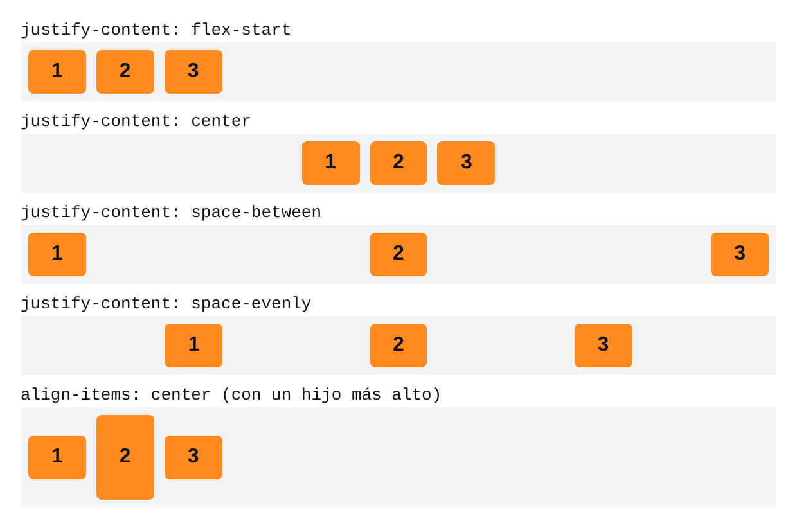


<a id="flex-hijos"></a>

### ▸ Propiedades de los hijos

| Propiedad | Hace | Ejemplo |
|---|---|---|
| `flex-grow` | Cuánto **crece** para ocupar espacio libre (0 = no crece) | `flex-grow: 1` |
| `flex-shrink` | Cuánto **encoge** si falta espacio (0 = no encoge) | `flex-shrink: 0` en un icono o un logo |
| `flex-basis` | Tamaño de partida antes de crecer o encoger | `flex-basis: 200px` |
| `align-self` | Alineación propia en el eje cruzado | `align-self: flex-end` |
| `order` | Cambia el orden **visual** (no el del lector de pantalla ni el del tabulador) | `order: -1` |
| `margin-left: auto` | Empuja ese hijo y los siguientes al final | Botón "Entrar" a la derecha del menú |

<a id="flex-shorthand"></a>

### ▸ flex: el abreviado

| Escritura | Equivale a | Significa |
|---|---|---|
| `flex: 1` | `1 1 0%` | Reparte el espacio **a partes iguales** con sus hermanos |
| `flex: 2` | `2 1 0%` | El doble de espacio que un `flex: 1` |
| `flex: auto` | `1 1 auto` | Crece y encoge **partiendo de su contenido** |
| `flex: none` | `0 0 auto` | Rígido: ni crece ni encoge |
| `flex: 0 0 250px` | — | Barra lateral fija de 250 px |

```html
<div class="fila"><b class="a">flex: 1</b><b class="a">flex: 1</b><b class="b">flex: 2</b></div>
<div class="fila"><b class="fijo">flex: 0 0 120px</b><b class="a">flex: 1 (el resto)</b></div>
<div class="fila"><b>Logo</b><b>Inicio</b><b>Tienda</b><b class="derecha">Entrar →</b></div>
```
```css
.fila { display: flex; gap: 8px; background: #f1f3f5; padding: 6px; margin-bottom: 8px; }
.fila b { background: #ff8a1f; padding: 8px 12px; border-radius: 4px; }
.a { flex: 1; } .b { flex: 2; } .fijo { flex: 0 0 120px; }
.derecha { margin-left: auto; background: #1f6feb !important; color: #fff; }
```

<sub>▸ RESULTADO</sub><br>
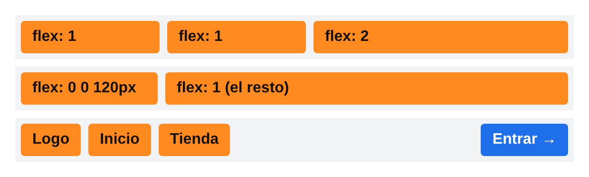


<a id="flex-recetas"></a>

### ▸ Recetas

```css
/* Barra de navegación: logo a la izquierda, enlaces a la derecha */
.nav { display: flex; align-items: center; justify-content: space-between; gap: 1rem; }

/* Footer siempre abajo aunque haya poco contenido */
body { min-height: 100dvh; display: flex; flex-direction: column; }
main { flex: 1; }

/* Tarjetas que pasan a la línea de abajo, con ancho mínimo de 250 px */
.tarjetas { display: flex; flex-wrap: wrap; gap: 1rem; }
.tarjetas > * { flex: 1 1 250px; }

/* Botón siempre al final de la tarjeta aunque los textos midan distinto */
.tarjeta { display: flex; flex-direction: column; }
.tarjeta .boton { margin-top: auto; }
```

```html
<div class="tarjetas">
  <article class="tarjeta"><h3>Básico</h3><p>Texto corto.</p><a class="boton" href="#">Elegir</a></article>
  <article class="tarjeta"><h3>Pro</h3><p>Un texto bastante más largo que ocupa varias líneas y hace la tarjeta más alta.</p><a class="boton" href="#">Elegir</a></article>
  <article class="tarjeta"><h3>Empresa</h3><p>Medio.</p><a class="boton" href="#">Elegir</a></article>
</div>
```
```css
.tarjetas { display: flex; gap: 12px; }
.tarjeta { flex: 1; display: flex; flex-direction: column; border: 1px solid #ccc; border-radius: 8px; padding: 12px; }
.tarjeta h3, .tarjeta p { margin: 0 0 8px; }
.boton { margin-top: auto; text-align: center; background: #ff8a1f; color: #000; padding: 8px; border-radius: 6px; text-decoration: none; font-weight: bold; }
```

<sub>▸ RESULTADO</sub><br>
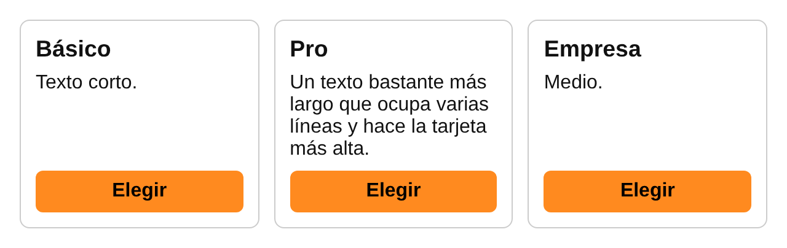


<sub>Las tres tarjetas miden lo mismo de alto (porque `align-items: stretch` es el valor por defecto) y los botones quedan alineados abajo gracias a `margin-top: auto`.</sub>

<sub>[▲ ÍNDICE](#indice) · [◂ MOD.08](#mod-08) · [MOD.10 ▸](#mod-10)</sub>

---

<a id="mod-10"></a>

## `10` GRID

```text
┌─[ MOD.10 ]──────────────────────────────────────────────────── GRID ─┐
│  dos dimensiones · fr · repeat · minmax · áreas                      │
└─────────────────────────────────────────────────────────── SYS.OK ───┘
```

Grid coloca los hijos en una **rejilla de filas y columnas a la vez**.

<a id="grid-columnas"></a>

### ▸ Columnas y filas

```css
.rejilla {
  display: grid;
  grid-template-columns: 200px 1fr 1fr;   /* 3 columnas: una fija y dos que se reparten el resto */
  grid-template-rows: auto 1fr auto;      /* filas (normalmente no hace falta definirlas) */
  gap: 1rem;                              /* separación entre celdas (row-gap y column-gap) */
}
```

<a id="grid-fr"></a>

### ▸ fr, repeat() y minmax()

| Escritura | Significa |
|---|---|
| `1fr 1fr 1fr` | 3 columnas iguales |
| `repeat(3, 1fr)` | Lo mismo, abreviado |
| `2fr 1fr` | La primera, el doble que la segunda |
| `250px 1fr` | Barra lateral fija + contenido flexible |
| `repeat(4, minmax(0, 1fr))` | 4 iguales que **nunca se desbordan** aunque el contenido sea largo |
| `minmax(200px, 1fr)` | Como poco 200 px; como mucho, una fracción |
| `auto` | Lo que mida el contenido |

<a id="grid-autofit"></a>

### ▸ Galería responsive sin media queries

```css
.galeria {
  display: grid;
  grid-template-columns: repeat(auto-fit, minmax(160px, 1fr));
  gap: 12px;
}
```

```html
<div class="galeria">
  <div>1</div><div>2</div><div>3</div><div>4</div><div>5</div><div>6</div>
</div>
```
```css
.galeria { display: grid; grid-template-columns: repeat(auto-fit, minmax(140px, 1fr)); gap: 8px; }
.galeria div { background: #ff8a1f; aspect-ratio: 4 / 3; display: grid; place-items: center; font-weight: bold; border-radius: 6px; }
```

<sub>▸ RESULTADO</sub><br>
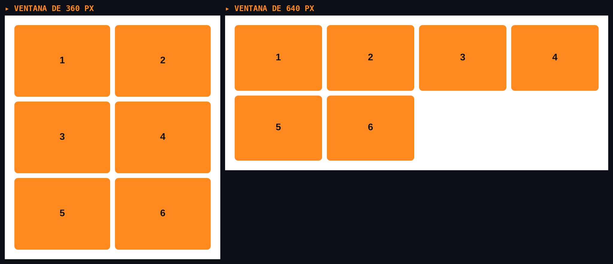


| | `auto-fit` | `auto-fill` |
|---|---|---|
| Con pocos elementos en una pantalla ancha | **Estira** los elementos para ocupar toda la fila | Deja **columnas vacías** al final |
| Úsalo para | Galerías y tarjetas (lo habitual) | Mantener siempre el mismo tamaño de celda |

<a id="grid-areas"></a>

### ▸ grid-template-areas: maquetar una página "dibujándola"

```html
<div class="pagina">
  <header>header</header>
  <nav>nav</nav>
  <main>main</main>
  <aside>aside</aside>
  <footer>footer</footer>
</div>
```
```css
.pagina {
  display: grid;
  grid-template-columns: 140px 1fr 140px;
  grid-template-rows: auto 160px auto;
  grid-template-areas:
    "header header header"
    "nav    main   aside"
    "footer footer footer";
  gap: 8px;
}
.pagina header { grid-area: header; }
.pagina nav    { grid-area: nav; }
.pagina main   { grid-area: main; }
.pagina aside  { grid-area: aside; }
.pagina footer { grid-area: footer; }
.pagina > * { background: #fff3e6; border: 2px solid #ff8a1f; padding: 12px; font-family: monospace; }
```

<sub>▸ RESULTADO</sub><br>
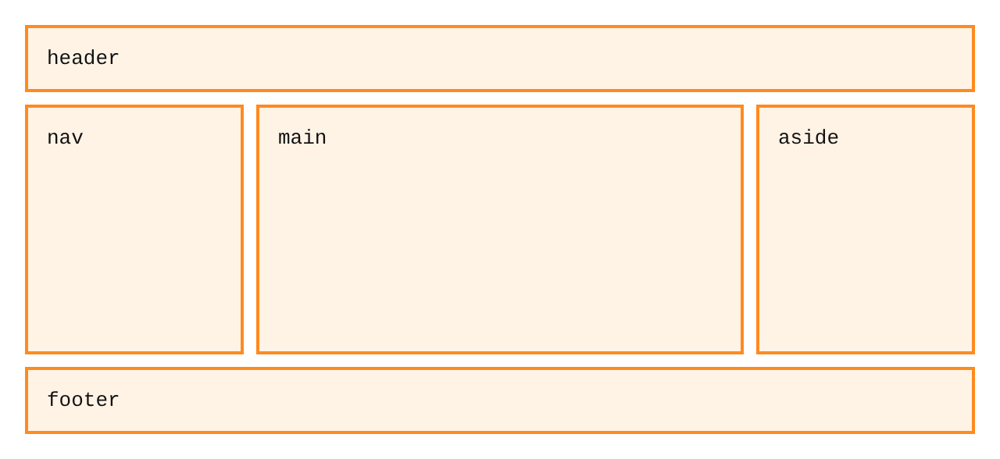


<sub>Cada cadena es una fila; repetir un nombre hace que el área ocupe varias celdas. Con una media query se puede redibujar en una columna para móvil (→ [M3](#m3)).</sub>

<a id="grid-colocar"></a>

### ▸ Colocar elementos concretos

| Propiedad | Ejemplo | Hace |
|---|---|---|
| `grid-column` | `grid-column: 1 / 3` | De la **línea** 1 a la 3 (ocupa 2 columnas) |
| `grid-column` | `grid-column: span 2` | Ocupa 2 columnas desde donde caiga |
| `grid-column` | `grid-column: 1 / -1` | **Todo el ancho** (`-1` = última línea) |
| `grid-row` | `grid-row: span 2` | Ocupa 2 filas |
| `justify-items` / `align-items` | `center` | Alinea el contenido **dentro** de cada celda |
| `place-items` | `center` | Las dos a la vez → centrar |
| `grid-auto-flow` | `dense` | Rellena los huecos que dejan los elementos grandes |

```html
<div class="mosaico">
  <div class="grande">span 2 × 2</div><div>2</div><div>3</div>
  <div>4</div><div>5</div><div class="ancho">1 / -1 (todo el ancho)</div>
</div>
```
```css
.mosaico { display: grid; grid-template-columns: repeat(4, 1fr); grid-auto-rows: 60px; gap: 8px; }
.mosaico div { background: #ffd8b0; display: grid; place-items: center; border-radius: 6px; }
.mosaico .grande { grid-column: span 2; grid-row: span 2; background: #ff8a1f; font-weight: bold; }
.mosaico .ancho  { grid-column: 1 / -1; background: #1f6feb; color: #fff; }
```

<sub>▸ RESULTADO</sub><br>
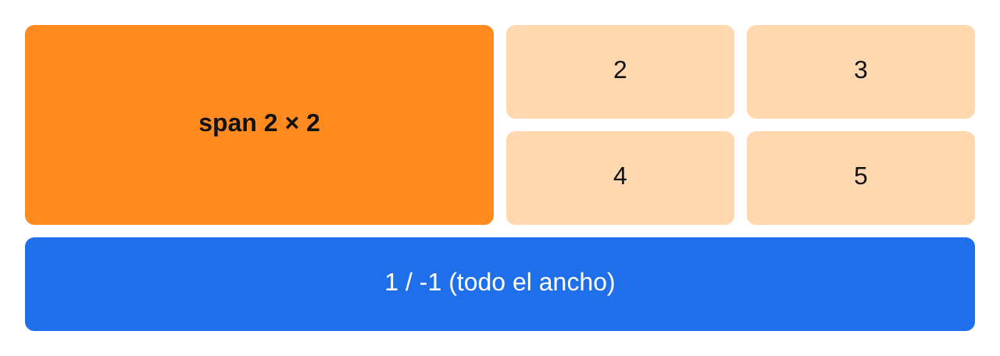


<a id="subgrid"></a>

### ▸ subgrid: alinear entre tarjetas

🟢 Disponible en todos (desde 2023)

Con `subgrid`, las filas de cada tarjeta se alinean con las de sus vecinas: todos los títulos a la misma altura, todos los precios a la misma altura.

```html
<div class="productos">
  <article><h3>Ratón</h3><p>Ligero.</p><strong>29 €</strong></article>
  <article><h3>Teclado mecánico inalámbrico</h3><p>Switches marrones, retroiluminado y batería de 4000 mAh.</p><strong>89 €</strong></article>
  <article><h3>Hub USB-C</h3><p>7 puertos.</p><strong>39 €</strong></article>
</div>
```
```css
.productos { display: grid; grid-template-columns: repeat(3, 1fr); gap: 12px; }
.productos article {
  display: grid;
  grid-row: span 3;                 /* cada tarjeta ocupa 3 filas de la rejilla padre… */
  grid-template-rows: subgrid;      /* …y usa esas mismas filas */
  gap: 6px; border: 1px solid #ccc; border-radius: 8px; padding: 10px;
}
.productos h3, .productos p { margin: 0; }
.productos strong { color: #c25e00; font-size: 1.25rem; }
```

<sub>▸ RESULTADO</sub><br>
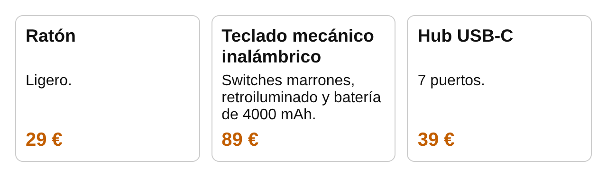


<sub>[▲ ÍNDICE](#indice) · [◂ MOD.09](#mod-09) · [MOD.11 ▸](#mod-11)</sub>

---

<a id="mod-11"></a>

## `11` ¿FLEX O GRID? Y CENTRAR

```text
┌─[ MOD.11 ]───────────────────────────────────────────── FLEX / GRID ─┐
│  cuál elegir · todas las formas de centrar                           │
└─────────────────────────────────────────────────────────── SYS.OK ───┘
```

<a id="flex-o-grid"></a>

### ▸ ¿Flex o Grid?

| Situación | Elige | Por qué |
|---|---|---|
| Elementos **en una fila o una columna** (menú, botones, barra de herramientas) | **Flex** | Una dimensión |
| El **contenido manda** en el tamaño (etiquetas de distinto largo) | **Flex** | Cada elemento mide lo que necesita |
| **Filas y columnas** que deben alinearse (galería, catálogo, tablero) | **Grid** | Dos dimensiones |
| El **diseño manda**: estructura de página (cabecera, lateral, contenido) | **Grid** | `grid-template-areas` |
| Alinear un icono con un texto | **Flex** | `align-items: center` |
| Superponer elementos sin `position` | **Grid** | Varios hijos en la misma celda (`grid-area: 1 / 1`) |

<sub>No son excluyentes: lo normal es **Grid para la página** y **Flex dentro de cada componente**.</sub>

<a id="centrar"></a>

### ▸ Todas las formas de centrar

| Qué | Cómo |
|---|---|
| **Texto** o elementos en línea dentro de un bloque | `text-align: center` |
| Un **bloque con ancho** en horizontal | `margin-inline: auto` |
| **Cualquier cosa**, en las dos direcciones (la más corta) | Padre: `display: grid; place-items: center;` |
| Cualquier cosa, con flex | Padre: `display: flex; justify-content: center; align-items: center;` |
| Un elemento `absolute` | `inset: 0; margin: auto;` (con ancho y alto) o `top: 50%; left: 50%; translate: -50% -50%;` |
| Texto en vertical en una línea | `line-height` igual a la altura (solo si es una línea) |

```html
<div class="marco grid"><span>grid + place-items</span></div>
<div class="marco flex"><span>flex + justify + align</span></div>
<div class="marco abs"><span>absolute + translate</span></div>
```
```css
.marco { height: 90px; border: 2px dashed #ff8a1f; margin-bottom: 8px; position: relative; }
.marco span { background: #ff8a1f; padding: 6px 12px; border-radius: 4px; font-weight: bold; }
.grid { display: grid; place-items: center; }
.flex { display: flex; justify-content: center; align-items: center; }
.abs span { position: absolute; top: 50%; left: 50%; translate: -50% -50%; }
```

<sub>▸ RESULTADO</sub><br>
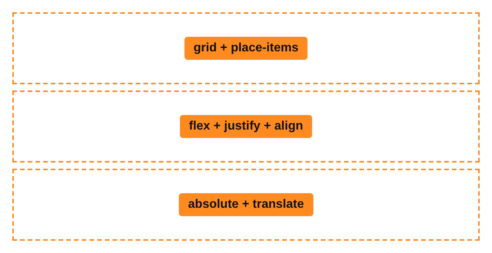


<sub>[▲ ÍNDICE](#indice) · [◂ MOD.10](#mod-10) · [MOD.12 ▸](#mod-12)</sub>

---

<a id="mod-12"></a>

## `12` RESPONSIVE

```text
┌─[ MOD.12 ]────────────────────────────────────────────── RESPONSIVE ─┐
│  mobile-first · media queries · container queries                    │
└─────────────────────────────────────────────────────────── SYS.OK ───┘
```

> [!NOTE]
> Va más allá del proyecto del festival (que de momento es solo para escritorio), pero es lo siguiente que vas a necesitar. Recuerda que todo empieza por `<meta name="viewport" content="width=device-width, initial-scale=1">` en el HTML.

<a id="mobile-first"></a>

### ▸ Mobile-first

Primero se escribe el CSS para **móvil** (sin media query) y luego se **añade** lo que cambia en pantallas más grandes con `min-width`.

| | Mobile-first (`min-width`) ✔ | Desktop-first (`max-width`) |
|---|---|---|
| CSS base | Móvil: una columna, sencillo | Escritorio: complejo |
| Media queries | **Añaden** columnas y adornos | **Deshacen** cosas para móvil |
| Resultado | Menos código y móviles más rápidos | Más sobrescrituras |

```html
<div class="layout">
  <main>Contenido principal</main>
  <aside>Barra lateral</aside>
</div>
```
```css
/* Base = móvil: una columna */
.layout { display: grid; gap: 12px; }
.layout > * { background: #fff3e6; border: 2px solid #ff8a1f; padding: 16px; }

/* A partir de 600 px: dos columnas */
@media (width >= 600px) {
  .layout { grid-template-columns: 2fr 1fr; }
}
```

<sub>▸ RESULTADO</sub><br>
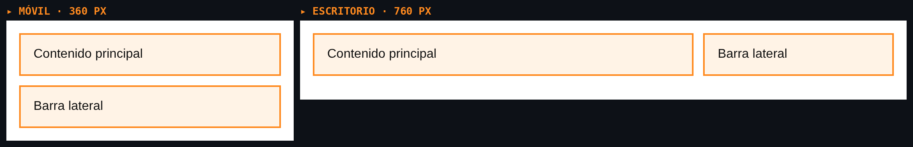


<a id="media-queries"></a>

### ▸ Media queries

```css
@media (min-width: 768px) { … }               /* clásica: a partir de 768 px */
@media (width >= 768px) { … }                 /* sintaxis de rango moderna, equivalente (🟢 Disponible en todos (desde 2023)) */
@media (768px <= width < 1200px) { … }        /* entre dos valores */
@media (orientation: landscape) { … }         /* horizontal */
@media (hover: hover) { .tarjeta:hover { … } }   /* solo en dispositivos con ratón */
@media print { nav, footer { display: none; } }  /* al imprimir */
```

<a id="breakpoints"></a>

### ▸ Puntos de corte

| Nombre | Desde | Dispositivos típicos |
|---|---|---|
| (base) | 0 | Móvil vertical |
| `sm` | 640 px | Móvil grande, horizontal |
| `md` | 768 px | Tableta vertical |
| `lg` | 1024 px | Tableta horizontal, portátil pequeño |
| `xl` | 1280 px | Escritorio |

<sub>Son orientativos (los de Tailwind). Lo correcto es poner el corte **donde tu diseño se rompe**, no donde está un dispositivo concreto: estrecha la ventana y mira dónde empieza a verse mal.</sub>

**Imágenes fluidas** (ya incluido en el [reset](#reset)): `img { max-width: 100%; height: auto; }`. **Tablas anchas:** envolverlas en un `div` con `overflow-x: auto`.

<a id="container-queries"></a>

### ▸ Container queries: responsive según el contenedor

🟢 Disponible en todos (desde 2023)

Una media query mira la **ventana**; una container query mira **la caja donde está el componente**. La misma tarjeta se adapta tanto si está en una columna estrecha como en una ancha.

```html
<div class="col estrecha">
  <div class="envoltorio"><article class="tarjeta"><div><h3>Auriculares</h3><p>Columna estrecha: apilada.</p></div></article></div>
</div>
<div class="col ancha">
  <div class="envoltorio"><article class="tarjeta"><div><h3>Auriculares</h3><p>Columna ancha: imagen al lado.</p></div></article></div>
</div>
```
```css
.estrecha { width: 220px; } .ancha { width: 560px; margin-top: 12px; }
.envoltorio { container-type: inline-size; }          /* 1. declarar el contenedor */
.tarjeta { display: grid; gap: 8px; border: 1px solid #ccc; border-radius: 8px; padding: 8px; }
.tarjeta img { width: 100%; height: auto; display: block; }
.tarjeta h3, .tarjeta p { margin: 0 0 4px; }
@container (width >= 400px) {                          /* 2. preguntar por SU ancho */
  .tarjeta { grid-template-columns: 160px 1fr; align-items: center; }
}
```

<sub>▸ RESULTADO</sub><br>
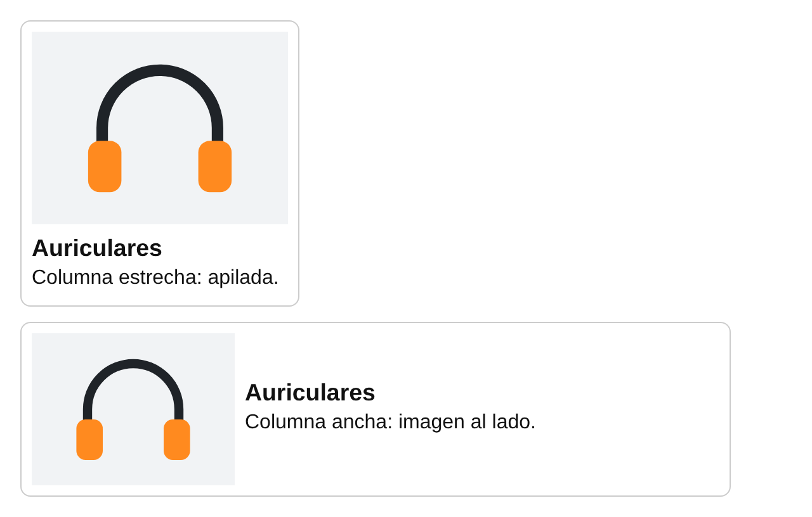


<a id="preferencias"></a>

### ▸ Preferencias del usuario

| Media query | El usuario ha pedido… | Qué hacer |
|---|---|---|
| `prefers-color-scheme: dark` | Modo oscuro en su sistema | Cambiar las variables de color → [MOD.13](#modo-oscuro) |
| `prefers-reduced-motion: reduce` | Reducir el movimiento | Quitar o suavizar animaciones (ya está en el [reset](#reset)) |
| `prefers-contrast: more` | Más contraste | Bordes y textos más marcados |
| `forced-colors: active` | Modo de alto contraste de Windows | Comprobar que los bordes y los iconos siguen viéndose |

<sub>[▲ ÍNDICE](#indice) · [◂ MOD.11](#mod-11) · [MOD.13 ▸](#mod-13)</sub>

---

<a id="mod-13"></a>

## `13` VARIABLES (CUSTOM PROPERTIES)

```text
┌─[ MOD.13 ]─────────────────────────────────────────────── VARIABLES ─┐
│  :root · var() · tokens · modo oscuro                                │
└─────────────────────────────────────────────────────────── SYS.OK ───┘
```

<a id="variables"></a>

### ▸ Definir y usar

```css
:root {                                   /* :root = <html>: disponibles en toda la página */
  --color-marca: #ff8a1f;
  --espacio-m: 1rem;
}

.boton {
  background: var(--color-marca);
  padding: var(--espacio-m);
  color: var(--color-texto-boton, #000);  /* segundo valor = respaldo si la variable no existe */
}

.boton--peligro {
  --color-marca: #d1242f;                 /* se puede redefinir en un elemento: afecta a él y a sus hijos */
}
```

| Detalle | Explicación |
|---|---|
| Nombre | Empiezan por `--` y distinguen mayúsculas (`--Color` ≠ `--color`) |
| Herencia | Se heredan: definida en un padre, la usan todos sus descendientes |
| En `calc()` | `margin: calc(var(--espacio-m) * 2);` |
| Desde JavaScript | `elemento.style.setProperty('--color-marca', '#1f6feb')` |
| Lo que no hacen | No sirven en media queries: `@media (width >= var(--md))` **no funciona** |

<a id="tokens"></a>

### ▸ Tokens de diseño (un sistema de diseño en un archivo)

```css
/* css/variables.css */
:root {
  /* Colores */
  --color-fondo: #ffffff;
  --color-superficie: #f6f8fa;
  --color-texto: #1f2328;
  --color-texto-suave: #59636e;
  --color-marca: #ff8a1f;
  --color-borde: #d1d9e0;
  --color-error: #d1242f;
  --color-ok: #1a7f37;

  /* Tipografía */
  --fuente-base: system-ui, sans-serif;
  --fuente-mono: ui-monospace, Consolas, monospace;
  --texto-s: 0.875rem;
  --texto-m: 1rem;
  --texto-l: 1.25rem;
  --texto-xl: clamp(1.75rem, 1rem + 3vw, 3rem);

  /* Espaciado (escala de 4 en 4 px) */
  --espacio-xs: 0.25rem;
  --espacio-s: 0.5rem;
  --espacio-m: 1rem;
  --espacio-l: 2rem;
  --espacio-xl: 4rem;

  /* Bordes, sombras y capas */
  --radio: 8px;
  --sombra: 0 4px 12px rgb(0 0 0 / 12%);
  --z-cabecera: 200;
  --z-modal: 300;
}
```

<sub>Así funciona el sistema de diseño de vuestro proyecto: cambiar el color de marca es tocar **una línea**.</sub>

<a id="modo-oscuro"></a>

### ▸ Modo oscuro

**Opción 1 · Automático según el sistema operativo:**

```css
:root { --color-fondo: #ffffff; --color-texto: #1f2328; }

@media (prefers-color-scheme: dark) {
  :root { --color-fondo: #0d1117; --color-texto: #e6edf3; }
}

body { background: var(--color-fondo); color: var(--color-texto); }
```

**Opción 2 · `light-dark()`**, más corta (🟡 Recién disponible (2024-05)):

```html
<div class="panel"><h3>Panel</h3><p>Se adapta al modo del sistema.</p><button>Aceptar</button></div>
```
```css
:root { color-scheme: light dark; }        /* obligatorio para light-dark() */
.panel {
  background: light-dark(#ffffff, #161b22);
  color: light-dark(#1f2328, #e6edf3);
  border: 1px solid light-dark(#d1d9e0, #30363d);
  border-radius: 8px; padding: 12px;
}
.panel h3 { margin: 0 0 4px; }
.panel button { background: #ff8a1f; border: 0; padding: 6px 14px; border-radius: 6px; }
```

<sub>▸ RESULTADO</sub><br>
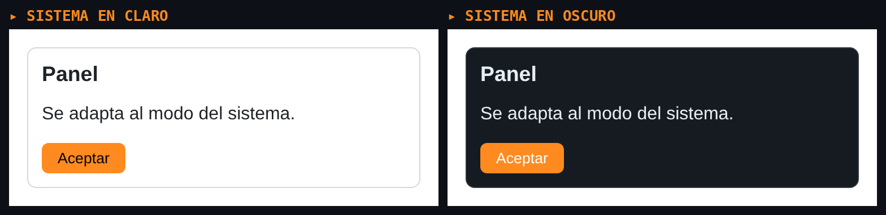


**Opción 3 · Interruptor manual sin JavaScript** (con `:has()`) → [M7](#m7).

<sub>[▲ ÍNDICE](#indice) · [◂ MOD.12](#mod-12) · [MOD.14 ▸](#mod-14)</sub>

---

<a id="mod-14"></a>

## `14` TRANSICIONES Y ANIMACIONES

```text
┌─[ MOD.14 ]─────────────────────────────────────────────── ANIMACIÓN ─┐
│  transition · transform · @keyframes                                 │
└─────────────────────────────────────────────────────────── SYS.OK ───┘
```

<a id="transition"></a>

### ▸ transition: de un estado a otro

```css
.boton {
  background: #ff8a1f;
  transition: background-color 200ms ease, translate 200ms ease;   /* qué, cuánto, cómo */
}
.boton:hover {
  background: #ffa552;
  translate: 0 -2px;
}
```

| Parte | Valores |
|---|---|
| Propiedad | `background-color`, `transform`, `opacity`… o `all` (cómodo, pero anima de más) |
| Duración | `150ms`-`300ms` para interfaz. Más de 500 ms se hace lento |
| Curva | `ease` (defecto) · `ease-out` (para lo que **entra**) · `ease-in` (para lo que **sale**) · `linear` · `cubic-bezier(…)` |
| Retardo | `transition: opacity 200ms ease 100ms;` (el último tiempo) |

```html
<a class="boton" href="#">Ver oferta</a>
```
```css
.boton { display: inline-block; margin: 12px; padding: 10px 20px; border-radius: 6px; background: #ff8a1f;
         color: #000; font-weight: bold; text-decoration: none;
         transition: background-color 200ms ease, translate 200ms ease, box-shadow 200ms ease; }
.boton:hover { background: #ffa552; translate: 0 -3px; box-shadow: 0 6px 12px rgb(0 0 0 / 20%); }
```

<sub>▸ RESULTADO</sub><br>
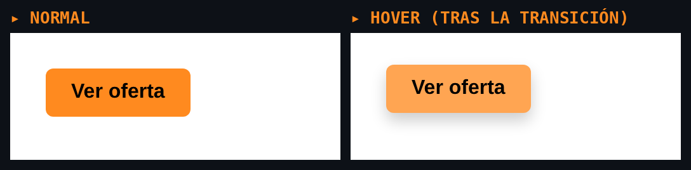


<a id="transform"></a>

### ▸ transform

| Función | Ejemplo | Propiedad individual moderna |
|---|---|---|
| Mover | `transform: translate(10px, -5px)` | `translate: 10px -5px` |
| Escalar | `transform: scale(1.05)` | `scale: 1.05` |
| Girar | `transform: rotate(45deg)` | `rotate: 45deg` |
| Inclinar | `transform: skew(-10deg)` | — |
| Punto de giro | `transform-origin: top left` | — |

<sub>Las propiedades individuales (`translate`, `scale`, `rotate`; 🟢 Disponible en todos (desde 2022)) se pueden combinar y animar por separado sin pisarse.</sub>

```html
<div class="formas"><b>normal</b><b class="t1">translate</b><b class="t2">scale(1.2)</b><b class="t3">rotate(15deg)</b><b class="t4">skew(-10deg)</b></div>
```
```css
.formas { display: flex; gap: 24px; padding: 24px 12px; }
.formas b { background: #ff8a1f; padding: 10px; border-radius: 4px; font-size: 13px; }
.t1 { translate: 0 -12px; } .t2 { scale: 1.2; } .t3 { rotate: 15deg; } .t4 { transform: skew(-10deg); }
```

<sub>▸ RESULTADO</sub><br>
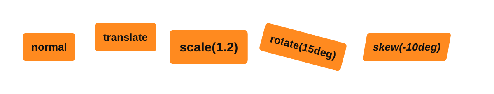


<a id="keyframes"></a>

### ▸ @keyframes: animaciones

```css
@keyframes aparecer {
  from { opacity: 0; translate: 0 20px; }
  to   { opacity: 1; translate: 0 0; }
}

@keyframes girar {
  to { rotate: 1turn; }
}

.tarjeta  { animation: aparecer 400ms ease-out both; }
.cargando { animation: girar 1s linear infinite; }
```

| Propiedad (dentro de `animation`) | Valores |
|---|---|
| `animation-name` | El nombre del `@keyframes` |
| `animation-duration` | `400ms`, `2s` |
| `animation-timing-function` | `ease-out`, `linear`, `steps(4)` |
| `animation-delay` | `200ms` (escalonar elementos: 0, 100, 200 ms…) |
| `animation-iteration-count` | `1`, `3`, `infinite` |
| `animation-direction` | `normal`, `alternate` (ida y vuelta) |
| `animation-fill-mode` | `both`: mantiene el estado inicial antes de empezar y el final al terminar |
| `animation-play-state` | `paused` (pausar al pasar el ratón) |

<a id="anim-rendimiento"></a>

### ▸ Rendimiento y accesibilidad

| ✔ Anima | ✖ Evita animar |
|---|---|
| `transform` (`translate`, `scale`, `rotate`) y `opacity` | `width`, `height`, `top`, `left`, `margin` |
| La tarjeta de gráficos los mueve sin recalcular la página: van fluidos a 60 fps | Obligan a recalcular la posición de toda la página en cada fotograma: tirones |

- Respeta **`prefers-reduced-motion`** (ya incluido en el reset).
- Nada que parpadee más de 3 veces por segundo (puede provocar crisis epilépticas).

<sub>[▲ ÍNDICE](#indice) · [◂ MOD.13](#mod-13) · [MOD.15 ▸](#mod-15)</sub>

---

<a id="mod-15"></a>

## `15` ARQUITECTURA

```text
┌─[ MOD.15 ]──────────────────────────────────────────── ARQUITECTURA ─┐
│  BEM · archivos · orden · nesting · @layer                           │
└─────────────────────────────────────────────────────────── SYS.OK ───┘
```

<a id="bem"></a>

### ▸ BEM: Bloque__Elemento--Modificador

| Parte | Qué es | Ejemplo |
|---|---|---|
| **Bloque** | Componente independiente y reutilizable | `.tarjeta`, `.menu`, `.boton` |
| **Elemento** (`__`) | Parte que solo tiene sentido dentro de su bloque | `.tarjeta__titulo`, `.tarjeta__imagen`, `.menu__enlace` |
| **Modificador** (`--`) | Variante o estado | `.tarjeta--destacada`, `.boton--grande`, `.menu__enlace--activo` |

```html
<article class="tarjeta tarjeta--destacada">
  
  <h3 class="tarjeta__titulo">Auriculares</h3>
  <a class="boton boton--grande" href="…">Comprar</a>
</article>
```

```css
.tarjeta { … }
.tarjeta--destacada { border-color: var(--color-marca); }
.tarjeta__titulo { … }
.boton { … }
.boton--grande { … }
```

| Regla | ✔ | ✖ |
|---|---|---|
| Una sola clase por selector | `.tarjeta__titulo` | `.tarjeta h3`, `.tarjeta .titulo` |
| Sin "nietos" en el nombre | `.tarjeta__enlace` | `.tarjeta__pie__enlace` |
| El modificador **acompaña** al bloque | `class="boton boton--grande"` | `class="boton--grande"` solo |
| Nada de `id` ni etiquetas para dar estilo | `.cabecera` | `#cabecera`, `header` |

<sub>Ventaja: todos los selectores tienen la misma especificidad (`0-1-0`), así que no hay "guerras" de especificidad y el nombre dice dónde está cada cosa.</sub>

<a id="organizar"></a>

### ▸ Organizar los archivos

```text
css/
├── reset.css          ← 1. el reset (MOD.01)
├── variables.css      ← 2. tokens: colores, fuentes, espacios
├── base.css           ← 3. estilos de etiquetas: body, h1-h6, a, enlaces…
├── layout.css         ← 4. estructura: contenedor, cabecera, rejillas de página
├── componentes/       ← 5. un archivo por bloque BEM
│   ├── boton.css
│   ├── tarjeta.css
│   └── menu.css
└── utilidades.css     ← 6. clases de ayuda: .sr-only, .texto-centrado…
```

<sub>El orden importa: de lo más general a lo más concreto. Así, a igual especificidad, lo concreto gana por ir después.</sub>

<a id="orden-propiedades"></a>

### ▸ Orden de las propiedades dentro de una regla

```css
.tarjeta {
  /* 1. Posición */
  position: relative;
  z-index: 1;
  /* 2. Modelo de caja y disposición */
  display: grid;
  gap: 1rem;
  width: 100%;
  padding: 1rem;
  /* 3. Tipografía */
  font-size: 1rem;
  color: var(--color-texto);
  /* 4. Aspecto */
  background: var(--color-superficie);
  border: 1px solid var(--color-borde);
  border-radius: var(--radio);
  /* 5. Otros */
  transition: box-shadow 200ms;
}
```

<a id="nesting"></a>

### ▸ Nesting nativo (sin Sass)

🟢 Disponible en todos (desde 2023)

```css
.tarjeta {
  padding: 1rem;

  & h3 { margin-bottom: 0.5rem; }            /* = .tarjeta h3 */
  &:hover { box-shadow: var(--sombra); }     /* = .tarjeta:hover */
  &--destacada { border-color: orange; }     /* ✖ esto NO crea .tarjeta--destacada (en Sass sí) */

  @media (width >= 768px) {                  /* media query dentro de la regla */
    padding: 2rem;
  }
}
```

> [!WARNING]
> El CSS nativo **no concatena** nombres como Sass: `&--destacada` no equivale a `.tarjeta--destacada`. Con BEM, escribe los modificadores y elementos como reglas aparte. Y no anides más de 2-3 niveles: la especificidad crece con cada nivel.

<a id="layer"></a>

### ▸ @layer: capas de cascada

🟢 Disponible en todos (desde 2022)

```css
/* Se declara el orden de las capas: las de la derecha GANAN, sea cual sea su especificidad */
@layer reset, base, componentes, utilidades;

@import url("reset.css") layer(reset);

@layer base {
  a { color: var(--color-marca); }
}

@layer componentes {
  .boton { color: #000; }        /* gana a "a" de base aunque se escriba antes */
}

@layer utilidades {
  .oculto { display: none; }     /* gana a cualquier componente */
}
```

<sub>Resuelve el problema de "este selector tan específico del reset me impide sobrescribirlo": la capa decide antes que la especificidad.</sub>

<sub>[▲ ÍNDICE](#indice) · [◂ MOD.14](#mod-14) · [MOD.16 ▸](#mod-16)</sub>

---

<a id="mod-16"></a>

## `16` CSS MODERNO

```text
┌─[ MOD.16 ]───────────────────────────────────────────── CSS MODERNO ─┐
│  qué se puede usar ya · datos Baseline                               │
└─────────────────────────────────────────────────────────── SYS.OK ───┘
```

<a id="moderno-tabla"></a>

### ▸ Tabla de compatibilidad

**Baseline** indica si una característica funciona en las últimas versiones de Chrome, Edge, Firefox y Safari. Datos oficiales del proyecto *web-features* a octubre de 2026.

| Característica | Para qué | ¿Se puede usar? |
|---|---|---|
| `:has()` | Seleccionar un padre según sus hijos → [MOD.02](#is-where-has) | 🟢 Disponible en todos (desde 2023) |
| Nesting | Anidar reglas sin Sass → [MOD.15](#nesting) | 🟢 Disponible en todos (desde 2023) |
| Container queries | Responsive según el contenedor → [MOD.12](#container-queries) | 🟢 Disponible en todos (desde 2023) |
| `subgrid` | Alinear filas entre tarjetas → [MOD.10](#subgrid) | 🟢 Disponible en todos (desde 2023) |
| `@layer` | Capas de cascada → [MOD.15](#layer) | 🟢 Disponible en todos (desde 2022) |
| `color-mix()` | Mezclar colores → [MOD.04](#color-mix) | 🟢 Disponible en todos (desde 2023) |
| `oklch()` | Colores con luminosidad uniforme | 🟢 Disponible en todos (desde 2023) |
| `:user-invalid` | Errores de formulario solo tras tocar el campo → [M6](#m6) | 🟢 Disponible en todos (desde 2023) |
| `light-dark()` | Modo claro y oscuro en una línea → [MOD.13](#modo-oscuro) | 🟡 Recién disponible (2024-05) |
| `text-wrap: balance` | Títulos equilibrados | 🟡 Recién disponible (2024-05) |
| `@starting-style` | Animar la **aparición** de un elemento (`display: none` → visible) | 🟡 Recién disponible (2024-08) |
| View transitions | Transiciones animadas entre estados de la página | 🟡 Recién disponible (2025-10) |
| `@scope` | Limitar estilos a una parte del DOM | 🟡 Recién disponible (2026-03) |
| `field-sizing: content` | Campos de formulario que crecen con el texto | 🟡 Recién disponible (2026-06) |
| Container style queries | `@container style(--tema: oscuro)` | 🟡 Recién disponible (2026-05) |
| Anchor positioning | Colocar un *tooltip* pegado a su botón sin JS | 🔴 Aún no en todos los navegadores |
| Scroll-driven animations | Animaciones que avanzan con el scroll | 🔴 Aún no en todos los navegadores |
| `<select>` personalizable | Dar estilo completo al desplegable nativo | 🔴 Aún no en todos los navegadores |
| `interpolate-size` | Animar hasta `height: auto` | 🔴 Aún no en todos los navegadores |

> [!TIP]
> - 🟢 **Úsalo** sin miedo.
> - 🟡 **Úsalo** si tu público usa navegadores actualizados (casi siempre); en navegadores de hace un año puede no funcionar.
> - 🔴 Solo como **mejora progresiva**: que la página funcione bien sin ello y, donde exista, quede mejor. Para comprobar con `@supports`: `@supports (anchor-name: --a) { … }`.

<a id="moderno-ejemplos"></a>

### ▸ Ejemplos rápidos

```css
/* @starting-style: el popover aparece con un fundido en vez de "de golpe" */
[popover] { opacity: 1; transition: opacity 200ms, display 200ms allow-discrete; }
[popover]:not(:popover-open) { opacity: 0; }
@starting-style { [popover]:popover-open { opacity: 0; } }

/* field-sizing: el textarea crece al escribir */
textarea { field-sizing: content; min-height: 3lh; max-height: 12lh; }

/* View transitions entre páginas de un mismo sitio (mejora progresiva) */
@view-transition { navigation: auto; }

/* @scope: estilos que solo afectan a .tarjeta y no "se filtran" a sus hijos con .anidado */
@scope (.tarjeta) to (.anidado) {
  img { border-radius: var(--radio); }
}
```

<sub>[▲ ÍNDICE](#indice) · [◂ MOD.15](#mod-15) · [MOD.17 ▸](#mod-17)</sub>

---

<a id="mod-17"></a>

## `17` DEPURAR

```text
┌─[ MOD.17 ]───────────────────────────────────────────────── DEPURAR ─┐
│  DevTools · por qué no se aplica · errores                           │
└─────────────────────────────────────────────────────────── SYS.OK ───┘
```

<a id="devtools"></a>

### ▸ DevTools (F12)

| Pestaña o herramienta | Para qué |
|---|---|
| *Elements → Styles* | Reglas que afectan al elemento, en orden de prioridad. **Las tachadas han perdido** contra otra; un **triángulo amarillo** indica propiedad o valor inválido |
| *Elements → Computed* | Valor **final** de cada propiedad y el dibujo del modelo de caja con sus medidas |
| Insignias `flex` / `grid` junto al elemento | Dibujan la rejilla, las líneas y los huecos sobre la página |
| Barra de herramientas de dispositivo (`Ctrl+Shift+M`) | Probar anchos de móvil y tableta |
| *Rendering* → *Emulate CSS media* | Simular `prefers-color-scheme: dark`, `prefers-reduced-motion`, `print` |
| Hacer clic en un color | Selector de color y **ratio de contraste** |
| `:hov` en *Styles* | Forzar `:hover`, `:focus`, `:active` para inspeccionarlos |

> [!TIP]
> **Truco para ver todas las cajas:** `* { outline: 1px solid red; }` muestra el borde de cada elemento sin cambiar las medidas (al contrario que `border`).

<a id="no-se-aplica"></a>

### ▸ "¿Por qué no se aplica mi CSS?"

1. ¿Está **enlazado** el archivo? Pestaña *Network* (F12) → ¿aparece con estado 200 o con 404? ¿La ruta del `href` es correcta desde el HTML?
2. ¿El navegador usa la **versión antigua**? Recarga sin caché: `Ctrl+F5` o `Ctrl+Shift+R`.
3. ¿El **selector** coincide con el HTML? Una errata en la clase (`.tarjta`), o un punto que falta (`tarjeta` en vez de `.tarjeta`).
4. ¿Hay un error **antes** en el CSS? Una llave `}` sin cerrar invalida todo lo que viene después.
5. ¿Pierde por **especificidad** u **orden**? En *Styles*, ¿aparece tachada?
6. ¿Es una propiedad que **no funciona en ese elemento**? `width` en un `span`, `z-index` sin `position`, `justify-content` sin `display: flex`.
7. ¿La propiedad o el valor están **mal escritos**? Triángulo amarillo en *Styles*.

<a id="errores"></a>

### ▸ Errores frecuentes

| Síntoma | Causa | Solución |
|---|---|---|
| `width` o `height` no hacen nada | El elemento es en línea (`span`, `a`) | `display: inline-block` o `block` |
| La caja mide más de lo que puse | `box-sizing: content-box`: el padding y el borde se suman | Reset con `border-box` |
| Hay un hueco bajo la imagen | La imagen es en línea | `img { display: block; }` |
| `height: 100%` no funciona | El padre no tiene una altura definida | `min-height` en el padre, o flex/grid |
| El margen del primer hijo "se sale" del padre | Colapso de márgenes | `padding` en el padre, `display: flow-root`, o usar `gap` |
| `z-index` no surte efecto | El elemento no está posicionado, o está en otro contexto de apilamiento | `position: relative`; revisar `opacity`/`transform` en los padres |
| `absolute` aparece en la esquina de la página | Ningún ancestro está posicionado | `position: relative` en el padre |
| `sticky` no se pega | Falta `top`, o un ancestro tiene `overflow` distinto de `visible` | `top: 0`; quitar el `overflow` |
| Scroll horizontal en móvil | Algo con ancho fijo (`width: 1200px`, `100vw` con barra de scroll) | `max-width: 100%`, `width: min(100%, 1200px)` |
| `100vh` en móvil corta el contenido | La barra del navegador no se descuenta | `100dvh` / `100svh` |
| La fuente propia no carga | Ruta de `url()` relativa al HTML en vez de al CSS | Desde `css/` → `../fonts/…` |
| El texto se ve borroso en la animación | Animar `top`/`left` o escalados con decimales raros | Animar `translate` y `scale` |
| Un `!important` lo arregla "todo" | Problema de especificidad sin resolver | Bajar especificidad (BEM, `:where`) o usar `@layer` |
| El color de un enlace no cambia | `:visited` o el orden de `:hover` | Orden **LVHA**: `:link`, `:visited`, `:hover`, `:active` |

<sub>[▲ ÍNDICE](#indice) · [◂ MOD.16](#mod-16) · [MOD.18 ▸](#mod-18)</sub>

---

<a id="mod-18"></a>

## `18` MISIONES: COMPONENTES REALES

```text
┌─[ MOD.18 ]──────────────────────────────────────────────── MISIONES ─┐
│  9 componentes reales · BEM · variables                              │
└─────────────────────────────────────────────────────────── SYS.OK ───┘
```

Cada misión es un componente que encontrarás en webs reales, con nombres **BEM** y **variables**. Las capturas muestran los estados importantes (hover, foco, móvil o escritorio…) y cada una está completa en [`demos/`](demos/) para abrirla y tocarla.

| ID | Componente | Practica |
|:---:|---|---|
| [M1](#m1) | Tarjeta de producto | BEM, `position`, `aspect-ratio`, `object-fit`, hover |
| [M2](#m2) | Barra de navegación responsive | Flexbox, `flex-wrap`, media query, `aria-current` |
| [M3](#m3) | Maquetación de página | `grid-template-areas` que cambia con el ancho |
| [M4](#m4) | Hero con imagen de fondo | Degradado sobre imagen, `clamp()`, `min-height` |
| [M5](#m5) | Tabla de precios con plan destacado | Grid, `subgrid`, modificador BEM, insignia |
| [M6](#m6) | Formulario con estados | `:focus-visible`, `:user-invalid`, `:has()` |
| [M7](#m7) | Modo oscuro con interruptor sin JS | Variables + `:has(:checked)` |
| [M8](#m8) | Banner de cookies | `position: fixed`, `backdrop-filter` |
| [M9](#m9) | Indicadores de carga | `@keyframes`, *skeleton* |

<a id="m1"></a>

### ◆ M1 · Tarjeta de producto

> **📡 Caso real:** la tarjeta de un listado de tienda: imagen con proporción fija, insignia de descuento, nombre, precio anterior y actual, y un efecto al pasar el ratón.

```html
<article class="producto">
  <div class="producto__media">
    
    <span class="producto__insignia">-8 %</span>
  </div>
  <div class="producto__cuerpo">
    <h3 class="producto__titulo">Auriculares Sony WH-1000XM5</h3>
    <p class="producto__precio"><s>379,00 €</s> <strong>349,00 €</strong></p>
    <a class="boton" href="#">Añadir al carrito</a>
  </div>
</article>
```
```css
:root { --marca: #ff8a1f; --texto: #1f2328; --suave: #59636e; --radio: 10px; }
.producto {
  width: 260px; margin: 12px; overflow: hidden;
  background: #fff; border: 1px solid #d1d9e0; border-radius: var(--radio);
  transition: translate 200ms ease, box-shadow 200ms ease;
}
.producto:hover { translate: 0 -4px; box-shadow: 0 12px 24px rgb(0 0 0 / 15%); }
.producto__media { position: relative; }
.producto__imagen { display: block; width: 100%; aspect-ratio: 4 / 3; object-fit: cover; }
.producto__insignia {
  position: absolute; top: 10px; left: 10px; padding: 2px 8px;
  background: #d1242f; color: #fff; font-weight: bold; font-size: 0.85rem; border-radius: 4px;
}
.producto__cuerpo { display: grid; gap: 8px; padding: 12px; }
.producto__titulo { margin: 0; font-size: 1rem; color: var(--texto); }
.producto__precio { margin: 0; }
.producto__precio s { color: var(--suave); font-size: 0.9rem; }
.producto__precio strong { font-size: 1.25rem; color: #c25e00; }
.boton {
  display: block; padding: 10px; text-align: center; font-weight: bold;
  background: var(--marca); color: #000; text-decoration: none; border-radius: 6px;
}
.boton:hover { background: color-mix(in oklch, var(--marca), white 20%); }
```

<sub>▸ RESULTADO</sub><br>
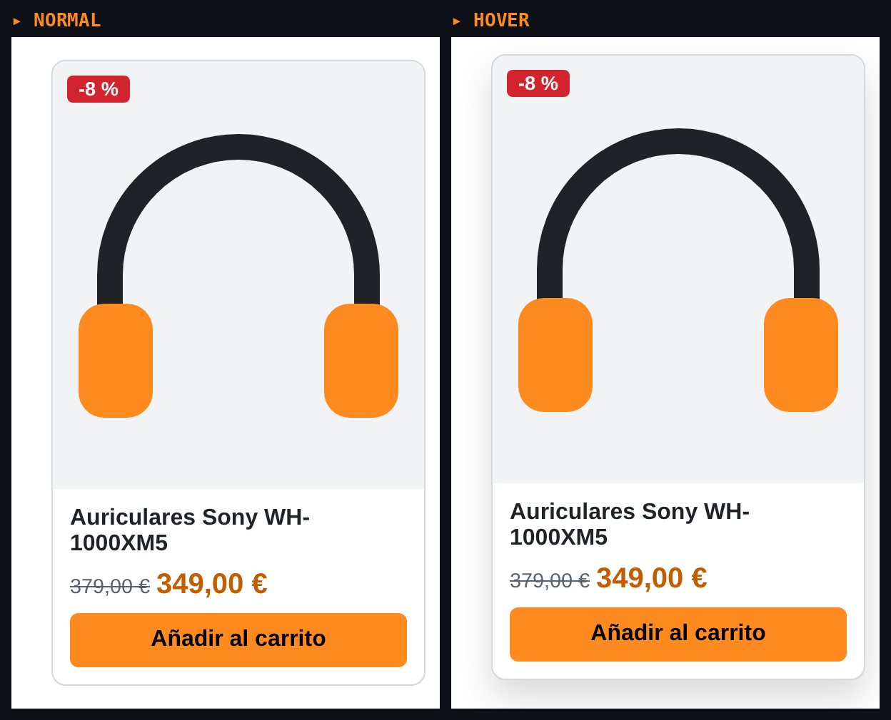


| Decisión | Por qué |
|---|---|
| `.producto__media` con `position: relative` | Es la referencia de la insignia `absolute` |
| `aspect-ratio` + `object-fit: cover` | Todas las fotos del listado iguales aunque los originales no lo sean |
| `overflow: hidden` en la tarjeta | Las esquinas redondeadas también recortan la imagen |
| Animar `translate` y `box-shadow` | Movimiento fluido, sin recalcular la página |
| `color-mix()` para el hover | Un solo color de marca; las variantes se calculan |

<sub>▸ [Abrir la demo](demos/m1-tarjeta.html) · [▲ ÍNDICE](#indice) · [◂ MISIONES](#mod-18) · [M2 ▸](#m2)</sub>

<a id="m2"></a>

### ◆ M2 · Barra de navegación responsive

> **📡 Caso real:** cabecera con logo, enlaces y botón de acceso. En escritorio, todo en una fila; en móvil, los enlaces pasan debajo y se pueden desplazar en horizontal.

```html
<header class="cabecera">
  <a class="cabecera__logo" href="#"></a>
  <nav class="menu" aria-label="Principal">
    <ul class="menu__lista" role="list">
      <li><a class="menu__enlace" href="#" aria-current="page">Inicio</a></li>
      <li><a class="menu__enlace" href="#">Teclados</a></li>
      <li><a class="menu__enlace" href="#">Audio</a></li>
      <li><a class="menu__enlace" href="#">Ofertas</a></li>
    </ul>
  </nav>
  <a class="cabecera__acceso" href="#">Entrar</a>
</header>
```
```css
body { margin: 0; }
.cabecera {
  display: flex; flex-wrap: wrap; align-items: center; gap: 8px 16px;
  padding: 12px 16px; background: #fff; border-bottom: 1px solid #d1d9e0;
}
.cabecera__logo img { display: block; height: 32px; width: auto; }
.cabecera__acceso {
  margin-left: auto; padding: 6px 14px; border-radius: 999px;
  background: #0d1117; color: #fff; text-decoration: none; font-weight: bold;
}
.menu { order: 3; width: 100%; overflow-x: auto; }          /* móvil: en otra línea, ancho completo */
.menu__lista { display: flex; gap: 4px; margin: 0; padding: 0; list-style: none; }
.menu__enlace {
  display: block; padding: 6px 12px; border-radius: 6px;
  color: #1f2328; text-decoration: none; white-space: nowrap;
}
.menu__enlace:hover { background: #f1f3f5; }
.menu__enlace[aria-current="page"] { background: #fff3e6; color: #c25e00; font-weight: bold; }

@media (width >= 640px) {
  .menu { order: 0; width: auto; }                           /* escritorio: en la misma fila */
}
```

<sub>▸ RESULTADO</sub><br>
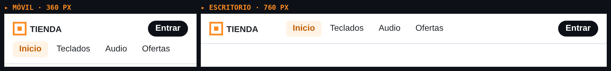


| Decisión | Por qué |
|---|---|
| `flex-wrap: wrap` + `order: 3` + `width: 100%` en móvil | El menú baja a su propia línea sin cambiar el HTML |
| `margin-left: auto` en "Entrar" | Lo empuja al extremo derecho |
| `overflow-x: auto` en el menú | Si no caben los enlaces en móvil, se desplazan con el dedo en vez de romper el diseño |
| `[aria-current="page"]` como selector | La marca de accesibilidad sirve también de gancho para el estilo: no hace falta una clase `--activo` |
| `role="list"` | El reset le quita las viñetas sin que Safari deje de anunciarla como lista |

<sub>▸ [Abrir la demo](demos/m2-navegacion.html) (estrecha la ventana) · [▲ ÍNDICE](#indice) · [◂ M1](#m1) · [M3 ▸](#m3)</sub>

<a id="m3"></a>

### ◆ M3 · Maquetación de página

> **📡 Caso real:** la estructura de un blog: cabecera, contenido, barra lateral y pie. En móvil, todo en una columna con la barra lateral **debajo** del contenido; en escritorio, dos columnas.

```html
<div class="pagina">
  <header class="pagina__cabecera">Cabecera</header>
  <main class="pagina__contenido">Contenido principal</main>
  <aside class="pagina__lateral">Barra lateral</aside>
  <footer class="pagina__pie">Pie</footer>
</div>
```
```css
body { margin: 0; }
.pagina {
  display: grid; gap: 8px; padding: 8px; min-height: 360px;
  grid-template-areas:
    "cabecera"
    "contenido"
    "lateral"
    "pie";
  grid-template-rows: auto 1fr auto auto;
}
.pagina__cabecera  { grid-area: cabecera; }
.pagina__contenido { grid-area: contenido; }
.pagina__lateral   { grid-area: lateral; }
.pagina__pie       { grid-area: pie; }
.pagina > * { padding: 16px; border: 2px solid #ff8a1f; background: #fff3e6; font-family: monospace; }

@media (width >= 640px) {
  .pagina {
    grid-template-columns: 1fr 200px;
    grid-template-areas:
      "cabecera  cabecera"
      "contenido lateral"
      "pie       pie";
    grid-template-rows: auto 1fr auto;
  }
}
```

<sub>▸ RESULTADO</sub><br>
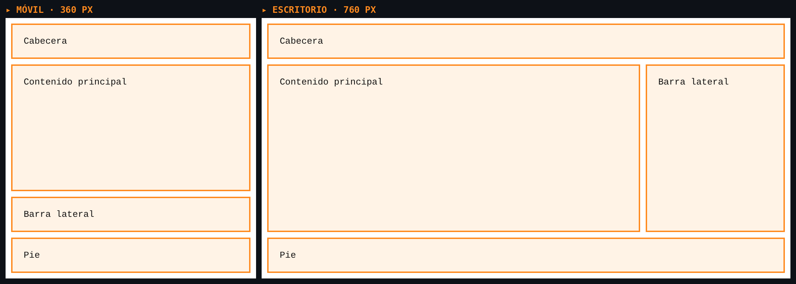


| Decisión | Por qué |
|---|---|
| `grid-template-areas` | El diseño de cada tamaño se "dibuja" y la media query solo redibuja el mapa |
| Orden del HTML: contenido antes que la barra lateral | Es el orden lógico para el lector de pantalla y el tabulador. En escritorio, el CSS los pone uno al lado del otro |
| Fila `1fr` para el contenido | El pie queda abajo aunque haya poco contenido |

<sub>▸ [Abrir la demo](demos/m3-layout.html) · [▲ ÍNDICE](#indice) · [◂ M2](#m2) · [M4 ▸](#m4)</sub>

<a id="m4"></a>

### ◆ M4 · Hero con imagen de fondo

> **📡 Caso real:** la portada de una web: imagen grande de fondo, título que se lee bien sobre ella, subtítulo y dos llamadas a la acción.

```html
<section class="hero">
  <div class="hero__contenido">
    <h1 class="hero__titulo">Equipa tu escritorio</h1>
    <p class="hero__texto">Periféricos seleccionados por desarrolladores, con envío en 24 h.</p>
    <div class="hero__acciones">
      <a class="boton boton--principal" href="#">Ver ofertas</a>
      <a class="boton boton--secundario" href="#">Cómo elegimos</a>
    </div>
  </div>
</section>
```
```css
body { margin: 0; }
.hero {
  display: grid; align-items: end; min-height: 320px; padding: clamp(16px, 4vw, 48px);
  color: #fff;
  background:
    linear-gradient(to top, rgb(13 17 23 / 90%), rgb(13 17 23 / 20%)),   /* capa oscura para leer el texto */
    url("recursos/paisaje.svg") center / cover no-repeat;
}
.hero__contenido { max-width: 34ch; }
.hero__titulo { margin: 0 0 8px; font-size: clamp(1.75rem, 1rem + 4vw, 3.25rem); line-height: 1.1; text-wrap: balance; }
.hero__texto { margin: 0 0 16px; font-size: 1.1rem; }
.hero__acciones { display: flex; flex-wrap: wrap; gap: 8px; }
.boton { padding: 10px 18px; border-radius: 6px; font-weight: bold; text-decoration: none; }
.boton--principal { background: #ff8a1f; color: #000; }
.boton--secundario { color: #fff; border: 2px solid #fff; }
```

<sub>▸ RESULTADO</sub><br>
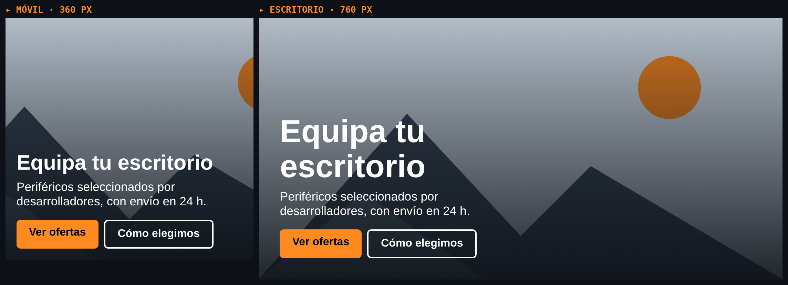


| Decisión | Por qué |
|---|---|
| Degradado **encima** de la imagen en el mismo `background` | Garantiza el contraste del texto sea cual sea la foto |
| `clamp()` en el título y el padding | Escalan con la pantalla sin media queries |
| `max-width: 34ch` | Líneas cortas y legibles |
| `min-height` y no `height` | Si el texto crece (traducción, zoom), la sección crece con él |

<sub>▸ [Abrir la demo](demos/m4-hero.html) · [▲ ÍNDICE](#indice) · [◂ M3](#m3) · [M5 ▸](#m5)</sub>

<a id="m5"></a>

### ◆ M5 · Tabla de precios con plan destacado

> **📡 Caso real:** tres planes de suscripción en tarjetas. El del medio está destacado; los precios y botones quedan alineados aunque las listas tengan distinta longitud.

```html
<div class="planes">
  <article class="plan">
    <h3 class="plan__nombre">Básico</h3>
    <p class="plan__precio">6,99 €<span>/mes</span></p>
    <ul class="plan__lista"><li>HD</li><li>1 pantalla</li></ul>
    <a class="plan__boton" href="#">Elegir</a>
  </article>
  <article class="plan plan--destacado">
    <span class="plan__insignia">Más popular</span>
    <h3 class="plan__nombre">Estándar</h3>
    <p class="plan__precio">12,99 €<span>/mes</span></p>
    <ul class="plan__lista"><li>Full HD</li><li>2 pantallas</li><li>Descargas</li></ul>
    <a class="plan__boton" href="#">Elegir</a>
  </article>
  <article class="plan">
    <h3 class="plan__nombre">Premium</h3>
    <p class="plan__precio">17,99 €<span>/mes</span></p>
    <ul class="plan__lista"><li>4K + HDR</li><li>4 pantallas</li><li>Descargas</li><li>Audio espacial</li></ul>
    <a class="plan__boton" href="#">Elegir</a>
  </article>
</div>
```
```css
.planes { display: grid; grid-template-columns: repeat(3, 1fr); gap: 16px; padding: 24px 8px 8px; align-items: stretch; }
.plan {
  position: relative; display: grid; grid-row: span 4; grid-template-rows: subgrid; gap: 8px;
  padding: 20px 16px; border: 1px solid #d1d9e0; border-radius: 12px; background: #fff; text-align: center;
}
.plan--destacado { border: 2px solid #ff8a1f; box-shadow: 0 12px 28px rgb(255 138 31 / 25%); scale: 1.04; }
.plan__insignia {
  position: absolute; top: 0; left: 50%; translate: -50% -50%;
  background: #ff8a1f; padding: 2px 12px; border-radius: 999px; font-size: 0.8rem; font-weight: bold; white-space: nowrap;
}
.plan__nombre { margin: 0; }
.plan__precio { margin: 0; font-size: 1.75rem; font-weight: bold; }
.plan__precio span { font-size: 0.9rem; font-weight: normal; color: #59636e; }
.plan__lista { margin: 0; padding: 0; list-style: none; line-height: 1.8; }
.plan__boton { align-self: end; padding: 10px; border-radius: 6px; background: #0d1117; color: #fff; text-decoration: none; font-weight: bold; }
.plan--destacado .plan__boton { background: #ff8a1f; color: #000; }
```

<sub>▸ RESULTADO</sub><br>
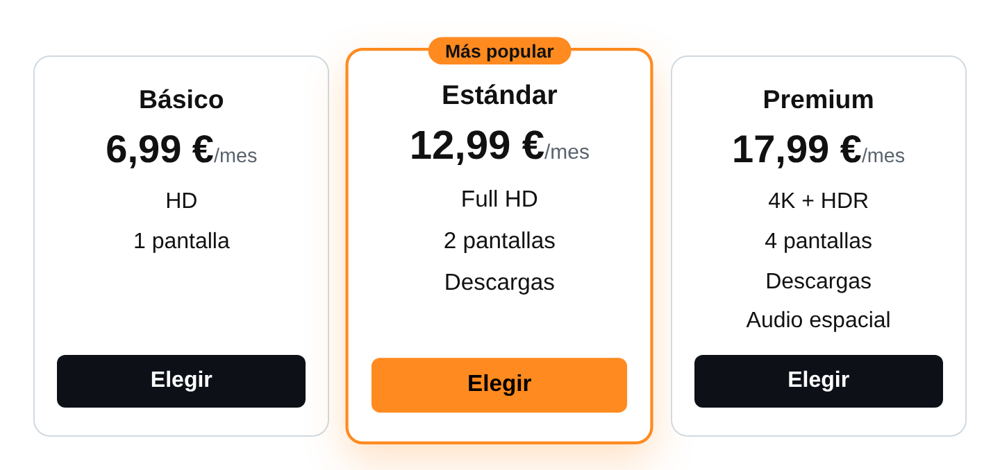


| Decisión | Por qué |
|---|---|
| `grid-template-rows: subgrid` en cada plan | Nombre, precio, lista y botón comparten filas con los otros planes: los precios quedan alineados |
| Modificador `plan--destacado` | Variante del mismo bloque, no un componente nuevo |
| Insignia con `translate: -50% -50%` | Centrada sobre el borde superior, sea cual sea su texto |
| `scale` y no `width` para destacar | No mueve a los vecinos ni recalcula la rejilla |

<sub>Para móvil bastaría con `grid-template-columns: 1fr` en la base y `repeat(3, 1fr)` a partir de 768 px.</sub>

<sub>▸ [Abrir la demo](demos/m5-precios.html) · [▲ ÍNDICE](#indice) · [◂ M4](#m4) · [M6 ▸](#m6)</sub>

<a id="m6"></a>

### ◆ M6 · Formulario con estados

> **📡 Caso real:** un campo de email que muestra el foco al tabular, y el error en rojo con su mensaje **solo después** de que el usuario escriba algo incorrecto (no nada más cargar la página).

```html
<form class="formulario" action="#" novalidate>
  <div class="campo">
    <label class="campo__etiqueta" for="email">Email</label>
    <input class="campo__control" id="email" name="email" type="email" required placeholder="tu@correo.com" aria-describedby="email-error">
    <p class="campo__error" id="email-error">Escribe un email válido, por ejemplo ana@correo.com</p>
  </div>
  <button class="formulario__boton" type="submit">Suscribirme</button>
</form>
```
```css
.formulario { display: grid; gap: 12px; max-width: 300px; padding: 4px; }
.campo { display: grid; gap: 4px; }
.campo__etiqueta { font-weight: bold; }
.campo__control {
  padding: 10px 12px; border: 2px solid #d1d9e0; border-radius: 6px; font: inherit;
  transition: border-color 150ms, box-shadow 150ms;
}
.campo__control:focus-visible { outline: none; border-color: #1f6feb; box-shadow: 0 0 0 4px rgb(31 111 235 / 25%); }
.campo__control:user-invalid { border-color: #d1242f; background: #fff5f5; }
.campo__control:user-valid   { border-color: #1a7f37; }
.campo__error { display: none; margin: 0; color: #d1242f; font-size: 0.875rem; }
.campo:has(.campo__control:user-invalid) .campo__error { display: block; }   /* el mensaje aparece solo */
.formulario__boton { padding: 10px; border: 0; border-radius: 6px; background: #ff8a1f; font: inherit; font-weight: bold; }
```

<sub>▸ RESULTADO</sub><br>
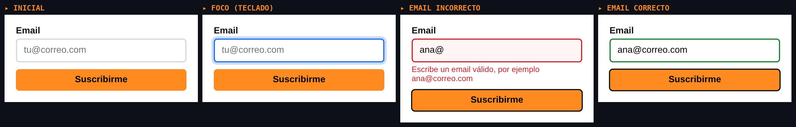


| Decisión | Por qué |
|---|---|
| `:user-invalid` y no `:invalid` | `:invalid` pintaría el campo de rojo nada más cargar la página (vacío + `required` = inválido) |
| `:has()` para mostrar el mensaje | El padre `.campo` sabe si su campo es inválido: sin JavaScript |
| `outline: none` **solo** porque se sustituye por otro foco visible | Nunca dejar un control sin indicador de foco |
| `aria-describedby` → el párrafo de error | El lector de pantalla lee el error al entrar en el campo |
| `novalidate` en el form | Desactiva el globo nativo para usar los mensajes propios (el servidor valida igualmente) |

<sub>▸ [Abrir la demo](demos/m6-formulario.html) · [▲ ÍNDICE](#indice) · [◂ M5](#m5) · [M7 ▸](#m7)</sub>

<a id="m7"></a>

### ◆ M7 · Modo oscuro con interruptor sin JavaScript

> **📡 Caso real:** un interruptor "Modo oscuro" que cambia los colores de toda la página. Todo el tema depende de variables y el cambio lo hace `:has()`.

```html
<label class="interruptor">
  <input class="interruptor__control" type="checkbox" id="modo" role="switch">
  <span class="interruptor__pista" aria-hidden="true"></span>
  Modo oscuro
</label>
<article class="aviso">
  <h2 class="aviso__titulo">Pedido enviado</h2>
  <p>Tu pedido #1024 llegará mañana.</p>
  <a href="#">Seguir el envío</a>
</article>
```
```css
:root {
  --fondo: #ffffff; --superficie: #f6f8fa; --texto: #1f2328; --borde: #d1d9e0; --enlace: #0969da;
}
:root:has(#modo:checked) {                      /* si el interruptor está marcado, cambian las variables */
  --fondo: #0d1117; --superficie: #161b22; --texto: #e6edf3; --borde: #30363d; --enlace: #ff8a1f;
  color-scheme: dark;
}
body { margin: 0; padding: 16px; background: var(--fondo); color: var(--texto); transition: background 200ms, color 200ms; }
a { color: var(--enlace); }
.aviso { margin-top: 16px; padding: 16px; background: var(--superficie); border: 1px solid var(--borde); border-radius: 8px; }
.aviso__titulo { margin: 0 0 4px; font-size: 1.1rem; }
.interruptor { display: inline-flex; align-items: center; gap: 8px; cursor: pointer; font-weight: bold; }
.interruptor__control { position: absolute; opacity: 0; }        /* oculto pero accesible con teclado */
.interruptor__pista { width: 44px; height: 24px; border-radius: 999px; background: #d1d9e0; position: relative; transition: background 200ms; }
.interruptor__pista::after {
  content: ""; position: absolute; top: 3px; left: 3px; width: 18px; height: 18px; border-radius: 50%;
  background: #fff; transition: translate 200ms;
}
.interruptor__control:checked + .interruptor__pista { background: #ff8a1f; }
.interruptor__control:checked + .interruptor__pista::after { translate: 20px 0; }
.interruptor__control:focus-visible + .interruptor__pista { outline: 3px solid #1f6feb; outline-offset: 2px; }
```

<sub>▸ RESULTADO</sub><br>
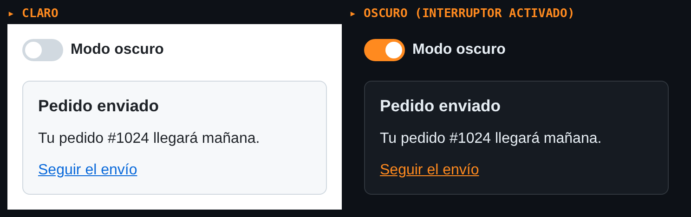


| Decisión | Por qué |
|---|---|
| Todos los colores en variables | El tema entero cambia redefiniendo **5 variables**, no reescribiendo reglas |
| `:root:has(#modo:checked)` | El documento "sabe" si el checkbox está marcado, aunque esté en cualquier parte de la página |
| Checkbox real oculto con `opacity: 0` | Sigue siendo accesible: se activa con teclado y el lector anuncia "interruptor" (`role="switch"`) |
| `color-scheme: dark` | Las barras de scroll y los controles nativos también se vuelven oscuros |

<sub>Para que se recuerde la elección al cambiar de página haría falta un poco de JavaScript (`localStorage`). Lo ideal es combinarlo con `prefers-color-scheme` como valor inicial.</sub>

<sub>▸ [Abrir la demo](demos/m7-modo-oscuro.html) · [▲ ÍNDICE](#indice) · [◂ M6](#m6) · [M8 ▸](#m8)</sub>

<a id="m8"></a>

### ◆ M8 · Banner de cookies

> **📡 Caso real:** el aviso de cookies fijo en la parte inferior, por encima del contenido, con efecto de cristal y botones con el **mismo peso visual** para aceptar y rechazar (lo exige la normativa española).

```html
<main class="contenido">
  <h1>Ofertas de la semana</h1>
  <p>Contenido de la página que queda por detrás del aviso de cookies…</p>
  
</main>
<section class="cookies" aria-labelledby="cookies-titulo">
  <h2 class="cookies__titulo" id="cookies-titulo">Usamos cookies</h2>
  <p class="cookies__texto">Para analizar el tráfico y recordar tus preferencias. <a href="#">Más información</a></p>
  <div class="cookies__acciones">
    <button class="cookies__boton" type="button">Rechazar</button>
    <button class="cookies__boton" type="button">Aceptar</button>
  </div>
</section>
```
```css
.contenido img { max-width: 100%; height: auto; display: block; }
.cookies {
  position: fixed; inset: auto 12px 12px 12px;          /* abajo, con 12 px de margen a los lados */
  z-index: 400;
  display: flex; flex-wrap: wrap; align-items: center; gap: 8px 16px;
  padding: 14px 16px; border-radius: 12px; color: #fff;
  background: rgb(13 17 23 / 75%);
  backdrop-filter: blur(8px);                            /* desenfoca lo que hay detrás */
  box-shadow: 0 8px 24px rgb(0 0 0 / 30%);
}
.cookies__titulo { margin: 0; font-size: 1rem; width: 100%; }
.cookies__texto { margin: 0; flex: 1 1 260px; font-size: 0.9rem; }
.cookies__texto a { color: #ffb366; }
.cookies__acciones { display: flex; gap: 8px; }
.cookies__boton {
  padding: 8px 16px; border-radius: 6px; font: inherit; font-weight: bold; cursor: pointer;
  background: #fff; color: #0d1117; border: 0;            /* los dos botones iguales */
}
```

<sub>▸ RESULTADO</sub><br>
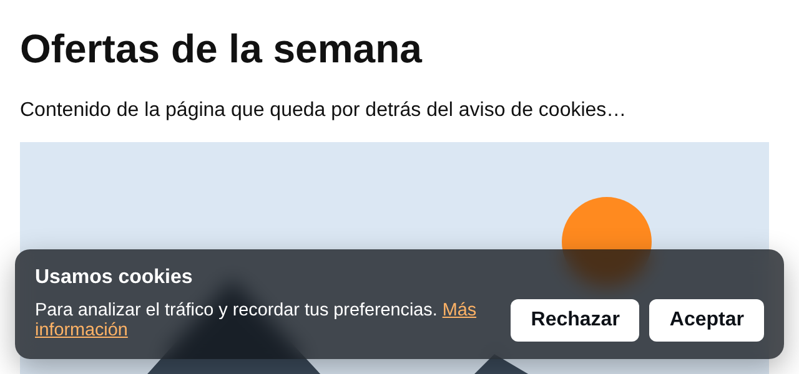


| Decisión | Por qué |
|---|---|
| `position: fixed` con `inset: auto 12px 12px 12px` | Pegado abajo, separado de los bordes, sin depender del ancho |
| `backdrop-filter: blur()` con fondo semitransparente | Se sigue intuyendo la página detrás pero el texto se lee |
| Dos botones con el mismo estilo | La AEPD exige que rechazar sea tan fácil y visible como aceptar |
| `flex: 1 1 260px` en el texto | En pantallas anchas, texto y botones en una fila; en estrechas, los botones bajan |

<sub>▸ [Abrir la demo](demos/m8-cookies.html) · [▲ ÍNDICE](#indice) · [◂ M7](#m7) · [M9 ▸](#m9)</sub>

<a id="m9"></a>

### ◆ M9 · Indicadores de carga

> **📡 Caso real:** mientras llegan los datos, un *spinner* para acciones cortas y un *skeleton* (la silueta gris de la tarjeta) para listados, que reduce la sensación de espera.

```html
<div class="spinner" role="status"><span class="sr-only">Cargando…</span></div>

<div class="skeleton" aria-hidden="true">
  <div class="skeleton__imagen"></div>
  <div class="skeleton__linea"></div>
  <div class="skeleton__linea skeleton__linea--corta"></div>
</div>
```
```css
.sr-only { position: absolute; width: 1px; height: 1px; overflow: hidden; clip-path: inset(50%); white-space: nowrap; }

@keyframes girar { to { rotate: 1turn; } }
.spinner {
  width: 40px; height: 40px; margin: 8px 0 20px;
  border: 4px solid #ffd8b0; border-top-color: #ff8a1f; border-radius: 50%;
  animation: girar 800ms linear infinite;
}

@keyframes brillo { to { background-position: -200% 0; } }
.skeleton { display: grid; gap: 10px; width: 260px; padding: 12px; border: 1px solid #d1d9e0; border-radius: 10px; }
.skeleton__imagen, .skeleton__linea {
  border-radius: 6px;
  background: linear-gradient(90deg, #eceff2 25%, #f8f9fa 50%, #eceff2 75%) 0 0 / 200% 100%;
  animation: brillo 1.4s ease-in-out infinite;
}
.skeleton__imagen { aspect-ratio: 4 / 3; }
.skeleton__linea { height: 14px; }
.skeleton__linea--corta { width: 60%; }
```

<sub>▸ RESULTADO</sub><br>
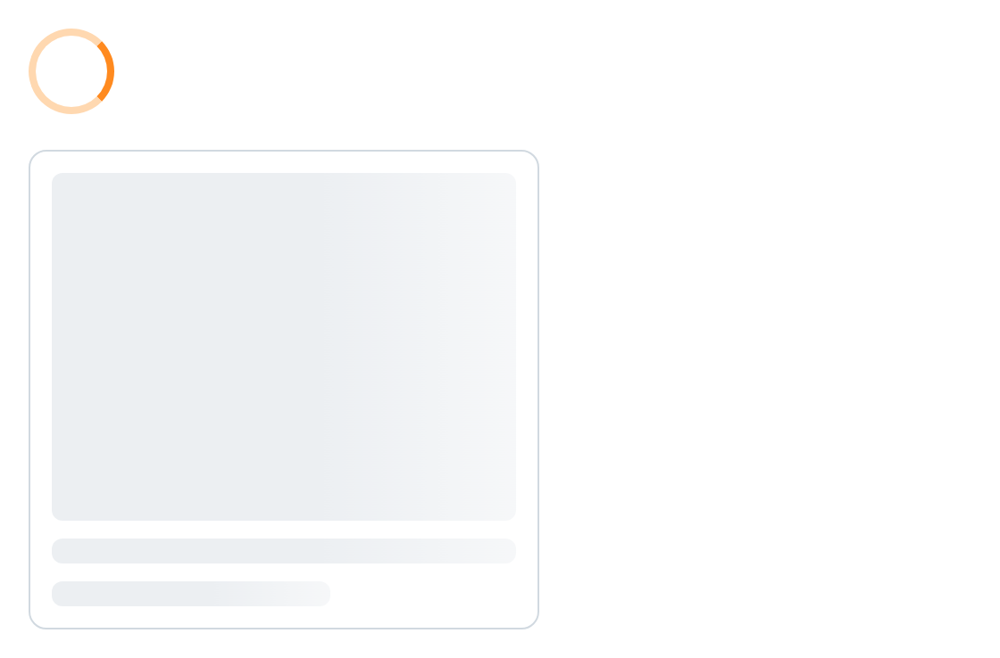


<sub>La captura es un fotograma; abre la demo para verlos en movimiento.</sub>

| Decisión | Por qué |
|---|---|
| Spinner con `border-top-color` distinto | Un solo elemento y un solo `rotate`: ligero |
| `role="status"` + texto `.sr-only` | El lector de pantalla anuncia "Cargando…" |
| *Skeleton* con `aria-hidden="true"` | Es decoración; ya hay un aviso de carga |
| Degradado con `background-size: 200%` animado | El "brillo" se mueve sin animar el tamaño de nada |
| Con `prefers-reduced-motion` | El reset frena estas animaciones a quien lo pida |

<sub>▸ [Abrir la demo](demos/m9-carga.html) · [▲ ÍNDICE](#indice) · [◂ M8](#m8) · [MISIONES ▲](#mod-18)</sub>

---

```text
┌─[ FIN DE TRANSMISIÓN ]─────────────────────────────────────────────────┐
│  CSS · Baseline oct. 2026 · capturas renderizadas en Chromium          │
└──────────────────────────────────────────────────────────── SYS.OK ───┘
```

<sub>[▲ VOLVER AL ÍNDICE](#indice)</sub>
