<p align="center">
  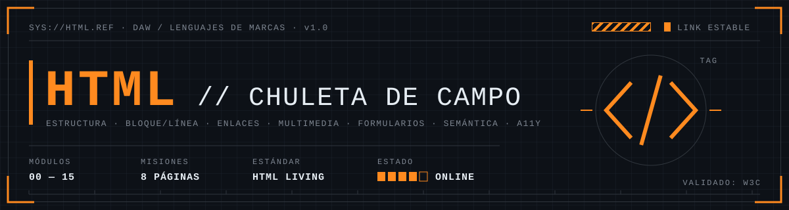
</p>

<p align="center">
  
  
  
  
</p>

```text
> SYS://HTML.CHULETA ........................ v1.0
> USO ....................................... consulta rápida: Ctrl+F o índice
> EJEMPLOS .................................. validados con el validador oficial del W3C
> CAPTURAS .................................. renderizadas en Chromium (estilos por defecto)
> LEYENDA ................................... ▲ índice · ◂ anterior · ▸ siguiente
> COMPATIBILIDAD ............................ 🟢 todos · 🟡 recién llegado · 🔴 aún no
```

> [!NOTE]
> Las capturas muestran los **estilos por defecto del navegador**: solo se ha cambiado la fuente a una sans-serif para que se lea mejor. Así ves lo que hace el HTML por sí solo, antes de escribir una línea de CSS. La compañera de esta chuleta es la **chuleta CSS**.

<a id="indice"></a>

## ⌖ ÍNDICE

| MOD | SECCIÓN | ACCESO DIRECTO |
|:---:|---|---|
| `00` | [**Fundamentos**](#mod-00) | [Anatomía](#anatomia) · [El DOM](#dom) · [Anidación](#anidacion) · [Espacios en blanco](#espacios) · [Entidades](#entidades) |
| `01` | [**Documento base**](#mod-01) | [Plantilla](#plantilla) · [El head](#head) · [CSS y JS](#enlazar-css-js) |
| `02` | [**Bloque y en línea**](#mod-02) | [La diferencia](#bl-diferencia) · [Tabla de elementos](#bl-tabla) · [Qué va dentro de qué](#bl-anidar) · [Consecuencias al maquetar](#bl-maquetar) · [div y span](#bl-div-span) |
| `03` | [**Texto**](#mod-03) | [Títulos](#titulos) · [Párrafos y saltos](#parrafos) · [Énfasis](#enfasis) · [Otros elementos de texto](#texto-otros) · [Citas y código](#citas-codigo) |
| `04` | [**Enlaces y rutas**](#mod-04) | [Anatomía de un enlace](#enlace) · [Rutas](#rutas) · [Tipos de enlace](#enlace-tipos) · [Nueva pestaña](#nueva-pestana) |
| `05` | [**Imágenes y multimedia**](#mod-05) | [img](#img) · [alt](#alt) · [figure](#figure) · [Formatos](#formatos) · [Responsive](#img-responsive) · [Audio y vídeo](#audio-video) · [iframe](#iframe) |
| `06` | [**Listas**](#mod-06) | [ul / ol](#ul-ol) · [Anidadas](#listas-anidadas) · [dl](#dl) · [Menú como lista](#menu-lista) |
| `07` | [**Tablas**](#mod-07) | [Estructura](#tabla-estructura) · [colspan / rowspan](#tabla-span) · [Accesibles](#tabla-accesible) · [¿Cuándo?](#tabla-cuando) |
| `08` | [**Semántica y estructura**](#mod-08) | [Esqueleto de página](#sem-esqueleto) · [Elementos](#sem-elementos) · [¿article, section o div?](#sem-elegir) · [Landmarks](#landmarks) |
| `09` | [**Formularios**](#mod-09) | [form](#form) · [label](#label) · [Tipos de input](#input-tipos) · [Atributos](#input-atributos) · [Selección](#seleccion) · [Agrupar](#fieldset) · [Botones](#botones) · [Validación nativa](#validacion) |
| `10` | [**Atributos globales**](#mod-10) | [Tabla](#globales) · [id vs class](#id-class) · [data-*](#data-attr) |
| `11` | [**Accesibilidad**](#mod-11) | [Principios](#a11y-principios) · [Teclado y foco](#a11y-teclado) · [ARIA básico](#aria) · [Checklist](#a11y-checklist) |
| `12` | [**SEO y metadatos**](#mod-12) | [Esenciales](#seo-esenciales) · [Open Graph](#open-graph) |
| `13` | [**Elementos interactivos**](#mod-13) | [details](#details) · [dialog](#dialog) · [popover](#popover) |
| `14` | [**Validar y depurar**](#mod-14) | [Herramientas](#herramientas) · [Errores frecuentes](#errores) |
| `15` | [**Misiones: casos reales**](#mod-15) | [M1](#m1) · [M2](#m2) · [M3](#m3) · [M4](#m4) · [M5](#m5) · [M6](#m6) · [M7](#m7) · [M8](#m8) |

---

<a id="mod-00"></a>

## `00` FUNDAMENTOS

```text
┌─[ MOD.00 ]───────────────────────────────────────────── FUNDAMENTOS ─┐
│  etiquetas · atributos · DOM · anidación                             │
└─────────────────────────────────────────────────────────── SYS.OK ───┘
```

<a id="anatomia"></a>

### ▸ Anatomía de un elemento

```text
   etiqueta de apertura           contenido          etiqueta de cierre
 ┌────────────────────────────┐ ┌────────────┐      ┌────┐
 <a href="contacto.html" class="btn">Escríbenos</a>
    │    └────┬────────┘
    │      valor (entre comillas dobles)
    └─ atributo: nombre="valor"
 └──────────────────── ELEMENTO completo ───────────────────┘
```

| Concepto | Detalle |
|---|---|
| **Elemento** | Apertura + contenido + cierre: `<p>Hola</p>` |
| **Atributo** | Información extra en la apertura: `nombre="valor"`. Se separan con espacios |
| **Atributo booleano** | Basta con escribirlo: `<input required>` (equivale a `required="required"`) |
| **Elementos vacíos** | No tienen contenido ni cierre: `<br>`, `<hr>`, ``, `<input>`, `<meta>`, `<link>`. La barra `<br />` es opcional en HTML5 |
| **Mayúsculas** | HTML no las distingue, pero la convención es **todo en minúsculas** |

<a id="dom"></a>

### ▸ El DOM: el HTML es un árbol

El navegador convierte el HTML en un **árbol de nodos** (DOM). El CSS y el JavaScript trabajan sobre ese árbol, no sobre el texto.

```text
html
├── head
│   ├── meta
│   └── title ── "Mi tienda"
└── body
    ├── header
    │   └── h1 ── "Mi tienda"
    └── main
        ├── h2 ── "Ofertas"
        └── p ── "Hoy un 20 % menos en…"
```

| Relación | Ejemplo en el árbol | Selector CSS relacionado |
|---|---|---|
| **Padre / hijo** | `main` es padre de `h2` | `main > h2` |
| **Ancestro / descendiente** | `body` es ancestro de `h2` | `body h2` |
| **Hermanos** | `h2` y `p` (mismo padre) | `h2 + p`, `h2 ~ p` |

> [!TIP]
> **Ver el DOM real:** `F12` → pestaña *Elements*. Si escribes mal el HTML, el navegador "lo arregla" a su manera, y en el inspector verás el árbol que ha construido de verdad, no el que tú escribiste.

<a id="anidacion"></a>

### ▸ Anidación correcta

Las etiquetas se cierran **en orden inverso** a como se abren, como paréntesis:

```html
<p>Texto <strong>importante <em>de verdad</em></strong></p>   ✔ se cierran en orden
<p>Texto <strong>importante <em>de verdad</strong></em></p>   ✖ cruzadas
```

<sub>Qué puede ir dentro de qué depende de si el elemento es de bloque o en línea → [MOD.02](#bl-anidar).</sub>

<a id="espacios"></a>

### ▸ Espacios en blanco

Varios espacios, tabuladores o saltos de línea seguidos se muestran como **un solo espacio**. Para separar se usan elementos (`<p>`, `<br>`) o CSS, nunca espacios repetidos.

```html
<p>Esto      tiene     muchos
   espacios y
   saltos de línea en el código.</p>
<p>Esto&nbsp;&nbsp;&nbsp;&nbsp;usa &amp;nbsp; (espacio que no se colapsa).</p>
```

<sub>▸ RESULTADO</sub><br>
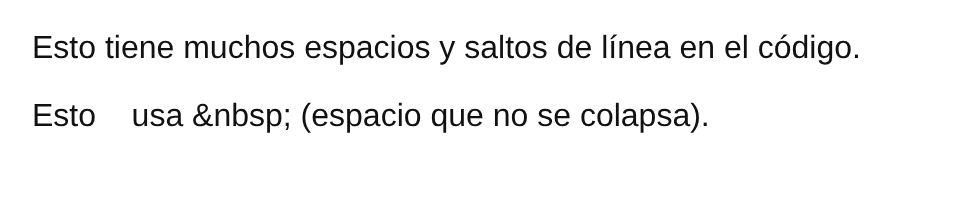


<a id="entidades"></a>

### ▸ Entidades (caracteres especiales)

| Carácter | Entidad | Cuándo hace falta |
|:---:|---|---|
| `<` | `&lt;` | Siempre que quieras mostrar el símbolo (si no, se interpreta como etiqueta) |
| `>` | `&gt;` | Recomendable junto a `&lt;` |
| `&` | `&amp;` | Siempre en textos y en URL dentro de `href` |
| `"` | `&quot;` | Dentro de un atributo entre comillas dobles |
| espacio fijo | `&nbsp;` | Que no se parta la línea: `10&nbsp;€`, `Sr.&nbsp;López` |
| `©` `®` `€` | `&copy;` `&reg;` `&euro;` | Opcional: con `<meta charset="utf-8">` puedes escribirlos directamente |

```html
<p>La etiqueta &lt;p&gt; crea un párrafo.</p>
<p>Precio: 49,90&nbsp;€ &middot; &copy; 2026 Tienda</p>
```

<sub>▸ RESULTADO</sub><br>
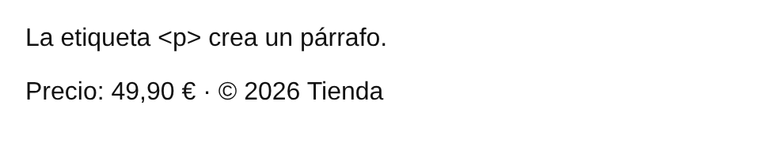


### ▸ Comentarios

```html
<!-- Esto no se muestra en la página, pero SÍ se ve con "Ver código fuente" -->
```

> [!WARNING]
> Nunca pongas contraseñas, notas internas ni datos sensibles en comentarios HTML: cualquiera puede leerlos con `Ctrl+U`.

<sub>[▲ ÍNDICE](#indice) · [MOD.01 ▸](#mod-01)</sub>

---

<a id="mod-01"></a>

## `01` DOCUMENTO BASE

```text
┌─[ MOD.01 ]────────────────────────────────────────── DOCUMENTO BASE ─┐
│  doctype · head · body · plantilla                                   │
└─────────────────────────────────────────────────────────── SYS.OK ───┘
```

<a id="plantilla"></a>

### ▸ Plantilla para copiar

```html
<!DOCTYPE html>
<html lang="es">
<head>
    <meta charset="utf-8">
    <meta name="viewport" content="width=device-width, initial-scale=1">
    <title>Título de la página · Nombre del sitio</title>
    <meta name="description" content="Resumen de 150-160 caracteres que aparece en Google.">
    <link rel="icon" href="img/favicon.svg" type="image/svg+xml">
    <link rel="stylesheet" href="css/estilos.css">
    <script src="js/app.js" defer></script>
</head>
<body>
    <header>…</header>
    <main>…</main>
    <footer>…</footer>
</body>
</html>
```

<sub>En VS Code: escribe `!` y pulsa `Tab` (Emmet) para generar el esqueleto.</sub>

<a id="head"></a>

### ▸ Qué hace cada línea del head

| Línea | Para qué | Si falta… |
|---|---|---|
| `<!DOCTYPE html>` | Indica HTML5 | El navegador entra en "modo quirks" y el CSS se comporta de forma rara |
| `<html lang="es">` | Idioma de la página | Los lectores de pantalla pronuncian mal; el traductor no sabe el idioma |
| `<meta charset="utf-8">` | Codificación de caracteres. **Primera línea del head** | Salen `ñ` en lugar de `ñ` |
| `<meta name="viewport" …>` | En móvil, usar el ancho real de la pantalla | En móvil se ve la página "de escritorio" en miniatura |
| `<title>` | Título de la pestaña, de los marcadores y de Google | La pestaña muestra la URL |
| `<meta name="description">` | Resumen en los resultados de búsqueda | Google se inventa uno con trozos de la página |
| `<link rel="icon">` | Favicon | Icono genérico en la pestaña |

<a id="enlazar-css-js"></a>

### ▸ Enlazar CSS y JavaScript

| Qué | Cómo | Dónde |
|---|---|---|
| CSS externo (**recomendado**) | `<link rel="stylesheet" href="css/estilos.css">` | `<head>` |
| CSS interno | `<style> … </style>` | `<head>` |
| CSS en línea | `<p style="color: red">` | En el elemento (evitar) |
| JS externo | `<script src="js/app.js" defer></script>` | `<head>` con `defer` |
| JS en módulos | `<script type="module" src="js/app.js"></script>` | `<head>` (los módulos ya se cargan diferidos) |

> [!TIP]
> `defer` descarga el script mientras se lee el HTML y lo ejecuta **cuando el DOM está completo**. Sin `defer`, un script en el `<head>` no encuentra los elementos del `<body>` porque aún no existen. Por eso antes se ponía al final del `<body>`.

<sub>[▲ ÍNDICE](#indice) · [◂ MOD.00](#mod-00) · [MOD.02 ▸](#mod-02)</sub>

---

<a id="mod-02"></a>

## `02` BLOQUE Y EN LÍNEA

```text
┌─[ MOD.02 ]─────────────────────────────────────── BLOQUE / EN LÍNEA ─┐
│  la base de toda maquetación                                         │
└─────────────────────────────────────────────────────────── SYS.OK ───┘
```

Todo elemento HTML tiene una forma de colocarse por defecto. Entender esto es el **80 % de maquetar**: explica por qué un `width` "no hace nada", por qué dos elementos no se ponen al lado o por qué sale un hueco debajo de una imagen.

<a id="bl-diferencia"></a>

### ▸ La diferencia

| | **Bloque** (`display: block`) | **En línea** (`display: inline`) |
|---|---|---|
| Empieza en línea nueva | ✔ Sí | ✖ No: sigue en la misma línea, como una palabra |
| Ancho | **Todo el disponible**, aunque el contenido sea corto | **Solo el de su contenido** |
| `width` / `height` | ✔ Funcionan | ✖ Se ignoran |
| `margin` / `padding` verticales | ✔ Empujan a los demás | ✖ No empujan (el padding se pinta, pero se solapa) |
| Puede contener | Bloque y en línea (según el elemento) | Solo en línea (texto) |
| Ejemplos | `div`, `p`, `h1`, `ul`, `section` | `span`, `a`, `strong`, `em`, `code` |

```html
<div>Soy un div (bloque)</div>
<p>Soy un párrafo (bloque). Dentro tengo un <span>span</span>,
   un <a href="#">enlace</a> y un <strong>strong</strong>: todos en línea.</p>
<h2>Soy un h2 (bloque)</h2>
<span>Span 1</span> <span>Span 2</span> <span>Span 3</span>
```
```css
/* CSS solo para dibujar las cajas: naranja = bloque, azul = en línea */
div, p, h2 { outline: 2px dashed #ff8a1f; }
span, a, strong { outline: 2px solid #1f6feb; background: #e7f0ff; }
```

<sub>▸ RESULTADO</sub><br>
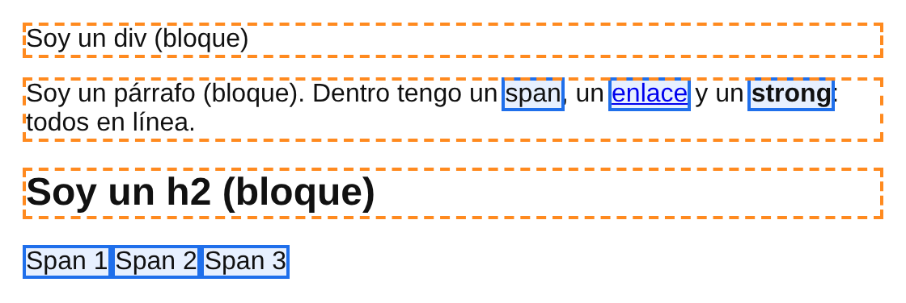


<sub>Fíjate en que las cajas naranjas ocupan todo el ancho aunque su texto sea corto, y en que los tres `span` del final se colocan uno al lado de otro.</sub>

**Hay un tercer comportamiento: `inline-block`.** Se coloca en línea (al lado de otros) **pero acepta** `width`, `height`, `margin` y `padding` como un bloque. Así se comportan por defecto los **controles de formulario** (`input`, `button`, `select`, `textarea`). Las **imágenes** son en línea, pero como su contenido viene de fuera (son "elementos reemplazados") también aceptan `width` y `height`.

<a id="bl-tabla"></a>

### ▸ Tabla de elementos por comportamiento

| Por defecto | Elementos |
|---|---|
| **Bloque** | `div` `p` `h1`–`h6` `header` `footer` `main` `nav` `section` `article` `aside` `address` `blockquote` `pre` `hr` `form` `fieldset` `figure` `figcaption` `details` `dialog` `ul` `ol` `dl` `dt` `dd` |
| **Bloque especial** | `li` (`list-item`: bloque + viñeta) · `table` (`table`) · `tr`, `td`, `th` (partes de tabla) |
| **En línea** | `span` `a` `strong` `em` `b` `i` `u` `s` `mark` `small` `abbr` `cite` `q` `code` `kbd` `samp` `var` `time` `sub` `sup` `br` `label` `data` `del` `ins` |
| **En línea, pero aceptan tamaño** | `img` `video` `iframe` `svg` `canvas` (elementos reemplazados) |
| **inline-block** | `input` `button` `select` `textarea` `meter` `progress` |
| **No se muestran** | `head` `meta` `title` `link` `script` `style` `template` (`display: none`) |

> [!TIP]
> Si dudas, inspecciónalo: `F12` → selecciona el elemento → pestaña **Computed** → busca `display`.

<a id="bl-anidar"></a>

### ▸ Qué puede ir dentro de qué

| Regla | ✔ Correcto | ✖ Incorrecto |
|---|---|---|
| Un `<p>` solo admite contenido en línea | `<p>Texto <a href="#">enlace</a></p>` | `<p><div>…</div></p>`, `<p><ul>…</ul></p>`, `<p><p>…</p></p>` |
| Los títulos `h1`–`h6` solo admiten contenido en línea | `<h2>Ofertas <small>hoy</small></h2>` | `<h2><p>Ofertas</p></h2>` |
| Un elemento en línea no envuelve bloques… | `<strong>texto</strong>` | `<span><div>…</div></span>` |
| …**excepto `<a>`**, que puede envolver bloques (tarjeta clicable) | `<a href="#"><h3>Título</h3><p>Resumen</p></a>` | — |
| Elementos interactivos no se anidan entre sí | `<a href="#">Comprar</a>` | `<a href="#"><button>Comprar</button></a>`, `<a>` dentro de `<a>` |
| `ul` y `ol` solo admiten `li` como hijos directos | `<ul><li><a href="#">Inicio</a></li></ul>` | `<ul><a href="#">Inicio</a></ul>` |

Lo que no está permitido, el navegador lo "arregla" a su manera. Con un `div` dentro de un `p`, **cierra el párrafo antes del div** y luego encuentra un `</p>` suelto:

```html
<p>Inicio del párrafo
  <div>Un div dentro del párrafo</div>
  final del párrafo</p>
```
```css
p { outline: 2px dashed #ff8a1f; }
div { outline: 2px solid #1f6feb; }
```

<sub>▸ RESULTADO</sub><br>
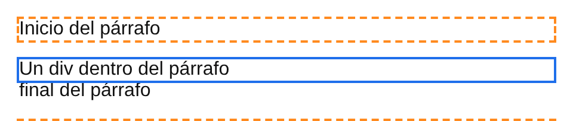

<sub>✖ VALIDADOR W3C</sub>

```text
Error: No “p” element in scope but a “p” end tag seen.
```


<sub>El validador dice: "se ha encontrado un `</p>` de cierre sin ningún `p` abierto". El navegador cerró el párrafo al ver el `div`, y el resultado tiene **tres** cajas: el párrafo con "Inicio del párrafo", el div y un párrafo vacío (la línea discontinua de abajo) creado para el `</p>` suelto. El texto "final del párrafo" queda fuera de cualquier párrafo.</sub>

<a id="bl-maquetar"></a>

### ▸ Consecuencias al maquetar

```html
<span class="caja">span con width: 200px</span>
<span class="caja">otro span</span>
<div class="caja">div con width: 200px</div>
<span class="caja ib">span con inline-block</span>
<span class="caja ib">otro inline-block</span>
```
```css
.caja { width: 200px; height: 50px; padding: 10px; margin: 10px;
        background: #e7f0ff; outline: 2px solid #1f6feb; }
.ib   { display: inline-block; }
```

<sub>▸ RESULTADO</sub><br>
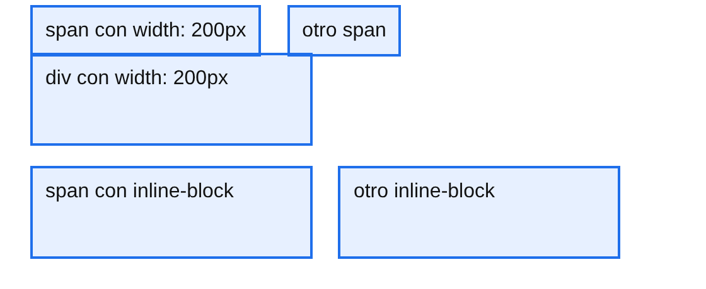


| Lo que ves | Por qué | Arreglo (CSS) |
|---|---|---|
| El `width` de un `span` o un `a` no hace nada | Son en línea: miden lo que su texto | `display: inline-block` o `block` |
| El `margin-top` de un enlace no lo separa de la línea de arriba | Los márgenes verticales de los elementos en línea no empujan | `display: inline-block` |
| Un `div` ocupa todo el ancho aunque le sobre espacio | Los bloques se estiran | `width`, `max-width`, o ponerlo en un contenedor flex o grid |
| Dos `div` no se ponen uno al lado del otro | Cada bloque empieza en línea nueva | `display: flex` en el padre (chuleta CSS · Flexbox) |
| Un hueco de unos px **debajo de una imagen** dentro de una caja | La imagen es en línea y se alinea con la línea base del texto, dejando sitio para las letras con rabito (g, p, y) | `img { display: block; }` (incluido en el reset de la chuleta CSS) |
| Un pequeño espacio entre elementos `inline-block` | El salto de línea del código entre ellos cuenta como un espacio | Usar flex en el padre con `gap` |
| `text-align: center` no centra un `div` | `text-align` centra el contenido **en línea** de dentro | Para centrar un bloque: `margin-inline: auto` con un `width`, o flex |

```html
<div class="marco"> imagen en línea</div>
<div class="marco"></div>
```
```css
.marco { border: 2px solid #ff8a1f; margin-bottom: 12px; width: 260px; }
.bloque { display: block; }
```

<sub>▸ RESULTADO</sub><br>
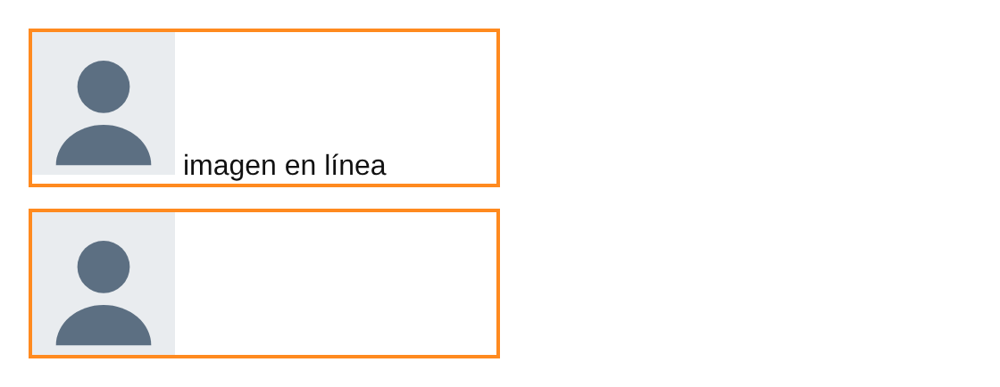


<sub>En la primera caja hay un hueco entre la imagen y el borde inferior; en la segunda (`display: block`) desaparece.</sub>

<a id="bl-div-span"></a>

### ▸ div y span: los "comodines"

| | `<div>` | `<span>` |
|---|---|---|
| Comportamiento | Bloque | En línea |
| Significado | **Ninguno**: solo agrupa | **Ninguno**: solo marca un trozo de texto |
| Úsalo para | Agrupar elementos y darles estilo o disposición (contenedores flex o grid, envoltorios) | Dar estilo a una parte de un texto (`<span class="precio">`) |
| No lo uses si… | Existe un elemento con significado: `header`, `nav`, `section`, `article`… → [MOD.08](#mod-08) | Existe uno con significado: `strong`, `em`, `time`, `abbr`… → [MOD.03](#mod-03) |

<sub>[▲ ÍNDICE](#indice) · [◂ MOD.01](#mod-01) · [MOD.03 ▸](#mod-03)</sub>

---

<a id="mod-03"></a>

## `03` TEXTO

```text
┌─[ MOD.03 ]─────────────────────────────────────────────────── TEXTO ─┐
│  títulos · párrafos · énfasis · citas · código                       │
└─────────────────────────────────────────────────────────── SYS.OK ───┘
```

<a id="titulos"></a>

### ▸ Títulos h1 – h6

```html
<h1>h1 · Título de la página</h1>
<h2>h2 · Sección</h2>
<h3>h3 · Subsección</h3>
<h4>h4 · Apartado</h4>
<h5>h5 · Poco habitual</h5>
<h6>h6 · Casi nunca</h6>
```

<sub>▸ RESULTADO</sub><br>
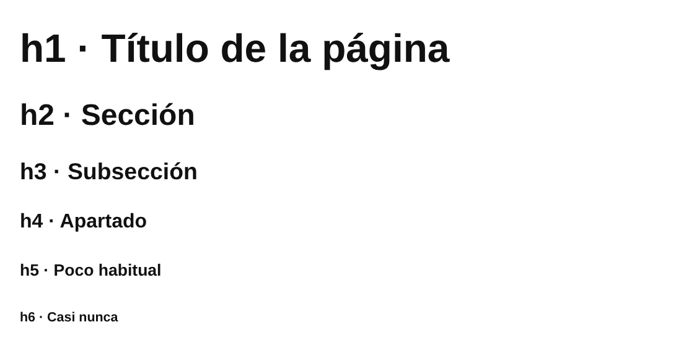


| Regla | Por qué |
|---|---|
| **Un solo `h1` por página**, con el tema principal | Es lo que Google y los lectores de pantalla toman como título |
| **No saltar niveles** (`h2` → `h4`) | Quien navega con lector de pantalla salta de título en título: un salto parece que le falta contenido |
| Elegir el nivel por **jerarquía**, no por tamaño | El tamaño se cambia con CSS. Si quieres un `h2` pequeño, sigue siendo `h2` |
| No usar títulos para destacar texto | Para eso está `<strong>` |

<a id="parrafos"></a>

### ▸ Párrafos, saltos y separadores

| Elemento | Uso | No lo uses para |
|---|---|---|
| `<p>` | Párrafo de texto | Separar con párrafos vacíos (`<p></p>`): eso es CSS (`margin`) |
| `<br>` | Salto de línea **dentro** de un mismo bloque: direcciones, poemas | Separar bloques (`<br><br>`) |
| `<hr>` | Cambio de tema entre párrafos (una pausa) | Dibujar una línea decorativa: eso es `border` en CSS |

```html
<address>
  Tienda DAW<br>
  C/ Mayor, 10<br>
  28013 Madrid
</address>
<hr>
<p>Horario: de lunes a sábado, de 10:00 a 20:00.</p>
```

<sub>▸ RESULTADO</sub><br>
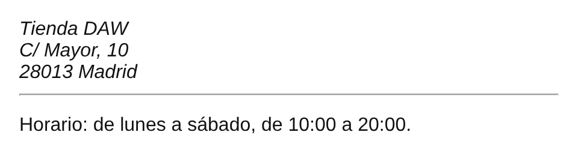


<a id="enfasis"></a>

### ▸ Énfasis: strong / em frente a b / i

| Elemento | Significado | Se ve (por defecto) |
|---|---|---|
| `<strong>` | **Importancia**: avisos, lo que no se debe pasar por alto | Negrita |
| `<em>` | **Énfasis** que cambia el sentido de la frase (se pronuncia distinto) | Cursiva |
| `<b>` | Llamar la atención **sin** más importancia: palabras clave, nombres de producto | Negrita |
| `<i>` | Voz o tono distinto: términos técnicos, palabras extranjeras, pensamientos | Cursiva |
| `<mark>` | Resaltado por relevancia: el término buscado | Fondo amarillo |
| `<small>` | Letra pequeña: avisos legales, copyright | Más pequeño |
| `<s>` | Ya no es correcto o válido: precio anterior | Tachado |

```html
<p><strong>Atención:</strong> la oferta termina hoy.</p>
<p>No es que <em>no quiera</em> ir, es que no puedo.</p>
<p>El <b>Keychron K2</b> incluye un <i lang="en">keycap puller</i>.</p>
<p>Resultados para <mark>teclado</mark>.</p>
<p>Antes <s>89,99 €</s> ahora 69,99 € <small>IVA incluido</small></p>
```

<sub>▸ RESULTADO</sub><br>
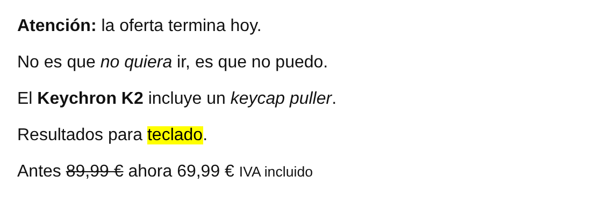


> [!TIP]
> La pregunta es: ¿la palabra es **más importante** (`strong`), se **pronuncia distinto** (`em`) o solo **se ve distinta** (`b`, `i`)? Los lectores de pantalla pueden tratar `strong` y `em` de forma especial; `b` e `i`, no.

<a id="texto-otros"></a>

### ▸ Otros elementos de texto

| Elemento | Para qué | Ejemplo |
|---|---|---|
| `<abbr title="…">` | Abreviatura con su significado (aparece al pasar el ratón) | `<abbr title="Desarrollo de Aplicaciones Web">DAW</abbr>` |
| `<time datetime="…">` | Fecha u hora legible por máquinas (buscadores, calendarios) | `<time datetime="2026-10-03">3 de octubre</time>` |
| `<sub>` / `<sup>` | Subíndice / superíndice | `H<sub>2</sub>O`, `m<sup>2</sup>`, `1<sup>er</sup>` |
| `<del>` / `<ins>` | Texto eliminado / añadido en una revisión | Control de cambios |
| `<data value="…">` | Valor para máquinas junto a un texto para personas | `<data value="8423">Teclado K2</data>` |
| `<dfn>` | Término que se define en esa frase | `<dfn>HTML</dfn> es un lenguaje de marcas…` |

```html
<p>Estudio <abbr title="Desarrollo de Aplicaciones Web">DAW</abbr> desde el
   <time datetime="2026-09-15">15 de septiembre</time>.</p>
<p>Fórmula del agua: H<sub>2</sub>O · Superficie: 85 m<sup>2</sup></p>
<p>Entrega: <del>viernes</del> <ins>lunes</ins></p>
```

<sub>▸ RESULTADO</sub><br>
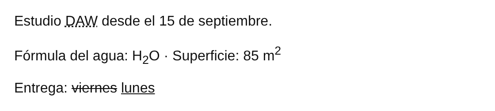


<a id="citas-codigo"></a>

### ▸ Citas y código

| Elemento | Para qué |
|---|---|
| `<blockquote cite="url">` | Cita larga en bloque |
| `<q>` | Cita corta dentro de una frase (añade comillas solo) |
| `<cite>` | **Título** de una obra: libro, película, canción, web |
| `<code>` | Código dentro de una frase |
| `<pre>` | Texto preformateado: respeta espacios y saltos. Para bloques de código: `<pre><code>…</code></pre>` |
| `<kbd>` | Tecla o combinación de teclas |
| `<samp>` | Salida de un programa |

```html
<blockquote cite="https://developer.mozilla.org/">
  <p>HTML es el componente más básico de la Web.</p>
</blockquote>
<p>Como dice <cite>MDN Web Docs</cite>: <q>usa siempre el elemento adecuado</q>.</p>
<p>Guarda con <kbd>Ctrl</kbd> + <kbd>S</kbd> y escribe <code>git status</code>.</p>
<pre><code>for (int i = 0; i &lt; 3; i++) {
    System.out.println(i);
}</code></pre>
```

<sub>▸ RESULTADO</sub><br>
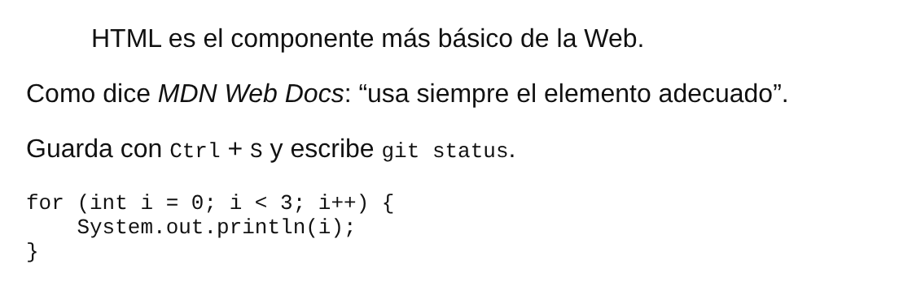


<sub>[▲ ÍNDICE](#indice) · [◂ MOD.02](#mod-02) · [MOD.04 ▸](#mod-04)</sub>

---

<a id="mod-04"></a>

## `04` ENLACES Y RUTAS

```text
┌─[ MOD.04 ]───────────────────────────────────────────────── ENLACES ─┐
│  href · rutas relativas · anclas · mailto                            │
└─────────────────────────────────────────────────────────── SYS.OK ───┘
```

<a id="enlace"></a>

### ▸ Anatomía de un enlace

```html
<a href="destino" title="info extra (opcional)">texto del enlace</a>
```

> [!IMPORTANT]
> El **texto del enlace debe decir adónde lleva**: "Ver condiciones de envío" y no "pincha aquí". Los lectores de pantalla pueden listar todos los enlaces de la página: una lista de diez "aquí" no sirve para nada.

<a id="rutas"></a>

### ▸ Rutas

Estructura de ejemplo:

```text
mi-web/
├── index.html
├── contacto.html
├── css/
│   └── estilos.css
├── img/
│   └── logo.svg
└── productos/
    ├── index.html
    └── teclado.html          ← estamos aquí
```

| Desde `productos/teclado.html` quiero ir a… | Ruta | Tipo |
|---|---|---|
| `productos/index.html` (misma carpeta) | `index.html` | Relativa |
| `contacto.html` (carpeta de arriba) | `../contacto.html` | Relativa (`../` = subir una carpeta) |
| `img/logo.svg` | `../img/logo.svg` | Relativa |
| `contacto.html` desde la raíz del sitio | `/contacto.html` | Relativa a la raíz (solo funciona con servidor, no abriendo el archivo con doble clic) |
| Otra web | `https://developer.mozilla.org/` | Absoluta |

> [!WARNING]
> - Windows no distingue mayúsculas en los nombres de archivo, **pero los servidores Linux sí**: `Logo.svg` y `logo.svg` son archivos distintos. Nombres en minúsculas, sin espacios ni tildes: `foto-equipo.jpg`.
> - Las barras son siempre `/` (nunca `\`), también en Windows.

<a id="enlace-tipos"></a>

### ▸ Tipos de enlace

| Para… | `href` | Ejemplo |
|---|---|---|
| Otra página | Ruta | `<a href="contacto.html">Contacto</a>` |
| Una sección de la misma página | `#id` | `<a href="#precios">Ver precios</a>` → va a `<section id="precios">` |
| Una sección de otra página | `pagina.html#id` | `<a href="faq.html#envios">Envíos</a>` |
| Volver arriba | `#` o `#top` | `<a href="#">Subir</a>` |
| Enviar un email | `mailto:` | `<a href="mailto:info@tienda.es?subject=Consulta">info@tienda.es</a>` |
| Llamar (móvil) | `tel:` | `<a href="tel:+34910000000">910 000 000</a>` |
| Descargar un archivo | `download` | `<a href="docs/catalogo.pdf" download>Catálogo (PDF, 2 MB)</a>` |

<a id="nueva-pestana"></a>

### ▸ Abrir en una pestaña nueva

```html
<a href="https://www.boe.es/" target="_blank" rel="noopener">BOE (se abre en una pestaña nueva)</a>
```

- Úsalo **solo** cuando salir de la página haga perder algo al usuario (un formulario a medias, un vídeo). Por defecto, deja que el usuario decida.
- `rel="noopener"` impide que la página abierta pueda controlar la tuya. Los navegadores actuales ya lo aplican solos, pero ponerlo no cuesta nada.
- Avisa en el texto de que se abre en una pestaña nueva (accesibilidad).

| Valor de `rel` | Significa |
|---|---|
| `noopener` | La página destino no puede acceder a la tuya |
| `noreferrer` | No envía desde qué página viene el usuario |
| `nofollow` | Pide a los buscadores que no sigan el enlace (enlaces de usuarios, publicidad) |

<sub>[▲ ÍNDICE](#indice) · [◂ MOD.03](#mod-03) · [MOD.05 ▸](#mod-05)</sub>

---

<a id="mod-05"></a>

## `05` IMÁGENES Y MULTIMEDIA

```text
┌─[ MOD.05 ]────────────────────────────────────────────── MULTIMEDIA ─┐
│  img · alt · figure · picture · video · iframe                       │
└─────────────────────────────────────────────────────────── SYS.OK ───┘
```

<a id="img"></a>

### ▸ img

```html

```

| Atributo | Para qué |
|---|---|
| `src` | Ruta de la imagen (obligatorio) |
| `alt` | Texto alternativo (obligatorio) → [cómo escribirlo](#alt) |
| `width` / `height` | Tamaño **original** en px, sin unidad. El navegador reserva el hueco antes de que cargue y la página no "salta" |
| `loading="lazy"` | No descarga la imagen hasta que el usuario se acerca a ella. **No** en la imagen principal de arriba |
| `decoding="async"` | Decodifica sin bloquear el resto de la página |

> [!TIP]
> Pon siempre `width` y `height` con el tamaño real del archivo, **aunque luego la cambies de tamaño con CSS** (`max-width: 100%; height: auto;`). Solo sirven para que el navegador conozca la proporción.

<a id="alt"></a>

### ▸ Cómo escribir el alt

| Tipo de imagen | `alt` | Ejemplo |
|---|---|---|
| **Informativa** (aporta contenido) | Describe lo que importa | `alt="Gráfico: las ventas suben un 30 % en 2026"` |
| **Decorativa** (adorno) | **Vacío**: `alt=""` (pero el atributo debe estar) | Una línea ondulada, un fondo |
| **Funcional** (es un enlace o botón) | Lo que hace o adónde lleva | Logo enlazado: `alt="Tienda DAW, ir al inicio"` |
| **Con texto** dentro | El texto | Un banner con "Rebajas -50 %" → `alt="Rebajas: 50 % de descuento"` |

✖ No empieces por "imagen de…" (el lector ya dice que es una imagen) y no repitas el texto que tiene al lado.

<a id="figure"></a>

### ▸ figure y figcaption

Para imágenes (o gráficos, código, citas) con un **pie de foto**.

```html
<figure>
  
  <figcaption>Fig. 1 · Sierra de Guadarrama al atardecer.</figcaption>
</figure>
```

<sub>▸ RESULTADO</sub><br>
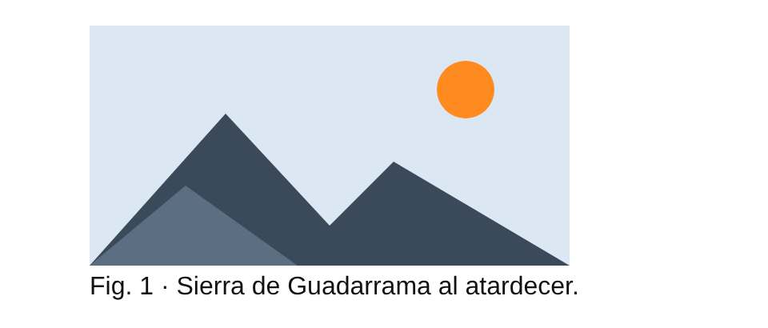


<a id="formatos"></a>

### ▸ ¿Qué formato elijo?

| Formato | Para | Transparencia | Animación | Nota |
|---|---|:---:|:---:|---|
| **WebP** | Fotos e imágenes generales | ✔ | ✔ | Pesa un 25-35 % menos que JPG con calidad similar. Opción por defecto hoy |
| **AVIF** | Fotos (máxima compresión) | ✔ | ✔ | Aún más ligero que WebP; tarda más en generarse |
| **JPG** | Fotos (compatibilidad total) | ✖ | ✖ | Respaldo clásico |
| **PNG** | Capturas, imágenes con texto, transparencias | ✔ | ✖ | Sin pérdida: pesa mucho en fotos |
| **SVG** | Logos, iconos, ilustraciones planas | ✔ | ✔ | Vectorial: se ve nítido a cualquier tamaño. Se puede incrustar y colorear con CSS |
| **GIF** | — | ✔ | ✔ | Obsoleto: para animaciones, mejor un vídeo `<video autoplay muted loop>` |

<a id="img-responsive"></a>

### ▸ Imágenes responsive

**Misma imagen en varios tamaños** (el navegador elige según la pantalla):

```html

```

<sub>`srcset` lista los archivos con su ancho real (`400w`); `sizes` dice qué ancho ocupará la imagen en pantalla (100 % del ancho en móvil, la mitad en el resto).</sub>

**Imagen distinta o formato moderno con respaldo** (`picture`):

```html
<picture>
  <source srcset="img/hero.avif" type="image/avif">       <!-- si lo soporta, usa AVIF -->
  <source srcset="img/hero.webp" type="image/webp">       <!-- si no, WebP -->
    <!-- respaldo -->
</picture>
```

<a id="audio-video"></a>

### ▸ Audio y vídeo

```html
<video controls width="360" height="180" poster="recursos/paisaje.svg" preload="metadata">
  <source src="video/presentacion.webm" type="video/webm">
  <source src="video/presentacion.mp4" type="video/mp4">
  <track kind="subtitles" src="video/subtitulos-es.vtt" srclang="es" label="Español" default>
  Tu navegador no puede reproducir este vídeo. <a href="video/presentacion.mp4">Descárgalo</a>.
</video>
<audio controls src="audio/podcast.mp3"></audio>
```

<sub>▸ RESULTADO</sub><br>
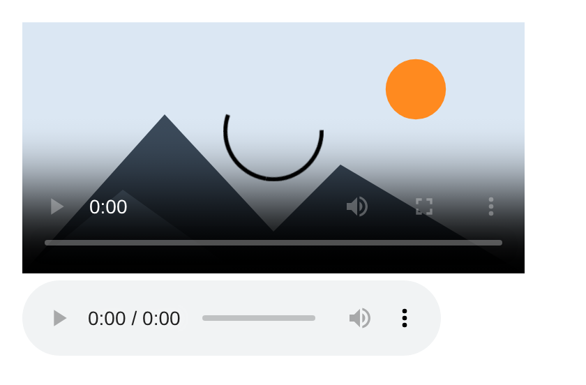


| Atributo | Hace |
|---|---|
| `controls` | Muestra los controles (sin él no hay botón de play) |
| `poster` | Imagen mientras no se reproduce |
| `autoplay` | Reproduce sola. Los navegadores **solo lo permiten si también lleva `muted`** |
| `muted` / `loop` | Sin sonido / en bucle |
| `playsinline` | En iPhone, no abrir a pantalla completa |
| `preload` | `none` (no descargar), `metadata` (solo duración), `auto` |
| `<track>` | Subtítulos en formato `.vtt` |

<a id="iframe"></a>

### ▸ iframe: incrustar otra página

```html
<!-- Mapa (OpenStreetMap → Compartir → HTML) o Google Maps → Compartir → Insertar un mapa -->
<iframe src="https://www.openstreetmap.org/export/embed.html?bbox=-3.71,40.41,-3.69,40.42&amp;layer=mapnik"
        title="Mapa de la ubicación de la tienda" width="600" height="300" loading="lazy"></iframe>

<!-- Vídeo de YouTube → Compartir → Insertar -->
<iframe src="https://www.youtube-nocookie.com/embed/ID_DEL_VIDEO" title="Vídeo: cómo montar el teclado"
        width="560" height="315" allowfullscreen loading="lazy"></iframe>
```

- `title` es **obligatorio** en la práctica: el lector de pantalla lo anuncia.
- `youtube-nocookie.com` evita cookies de seguimiento hasta que se reproduce.
- Dentro de una URL en HTML, el `&` se escribe `&amp;`.

<sub>[▲ ÍNDICE](#indice) · [◂ MOD.04](#mod-04) · [MOD.06 ▸](#mod-06)</sub>

---

<a id="mod-06"></a>

## `06` LISTAS

```text
┌─[ MOD.06 ]────────────────────────────────────────────────── LISTAS ─┐
│  ul · ol · li · dl · menús                                           │
└─────────────────────────────────────────────────────────── SYS.OK ───┘
```

<a id="ul-ol"></a>

### ▸ ul y ol

```html
<h3>Ingredientes (sin orden)</h3>
<ul>
  <li>200 g de harina</li>
  <li>2 huevos</li>
</ul>
<h3>Pasos (el orden importa)</h3>
<ol>
  <li>Precalentar el horno.</li>
  <li>Mezclar los ingredientes.</li>
</ol>
<h3>Top 3 (cuenta atrás)</h3>
<ol reversed>
  <li>Bronce</li>
  <li>Plata</li>
  <li>Oro</li>
</ol>
```

<sub>▸ RESULTADO</sub><br>
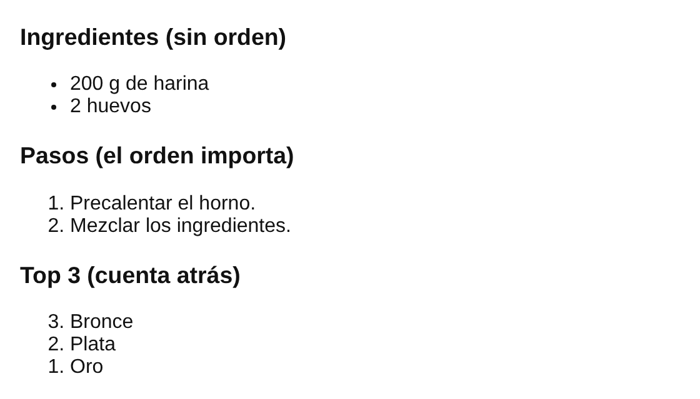


| Atributo de `<ol>` | Hace |
|---|---|
| `start="5"` | Empieza en 5 |
| `reversed` | Cuenta hacia atrás |
| `type="a"` / `"A"` / `"i"` / `"I"` | Letras o números romanos (mejor con CSS: `list-style-type`) |
| `<li value="10">` | Fuerza el número de un elemento |

<a id="listas-anidadas"></a>

### ▸ Listas anidadas

La sublista va **dentro del `<li>`**, no entre dos `<li>`:

```html
<ul>
  <li>Hardware
    <ul>
      <li>Teclados</li>
      <li>Ratones</li>
    </ul>
  </li>
  <li>Software</li>
</ul>
```

<sub>▸ RESULTADO</sub><br>
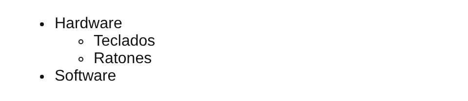


<a id="dl"></a>

### ▸ dl: lista de descripciones

Pares **término → descripción**: glosarios, fichas técnicas, preguntas y respuestas.

```html
<dl>
  <dt>Conexión</dt>
  <dd>Bluetooth 5.1 y USB-C</dd>
  <dt>Batería</dt>
  <dd>Hasta 72 horas</dd>
  <dt>Peso</dt>
  <dd>663 g</dd>
</dl>
```

<sub>▸ RESULTADO</sub><br>
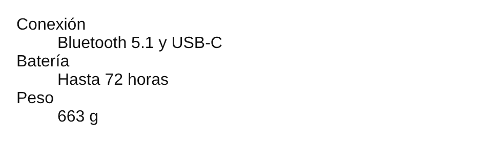


<a id="menu-lista"></a>

### ▸ Menú de navegación como lista

Un menú **es** una lista de enlaces. La viñeta y la disposición vertical se quitan después con CSS.

```html
<nav aria-label="Principal">
  <ul>
    <li><a href="index.html" aria-current="page">Inicio</a></li>
    <li><a href="productos.html">Productos</a></li>
    <li><a href="contacto.html">Contacto</a></li>
  </ul>
</nav>
```

<sub>`aria-current="page"` marca la página actual para los lectores de pantalla y sirve de "gancho" para resaltarla con CSS: `[aria-current="page"] { … }`.</sub>

<sub>[▲ ÍNDICE](#indice) · [◂ MOD.05](#mod-05) · [MOD.07 ▸](#mod-07)</sub>

---

<a id="mod-07"></a>

## `07` TABLAS

```text
┌─[ MOD.07 ]────────────────────────────────────────────────── TABLAS ─┐
│  caption · thead · tbody · th · colspan                              │
└─────────────────────────────────────────────────────────── SYS.OK ───┘
```

<a id="tabla-estructura"></a>

### ▸ Estructura

```html
<table>
  <caption>Pedidos de septiembre</caption>
  <thead>
    <tr>
      <th scope="col">Pedido</th>
      <th scope="col">Cliente</th>
      <th scope="col">Importe</th>
    </tr>
  </thead>
  <tbody>
    <tr>
      <th scope="row">#1024</th>
      <td>Lucía Fernández</td>
      <td>748,00 €</td>
    </tr>
    <tr>
      <th scope="row">#1025</th>
      <td>Marcos Ruiz</td>
      <td>180,99 €</td>
    </tr>
  </tbody>
  <tfoot>
    <tr>
      <th scope="row" colspan="2">Total</th>
      <td>928,99 €</td>
    </tr>
  </tfoot>
</table>
```
```css
/* Sin CSS la tabla no tiene bordes: esto es solo para verla */
table { border-collapse: collapse; }
th, td { border: 1px solid #999; padding: 4px 10px; }
```

<sub>▸ RESULTADO</sub><br>
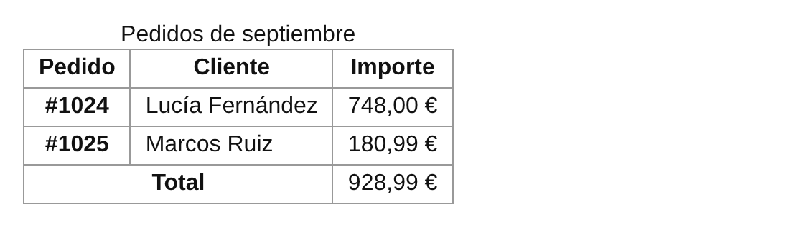


| Elemento | Qué es |
|---|---|
| `<table>` | La tabla |
| `<caption>` | Título de la tabla (primer hijo) |
| `<thead>` / `<tbody>` / `<tfoot>` | Cabecera / cuerpo / pie |
| `<tr>` | Fila (*table row*) |
| `<th>` | Celda de **cabecera** (negrita y centrada por defecto) |
| `<td>` | Celda de **datos** |

<a id="tabla-span"></a>

### ▸ colspan y rowspan: fusionar celdas

```html
<table>
  <caption>Horario · 1.º DAW</caption>
  <thead>
    <tr><th scope="col">Hora</th><th scope="col">Lunes</th><th scope="col">Martes</th></tr>
  </thead>
  <tbody>
    <tr><th scope="row">15:00</th><td rowspan="2">Programación</td><td>Bases de datos</td></tr>
    <tr><th scope="row">16:00</th><td>Lenguajes de marcas</td></tr>
    <tr><th scope="row">17:00</th><td colspan="2">Recreo</td></tr>
  </tbody>
</table>
```
```css
table { border-collapse: collapse; }
th, td { border: 1px solid #999; padding: 4px 10px; }
```

<sub>▸ RESULTADO</sub><br>
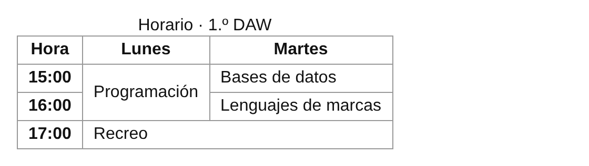


<sub>`rowspan="2"` ocupa 2 filas hacia abajo (la fila siguiente tiene una celda menos). `colspan="2"` ocupa 2 columnas a la derecha.</sub>

<a id="tabla-accesible"></a>

### ▸ Tablas accesibles

- `<caption>` dice de qué trata la tabla.
- `<th scope="col">` en cabeceras de columna y `scope="row"` en cabeceras de fila: el lector de pantalla anuncia "Martes, 16:00: Lenguajes de marcas".
- Nada de celdas vacías para dar espacio ni de tablas dentro de tablas.

<a id="tabla-cuando"></a>

### ▸ ¿Cuándo usar una tabla?

| ✔ Sí: datos tabulares | ✖ No: maquetar |
|---|---|
| Horarios, precios por plan, resultados, comparativas, listados de pedidos | Poner columnas de texto, colocar un formulario, el diseño de la página |
| Pregunta: ¿tiene sentido leerla por **filas y columnas** con cabeceras? | Para disposición se usa CSS: Flexbox o Grid |

<sub>[▲ ÍNDICE](#indice) · [◂ MOD.06](#mod-06) · [MOD.08 ▸](#mod-08)</sub>

---

<a id="mod-08"></a>

## `08` SEMÁNTICA Y ESTRUCTURA

```text
┌─[ MOD.08 ]─────────────────────────────────────────────── SEMÁNTICA ─┐
│  header · nav · main · article · section · aside · footer            │
└─────────────────────────────────────────────────────────── SYS.OK ───┘
```

**Semántica** = usar el elemento que describe **qué es** el contenido, no cómo se ve. Un `<nav>` y un `<div>` se ven igual, pero el `<nav>` le dice al navegador, a Google y al lector de pantalla "esto es la navegación".

<a id="sem-esqueleto"></a>

### ▸ Esqueleto de una página típica

```text
┌──────────────────────────── <body> ─────────────────────────────┐
│ ┌──────────────────────── <header> ───────────────────────────┐ │
│ │  logo                  ┌────────── <nav> ─────────────┐     │ │
│ │                        │  Inicio · Productos · Blog   │     │ │
│ │                        └──────────────────────────────┘     │ │
│ └─────────────────────────────────────────────────────────────┘ │
│ ┌────────────────── <main> ───────────────────┐ ┌── <aside> ──┐ │
│ │  <h1>                                       │ │ relacionado │ │
│ │  ┌─────────── <section> ─────────────────┐  │ │ publicidad  │ │
│ │  │ <h2>  ┌<article>┐ ┌<article>┐         │  │ │ filtros     │ │
│ │  │       │ tarjeta │ │ tarjeta │         │  │ │             │ │
│ │  │       └─────────┘ └─────────┘         │  │ │             │ │
│ │  └───────────────────────────────────────┘  │ │             │ │
│ └─────────────────────────────────────────────┘ └─────────────┘ │
│ ┌──────────────────────── <footer> ───────────────────────────┐ │
│ │  © 2026 · <address> contacto · enlaces legales              │ │
│ └─────────────────────────────────────────────────────────────┘ │
└─────────────────────────────────────────────────────────────────┘
```

```html
<body>
  <header>
    <a href="index.html"></a>
    <nav aria-label="Principal">
      <ul>…</ul>
    </nav>
  </header>

  <main>
    <h1>Teclados mecánicos</h1>
    <section aria-labelledby="destacados">
      <h2 id="destacados">Destacados</h2>
      <article>…</article>
      <article>…</article>
    </section>
  </main>

  <aside aria-label="Filtros">…</aside>

  <footer>
    <p><small>© 2026 Tienda DAW</small></p>
  </footer>
</body>
```

<a id="sem-elementos"></a>

### ▸ Elementos

| Elemento | Qué es | Cuántos | Ejemplo |
|---|---|---|---|
| `<header>` | Cabecera de la página **o** de una sección o artículo | Varios | Logo + navegación; título + autor de un artículo |
| `<nav>` | Bloque de navegación **principal** | Varios (con `aria-label` distinto) | Menú principal, migas de pan, índice |
| `<main>` | Contenido principal y único de la página | **Uno** (visible) | Todo lo que no se repite en otras páginas |
| `<section>` | Sección temática **con título** | Varios | "Destacados", "Opiniones", "Preguntas frecuentes" |
| `<article>` | Contenido **independiente** que tendría sentido fuera de la página | Varios | Entrada de blog, tarjeta de producto, comentario, noticia |
| `<aside>` | Contenido **relacionado pero secundario** | Varios | Barra lateral, "te puede interesar", nota al margen |
| `<footer>` | Pie de la página o de una sección o artículo | Varios | Copyright, enlaces legales; fecha y etiquetas de un artículo |
| `<address>` | Datos de **contacto** del autor o del sitio | — | Email, teléfono, dirección |
| `<search>` | Zona de búsqueda o filtrado (🟢 Disponible en todos (desde 2023)) | — | El buscador de la cabecera |
| `<hgroup>` | Título + subtítulo | — | `<hgroup><h1>Título</h1><p>Subtítulo</p></hgroup>` |

<a id="sem-elegir"></a>

### ▸ ¿article, section o div?

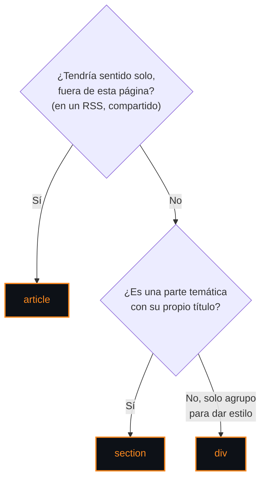
```mermaid
flowchart TD
    A{"¿Tendría sentido solo,<br/>fuera de esta página?<br/>(en un RSS, compartido)"} -->|Sí| ART["article"]
    A -->|No| B{"¿Es una parte temática<br/>con su propio título?"}
    B -->|Sí| SEC["section"]
    B -->|"No, solo agrupo<br/>para dar estilo"| DIV["div"]
    classDef el fill:#0d1117,stroke:#ff8a1f,color:#ff8a1f,stroke-width:2px
    class ART,SEC,DIV el
```

| Caso | Elemento |
|---|---|
| Tarjeta de producto en un listado | `article` |
| Entrada de blog completa | `article` (con sus `section` si es larga) |
| Bloque "Opiniones de clientes" | `section` con `h2`, y cada opinión un `article` |
| Contenedor para centrar el contenido a 1200 px | `div` |
| Columna izquierda de una rejilla | `div` |

<a id="landmarks"></a>

### ▸ Landmarks: el "mapa" para lectores de pantalla

Algunos elementos crean **regiones** a las que se puede saltar directamente con el lector de pantalla:

| Elemento | Región (rol) | Condición |
|---|---|---|
| `<header>` | `banner` | Solo si es hijo directo de `body` (no dentro de `article` o `section`) |
| `<nav>` | `navigation` | Siempre |
| `<main>` | `main` | Siempre |
| `<aside>` | `complementary` | Siempre |
| `<footer>` | `contentinfo` | Solo si es hijo directo de `body` |
| `<section>` | `region` | Solo si tiene nombre accesible (`aria-labelledby` o `aria-label`) |
| `<form>` | `form` | Solo si tiene nombre accesible |
| `<search>` | `search` | Siempre |

<sub>Si hay dos `nav`, distínguelos: `<nav aria-label="Principal">` y `<nav aria-label="Pie de página">`.</sub>

<sub>[▲ ÍNDICE](#indice) · [◂ MOD.07](#mod-07) · [MOD.09 ▸](#mod-09)</sub>

---

<a id="mod-09"></a>

## `09` FORMULARIOS

```text
┌─[ MOD.09 ]───────────────────────────────────────────── FORMULARIOS ─┐
│  form · label · input · select · validación                          │
└─────────────────────────────────────────────────────────── SYS.OK ───┘
```

<a id="form"></a>

### ▸ form

```html
<form action="/procesar-registro" method="post">
  …controles…
  <button type="submit">Enviar</button>
</form>
```

| Atributo | Qué hace |
|---|---|
| `action` | URL que recibe los datos. Sin él, se envían a la misma página |
| `method="get"` | Datos **en la URL** (`?q=teclado&orden=precio`). Para **buscar y filtrar**: se puede guardar como favorito o compartir |
| `method="post"` | Datos **en el cuerpo** de la petición, no visibles en la URL. Para **crear o modificar**: registros, pedidos, contraseñas |
| `novalidate` | Desactiva la validación del navegador (útil para probar la validación del servidor) |
| `autocomplete="off"` | Pide no autocompletar (los navegadores pueden ignorarlo en campos de login) |

> [!IMPORTANT]
> Solo se envían los controles que tienen **`name`**. El `name` es la "clave" del dato que llega al servidor (`email=ana@correo.com`); el `id` es para el `label` y el CSS.

<a id="label"></a>

### ▸ label: siempre

```html
<!-- Forma 1: for + id (la más habitual) -->
<label for="email">Email</label>
<input type="email" id="email" name="email">

<!-- Forma 2: el input dentro del label -->
<label><input type="checkbox" name="newsletter"> Quiero recibir ofertas</label>
```

Un `label` bien enlazado: lo lee el lector de pantalla, **amplía la zona clicable** (clic en el texto = marcar el checkbox) y lo pide el validador. `placeholder` **no** sustituye al `label`: desaparece al escribir.

<a id="input-tipos"></a>

### ▸ Tipos de input

```html
<form>
  <p><label for="t1">text</label> <input type="text" id="t1" name="t1" placeholder="Nombre"></p>
  <p><label for="t2">email</label> <input type="email" id="t2" name="t2" value="ana@correo.com"></p>
  <p><label for="t3">password</label> <input type="password" id="t3" name="t3" value="secreta"></p>
  <p><label for="t4">number</label> <input type="number" id="t4" name="t4" value="3" min="1" max="10"></p>
  <p><label for="t5">date</label> <input type="date" id="t5" name="t5" value="2026-10-03"></p>
  <p><label for="t6">time</label> <input type="time" id="t6" name="t6" value="09:30"></p>
  <p><label for="t7">range</label> <input type="range" id="t7" name="t7" min="0" max="100" value="70"></p>
  <p><label for="t8">color</label> <input type="color" id="t8" name="t8" value="#ff8a1f"></p>
  <p><label for="t9">file</label> <input type="file" id="t9" name="t9"></p>
  <p><input type="checkbox" id="t10" name="t10" checked> <label for="t10">checkbox</label>
     <input type="radio" id="t11" name="t11" checked> <label for="t11">radio</label></p>
  <p><label for="t12">search</label> <input type="search" id="t12" name="t12" value="teclado"></p>
</form>
```

<sub>▸ RESULTADO</sub><br>
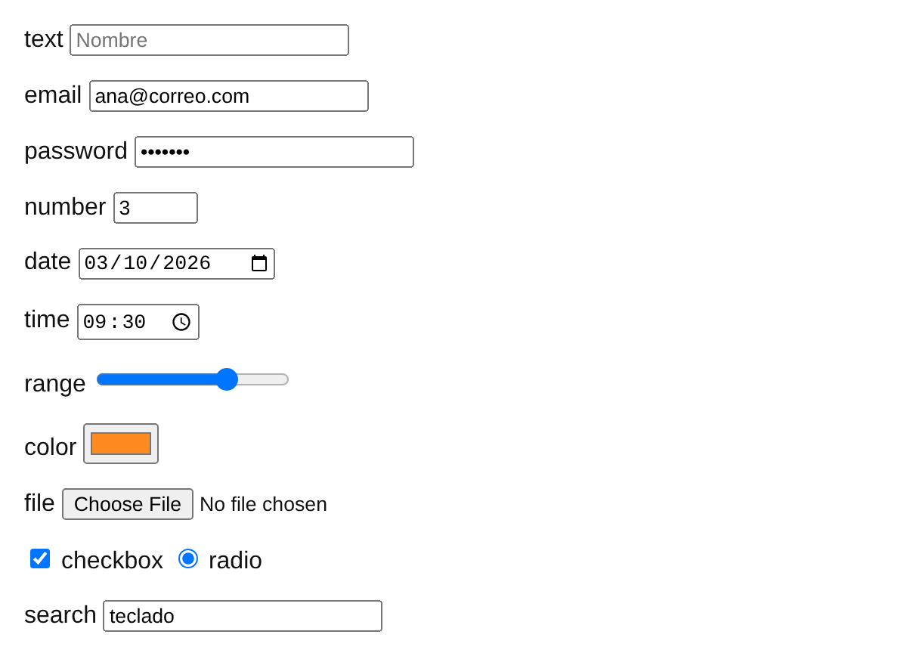


<sub>Captura generada con Chromium en español; el botón de `file` sale en inglés ("Choose File") por la versión sin interfaz del navegador usada para las capturas. En tu navegador dirá "Seleccionar archivo".</sub>

| `type` | Para | Ventaja |
|---|---|---|
| `text` | Texto corto genérico | — |
| `email` | Email | Valida el formato; en móvil, teclado con `@` |
| `password` | Contraseñas | Oculta lo escrito |
| `tel` | Teléfono | Teclado numérico en móvil (no valida formato: usa `pattern`) |
| `url` | Dirección web | Valida que empiece por `https://`… |
| `number` | Cantidades | Flechas, `min`, `max`, `step`. **No** para DNI, teléfonos o códigos postales (quita ceros iniciales) |
| `search` | Buscador | Botón para borrar |
| `date` / `time` / `datetime-local` / `month` / `week` | Fechas y horas | Calendario nativo; el valor siempre llega como `AAAA-MM-DD` (🟢 Disponible en todos (desde 2021)) |
| `range` | Valor aproximado en un rango | Deslizador (volumen, precio máximo) |
| `color` | Color | Selector nativo |
| `checkbox` | Sí/no o varias opciones | — |
| `radio` | **Una** opción entre varias (mismo `name`) | — |
| `file` | Subir archivos | `accept="image/*"`, `multiple`. El `form` necesita `enctype="multipart/form-data"` |
| `hidden` | Dato invisible que se envía | Id de un producto, token |
| `submit` / `reset` / `button` | Botones | Mejor usar `<button>` → [Botones](#botones) |

<a id="input-atributos"></a>

### ▸ Atributos de los controles

| Atributo | Hace | Ejemplo |
|---|---|---|
| `name` | Nombre del dato al enviar | `name="email"` |
| `value` | Valor inicial (o el valor enviado en checkbox y radio) | `value="1"` |
| `placeholder` | Texto de ejemplo (no sustituye al `label`) | `placeholder="ana@correo.com"` |
| `required` | Obligatorio | — |
| `minlength` / `maxlength` | Longitud de texto | `minlength="8"` |
| `min` / `max` / `step` | Límites numéricos o de fecha | `min="1" max="10" step="1"` |
| `pattern` | Expresión regular que debe cumplir | `pattern="[0-9]{8}[A-Za-z]"` (DNI) |
| `autocomplete` | Pista para rellenar solo | `email`, `given-name`, `tel`, `postal-code`, `new-password`, `current-password` |
| `disabled` | Desactivado: **no** se envía | — |
| `readonly` | Solo lectura: **sí** se envía | — |
| `checked` / `selected` | Marcado / seleccionado al inicio | — |
| `multiple` | Varios valores (`file`, `select`, `email`) | — |
| `autofocus` | Recibe el foco al cargar (con moderación) | — |
| `inputmode` | Teclado en móvil sin cambiar el tipo | `inputmode="numeric"` para códigos postales |

<a id="seleccion"></a>

### ▸ select, datalist y textarea

```html
<p><label for="provincia">Provincia</label>
  <select id="provincia" name="provincia">
    <option value="">— Elige —</option>
    <optgroup label="Comunidad de Madrid">
      <option value="M" selected>Madrid</option>
    </optgroup>
    <optgroup label="Cataluña">
      <option value="B">Barcelona</option>
      <option value="GI">Girona</option>
    </optgroup>
  </select></p>
<p><label for="navegador">Navegador</label>
  <input list="navegadores" id="navegador" name="navegador" placeholder="Escribe o elige">
  <datalist id="navegadores">
    <option value="Chrome"></option><option value="Firefox"></option><option value="Safari"></option>
  </datalist></p>
<p><label for="mensaje">Mensaje</label><br>
  <textarea id="mensaje" name="mensaje" rows="3" cols="40" maxlength="500">Hola, quería consultar…</textarea></p>
```

<sub>▸ RESULTADO</sub><br>
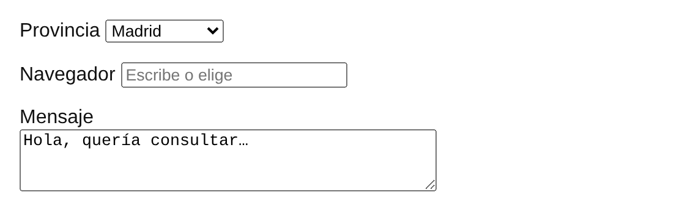


| Necesito… | Uso |
|---|---|
| Una opción de una lista **corta** (2-5) siempre visible | `radio` |
| Una opción de una lista **larga** | `select` |
| Varias opciones | `checkbox` (o `select multiple`, menos usable) |
| Texto libre **con sugerencias** | `input` + `datalist` (la compatibilidad no es total: 🔴 Aún no en todos los navegadores) |
| Texto largo | `textarea` |

<a id="fieldset"></a>

### ▸ fieldset y legend: agrupar

Imprescindible en grupos de `radio` y `checkbox`: la `legend` es la pregunta.

```html
<fieldset>
  <legend>Método de envío</legend>
  <label><input type="radio" name="envio" value="estandar" checked> Estándar (3-5 días) · Gratis</label><br>
  <label><input type="radio" name="envio" value="urgente"> Urgente (24 h) · 4,99 €</label>
</fieldset>
```

<sub>▸ RESULTADO</sub><br>
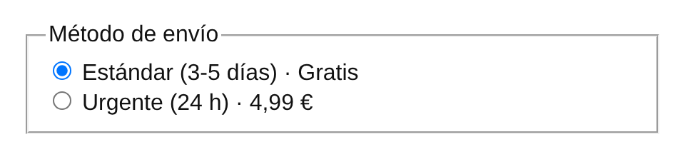


<a id="botones"></a>

### ▸ Botones

| Código | Hace |
|---|---|
| `<button type="submit">Enviar</button>` | Envía el formulario. **Es el tipo por defecto** dentro de un `form` |
| `<button type="reset">Borrar</button>` | Vuelve a los valores iniciales (casi nunca es buena idea) |
| `<button type="button">Ver contraseña</button>` | No hace nada por sí solo: para JavaScript |

> [!WARNING]
> Un `<button>` sin `type` dentro de un `form` **envía el formulario**. Si es para JavaScript (abrir un menú, mostrar la contraseña), pon siempre `type="button"`.

**¿Enlace o botón?** Si **lleva a otra página o sección** → `<a href>`. Si **hace algo** en la página (enviar, abrir, borrar) → `<button>`.

<a id="validacion"></a>

### ▸ Validación nativa

```html
<form action="/registro" method="post">
  <p>
    <label for="dni">DNI</label>
    <input id="dni" name="dni" required pattern="[0-9]{8}[A-Za-z]"
           title="8 números y una letra, por ejemplo 12345678Z" autocomplete="off">
  </p>
  <p>
    <label for="clave">Contraseña</label>
    <input id="clave" name="clave" type="password" required minlength="8" autocomplete="new-password">
  </p>
  <p>
    <label for="edad">Edad</label>
    <input id="edad" name="edad" type="number" min="18" max="120">
  </p>
  <button type="submit">Crear cuenta</button>
</form>
```

- Al pulsar *Enviar*, el navegador **bloquea el envío** y muestra un aviso en el primer campo incorrecto.
- El `title` se añade al mensaje cuando no se cumple el `pattern`.
- Con CSS se pueden marcar los campos: `:invalid`, `:valid`, `:user-invalid` (solo después de que el usuario lo toque) → chuleta CSS.

> [!CAUTION]
> La validación del navegador es **comodidad para el usuario, no seguridad**: se desactiva en dos clics con las DevTools. El servidor siempre tiene que volver a validar.

<sub>[▲ ÍNDICE](#indice) · [◂ MOD.08](#mod-08) · [MOD.10 ▸](#mod-10)</sub>

---

<a id="mod-10"></a>

## `10` ATRIBUTOS GLOBALES

```text
┌─[ MOD.10 ]────────────────────────────────────── ATRIBUTOS GLOBALES ─┐
│  id · class · data-* · hidden · lang                                 │
└─────────────────────────────────────────────────────────── SYS.OK ───┘
```

<a id="globales"></a>

### ▸ Tabla

Se pueden poner en **cualquier** elemento.

| Atributo | Para qué | Ejemplo |
|---|---|---|
| `id` | Identificador **único** en la página | `<section id="precios">` |
| `class` | Una o varias clases (separadas por espacios) para CSS y JS | `<button class="btn btn--primario">` |
| `style` | CSS en línea (evitar: mezcla contenido y diseño) | `style="color: red"` |
| `title` | Información extra en un globo al pasar el ratón | `<abbr title="…">` |
| `lang` | Idioma de ese fragmento | `<span lang="en">feedback</span>` |
| `hidden` | Oculta el elemento (como `display: none`) | `<div hidden>` |
| `tabindex` | Orden de foco con `Tab`: `0` = enfocable en su orden natural, `-1` = enfocable solo por JS | Evita valores mayores que 0 |
| `data-*` | Datos propios para JavaScript o CSS | `data-precio="49.90"` |
| `contenteditable` | El usuario puede editar el texto | `<div contenteditable>` |
| `draggable` | Se puede arrastrar | `draggable="true"` |
| `inert` | El bloque no responde a clics, foco ni lector de pantalla (🟢 Disponible en todos (desde 2023)) | Fondo detrás de un modal |
| `translate="no"` | Que el traductor automático no lo traduzca | Nombres de marca |

<a id="id-class"></a>

### ▸ id frente a class

| | `id` | `class` |
|---|---|---|
| ¿Cuántas veces por página? | **Una** | Las que quieras |
| ¿Varios por elemento? | No | Sí: `class="tarjeta tarjeta--oferta"` |
| Úsalo para | Enlaces internos (`#precios`), `label for`, `aria-labelledby`, buscar un elemento concreto en JS | **Dar estilos** (CSS) y seleccionar grupos en JS |
| Especificidad en CSS | Muy alta (cuesta sobrescribirla) | Normal |

> [!TIP]
> Regla práctica: **`class` para el CSS, `id` para enlazar** (anclas, formularios, accesibilidad). Si usas BEM: `bloque__elemento--modificador`, por ejemplo `tarjeta__titulo`, `boton--grande`.

<a id="data-attr"></a>

### ▸ Atributos data-*

```html
<article class="producto" data-id="8423" data-categoria="perifericos" data-stock="0">
  <h3>Webcam Full HD</h3>
</article>
```

```js
const producto = document.querySelector('.producto');
producto.dataset.id;          // "8423"   (data-id → dataset.id)
producto.dataset.categoria;   // "perifericos"
```

```css
.producto[data-stock="0"] { opacity: 0.5; }   /* atenuar los agotados */
```

<sub>[▲ ÍNDICE](#indice) · [◂ MOD.09](#mod-09) · [MOD.11 ▸](#mod-11)</sub>

---

<a id="mod-11"></a>

## `11` ACCESIBILIDAD

```text
┌─[ MOD.11 ]─────────────────────────────────────────── ACCESIBILIDAD ─┐
│  semántica · teclado · alt · ARIA                                    │
└─────────────────────────────────────────────────────────── SYS.OK ───┘
```

Una web accesible la puede usar **cualquiera**: con lector de pantalla, solo con teclado, con zoom al 200 %, con daltonismo o con una mano ocupada en el móvil. En España y la UE, además, la **Ley Europea de Accesibilidad** la exige a muchas webs de comercio y servicios desde junio de 2025.

<a id="a11y-principios"></a>

### ▸ Principios en HTML

| Principio | Cómo |
|---|---|
| **Usa el elemento correcto** | `<button>` para acciones, `<a>` para navegar, `<nav>`, `<main>`, títulos en orden. Solo con esto, el 80 % está hecho |
| **Todo contenido no textual tiene alternativa** | `alt` en imágenes, `title` en iframes, subtítulos en vídeos |
| **Todo control tiene nombre** | `<label>` en cada campo; texto (o `aria-label`) en botones de solo icono |
| **El idioma está declarado** | `<html lang="es">`, y `lang="en"` en fragmentos en inglés |
| **La información no depende solo del color** | "Campos obligatorios en rojo" ✖ → asterisco + texto "obligatorio" ✔ |
| **El orden del HTML es el orden lógico** | El lector y el tabulador siguen el orden del código, no el visual |

<a id="a11y-teclado"></a>

### ▸ Teclado y foco

| Tecla | Hace |
|---|---|
| `Tab` / `Shift+Tab` | Siguiente / anterior elemento interactivo |
| `Enter` | Activa enlaces y botones |
| `Espacio` | Activa botones, marca checkboxes |
| Flechas | Mueven entre opciones de `radio` y `select` |
| `Esc` | Cierra `dialog` y `popover` |

- Los elementos nativos (`a`, `button`, `input`, `select`, `details`) **ya son accesibles con teclado**. Un `<div onclick="…">` no: ni recibe foco ni responde a `Enter`.
- **Nunca quites el contorno del foco** (`outline: none`) sin poner otro estilo visible.
- **Enlace para saltar al contenido**, el primero del `body`, para no tabular por todo el menú en cada página:

```html
<body>
  <a href="#contenido" class="saltar">Saltar al contenido</a>
  <header>…menú largo…</header>
  <main id="contenido">…</main>
</body>
```

<sub>Con CSS se oculta y solo aparece al recibir el foco con `Tab`.</sub>

> [!TIP]
> **Prueba rápida:** desconecta el ratón y recorre tu página solo con `Tab`. ¿Ves siempre dónde estás? ¿Llegas a todo? ¿Puedes salir de los menús y modales?

<a id="aria"></a>

### ▸ ARIA básico

ARIA son atributos que **añaden información** para tecnologías de asistencia cuando el HTML no basta.

> [!IMPORTANT]
> **Primera regla de ARIA:** si existe un elemento HTML nativo que hace lo que necesitas, **úsalo en lugar de ARIA**. `<button>` mejor que `<div role="button" tabindex="0">`. Un ARIA mal puesto es peor que no poner ninguno.

| Atributo | Para qué | Ejemplo |
|---|---|---|
| `aria-label` | Nombre accesible cuando no hay texto visible | `<button aria-label="Cerrar"><svg>…</svg></button>` |
| `aria-labelledby` | El nombre es el texto de otro elemento | `<section aria-labelledby="t-ofertas"><h2 id="t-ofertas">Ofertas</h2>` |
| `aria-describedby` | Descripción o ayuda extra | `<input aria-describedby="ayuda-clave">` + `<p id="ayuda-clave">Mínimo 8 caracteres</p>` |
| `aria-hidden="true"` | Ocultarlo al lector (pero no a la vista) | Iconos decorativos: `<span aria-hidden="true">★</span>` |
| `aria-current="page"` | Página actual en un menú | `<a href="/" aria-current="page">Inicio</a>` |
| `aria-expanded` | Si un menú desplegable está abierto | `<button aria-expanded="false">Menú</button>` (lo cambia JS) |
| `aria-live="polite"` | Anunciar cambios sin mover el foco | Mensaje "Añadido al carrito" |
| `role` | Cambiar el tipo de elemento | `role="alert"` para un error urgente |

<a id="a11y-checklist"></a>

### ▸ Checklist antes de entregar

- [ ] `lang="es"` en `<html>` y un `<title>` descriptivo en cada página
- [ ] Un `h1` y títulos sin saltos de nivel
- [ ] `header`, `nav`, `main` y `footer` en su sitio
- [ ] Todas las `img` con `alt` (vacío si son decorativas)
- [ ] Todos los campos con `<label>`; grupos de radio y checkbox en `fieldset` + `legend`
- [ ] Botones de solo icono con `aria-label`
- [ ] Enlaces con texto que se entiende fuera de contexto (nada de "pincha aquí")
- [ ] Se puede usar todo con teclado y el foco siempre se ve
- [ ] Contraste suficiente (texto normal 4,5:1) → chuleta CSS
- [ ] Pasa el validador W3C y **Lighthouse → Accesibilidad** sin errores graves

<sub>[▲ ÍNDICE](#indice) · [◂ MOD.10](#mod-10) · [MOD.12 ▸](#mod-12)</sub>

---

<a id="mod-12"></a>

## `12` SEO Y METADATOS

```text
┌─[ MOD.12 ]───────────────────────────────────────── SEO / METADATOS ─┐
│  title · description · Open Graph                                    │
└─────────────────────────────────────────────────────────── SYS.OK ───┘
```

<a id="seo-esenciales"></a>

### ▸ Esenciales

```html
<head>
  <title>Teclados mecánicos inalámbricos · Tienda DAW</title>
  <meta name="description" content="Teclados mecánicos inalámbricos con envío en 24 h. Switches rojos, marrones y azules. Devolución gratis 30 días.">
  <link rel="canonical" href="https://tienda-daw.es/teclados/">
  <meta name="robots" content="index, follow">
  <meta name="theme-color" content="#0d1117">
</head>
```

| Elemento | Buenas prácticas |
|---|---|
| `<title>` | Único en cada página, unos 50-60 caracteres, lo importante primero |
| `description` | 150-160 caracteres, como un anuncio: qué hay y por qué entrar. No influye en la posición, pero sí en los clics |
| `canonical` | La URL "oficial" cuando la misma página es accesible por varias URL (filtros, parámetros) |
| `robots` | `noindex` para páginas que no deben salir en Google (área privada, pruebas) |
| `theme-color` | Color de la barra del navegador en móvil |
| **Contenido** | Un `h1` claro, títulos con las palabras que buscaría la gente, `alt` descriptivos, URL legibles (`/teclados/k2` mejor que `/p?id=8423`) |

<a id="open-graph"></a>

### ▸ Open Graph: la vista previa al compartir

Lo que se ve al pegar el enlace en WhatsApp, LinkedIn, Telegram o redes sociales.

```html
<meta property="og:title" content="Teclado mecánico Keychron K2">
<meta property="og:description" content="Inalámbrico, retroiluminado, switches marrones. 89,99 €.">
<meta property="og:image" content="https://tienda-daw.es/img/og/keychron-k2.jpg">
<meta property="og:url" content="https://tienda-daw.es/teclados/keychron-k2">
<meta property="og:type" content="product">
<meta property="og:locale" content="es_ES">
<meta name="twitter:card" content="summary_large_image">
```

<sub>La imagen debe ser una URL **absoluta**, con un tamaño recomendado de 1200 × 630 px.</sub>

<sub>[▲ ÍNDICE](#indice) · [◂ MOD.11](#mod-11) · [MOD.13 ▸](#mod-13)</sub>

---

<a id="mod-13"></a>

## `13` ELEMENTOS INTERACTIVOS

```text
┌─[ MOD.13 ]──────────────────────────────────────────── INTERACTIVOS ─┐
│  details · dialog · popover · sin JS                                 │
└─────────────────────────────────────────────────────────── SYS.OK ───┘
```

<a id="details"></a>

### ▸ details y summary: desplegables sin JavaScript

```html
<details open>
  <summary>¿Cuánto tarda el envío?</summary>
  <p>Entre 24 y 72 horas laborables en la península.</p>
</details>
<details>
  <summary>¿Puedo devolver un producto?</summary>
  <p>Sí, tienes 30 días naturales.</p>
</details>
```

<sub>▸ RESULTADO</sub><br>
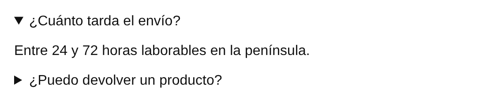


| Atributo | Hace | Compatibilidad |
|---|---|---|
| `open` | Empieza desplegado | 🟢 Disponible en todos (desde 2020) |
| `name="faq"` | Acordeón **exclusivo**: al abrir uno se cierran los demás con el mismo `name` | 🟡 Recién disponible (2024-09) |

<a id="dialog"></a>

### ▸ dialog: ventanas modales nativas

🟢 Disponible en todos (desde 2022)

```html
<button type="button" onclick="document.querySelector('#confirmar').showModal()">Vaciar carrito</button>

<dialog id="confirmar" aria-labelledby="titulo-confirmar">
  <h2 id="titulo-confirmar">¿Vaciar el carrito?</h2>
  <p>Se eliminarán los 3 productos.</p>
  <form method="dialog">
    <button value="cancelar">Cancelar</button>
    <button value="ok">Sí, vaciar</button>
  </form>
</dialog>
```

<sub>▸ RESULTADO</sub><br>
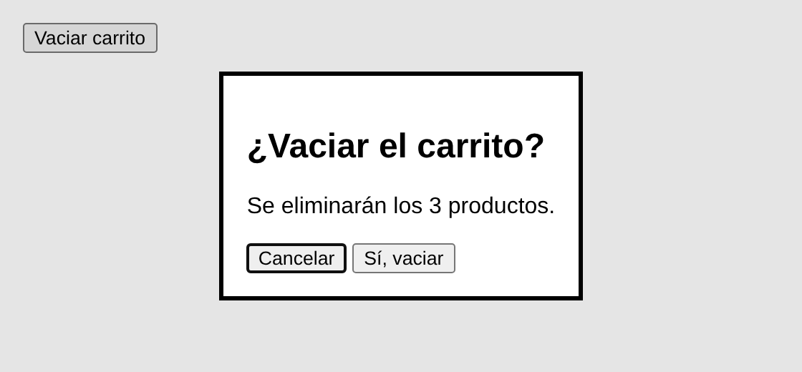


| Pieza | Hace |
|---|---|
| `showModal()` | Lo abre como **modal**: oscurece el fondo, bloquea el resto de la página y lleva el foco dentro |
| `show()` | Lo abre **sin** bloquear (no modal) |
| `<form method="dialog">` | Cualquier botón de ese formulario **cierra** el diálogo, y su `value` queda en `dialog.returnValue` |
| `Esc` | Cierra el modal |
| `::backdrop` (CSS) | Estilo del fondo oscurecido |

<a id="popover"></a>

### ▸ popover: menús y avisos flotantes sin JavaScript

🟡 Recién disponible (2025-01)

```html
<button type="button" id="btn-ayuda" popovertarget="ayuda">¿Qué es el CVV?</button>
<div id="ayuda" popover>
  <p>Son los 3 dígitos del reverso de tu tarjeta.</p>
</div>
```

<sub>▸ RESULTADO</sub><br>
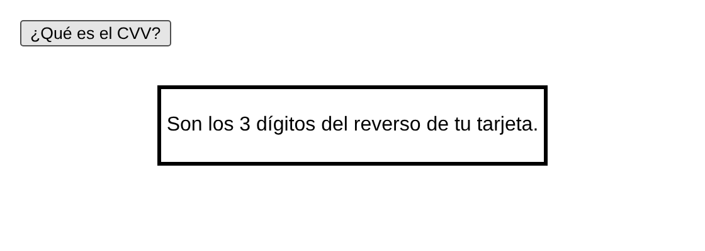


| | `dialog` + `showModal()` | `popover` |
|---|---|---|
| Para | Algo que **requiere respuesta**: confirmar, un formulario | Algo **ligero**: menú, tooltip, aviso |
| Bloquea la página | ✔ | ✖ |
| Se cierra al hacer clic fuera | ✖ | ✔ (con `popover` o `popover="auto"`) |
| JavaScript | Para abrirlo (`showModal()`) | **Ninguno**: `popovertarget` |

<sub>[▲ ÍNDICE](#indice) · [◂ MOD.12](#mod-12) · [MOD.14 ▸](#mod-14)</sub>

---

<a id="mod-14"></a>

## `14` VALIDAR Y DEPURAR

```text
┌─[ MOD.14 ]─────────────────────────────────────── VALIDAR / DEPURAR ─┐
│  W3C · DevTools · Lighthouse · errores                               │
└─────────────────────────────────────────────────────────── SYS.OK ───┘
```

<a id="herramientas"></a>

### ▸ Herramientas

| Herramienta | Para qué | Cómo |
|---|---|---|
| **Validador W3C** | Errores de sintaxis y de anidación | [validator.w3.org/nu](https://validator.w3.org/nu/) → *Check by file upload* o *Text input* |
| **DevTools → Elements** | Ver el DOM real y el CSS aplicado | `F12` o clic derecho → *Inspeccionar* |
| **DevTools → Lighthouse** | Puntuación de accesibilidad, SEO, rendimiento y buenas prácticas | `F12` → *Lighthouse* → *Analyze page load* |
| **DevTools → Accessibility** | El nombre accesible y el rol de cada elemento | `F12` → *Elements* → panel *Accessibility* |
| **WAVE** | Errores de accesibilidad señalados sobre la página | [wave.webaim.org](https://wave.webaim.org/) o su extensión |
| **Live Server** (VS Code) | Servidor local con recarga automática | Necesario para rutas que empiezan por `/` |

<a id="errores"></a>

### ▸ Errores frecuentes

| Error | Ejemplo | Qué pasa | Solución |
|---|---|---|---|
| Bloque dentro de `<p>` | `<p><div>…</div></p>` | El navegador cierra el `p` antes de tiempo ([ver captura](#bl-anidar)) | Cambiar el `p` por un `div`, o el `div` por un `span` |
| `id` duplicado | Dos `id="titulo"` | Las anclas, los `label` y el JS solo encuentran el primero | `id` únicos; para repetir, `class` |
| Enlace o botón dentro de otro | `<a><button>…</button></a>` | Comportamiento impredecible al hacer clic y con el teclado | Uno solo: `<a>` si navega, `<button>` si actúa |
| `img` sin `alt` | `` | El lector lee el nombre del archivo | `alt` descriptivo o `alt=""` |
| `label` sin enlazar | `<label>Email</label><input id="email">` | No se asocia: clic en el texto no hace nada | `for="email"` |
| Control sin `name` | `<input id="email">` | **No se envía** al servidor | `name="email"` |
| `li` fuera de una lista | `<li>` suelto, o `<a>` directo dentro de `<ul>` | HTML inválido; viñetas raras | `ul > li > a` |
| Saltos de títulos | `h1` → `h4` | Estructura confusa para el lector de pantalla | Niveles seguidos; el tamaño con CSS |
| Tabla para maquetar | Columnas hechas con `<table>` | Mala accesibilidad, imposible de adaptar al móvil | Flexbox o Grid |
| Ruta con mayúsculas o espacios | `src="Img/Mi Foto.JPG"` | Funciona en Windows y falla al subirlo al servidor | `img/mi-foto.jpg` |
| `<br>` para separar | `<br><br><br>` | Espaciado rígido, mal en móvil | `margin` en CSS |
| Atributo sin comillas con espacios | `class=btn grande` | `grande` se interpreta como otro atributo | `class="btn grande"` |
| Falta `<!DOCTYPE html>` | — | Modo quirks: el CSS se comporta raro | Primera línea del archivo |

```html
<ul>
  <a href="#">Inicio</a>
</ul>

<p id="dup">Uno</p>
<p id="dup">Dos</p>
```

<sub>✖ VALIDADOR W3C</sub>

```text
Error: Element “a” not allowed as child of element “ul” in this context. (Suppressing further errors from this subtree.)
Error: An “img” element must have an “alt” attribute, except under certain conditions. For details, consult guidance on providing text alternatives for images.
Error: Duplicate ID “dup”.
```


<sub>Traducción: (1) un `a` no puede ser hijo de `ul`; (2) a la `img` le falta el atributo `alt`; (3) hay un `id` duplicado.</sub>

<sub>[▲ ÍNDICE](#indice) · [◂ MOD.13](#mod-13) · [MOD.15 ▸](#mod-15)</sub>

---

<a id="mod-15"></a>

## `15` MISIONES: CASOS REALES

```text
┌─[ MOD.15 ]──────────────────────────────────────────────── MISIONES ─┐
│  8 páginas reales · solo HTML                                        │
└─────────────────────────────────────────────────────────── SYS.OK ───┘
```

Cada misión es una pieza real de una web, **solo con HTML** (estilos por defecto del navegador): primero se construye bien la estructura y luego se viste con CSS. Todas pasan el validador del W3C y tienes cada una como archivo completo en la carpeta [`demos/`](demos/) para abrirla en el navegador. El código muestra el contenido del `<body>`; el `<head>` es el de la [plantilla](#plantilla).

| ID | Caso real | Practica |
|:---:|---|---|
| [M1](#m1) | Ficha de producto de una tienda online | `article`, `figure`, precios, `dl`, formulario de compra |
| [M2](#m2) | Formulario de inscripción a un curso | `fieldset`, tipos de `input`, validación nativa |
| [M3](#m3) | Artículo de un blog técnico | `article`, `header`/`footer` de artículo, `time`, `figure`, `blockquote`, `code` |
| [M4](#m4) | Comparativa de planes de suscripción | Tabla accesible con `th scope` |
| [M5](#m5) | Página de contacto | `address`, `mailto:`/`tel:`, formulario, `iframe` |
| [M6](#m6) | Preguntas frecuentes (FAQ) | `details` exclusivo con `name` |
| [M7](#m7) | Factura | Semántica de documento, `dl`, tabla con `tfoot` |
| [M8](#m8) | Página de error 404 | Estructura de página completa, buscador con `GET` |

<a id="m1"></a>

### ◆ M1 · Ficha de producto

> **📡 Caso real:** la página de un producto en una tienda online: foto, nombre, precio con descuento, valoración, ficha técnica y botón de compra.

```html
<main>
  <article class="producto">
    <figure>
      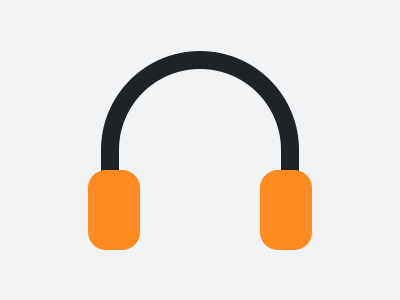
    </figure>

    <h1>Auriculares Sony WH-1000XM5</h1>
    <p>Valoración: <data value="4.7">4,7 de 5</data> (<a href="#opiniones">212 opiniones</a>)</p>

    <p>
      <s>379,00 €</s>
      <strong>349,00 €</strong>
      <small>IVA incluido · Envío gratis</small>
    </p>

    <form action="/carrito" method="post">
      <input type="hidden" name="id_producto" value="6">
      <label for="cantidad">Cantidad</label>
      <select id="cantidad" name="cantidad">
        <option>1</option><option>2</option><option>3</option>
      </select>
      <button type="submit">Añadir al carrito</button>
    </form>

    <h2>Ficha técnica</h2>
    <dl>
      <dt>Conexión</dt>     <dd>Bluetooth 5.2 y jack de 3,5 mm</dd>
      <dt>Autonomía</dt>    <dd>Hasta 30 horas</dd>
      <dt>Peso</dt>         <dd>250 g</dd>
    </dl>
  </article>
</main>
```

<sub>▸ RESULTADO</sub><br>
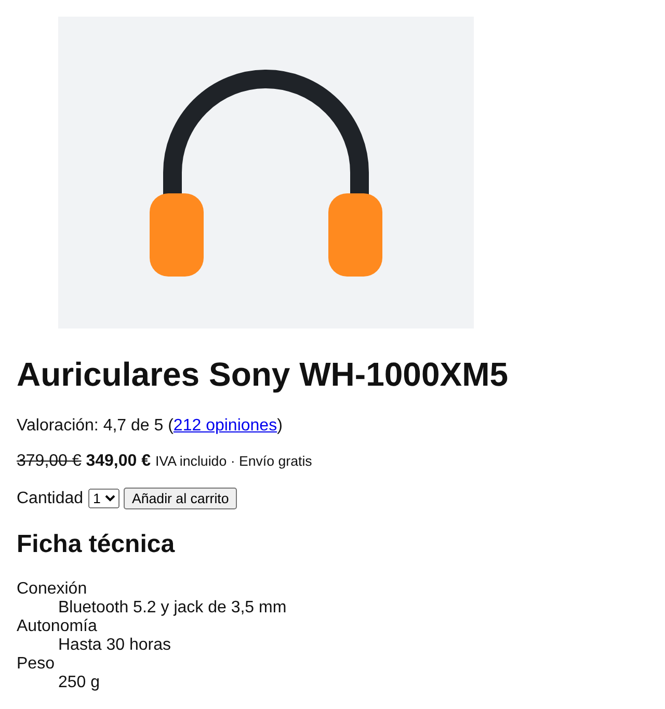


| Decisión | Por qué |
|---|---|
| `article` | La ficha tiene sentido sola (se puede compartir, aparece en un listado) |
| `h1` = nombre del producto | Es el tema de la página |
| `<s>` para el precio anterior y `<strong>` para el actual | `s` = "ya no es válido"; el actual es lo importante |
| `<data value="4.7">` | Valor para máquinas (4.7) junto al texto para personas (4,7 de 5) |
| `input type="hidden"` | El servidor necesita saber qué producto se añade, pero el usuario no tiene que verlo |
| `dl` para la ficha técnica | Son pares característica → valor |
| `method="post"` | Añadir al carrito **cambia** algo en el servidor |

<sub>▸ [Abrir la demo](demos/m1-ficha-producto.html) · [▲ ÍNDICE](#indice) · [◂ MISIONES](#mod-15) · [M2 ▸](#m2)</sub>

<a id="m2"></a>

### ◆ M2 · Formulario de inscripción a un curso

> **📡 Caso real:** una academia online recoge inscripciones: datos personales, modalidad, intereses y aceptación de la política de privacidad. Debe validar en el navegador antes de enviar.

```html
<main>
  <h1>Inscripción: curso de HTML y CSS</h1>
  <p>Los campos marcados con <span aria-hidden="true">*</span> (obligatorio) son necesarios.</p>

  <form action="/inscripcion" method="post">
    <fieldset>
      <legend>Datos personales</legend>
      <p>
        <label for="nombre">Nombre completo *</label><br>
        <input id="nombre" name="nombre" required autocomplete="name" size="40">
      </p>
      <p>
        <label for="email">Email *</label><br>
        <input id="email" name="email" type="email" required autocomplete="email" size="40">
      </p>
      <p>
        <label for="tel">Móvil</label><br>
        <input id="tel" name="tel" type="tel" autocomplete="tel" pattern="[6-7][0-9]{8}"
               title="9 cifras empezando por 6 o 7" aria-describedby="ayuda-tel">
        <small id="ayuda-tel">Sin espacios ni prefijo. Ej.: 600111222</small>
      </p>
      <p>
        <label for="nacimiento">Fecha de nacimiento</label><br>
        <input id="nacimiento" name="nacimiento" type="date" max="2010-12-31">
      </p>
    </fieldset>

    <fieldset>
      <legend>Modalidad *</legend>
      <label><input type="radio" name="modalidad" value="online" required checked> Online (99 €)</label><br>
      <label><input type="radio" name="modalidad" value="presencial"> Presencial en Madrid (149 €)</label>
    </fieldset>

    <fieldset>
      <legend>¿Qué te interesa más?</legend>
      <label><input type="checkbox" name="interes" value="maquetacion"> Maquetación</label>
      <label><input type="checkbox" name="interes" value="accesibilidad"> Accesibilidad</label>
      <label><input type="checkbox" name="interes" value="animaciones"> Animaciones</label>
    </fieldset>

    <p>
      <label for="comentarios">Comentarios</label><br>
      <textarea id="comentarios" name="comentarios" rows="3" cols="50" maxlength="500"></textarea>
    </p>

    <p>
      <label>
        <input type="checkbox" name="privacidad" required>
        Acepto la <a href="privacidad.html">política de privacidad</a> *
      </label>
    </p>

    <button type="submit">Inscribirme</button>
  </form>
</main>
```

<sub>▸ RESULTADO</sub><br>
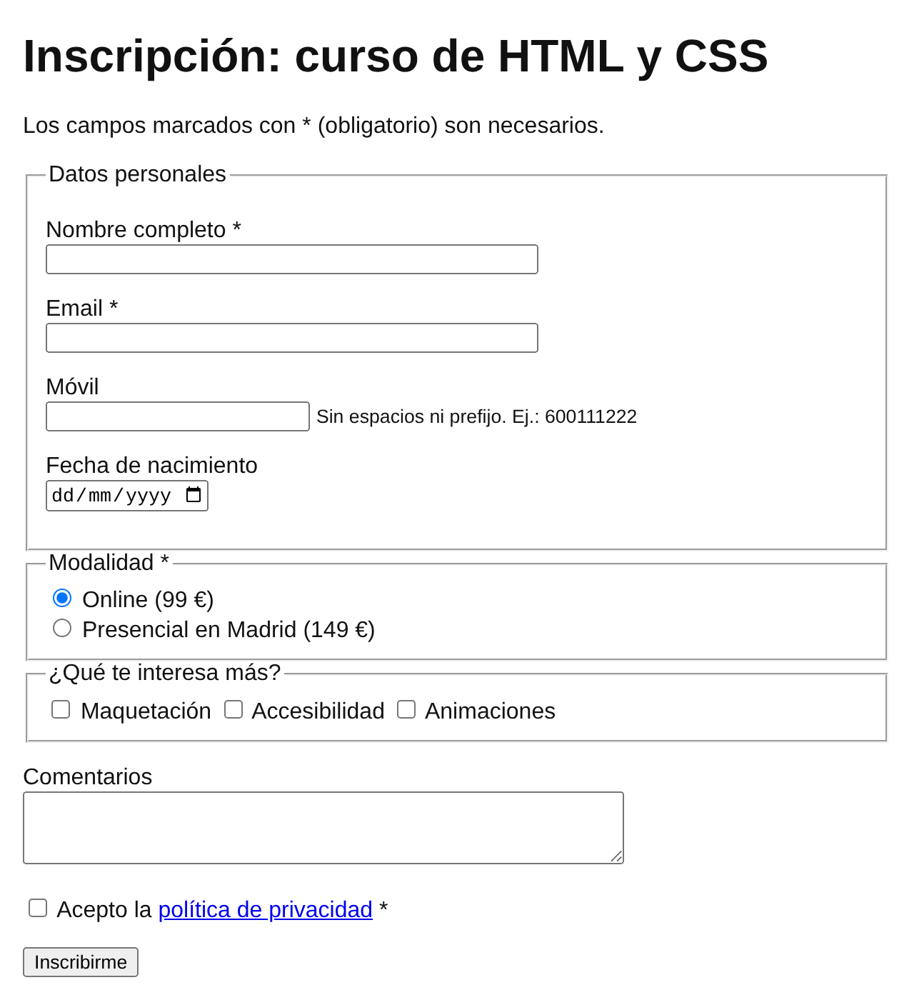


| Decisión | Por qué |
|---|---|
| `fieldset` + `legend` para cada grupo | El lector de pantalla anuncia "Modalidad" antes de leer cada opción |
| `required` en un solo radio del grupo | Basta con uno para que el grupo entero sea obligatorio |
| Todos los checkbox de intereses con el **mismo `name`** | El servidor recibe una lista: `interes=maquetacion&interes=animaciones` |
| `type="tel"` + `pattern` | `tel` no valida nada por sí solo; el `pattern` comprueba el formato español |
| `aria-describedby` | Asocia la ayuda al campo: el lector la lee al entrar en él |
| `autocomplete` | El navegador puede rellenar nombre, email y teléfono solo |
| `max` en la fecha | Impide elegir una fecha posterior a 2010 (edad mínima) |

<sub>▸ [Abrir la demo](demos/m2-inscripcion.html) (prueba a enviarlo vacío) · [▲ ÍNDICE](#indice) · [◂ M1](#m1) · [M3 ▸](#m3)</sub>

<a id="m3"></a>

### ◆ M3 · Artículo de un blog técnico

> **📡 Caso real:** una entrada de blog con autor y fecha, secciones, una imagen con pie de foto, una cita, código y etiquetas, más una barra lateral con artículos relacionados.

```html
<main>
  <article>
    <header>
      <h1>Por qué usar etiquetas semánticas</h1>
      <p>Por <a href="/autores/lucia">Lucía Fernández</a> ·
         <time datetime="2026-10-03">3 de octubre de 2026</time> · 4 min de lectura</p>
    </header>

    <p>Un <code>&lt;div&gt;</code> y un <code>&lt;nav&gt;</code> se ven igual, pero no significan lo mismo.</p>

    <section aria-labelledby="s-lectores">
      <h2 id="s-lectores">Para los lectores de pantalla</h2>
      <p>Permiten saltar directamente al contenido principal o al menú.</p>
      <figure>
        
        <figcaption>Las regiones que anuncia un lector de pantalla.</figcaption>
      </figure>
    </section>

    <section aria-labelledby="s-seo">
      <h2 id="s-seo">Para los buscadores</h2>
      <blockquote>
        <p>Usa elementos HTML semánticos para dar significado a tu contenido.</p>
      </blockquote>
    </section>

    <footer>
      <p>Etiquetas: <a href="/etiqueta/html" rel="tag">HTML</a>, <a href="/etiqueta/accesibilidad" rel="tag">Accesibilidad</a></p>
    </footer>
  </article>

  <aside aria-labelledby="relacionados">
    <h2 id="relacionados">Artículos relacionados</h2>
    <ul>
      <li><a href="/blog/alt">Cómo escribir un buen texto alternativo</a></li>
      <li><a href="/blog/formularios">Formularios accesibles paso a paso</a></li>
    </ul>
  </aside>
</main>
```

<sub>▸ RESULTADO</sub><br>
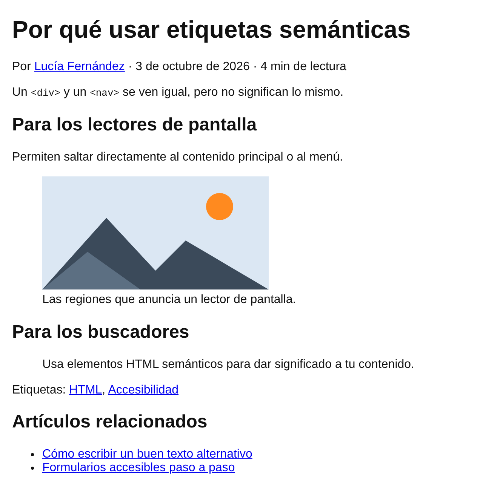


| Decisión | Por qué |
|---|---|
| `header` y `footer` **dentro** del `article` | Son la cabecera y el pie del artículo, no de la página (no crean regiones globales) |
| `time datetime` | Fecha legible por buscadores y lectores de feeds |
| `section` con `aria-labelledby` | Cada sección se nombra con su título y aparece en el mapa de regiones |
| `<code>&lt;div&gt;</code>` | Para mostrar una etiqueta hay que escapar `<` y `>` |
| `rel="tag"` | Indica que el enlace es una etiqueta del artículo |
| `aside` dentro de `main` | Contenido relacionado con **esta** página |

<sub>▸ [Abrir la demo](demos/m3-articulo.html) · [▲ ÍNDICE](#indice) · [◂ M2](#m2) · [M4 ▸](#m4)</sub>

<a id="m4"></a>

### ◆ M4 · Comparativa de planes de suscripción

> **📡 Caso real:** la tabla de precios de una plataforma: tres planes con sus características. Debe ser legible con lector de pantalla (que anuncie plan y característica en cada celda).

```html
<main>
  <h1>Planes y precios</h1>
  <table>
    <caption>Comparativa de planes (precio mensual, IVA incluido)</caption>
    <thead>
      <tr>
        <td></td>
        <th scope="col">Básico</th>
        <th scope="col">Estándar</th>
        <th scope="col">Premium</th>
      </tr>
    </thead>
    <tbody>
      <tr><th scope="row">Precio</th>       <td>6,99 €</td> <td>12,99 €</td> <td>17,99 €</td></tr>
      <tr><th scope="row">Calidad</th>      <td>HD</td>     <td>Full HD</td> <td>4K + HDR</td></tr>
      <tr><th scope="row">Pantallas</th>    <td>1</td>      <td>2</td>       <td>4</td></tr>
      <tr><th scope="row">Descargas</th>    <td>No</td>     <td>Sí</td>      <td>Sí</td></tr>
    </tbody>
    <tfoot>
      <tr>
        <td></td>
        <td><a href="/alta?plan=basico">Elegir Básico</a></td>
        <td><a href="/alta?plan=estandar">Elegir Estándar</a></td>
        <td><a href="/alta?plan=premium">Elegir Premium</a></td>
      </tr>
    </tfoot>
  </table>
</main>
```
```css
table { border-collapse: collapse; }
th, td { border: 1px solid #999; padding: 6px 12px; text-align: center; }
```

<sub>▸ RESULTADO</sub><br>
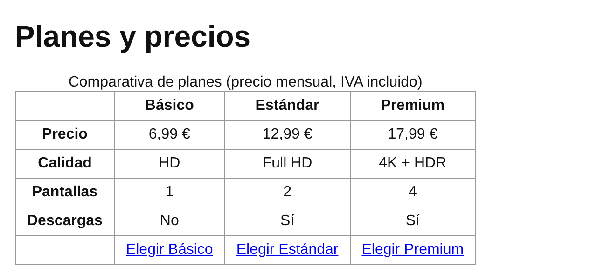


| Decisión | Por qué |
|---|---|
| Tabla | Son datos para comparar por **filas y columnas** |
| `th scope="col"` en los planes y `scope="row"` en las características | El lector anuncia "Estándar, Pantallas: 2" |
| "Sí" / "No" en texto | Un icono ✔ / ✖ sin texto alternativo no se entiende con lector de pantalla |
| Celda vacía `<td></td>` en la esquina | No es cabecera de nada |
| Enlaces en el `tfoot` | Son acciones que afectan a cada columna |

<sub>▸ [Abrir la demo](demos/m4-planes.html) · [▲ ÍNDICE](#indice) · [◂ M3](#m3) · [M5 ▸](#m5)</sub>

<a id="m5"></a>

### ◆ M5 · Página de contacto

> **📡 Caso real:** datos de contacto con enlaces que llaman o abren el correo al tocarlos en el móvil, horario, formulario y mapa de la tienda física.

```html
<main>
  <h1>Contacto</h1>

  <section aria-labelledby="t-datos">
    <h2 id="t-datos">Dónde estamos</h2>
    <address>
      Tienda DAW<br>
      C/ Mayor, 10 · 28013 Madrid<br>
      <a href="tel:+34910000000">910 000 000</a> ·
      <a href="mailto:hola@tienda-daw.es">hola@tienda-daw.es</a>
    </address>
    <p>Horario: lunes a sábado de <time>10:00</time> a <time>20:00</time>.</p>
    <iframe src="https://www.openstreetmap.org/export/embed.html?bbox=-3.712,40.413,-3.703,40.418&amp;layer=mapnik"
            title="Mapa: Tienda DAW en la calle Mayor de Madrid" width="400" height="200" loading="lazy"></iframe>
  </section>

  <section aria-labelledby="t-form">
    <h2 id="t-form">Escríbenos</h2>
    <form action="/contacto" method="post">
      <p><label for="c-nombre">Nombre</label><br>
         <input id="c-nombre" name="nombre" required autocomplete="name"></p>
      <p><label for="c-email">Email</label><br>
         <input id="c-email" name="email" type="email" required autocomplete="email"></p>
      <p><label for="c-asunto">Asunto</label><br>
         <select id="c-asunto" name="asunto">
           <option>Pedido</option><option>Devolución</option><option>Otro</option>
         </select></p>
      <p><label for="c-mensaje">Mensaje</label><br>
         <textarea id="c-mensaje" name="mensaje" rows="4" cols="45" required></textarea></p>
      <button type="submit">Enviar mensaje</button>
    </form>
  </section>
</main>
```

<sub>▸ RESULTADO</sub><br>
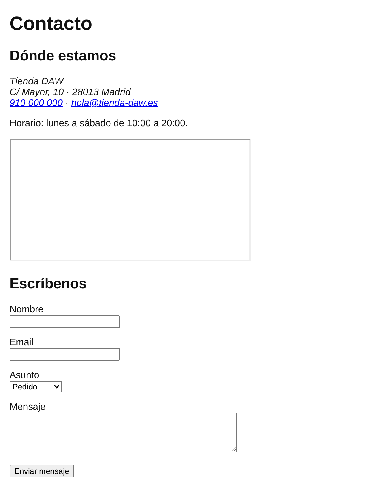


<sub>El mapa aparece vacío en la captura porque se generó sin conexión a internet; al abrir la demo con conexión se carga.</sub>

| Decisión | Por qué |
|---|---|
| `address` | Datos de contacto del sitio |
| `tel:` con prefijo `+34` | En el móvil abre el marcador; el prefijo hace que funcione también desde el extranjero |
| `iframe` con `title` y `loading="lazy"` | El título describe el mapa y no se descarga hasta que se acerca el scroll |
| `&amp;` en la URL | En HTML el `&` de una URL dentro de un atributo se escribe `&amp;` |

<sub>▸ [Abrir la demo](demos/m5-contacto.html) · [▲ ÍNDICE](#indice) · [◂ M4](#m4) · [M6 ▸](#m6)</sub>

<a id="m6"></a>

### ◆ M6 · Preguntas frecuentes (FAQ)

> **📡 Caso real:** la página de ayuda de una tienda, agrupada por temas. Al abrir una pregunta se cierran las demás de su grupo, sin JavaScript.

```html
<main>
  <h1>Preguntas frecuentes</h1>

  <section aria-labelledby="faq-envios">
    <h2 id="faq-envios">Envíos</h2>
    <details name="envios" open>
      <summary>¿Cuánto tarda en llegar mi pedido?</summary>
      <p>Entre 24 y 72 horas laborables en la península; de 3 a 5 días en Baleares y Canarias.</p>
    </details>
    <details name="envios">
      <summary>¿Cuánto cuesta el envío?</summary>
      <p>Gratis a partir de 50 €. Por debajo, 4,99 €.</p>
    </details>
  </section>

  <section aria-labelledby="faq-devoluciones">
    <h2 id="faq-devoluciones">Devoluciones</h2>
    <details name="devoluciones">
      <summary>¿Cuánto tiempo tengo para devolver un producto?</summary>
      <p>30 días naturales desde la entrega. Consulta las <a href="/condiciones#devoluciones">condiciones</a>.</p>
    </details>
  </section>

  <p>¿No encuentras tu respuesta? <a href="contacto.html">Escríbenos</a>.</p>
</main>
```

<sub>▸ RESULTADO</sub><br>
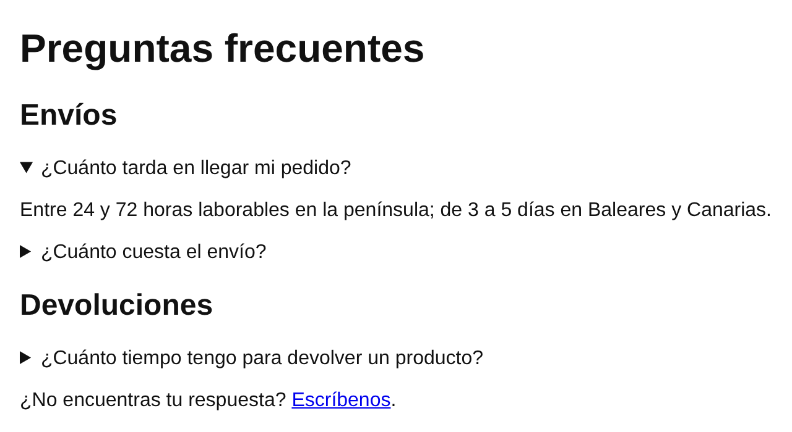


| Decisión | Por qué |
|---|---|
| `details` / `summary` | Desplegable accesible con teclado y lector de pantalla, sin JavaScript |
| `name="envios"` común | Acordeón exclusivo: solo una abierta por grupo (🟡 Recién disponible (2024-09); en navegadores antiguos simplemente se pueden abrir varias) |
| `open` en la primera | La pregunta más consultada aparece abierta |
| Un `section` por tema con su `h2` | Permite saltar de tema en tema |

<sub>▸ [Abrir la demo](demos/m6-faq.html) · [▲ ÍNDICE](#indice) · [◂ M5](#m5) · [M7 ▸](#m7)</sub>

<a id="m7"></a>

### ◆ M7 · Factura

> **📡 Caso real:** la factura que se descarga desde "Mis pedidos": datos del emisor y del cliente, líneas, base imponible, IVA y total.

```html
<main>
  <article>
    <header>
      <h1>Factura F-2026-0148</h1>
      <dl>
        <dt>Fecha</dt>         <dd><time datetime="2026-10-03">03/10/2026</time></dd>
        <dt>Nº de pedido</dt>  <dd>1024</dd>
      </dl>
    </header>

    <section aria-labelledby="t-emisor">
      <h2 id="t-emisor">Emisor</h2>
      <address>Tienda DAW S.L. · CIF B12345678<br>C/ Mayor, 10 · 28013 Madrid</address>
    </section>

    <section aria-labelledby="t-cliente">
      <h2 id="t-cliente">Cliente</h2>
      <p>Lucía Fernández Gil · NIF 12345678Z<br>C/ Alcalá, 200 · 28028 Madrid</p>
    </section>

    <table>
      <caption>Detalle de la factura</caption>
      <thead>
        <tr><th scope="col">Producto</th><th scope="col">Uds.</th><th scope="col">Precio</th><th scope="col">Importe</th></tr>
      </thead>
      <tbody>
        <tr><td>Portátil Lenovo IdeaPad 5</td><td>1</td><td>536,36 €</td><td>536,36 €</td></tr>
        <tr><td>Ratón Logitech MX Master 3S</td><td>1</td><td>81,82 €</td><td>81,82 €</td></tr>
      </tbody>
      <tfoot>
        <tr><th scope="row" colspan="3">Base imponible</th><td>618,18 €</td></tr>
        <tr><th scope="row" colspan="3">IVA (21 %)</th><td>129,82 €</td></tr>
        <tr><th scope="row" colspan="3">Total</th><td><strong>748,00 €</strong></td></tr>
      </tfoot>
    </table>

    <footer>
      <p><small>Forma de pago: tarjeta. Factura emitida electrónicamente.</small></p>
    </footer>
  </article>
</main>
```
```css
table { border-collapse: collapse; margin-top: 12px; }
th, td { border: 1px solid #999; padding: 4px 10px; }
td:nth-child(n+2) { text-align: right; }
```

<sub>▸ RESULTADO</sub><br>
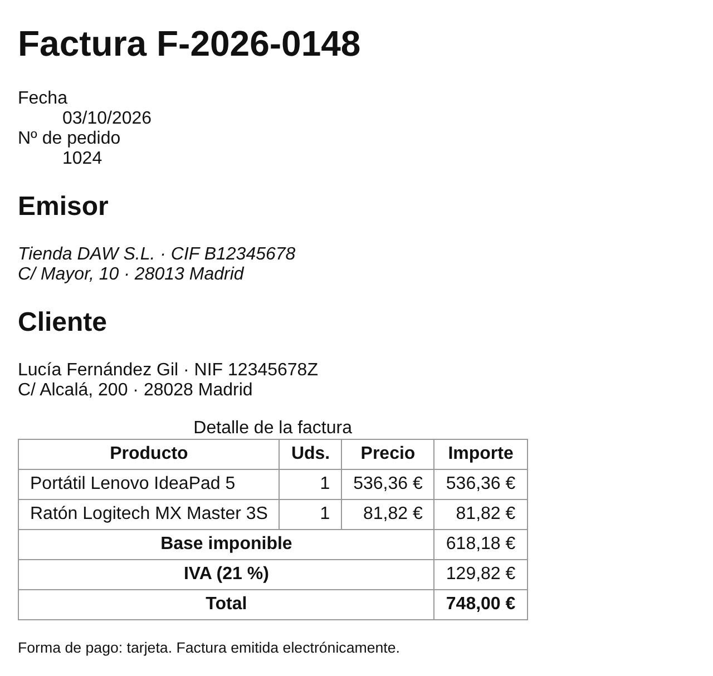


| Decisión | Por qué |
|---|---|
| `article` | La factura es un documento independiente (se imprime, se descarga) |
| `dl` para fecha y número | Pares etiqueta → valor |
| `tfoot` con `colspan="3"` | Los totales ocupan las tres primeras columnas como etiqueta y el importe va en la última |
| `strong` en el total | Es el dato más importante |

<sub>Comprobación: 536,36 + 81,82 = 618,18 € · 618,18 × 0,21 = 129,82 € · 618,18 + 129,82 = 748,00 €.</sub>

<sub>▸ [Abrir la demo](demos/m7-factura.html) · [▲ ÍNDICE](#indice) · [◂ M6](#m6) · [M8 ▸](#m8)</sub>

<a id="m8"></a>

### ◆ M8 · Página de error 404

> **📡 Caso real:** la página que ve el usuario cuando un enlace está roto. Debe explicar qué ha pasado y ofrecer salidas: buscador, enlaces principales y volver al inicio. Incluye la estructura completa de página.

```html
<a href="#contenido">Saltar al contenido</a>

<header>
  <a href="index.html"></a>
  <nav aria-label="Principal">
    <ul>
      <li><a href="index.html">Inicio</a></li>
      <li><a href="productos.html">Productos</a></li>
      <li><a href="contacto.html">Contacto</a></li>
    </ul>
  </nav>
</header>

<main id="contenido">
  <h1>Página no encontrada</h1>
  <p>Puede que el enlace esté mal escrito o que la página ya no exista. <small>(Error 404)</small></p>

  <search>
    <form action="/buscar" method="get">
      <label for="q">Busca lo que necesitas</label>
      <input id="q" name="q" type="search" placeholder="Ej.: teclado mecánico">
      <button type="submit">Buscar</button>
    </form>
  </search>

  <h2>Quizá te interese</h2>
  <ul>
    <li><a href="productos.html#ofertas">Ofertas de la semana</a></li>
    <li><a href="faq.html">Preguntas frecuentes</a></li>
  </ul>
</main>

<footer>
  <p><small>© 2026 Tienda DAW · <a href="privacidad.html">Privacidad</a></small></p>
</footer>
```

<sub>▸ RESULTADO</sub><br>
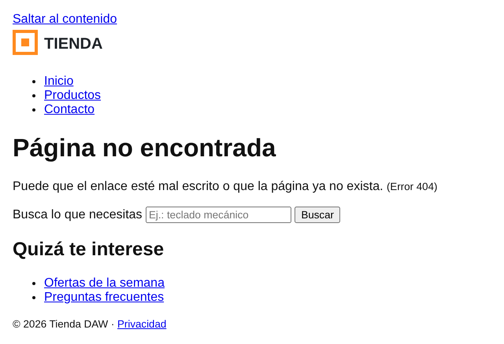


| Decisión | Por qué |
|---|---|
| Enlace "Saltar al contenido" el primero | Quien navega con teclado no tiene que recorrer todo el menú |
| `search` + `form method="get"` | Buscar no modifica nada y la URL resultante (`/buscar?q=teclado`) se puede compartir |
| Logo enlazado con `alt` que dice adónde lleva | Es una imagen **funcional** |
| Mensaje en lenguaje claro | "Error 404" solo dice algo a los desarrolladores |

<sub>▸ [Abrir la demo](demos/m8-404.html) · [▲ ÍNDICE](#indice) · [◂ M7](#m7) · [MISIONES ▲](#mod-15)</sub>

---

```text
┌─[ FIN DE TRANSMISIÓN ]─────────────────────────────────────────────────┐
│  HTML Living Standard · validado con W3C Nu · capturas en Chromium     │
└──────────────────────────────────────────────────────────── SYS.OK ───┘
```

<sub>[▲ VOLVER AL ÍNDICE](#indice)</sub>
