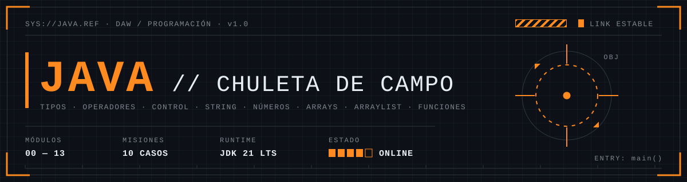
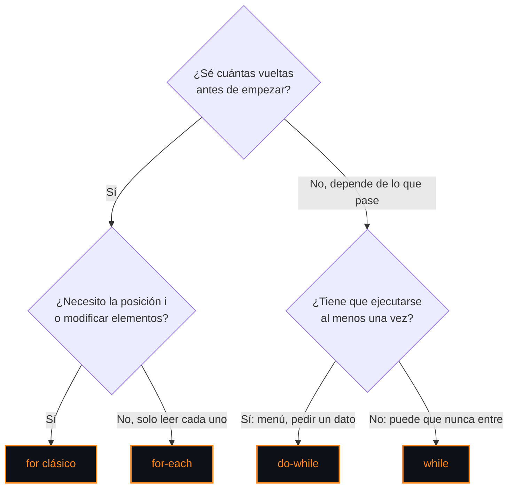

<p align="center">
  
</p>

<p align="center">
  
  
  
  
</p>

```text
> SYS://JAVA.CHULETA ........................ v1.0
> USO ....................................... consulta rápida: Ctrl+F o índice
> CÓDIGO .................................... todo compilado y probado en Java 21
> LEYENDA ................................... ▲ índice · ◂ anterior · ▸ siguiente
```

<a id="indice"></a>

## ⌖ ÍNDICE

| MOD | SECCIÓN | ACCESO DIRECTO |
|:---:|---|---|
| `00` | [**Estructura de un programa**](#mod-00) | [Esqueleto](#esqueleto) · [Nombres](#nombres) · [Comentarios](#comentarios) |
| `01` | [**Tipos de datos**](#mod-01) | [Primitivos](#primitivos) · [Valores por defecto](#valores-defecto) · [Referencia y wrappers](#referencia) · [Constantes y `var`](#constantes) · [Casting](#casting) |
| `02` | [**Operadores**](#mod-02) | [Aritméticos](#aritmeticos) · [Incremento](#incremento) · [Asignación](#asignacion) · [Comparación](#comparacion) · [Lógicos](#logicos) · [Ternario](#ternario) · [Precedencia](#precedencia) |
| `03` | [**Entrada y salida**](#mod-03) | [JOptionPane](#joptionpane) · [Scanner](#scanner) · [printf / format](#printf) · [Texto ↔ número](#parseo) |
| `04` | [**Estructuras de control**](#mod-04) | [if](#if) · [switch](#switch) · [for](#for) · [while](#while) · [do-while](#do-while) · [for-each](#for-each) · [break / continue](#break-continue) · [Anidados](#anidados) |
| `05` | [**¿Cuál elijo?**](#mod-05) | [Condicional](#elegir-condicional) · [Bucle](#elegir-bucle) · [Tipo de dato](#elegir-tipo) · [Colección](#elegir-coleccion) · [Texto](#elegir-texto) |
| `06` | [**String**](#mod-06) | [Índices](#string-indices) · [Métodos](#string-metodos) · [Comparar](#string-comparar) · [Character](#character) · [StringBuilder](#stringbuilder) · [Patrones](#string-patrones) |
| `07` | [**Números**](#mod-07) | [Integer / Double](#wrappers-numericos) · [División y módulo](#div-mod) · [Patrones](#num-patrones) · [Trampas](#num-trampas) |
| `08` | [**Math y aleatorios**](#mod-08) | [Math](#math) · [Aleatorios](#aleatorios) |
| `09` | [**Arrays**](#mod-09) | [Crear](#array-crear) · [Recorrer](#array-recorrer) · [Clase Arrays](#clase-arrays) · [Copiar](#array-copiar) · [Patrones](#array-patrones) · [Matrices 2D](#matrices) |
| `10` | [**ArrayList**](#mod-10) | [Crear](#arraylist-crear) · [Métodos](#arraylist-metodos) · [Recorrer y borrar](#arraylist-recorrer) · [Collections](#collections) · [Array vs ArrayList](#array-vs-arraylist) |
| `11` | [**Funciones**](#mod-11) | [Anatomía](#funcion-anatomia) · [Parámetros y return](#funcion-parametros) · [Paso por valor](#paso-valor) · [Plantilla de ejercicio](#funcion-plantilla) |
| `12` | [**Excepciones frecuentes**](#mod-12) | [Tabla](#excepciones) · [try-catch](#try-catch) |
| `13` | [**Ejercicios: casos reales**](#mod-13) | [E01](#e01) · [E02](#e02) · [E03](#e03) · [E04](#e04) · [E05](#e05) · [E06](#e06) · [E07](#e07) · [E08](#e08) · [E09](#e09) · [E10](#e10) |

---

<a id="mod-00"></a>

## `00` ESTRUCTURA DE UN PROGRAMA

```text
┌─[ MOD.00 ]────────────────────────────────────────────── ESTRUCTURA ─┐
│  clase · main · nombres · comentarios                                │
└─────────────────────────────────────────────────────────── SYS.OK ───┘
```

<a id="esqueleto"></a>

### ▸ Esqueleto mínimo

```java
// Archivo: Saludo.java   (el archivo se llama igual que la clase pública)
public class Saludo {

    public static void main(String[] args) {   // punto de entrada: lo llama la JVM, no tú
        System.out.println("Hola, DAW");      // imprime y salta de línea
        System.out.print("Sin salto ");        // imprime sin saltar de línea
    }
}
```

| Pieza | Qué es |
|---|---|
| `public class Saludo` | La clase. Todo el código Java vive dentro de una clase |
| `public static void main(String[] args)` | El método que arranca el programa. `void` = no devuelve nada |
| `{ }` | Delimitan un bloque. Una variable declarada dentro solo existe dentro (**ámbito**) |
| `;` | Fin de instrucción |
| `import javax.swing.JOptionPane;` | Va **antes** de la clase. Trae una clase de otro paquete |

<a id="nombres"></a>

### ▸ Convenciones de nombres

| Elemento | Estilo | Ejemplo |
|---|---|---|
| Clase | `PascalCase` | `CarritoCompra`, `ValidadorDni` |
| Variable / método | `camelCase` | `precioTotal`, `calcularIva()` |
| Constante | `MAYUSCULAS_CON_GUION` | `IVA_GENERAL`, `MAX_INTENTOS` |
| Paquete | `minusculas.con.puntos` | `com.daw.tienda` |
| Booleano | pregunta con `es` / `tiene` / `hay` | `esValido`, `tieneDescuento`, `hayStock` |

> [!TIP]
> El nombre debe decir **qué guarda**, no qué tipo es: `sumaVentas` mejor que `num`; `nombresAlumnos` mejor que `array1`.

Reglas obligatorias: no empezar por número, no usar palabras reservadas (`class`, `int`, `new`…), sin espacios. Java distingue mayúsculas: `total` y `Total` son variables distintas.

<a id="comentarios"></a>

### ▸ Comentarios

```java
// Comentario de una línea

/* Comentario
   de varias líneas */

/**
 * Javadoc: documenta clases y métodos. IntelliJ lo muestra al pasar el ratón.
 * @param base importe sin impuestos
 * @return importe con IVA
 */
```

<sub>[▲ ÍNDICE](#indice) · [MOD.01 ▸](#mod-01)</sub>

---

<a id="mod-01"></a>

## `01` TIPOS DE DATOS

```text
┌─[ MOD.01 ]────────────────────────────────────────── TIPOS DE DATOS ─┐
│  primitivos · wrappers · constantes · casting                        │
└─────────────────────────────────────────────────────────── SYS.OK ───┘
```

<a id="primitivos"></a>

### ▸ Los 8 tipos primitivos

| Tipo | Tamaño | Rango / precisión | Literal | Cuándo usarlo |
|---|---|---|---|---|
| `byte` | 8 bits | -128 a 127 | `byte b = 100;` | Datos binarios, archivos. Casi nunca en ejercicios |
| `short` | 16 bits | -32 768 a 32 767 | `short s = 1200;` | Casi nunca |
| **`int`** | 32 bits | ±2 147 483 647 (~2 100 millones) | `int stock = 250;` | **Por defecto para enteros**: contadores, edades, índices, cantidades |
| `long` | 64 bits | ±9,2 × 10¹⁸ | `long visitas = 3_000_000_000L;` | Lo que no cabe en `int`: milisegundos, IDs grandes, población |
| `float` | 32 bits | ~7 dígitos | `float t = 36.6f;` | Gráficos y juegos. En clase, usa `double` |
| **`double`** | 64 bits | ~15-16 dígitos | `double precio = 19.99;` | **Por defecto para decimales**: precios, medias, notas |
| `char` | 16 bits | Un carácter Unicode | `char letra = 'Z';` | Una letra: letra del DNI, inicial, opción de menú |
| `boolean` | — | `true` / `false` | `boolean activo = true;` | Indicadores (flags): `encontrado`, `esValido` |

> [!NOTE]
> `char` va con **comillas simples** (`'A'`) y `String` con **comillas dobles** (`"A"`). `'A'` y `"A"` no son lo mismo.
> El guion bajo en números (`1_000_000`) solo sirve para leer mejor; Java lo ignora.

<a id="valores-defecto"></a>

### ▸ Valores por defecto

Los arrays y los atributos de clase se rellenan solos. **Las variables locales (las de dentro de un método) no**: si las usas sin darles valor, el código no compila (`variable might not have been initialized`).

| Tipo | Valor inicial en un array |
|---|---|
| `int`, `long`, `short`, `byte` | `0` |
| `double`, `float` | `0.0` |
| `boolean` | `false` |
| `char` | `'\u0000'` (carácter nulo, invisible) |
| `String` y cualquier objeto | `null` |

<a id="referencia"></a>

### ▸ Tipos referencia y wrappers

Todo lo que **no** es primitivo es un objeto: `String`, arrays, `ArrayList`, `Scanner`… La variable no guarda el dato, guarda **dónde está** (una referencia). Por eso puede valer `null` y se compara con `equals`.

Cada primitivo tiene una clase "envoltorio" (*wrapper*). Es obligatoria en `ArrayList` y aporta métodos útiles:

| Primitivo | Wrapper | Métodos útiles |
|---|---|---|
| `int` | `Integer` | `parseInt`, `valueOf`, `MAX_VALUE`, `toBinaryString` |
| `double` | `Double` | `parseDouble`, `isNaN`, `compare` |
| `char` | `Character` | `isDigit`, `isLetter`, `toUpperCase` → [MOD.06](#character) |
| `boolean` | `Boolean` | `parseBoolean` |
| `long` | `Long` | `parseLong` |

Java convierte solo entre primitivo y wrapper (*autoboxing*): `Integer n = 5;` y `int m = n;` funcionan.

<a id="constantes"></a>

### ▸ Constantes y `var`

```java
final double IVA = 0.21;          // final: no se puede reasignar → constante
final int MAX_INTENTOS = 3;
// IVA = 0.10;                    // ✖ error de compilación

var total = 0.0;                  // Java 10+: deduce el tipo del valor → double
var nombre = "Ana";               // → String
```

> [!TIP]
> Mientras aprendes, escribe el tipo explícito (`double total = 0.0;`). `var` solo vale para variables locales y necesita valor inicial. Además, `var total = 0;` sería `int`, no `double`.

<a id="casting"></a>

### ▸ Conversión de tipos (casting)

```text
AUTOMÁTICA (ensanchar, sin pérdida) ─────────────────────────────▶
byte → short → int → long → float → double
              char ┘
◀──────────────────────────── EXPLÍCITA (estrechar, puede perder)
```

| Código | Resultado | Por qué |
|---|---|---|
| `double d = 7;` | `7.0` | int → double es automático |
| `int n = (int) 9.99;` | `9` | **Trunca**, no redondea |
| `int n = (int) -9.99;` | `-9` | Trunca hacia el 0 |
| `char c = (char) 65;` | `'A'` | Código Unicode → carácter |
| `int code = (int) 'A';` | `65` | Carácter → código |
| `'a' + 1` | `98` | `char` + `int` da `int` |
| `(char) ('a' + 1)` | `'b'` | Se vuelve a convertir a carácter |
| `'7' - '0'` | `7` | Truco: dígito en texto → su valor |
| `5 / 2 * 2.0` | `4.0` | `5/2` se hace primero entre enteros → `2` |
| `5 / 2.0 * 2` | `5.0` | Con un `double` en la división, ya no trunca |

`byte b = 10; b = b + 1;` no compila (`b + 1` es `int`). `b += 1;` sí, porque `+=` hace el casting por ti.

Para pasar de **texto a número** se usa `parse`, no casting → [MOD.03 · Texto ↔ número](#parseo).

<sub>[▲ ÍNDICE](#indice) · [◂ MOD.00](#mod-00) · [MOD.02 ▸](#mod-02)</sub>

---

<a id="mod-02"></a>

## `02` OPERADORES

```text
┌─[ MOD.02 ]────────────────────────────────────────────── OPERADORES ─┐
│  aritméticos · lógicos · ternario · precedencia                      │
└─────────────────────────────────────────────────────────── SYS.OK ───┘
```

<a id="aritmeticos"></a>

### ▸ Aritméticos

| Op | Nombre | Ejemplo | Resultado |
|:---:|---|---|---|
| `+` | Suma / **concatena** | `7 + 2` | `9` |
| `-` | Resta | `7 - 2` | `5` |
| `*` | Multiplicación | `7 * 2` | `14` |
| `/` | División | `7 / 2` · `7.0 / 2` | `3` · `3.5` |
| `%` | Resto (módulo) | `7 % 2` · `-7 % 2` | `1` · `-1` |

> [!WARNING]
> **`int / int` = `int`**: los decimales se tiran. `7 / 2` da `3`. Si necesitas decimales, que uno de los dos sea `double`: `7 / 2.0`, `total * 1.0 / n` o `(double) total / n`.

**`+` con texto concatena, y se evalúa de izquierda a derecha:**

```java
"Total: " + 5 + 3      // "Total: 53"   (primero "Total: 5", luego + "3")
"Total: " + (5 + 3)    // "Total: 8"    (el paréntesis va primero)
5 + 3 + " uds"         // "8 uds"       (primero 5 + 3 = 8, luego texto)
```

<a id="incremento"></a>

### ▸ Incremento y decremento

```java
int a = 5;
int b = a++;   // b = 5, a = 6  → postfijo: USA el valor y LUEGO suma
int c = ++a;   // c = 7, a = 7  → prefijo: SUMA primero y LUEGO usa
a--;           // resta 1
```

Sueltos en una línea (`i++;`) los dos hacen lo mismo. La diferencia solo importa si están dentro de otra expresión.

<a id="asignacion"></a>

### ▸ Asignación compuesta

| Forma corta | Equivale a | Uso típico |
|---|---|---|
| `total += precio;` | `total = total + precio;` | Acumular |
| `saldo -= retirada;` | `saldo = saldo - retirada;` | Descontar |
| `importe *= 1.21;` | `importe = importe * 1.21;` | Aplicar un porcentaje |
| `n /= 10;` | `n = n / 10;` | Quitar el último dígito |
| `n %= 60;` | `n = n % 60;` | Quedarse con el resto |
| `texto += "x";` | `texto = texto + "x";` | Añadir texto |

<a id="comparacion"></a>

### ▸ Comparación (devuelven `boolean`)

| Op | Significado | Ejemplo |
|:---:|---|---|
| `==` | Igual | `edad == 18` |
| `!=` | Distinto | `opcion != 0` |
| `>` `<` | Mayor / menor | `stock > 0` |
| `>=` `<=` | Mayor o igual / menor o igual | `nota >= 5` |

> [!IMPORTANT]
> Con **String** no se usa `==`: compara direcciones de memoria, no el texto. Usa `texto.equals("hola")` → [MOD.06 · Comparar](#string-comparar).

<a id="logicos"></a>

### ▸ Lógicos

| Op | Nombre | Es `true` cuando… | Ejemplo real |
|:---:|---|---|---|
| `&&` | Y (AND) | las dos condiciones son `true` | `edad >= 18 && tieneDni` |
| `\|\|` | O (OR) | al menos una es `true` | `esAdmin \|\| esPropietario` |
| `!` | NO (NOT) | invierte el valor | `!encontrado` |
| `^` | O exclusivo (XOR) | solo una de las dos es `true` | Poco usado |

**Cortocircuito:** `&&` no evalúa la derecha si la izquierda ya es `false`, y `||` no la evalúa si la izquierda ya es `true`. Por eso el **orden importa**:

```java
if (texto != null && texto.length() > 0) { ... }   // ✔ si es null, ni mira length()
if (texto.length() > 0 && texto != null) { ... }   // ✖ NullPointerException si es null
```

<a id="ternario"></a>

### ▸ Ternario `condición ? siEsTrue : siEsFalse`

Un `if-else` en una línea **que devuelve un valor**:

```java
String estado = (stock > 0) ? "Disponible" : "Agotado";
double envio  = (total >= 50) ? 0 : 4.99;
String plural = (n == 1) ? "artículo" : "artículos";
```

Úsalo solo para elegir **un valor entre dos**. Si hay más lógica, usa `if`.

<a id="precedencia"></a>

### ▸ Precedencia (de mayor a menor)

| Nivel | Operadores |
|:---:|---|
| 1 | `()` paréntesis |
| 2 | `++` `--` `!` `-` (unarios) · `(tipo)` casting |
| 3 | `*` `/` `%` |
| 4 | `+` `-` |
| 5 | `<` `<=` `>` `>=` |
| 6 | `==` `!=` |
| 7 | `&&` |
| 8 | `\|\|` |
| 9 | `? :` |
| 10 | `=` `+=` `-=` … |

> [!TIP]
> Ante la duda, pon paréntesis. `(a + b) / 2` se lee mejor que confiar en la tabla.

<sub>[▲ ÍNDICE](#indice) · [◂ MOD.01](#mod-01) · [MOD.03 ▸](#mod-03)</sub>

---

<a id="mod-03"></a>

## `03` ENTRADA Y SALIDA

```text
┌─[ MOD.03 ]──────────────────────────────────────── ENTRADA / SALIDA ─┐
│  JOptionPane · Scanner · printf · parse                              │
└─────────────────────────────────────────────────────────── SYS.OK ───┘
```

<a id="joptionpane"></a>

### ▸ JOptionPane (ventanas)

```java
import javax.swing.JOptionPane;
```

| Método | Devuelve | Para qué |
|---|---|---|
| `showInputDialog("Edad:")` | `String` (**`null` si pulsa Cancelar**) | Pedir un dato |
| `showMessageDialog(null, "Hola")` | nada | Mostrar un mensaje |
| `showMessageDialog(null, msg, "Título", JOptionPane.ERROR_MESSAGE)` | nada | Mensaje con título e icono |
| `showConfirmDialog(null, "¿Seguro?")` | `int`: `YES_OPTION` (0), `NO_OPTION` (1), `CANCEL_OPTION` (2) | Sí / No / Cancelar |
| `showOptionDialog(...)` | `int`: índice del botón pulsado (`-1` si cierra con la X) | Botones personalizados → [E09](#e09) |

Iconos: `INFORMATION_MESSAGE` · `WARNING_MESSAGE` · `ERROR_MESSAGE` · `QUESTION_MESSAGE` · `PLAIN_MESSAGE` (sin icono).

```java
String edadTexto = JOptionPane.showInputDialog("Edad:");
if (edadTexto == null) {
    // pulsó Cancelar o cerró la ventana
} else {
    int edad = Integer.parseInt(edadTexto.trim());
}

int respuesta = JOptionPane.showConfirmDialog(null, "¿Borrar el pedido?");
if (respuesta == JOptionPane.YES_OPTION) { ... }
```

> [!TIP]
> `"\n"` hace salto de línea dentro de la ventana. Si el mensaje empieza por `<html>`, la ventana interpreta HTML: `<pre>...</pre>` usa letra monoespaciada para alinear columnas → [E10](#e10).

<a id="scanner"></a>

### ▸ Scanner (consola)

```java
import java.util.Scanner;

Scanner teclado = new Scanner(System.in);
System.out.print("Nombre: ");
String nombre = teclado.nextLine();
```

| Método | Lee | Ojo |
|---|---|---|
| `nextLine()` | La línea entera, con espacios | — |
| `next()` | Una palabra (hasta el espacio) | — |
| `nextInt()` | Un `int` | Deja el salto de línea (`Enter`) pendiente |
| `nextDouble()` | Un `double` | Usa el idioma del sistema: en un PC en español espera `3,5` |
| `nextBoolean()` | `true` / `false` | — |
| `hasNextInt()` | `true` si lo siguiente es un `int` | Sirve para validar antes de leer |
| `close()` | Cierra el Scanner | Al final del programa |

> [!WARNING]
> **La trampa del `nextInt()` + `nextLine()`**: tras `nextInt()` queda el `Enter` en el búfer, y el siguiente `nextLine()` lo lee como línea vacía.
> Solución: un `teclado.nextLine();` extra después de `nextInt()`, o leerlo todo con `nextLine()` y convertir con `Integer.parseInt(...)`.

<a id="printf"></a>

### ▸ printf / String.format

`System.out.printf(...)` imprime y `String.format(...)` devuelve el texto (útil para JOptionPane). Desde Java 15 también existe `"%d uds".formatted(3)`.

| Formato | Para | Ejemplo | Salida |
|---|---|---|---|
| `%d` | Entero | `"%d uds", 3` | `3 uds` |
| `%f` | Decimal | `"%f", 3.5` | `3,500000` |
| `%.2f` | Decimal con 2 cifras (redondea) | `"%.2f", 3.14159` | `3,14` |
| `%s` | Texto (o cualquier cosa) | `"Hola %s", "Ana"` | `Hola Ana` |
| `%c` | Carácter | `"%c", 'Z'` | `Z` |
| `%b` | Booleano | `"%b", true` | `true` |
| `%n` | Salto de línea | — | — |
| `%%` | El símbolo `%` | `"IVA 21%%"` | `IVA 21%` |
| `%8.2f` | Ancho 8, alineado a la derecha | `"%8.2f\|", 3.5` | `    3,50\|` |
| `%-10s` | Ancho 10, alineado a la izquierda | `"%-10s\|", "Café"` | `Café      \|` |
| `%05d` | Rellenar con ceros | `"%05d", 42` | `00042` |
| `%,d` | Separador de miles | `"%,d", 1234567` | `1.234.567` |

> [!IMPORTANT]
> `printf` y `format` usan **el idioma de tu sistema**. En un Windows en español, `%.2f` escribe `3,14` (con coma). Si necesitas punto: `String.format(Locale.US, "%.2f", x)` con `import java.util.Locale;`.

```java
// Ticket con columnas alineadas
System.out.printf("%-12s %8.2f €%n", "Café", 1.5);
System.out.printf("%-12s %8.2f €%n", "Croissant", 2.25);
```

<a id="parseo"></a>

### ▸ Texto ↔ número

| De → A | Cómo | Ejemplo |
|---|---|---|
| `String` → `int` | `Integer.parseInt(texto)` | `Integer.parseInt("42")` → `42` |
| `String` → `double` | `Double.parseDouble(texto)` | `Double.parseDouble("3.5")` → `3.5` |
| `String` → `long` | `Long.parseLong(texto)` | — |
| `String` → `boolean` | `Boolean.parseBoolean(texto)` | `"true"` → `true` (cualquier otra cosa → `false`) |
| `String` → `char` | `texto.charAt(0)` | `"S".charAt(0)` → `'S'` |
| número → `String` | `String.valueOf(n)` · `"" + n` · `Integer.toString(n)` | `String.valueOf(3.5)` → `"3.5"` |
| `char` dígito → `int` | `c - '0'` · `Character.getNumericValue(c)` | `'7' - '0'` → `7` |
| `char` → `String` | `String.valueOf(c)` | `'A'` → `"A"` |

> [!WARNING]
> - `Integer.parseInt(" 42")` **falla** (`NumberFormatException`) por el espacio → usa `.trim()` antes.
> - `Double.parseDouble("3,5")` **falla**: solo acepta punto → `texto.replace(",", ".")` antes.
> - `Integer.parseInt("12abc")` y `Integer.parseInt("")` también fallan → [MOD.12 · try-catch](#try-catch).

<sub>[▲ ÍNDICE](#indice) · [◂ MOD.02](#mod-02) · [MOD.04 ▸](#mod-04)</sub>

---

<a id="mod-04"></a>

## `04` ESTRUCTURAS DE CONTROL

```text
┌─[ MOD.04 ]──────────────────────────────────────── CONTROL DE FLUJO ─┐
│  if · switch · for · while · do-while · for-each                     │
└─────────────────────────────────────────────────────────── SYS.OK ───┘
```

<a id="if"></a>

### ▸ if / else if / else

```java
// Gastos de envío según el importe del pedido (rangos → if/else if)
double envio;
if (totalPedido >= 50) {
    envio = 0;
} else if (totalPedido >= 20) {
    envio = 2.99;
} else {
    envio = 4.99;
}
```

- Se evalúan **de arriba abajo** y se ejecuta **solo el primer** bloque que cumple. Ordena los rangos de más a menos restrictivo (o al revés, pero con coherencia).
- Usa siempre llaves `{ }` aunque haya una sola línea: evita errores al añadir líneas después.
- Varias condiciones a la vez → `&&` / `||` en lugar de `if` anidados:

```java
if (edad >= 18 && tieneEntrada) { ... }        // en vez de if (edad >= 18) { if (tieneEntrada) { ... } }
```

<a id="switch"></a>

### ▸ switch

**Clásico** (necesita `break`; sin él, sigue ejecutando los `case` de abajo):

```java
switch (opcion) {
    case 1:
        consultarSaldo();
        break;
    case 2:
    case 3:                       // dos casos agrupados (aprovecha que sin break "cae" al siguiente)
        operar();
        break;
    default:                      // ninguno coincide (como el else)
        System.out.println("Opción no válida");
}
```

**Con flechas** (Java 14+, sin `break` ni "caídas"):

```java
switch (opcion) {
    case 1 -> consultarSaldo();
    case 2, 3 -> operar();
    default -> System.out.println("Opción no válida");
}
```

**Como expresión** (devuelve un valor):

```java
String tipoDia = switch (numeroDia) {
    case 1, 2, 3, 4, 5 -> "Laborable";
    case 6, 7 -> "Fin de semana";
    default -> "Día no válido";
};
```

> [!NOTE]
> `switch` admite `int`, `char`, `String` (y `byte`, `short`, `enum`). **No** admite `double`, `long`, `boolean` ni rangos (`case > 5` no existe).

<a id="for"></a>

### ▸ for

```text
for ( inicio ; condición ; actualización ) { cuerpo }
      │         │           └─ 3. después de cada vuelta
      │         └─ 2. antes de cada vuelta: si es false, sale
      └─ 1. una sola vez, al empezar
```

```java
for (int i = 0; i < 10; i++) { ... }               // 0..9 → 10 vueltas
for (int i = 1; i <= 10; i++) { ... }              // 1..10
for (int i = array.length - 1; i >= 0; i--) { ... } // recorrer al revés
for (int i = 0; i < 100; i += 5) { ... }           // de 5 en 5
```

<a id="while"></a>

### ▸ while

Comprueba **antes** de cada vuelta. Si la condición es falsa al empezar, no entra nunca.

```java
// Pedir hasta que el stock solicitado sea válido (no sé cuántos intentos hará el usuario)
int cantidad = Integer.parseInt(JOptionPane.showInputDialog("Unidades:"));
while (cantidad <= 0 || cantidad > stockDisponible) {
    cantidad = Integer.parseInt(JOptionPane.showInputDialog("Entre 1 y " + stockDisponible + ":"));
}
```

<a id="do-while"></a>

### ▸ do-while

Ejecuta **primero** y comprueba **después** → mínimo una vuelta. Lleva `;` al final.

```java
int opcion;                       // declarada fuera: el while de abajo la necesita
do {
    opcion = Integer.parseInt(JOptionPane.showInputDialog("1. Jugar\n2. Opciones\n0. Salir"));
    // ...
} while (opcion != 0);
```

<a id="for-each"></a>

### ▸ for-each

Recorre todos los elementos **sin índice**. Solo lectura: no sabes en qué posición estás y no puedes reemplazar elementos.

```java
double total = 0;
for (double precio : precios) {       // "para cada precio de precios"
    total += precio;
}

for (String nombre : listaNombres) {  // también con ArrayList
    System.out.println(nombre);
}
```

<a id="break-continue"></a>

### ▸ break / continue

```java
// break: salir del bucle en cuanto se encuentra lo buscado
int posicion = -1;
for (int i = 0; i < codigos.length; i++) {
    if (codigos[i].equals(codigoBuscado)) {
        posicion = i;
        break;
    }
}

// continue: saltar a la siguiente vuelta (ignorar lo que no interesa)
for (String linea : lineas) {
    if (linea.isBlank()) {
        continue;            // línea vacía: pasar a la siguiente
    }
    procesar(linea);
}
```

> [!TIP]
> En lugar de `while (true)` + `break`, usa una variable `boolean` que controle el bucle (`while (seguir)`). Se lee mejor y se ve en la condición cuándo termina → [E09](#e09), [E10](#e10).

<a id="anidados"></a>

### ▸ Bucles anidados

El de dentro da **todas** sus vueltas por cada vuelta del de fuera (filas × columnas).

```java
// Tabla de precios: 3 tallas x 4 colores
for (int talla = 0; talla < 3; talla++) {
    for (int color = 0; color < 4; color++) {
        System.out.print(precios[talla][color] + "\t");
    }
    System.out.println();    // al acabar cada fila, salto de línea
}
```

<sub>[▲ ÍNDICE](#indice) · [◂ MOD.03](#mod-03) · [MOD.05 ▸](#mod-05)</sub>

---

<a id="mod-05"></a>

## `05` ¿CUÁL ELIJO?

```text
┌─[ MOD.05 ]──────────────────────────────────────── SELECTOR TÁCTICO ─┐
│  qué estructura según la necesidad                                   │
└─────────────────────────────────────────────────────────── SYS.OK ───┘
```

<a id="elegir-condicional"></a>

### ▸ Condicional

| Necesito… | Usa | Por qué | Ejemplo real |
|---|---|---|---|
| Dos caminos | `if / else` | Lo más simple | ¿Hay stock o no? |
| Rangos de valores | `if / else if` | `switch` no admite `>` ni `<` | Tramos de envío, notas (suspenso, aprobado…) |
| Varias condiciones combinadas | `if` con `&&` / `\|\|` | Expresa la regla en una línea | Mayor de edad **y** con entrada |
| Un valor exacto de una lista cerrada | `switch` | Más limpio que 5 `else if` con `==` | Opción de menú, día de la semana, código de estado |
| Elegir uno de dos **valores** | Ternario `? :` | Una línea, devuelve valor | `"artículo"` / `"artículos"` |
| Un valor según muchos casos exactos | `switch` expresión | Asigna directamente | Número de mes → nombre del mes |

<a id="elegir-bucle"></a>

### ▸ Bucle



| Bucle | Úsalo cuando… | Ejemplo real |
|---|---|---|
| `for` | Sabes las vueltas o necesitas el índice | Recorrer un array por posición, repetir N veces, leer dos arrays paralelos |
| `for-each` | Quieres cada elemento y no te importa la posición | Sumar precios, imprimir una lista |
| `while` | Repites mientras se cumpla algo y puede que no entre | Leer líneas hasta el final, reintentar mientras falle |
| `do-while` | Al menos una vez y luego decides si repetir | Menús, pedir un dato hasta que sea válido |

<a id="elegir-tipo"></a>

### ▸ Tipo de dato

| Para guardar… | Tipo | Ojo |
|---|---|---|
| Cantidades, contadores, edades, índices | `int` | — |
| Precios, medias, notas con decimales | `double` | Imprecisión: `0.1 + 0.2 ≠ 0.3` → [MOD.07](#num-trampas) |
| Dinero en aplicaciones reales | `BigDecimal` (o céntimos en `long`) | En clase basta con `double` |
| Números enormes, milisegundos | `long` | Literal con `L`: `3_000_000_000L` |
| Sí / No, encontrado / no encontrado | `boolean` | Nombre tipo pregunta: `esValido` |
| Una sola letra o símbolo | `char` | Comillas simples |
| Texto, aunque sean números que no se operan | `String` | DNI, teléfono, código postal (`"08001"` como `int` perdería el `0`) |

<a id="elegir-coleccion"></a>

### ▸ Colección

| Situación | Usa |
|---|---|
| Sé el tamaño y no cambia (días de la semana, 12 meses, tablero 8×8) | **Array** `tipo[]` |
| Crece y encoge (carrito, cola de clientes, resultados de un filtro) | **ArrayList** |
| Datos en filas y columnas (butacas, notas por alumno y evaluación) | **Array 2D** `tipo[][]` |
| Tipos primitivos y máximo rendimiento | **Array** (ArrayList solo admite objetos: `Integer`, no `int`) |

Comparativa completa → [MOD.10 · Array vs ArrayList](#array-vs-arraylist).

<a id="elegir-texto"></a>

### ▸ Texto

| Situación | Usa | Por qué |
|---|---|---|
| Texto que no cambia o cambia poco | `String` | Simple |
| Construir texto dentro de un bucle | `StringBuilder` | Cada `+=` sobre un String crea un objeto nuevo; StringBuilder modifica el mismo |
| Un solo carácter | `char` | Se compara con `==` |
| Texto con formato (decimales, columnas) | `String.format` | Control de decimales y alineación |

<sub>[▲ ÍNDICE](#indice) · [◂ MOD.04](#mod-04) · [MOD.06 ▸](#mod-06)</sub>

---
<a id="mod-06"></a>

## `06` STRING

```text
┌─[ MOD.06 ]────────────────────────────────────────────────── STRING ─┐
│  métodos · comparar · Character · StringBuilder                      │
└─────────────────────────────────────────────────────────── SYS.OK ───┘
```

> [!IMPORTANT]
> Un `String` es **inmutable**: ningún método lo modifica, todos devuelven uno nuevo. `nombre.toUpperCase();` sola no hace nada; tienes que guardarlo: `nombre = nombre.toUpperCase();`

<a id="string-indices"></a>

### ▸ Índices

```text
  texto = "Hola Mundo"
           H o l a   M u n d o
  índice   0 1 2 3 4 5 6 7 8 9        length() = 10   ·   último = length() - 1
```

<a id="string-metodos"></a>

### ▸ Métodos más usados

Ejemplos con `String s = "Hola Mundo";`

| Método | Devuelve | Ejemplo | Resultado |
|---|---|---|---|
| **Información** | | | |
| `length()` | `int` | `s.length()` | `10` |
| `charAt(i)` | `char` | `s.charAt(0)` | `'H'` |
| `isEmpty()` | `boolean` | `"".isEmpty()` · `"  ".isEmpty()` | `true` · `false` |
| `isBlank()` (Java 11) | `boolean` | `"   ".isBlank()` | `true` (vacío o solo espacios) |
| **Buscar** | | | |
| `indexOf(x)` | `int` (`-1` si no está) | `s.indexOf("o")` · `s.indexOf("xyz")` | `1` · `-1` |
| `indexOf(x, desde)` | `int` | `s.indexOf('o', 2)` | `9` |
| `lastIndexOf(x)` | `int` | `s.lastIndexOf("o")` | `9` |
| `contains(x)` | `boolean` | `s.contains("Mun")` | `true` |
| `startsWith(x)` | `boolean` | `s.startsWith("Ho")` | `true` |
| `endsWith(x)` | `boolean` | `"foto.png".endsWith(".png")` | `true` |
| **Extraer** | | | |
| `substring(desde)` | `String` | `s.substring(5)` | `"Mundo"` |
| `substring(desde, hasta)` | `String` (**`hasta` no se incluye**) | `s.substring(0, 4)` | `"Hola"` |
| **Transformar** | | | |
| `toUpperCase()` / `toLowerCase()` | `String` | `s.toUpperCase()` | `"HOLA MUNDO"` |
| `trim()` | `String` | `"  hi  ".trim()` | `"hi"` |
| `strip()` (Java 11) | `String` | Como `trim`, pero también quita espacios Unicode | — |
| `replace(a, b)` | `String` (todas las apariciones) | `s.replace("o", "0")` | `"H0la Mund0"` |
| `replaceAll(regex, b)` | `String` | `"a   b".replaceAll("\\s+", " ")` | `"a b"` |
| `repeat(n)` (Java 11) | `String` | `"ab".repeat(3)` | `"ababab"` |
| **Comparar** | | | |
| `equals(x)` | `boolean` | `s.equals("Hola Mundo")` | `true` |
| `equalsIgnoreCase(x)` | `boolean` | `"SI".equalsIgnoreCase("si")` | `true` |
| `compareTo(x)` | `int` (`<0`, `0`, `>0`) | `"ana".compareTo("bea")` | `-1` (va antes) |
| `compareToIgnoreCase(x)` | `int` | — | Ordena sin distinguir mayúsculas |
| **Dividir y unir** | | | |
| `split(regex)` | `String[]` | `s.split(" ")` | `["Hola", "Mundo"]` |
| `String.join(sep, ...)` | `String` | `String.join("-", "a", "b", "c")` | `"a-b-c"` |
| **Convertir** | | | |
| `toCharArray()` | `char[]` | `"hey".toCharArray()` | `['h', 'e', 'y']` |
| `String.valueOf(x)` | `String` | `String.valueOf(3.5)` | `"3.5"` |
| `matches(regex)` | `boolean` | `"12345678Z".matches("\\d{8}[A-Z]")` | `true` |

> [!WARNING]
> **Trampas de `split`** (recibe una expresión regular):
> - `"1.2.3".split(".")` devuelve un array **vacío**: el `.` significa "cualquier carácter". Usa `split("\\.")`. Lo mismo con `|`, `+`, `*`, `?` → `"\\|"`, `"\\+"`…
> - `"a,b,,".split(",")` → `["a", "b"]`: los vacíos **del final** se descartan (los del medio no: `"a,,c"` → `["a", "", "c"]`).
> - Para separar por uno o más espacios: `texto.trim().split("\\s+")`.

<a id="string-comparar"></a>

### ▸ Comparar Strings

```java
String respuesta = JOptionPane.showInputDialog("¿Continuar? (si/no)");

if (respuesta == "si") { ... }                  // ✖ compara si son el MISMO objeto en memoria
if (respuesta.equals("si")) { ... }             // ✔ compara el texto
if ("si".equalsIgnoreCase(respuesta)) { ... }   // ✔✔ ignora mayúsculas y no falla si respuesta es null
```

`compareTo` sirve para **ordenar** alfabéticamente. Las mayúsculas van antes que las minúsculas (`"Zeta".compareTo("ana")` es negativo), así que para un orden "humano" usa `compareToIgnoreCase`.

<a id="character"></a>

### ▸ Character (analizar letra a letra)

| Método | Devuelve `true` si… / hace | Ejemplo |
|---|---|---|
| `Character.isDigit(c)` | es un dígito | `'7'` → `true` |
| `Character.isLetter(c)` | es una letra (incluye `ñ`, `á`) | `'ñ'` → `true` |
| `Character.isLetterOrDigit(c)` | letra o dígito | `'_'` → `false` |
| `Character.isUpperCase(c)` / `isLowerCase(c)` | mayúscula / minúscula | `'A'` → `true` |
| `Character.isWhitespace(c)` | espacio, tabulador, salto | `' '` → `true` |
| `Character.toUpperCase(c)` / `toLowerCase(c)` | convierte | `'a'` → `'A'` |
| `Character.getNumericValue(c)` | valor del dígito | `'7'` → `7` |

```java
// Plantilla: recorrer un texto carácter a carácter
for (int i = 0; i < texto.length(); i++) {
    char caracter = texto.charAt(i);
    if (Character.isDigit(caracter)) { ... }
}
```

Los `char` se comparan con `==` y con `<`/`>` (por su código): `'a' < 'b'` es `true`.

<a id="stringbuilder"></a>

### ▸ StringBuilder (texto que se modifica)

```java
StringBuilder sb = new StringBuilder("Java");
sb.append(" 21");            // "Java 21"         añade al final (encadenable)
sb.insert(0, ">> ");         // ">> Java 21"      inserta en una posición
sb.reverse();                // "12 avaJ >>"      da la vuelta
String resultado = sb.toString();   // de vuelta a String
```

| Método | Hace |
|---|---|
| `append(x)` | Añade al final (cualquier tipo) |
| `insert(i, x)` | Inserta en la posición `i` |
| `reverse()` | Invierte |
| `deleteCharAt(i)` | Borra el carácter de la posición `i` |
| `delete(desde, hasta)` | Borra un tramo (`hasta` no incluido) |
| `setCharAt(i, c)` | Cambia el carácter de la posición `i` |
| `length()` · `charAt(i)` · `indexOf(x)` | Igual que en String |
| `toString()` | Lo convierte en `String` |

<a id="string-patrones"></a>

### ▸ Patrones típicos con texto

```java
// Contar vocales
int vocales = 0;
for (char c : texto.toLowerCase().toCharArray()) {
    if ("aeiouáéíóú".indexOf(c) != -1) vocales++;
}

// Contar palabras (aunque haya varios espacios seguidos)
int palabras = texto.isBlank() ? 0 : texto.trim().split("\\s+").length;

// Invertir y comprobar palíndromo
String invertido = new StringBuilder(texto).reverse().toString();
boolean esPalindromo = invertido.equalsIgnoreCase(texto);

// Primera letra en mayúscula ("madrid" → "Madrid")
String capitalizado = texto.substring(0, 1).toUpperCase() + texto.substring(1).toLowerCase();

// Extensión de un archivo ("informe.final.pdf" → "pdf")
String extension = archivo.substring(archivo.lastIndexOf('.') + 1);

// Dominio de un email ("ana@empresa.es" → "empresa.es")
String dominio = email.substring(email.indexOf('@') + 1);

// Enmascarar una tarjeta ("1234567812345678" → "**** **** **** 5678")
String oculta = "**** **** **** " + tarjeta.substring(tarjeta.length() - 4);

// Validación básica de email: tiene @ y después un punto
boolean emailValido = email.indexOf('@') > 0 && email.lastIndexOf('.') > email.indexOf('@');
```

▸ Aplicado en: [E03 Contraseña](#e03) · [E04 Email corporativo](#e04) · [E05 DNI](#e05) · [E08 Logs](#e08)

<sub>[▲ ÍNDICE](#indice) · [◂ MOD.05](#mod-05) · [MOD.07 ▸](#mod-07)</sub>

---

<a id="mod-07"></a>

## `07` NÚMEROS

```text
┌─[ MOD.07 ]───────────────────────────────────────────────── NÚMEROS ─┐
│  Integer · Double · división · módulo · trampas                      │
└─────────────────────────────────────────────────────────── SYS.OK ───┘
```

<a id="wrappers-numericos"></a>

### ▸ Integer, Long y Double

| Miembro | Devuelve | Ejemplo | Resultado |
|---|---|---|---|
| `Integer.MAX_VALUE` / `MIN_VALUE` | `int` | — | `2147483647` / `-2147483648` |
| `Integer.parseInt(texto)` | `int` | `Integer.parseInt("42")` | `42` |
| `Integer.valueOf(texto)` | `Integer` (objeto) | `Integer.valueOf("7") + 1` | `8` |
| `Integer.toString(n)` | `String` | `Integer.toString(42)` | `"42"` |
| `Integer.toBinaryString(n)` | `String` | `Integer.toBinaryString(10)` | `"1010"` |
| `Integer.toHexString(n)` | `String` | `Integer.toHexString(255)` | `"ff"` |
| `Integer.compare(a, b)` | `int` (`<0`, `0`, `>0`) | `Integer.compare(3, 7)` | `-1` |
| `Integer.max(a, b)` / `min` / `sum` | `int` | — | — |
| `Long.MAX_VALUE` | `long` | — | `9223372036854775807` |
| `Long.parseLong(texto)` | `long` | — | — |
| `Double.parseDouble(texto)` | `double` | `Double.parseDouble(" 3.5 ")` | `3.5` (este sí tolera espacios) |
| `Double.isNaN(x)` | `boolean` | `Double.isNaN(0.0 / 0)` | `true` |
| `Double.MAX_VALUE` | `double` | — | ~`1.8 × 10³⁰⁸` |

<a id="div-mod"></a>

### ▸ División entera y módulo `%`: los dos grandes aliados

| Quiero… | Código | Ejemplo |
|---|---|---|
| Saber si es par | `n % 2 == 0` | `14 % 2` → `0` ✔ |
| Saber si es múltiplo de k | `n % k == 0` | Billetes de 10: `retirada % 10 == 0` |
| El último dígito | `n % 10` | `4721 % 10` → `1` |
| Quitar el último dígito | `n / 10` | `4721 / 10` → `472` |
| Minutos → horas y minutos | `min / 60` · `min % 60` | `135` → `2` h `15` min |
| Segundos → hh:mm:ss | `s / 3600` · `(s % 3600) / 60` · `s % 60` | `3725` → `01:02:05` |
| Índice circular (volver a 0 al final) | `(i + 1) % n` | Con `n = 5`: después del 4 viene el `0` |
| Repartir en grupos | `total / tamaño` y `total % tamaño` | 23 alumnos en grupos de 5 → `4` grupos y `3` sueltos |
| Redondear hacia arriba sin Math | `if (n % k != 0) cociente++` | Cobrar fracción de hora → [E02](#e02) |

<a id="num-patrones"></a>

### ▸ Patrones típicos con números

```java
// Sumar los dígitos de un número (4721 → 14)
int sumaDigitos = 0;
while (numero > 0) {
    sumaDigitos += numero % 10;    // coger el último
    numero /= 10;                  // quitarlo
}

// Invertir un número (1234 → 4321)
int invertido = 0;
while (numero > 0) {
    invertido = invertido * 10 + numero % 10;
    numero /= 10;
}

// ¿Es primo? Basta con probar divisores hasta la raíz (i * i <= n)
boolean esPrimo = numero >= 2;
for (int i = 2; i * i <= numero && esPrimo; i++) {
    if (numero % i == 0) esPrimo = false;
}

// Segundos → "01:02:05"
String duracion = String.format("%02d:%02d:%02d", seg / 3600, (seg % 3600) / 60, seg % 60);

// Porcentaje sin división entera
double porcentaje = aciertos * 100.0 / total;
```

<a id="num-trampas"></a>

### ▸ Trampas con números

| Trampa | Código | Resultado | Solución |
|---|---|---|---|
| Desbordamiento | `Integer.MAX_VALUE + 1` | `-2147483648` | Usar `long` |
| Cálculo en `int` antes de guardar en `long` | `long ms = 30 * 24 * 60 * 60 * 1000;` | `-1702967296` | Un literal `long`: `30L * 24 * ...` → `2592000000` |
| Imprecisión de `double` | `0.1 + 0.2` | `0.30000000000000004` | Mostrar con `%.2f`; dinero real con `BigDecimal` |
| Comparar `double` con `==` | `0.1 + 0.2 == 0.3` | `false` | Comparar con margen: `Math.abs(a - b) < 0.0001` ([MOD.08](#math)) |
| División entre 0 con `int` | `5 / 0` | `ArithmeticException` | Comprobar el divisor antes |
| División entre 0 con `double` | `10 / 0.0` · `0.0 / 0` | `Infinity` · `NaN` | Comprobar el divisor antes |
| Comparar `Integer` con `==` | `Integer a = 128, b = 128; a == b` | `false` (con 127 da `true`) | `a.equals(b)` |
| Resto de negativo | `-7 % 3` | `-1` | El signo es el del dividendo |

▸ Aplicado en: [E01 Ticket](#e01) · [E02 Parking](#e02) · [E05 DNI](#e05) · [E07 Ventas](#e07)

<sub>[▲ ÍNDICE](#indice) · [◂ MOD.06](#mod-06) · [MOD.08 ▸](#mod-08)</sub>

---

<a id="mod-08"></a>

## `08` MATH Y ALEATORIOS

```text
┌─[ MOD.08 ]─────────────────────────────────────────── MATH / RANDOM ─┐
│  referencia · equivalentes a mano                                    │
└─────────────────────────────────────────────────────────── SYS.OK ───┘
```

> [!CAUTION]
> **Aún no visto en clase.** Esta sección es de referencia. En los ejercicios, si no lo habéis dado, usa la columna **"sin Math"**: es la lógica que hay detrás y la que te van a pedir.

<a id="math"></a>

### ▸ Clase Math (no necesita import)

| Método | Devuelve | Ejemplo | Resultado | Sin Math |
|---|---|---|---|---|
| `Math.abs(x)` | mismo tipo | `Math.abs(-5)` | `5` | `(x < 0) ? -x : x` |
| `Math.max(a, b)` / `min` | mismo tipo | `Math.max(3, 8)` | `8` | `(a > b) ? a : b` |
| `Math.pow(base, exp)` | `double` | `Math.pow(2, 10)` | `1024.0` | Bucle multiplicando `exp` veces |
| `Math.sqrt(x)` | `double` | `Math.sqrt(16)` | `4.0` | — |
| `Math.round(x)` | `long` (de `double`) | `Math.round(2.5)` · `Math.round(2.4)` | `3` · `2` | `(int) (x + 0.5)` (solo positivos) |
| `Math.floor(x)` | `double` | `Math.floor(-2.5)` | `-3.0` (hacia abajo) | — |
| `Math.ceil(x)` | `double` | `Math.ceil(2.1)` | `3.0` (hacia arriba) | `if (n % k != 0) cociente++` |
| `Math.random()` | `double` en [0, 1) | — | `0.7310…` | — |
| `Math.floorMod(a, n)` | `int` | `Math.floorMod(-7, 3)` | `2` (`-7 % 3` da `-1`) | — |
| `Math.PI` | `double` | — | `3.141592653589793` | — |

```java
// Redondear a 2 decimales para CALCULAR (para MOSTRAR basta %.2f)
double redondeado = Math.round(valor * 100) / 100.0;       // 3.14159 → 3.14
double sinMath    = (int) (valor * 100 + 0.5) / 100.0;     // igual, solo para positivos
```

<a id="aleatorios"></a>

### ▸ Números aleatorios

```java
// Con Math.random(): entero entre min y max (ambos incluidos)
int dado = (int) (Math.random() * 6) + 1;                         // 1..6
int numero = (int) (Math.random() * (max - min + 1)) + min;

// Con Random (más legible)
import java.util.Random;
Random random = new Random();
int dado2   = random.nextInt(6) + 1;      // nextInt(n) → 0..n-1, así que +1 → 1..6
int entre   = random.nextInt(10, 21);     // Java 17+: 10..20 (el segundo no se incluye)
double d    = random.nextDouble();        // 0.0..1.0
boolean moneda = random.nextBoolean();
```

Usos reales: código de verificación de 6 cifras, sortear un alumno, barajar una lista (`Collections.shuffle(lista)`), generar datos de prueba.

<sub>[▲ ÍNDICE](#indice) · [◂ MOD.07](#mod-07) · [MOD.09 ▸](#mod-09)</sub>

---

<a id="mod-09"></a>

## `09` ARRAYS

```text
┌─[ MOD.09 ]────────────────────────────────────────────────── ARRAYS ─┐
│  crear · recorrer · Arrays · copiar · 2D                             │
└─────────────────────────────────────────────────────────── SYS.OK ───┘
```

<a id="array-crear"></a>

### ▸ Crear

```java
int[] stock = new int[5];                                   // 5 posiciones a 0
String[] dias = {"Lun", "Mar", "Mié", "Jue", "Vie"};        // con valores
double[] precios = new double[]{9.99, 4.50, 12.00};         // forma larga (útil al pasar a una función)

stock[0] = 25;                    // escribir en la posición 0
int primero = stock[0];           // leer
int ultimo = stock[stock.length - 1];
```

```text
  dias  →  [ "Lun" | "Mar" | "Mié" | "Jue" | "Vie" ]
  índice      0       1       2       3       4         dias.length = 5
```

> [!IMPORTANT]
> - Tamaño **fijo**: una vez creado no crece ni encoge.
> - `array.length` es una **propiedad**, va **sin paréntesis**. Comparado con los demás: `texto.length()` · `lista.size()`.
> - Índices de `0` a `length - 1`. Acceder a `array[length]` → `ArrayIndexOutOfBoundsException`.

<a id="array-recorrer"></a>

### ▸ Recorrer

```java
for (int i = 0; i < precios.length; i++) {          // con índice: leer o modificar
    precios[i] = precios[i] * 1.21;
}

for (double precio : precios) {                     // sin índice: solo leer
    System.out.println(precio);
}

for (int i = precios.length - 1; i >= 0; i--) { }   // al revés
```

<a id="clase-arrays"></a>

### ▸ Clase Arrays

```java
import java.util.Arrays;
```

| Método | Hace | Ejemplo con `{5, 3, 9, 1}` | Resultado |
|---|---|---|---|
| `Arrays.toString(a)` | Texto para imprimir | `Arrays.toString(a)` | `"[5, 3, 9, 1]"` |
| `Arrays.sort(a)` | Ordena (modifica el array) | `Arrays.sort(a)` | `[1, 3, 5, 9]` |
| `Arrays.fill(a, v)` | Rellena todo con `v` | `Arrays.fill(a, -1)` | `[-1, -1, -1, -1]` |
| `Arrays.copyOf(a, n)` | Copia con nuevo tamaño (rellena con 0) | `Arrays.copyOf(a, 6)` | `[5, 3, 9, 1, 0, 0]` |
| `Arrays.copyOfRange(a, i, j)` | Copia un tramo (`j` no incluido) | `Arrays.copyOfRange(a, 1, 3)` | `[3, 9]` |
| `Arrays.equals(a, b)` | Compara contenido | `Arrays.equals(new int[]{1,2}, new int[]{1,2})` | `true` (con `==` → `false`) |
| `Arrays.binarySearch(a, v)` | Posición de `v` (**array ya ordenado**) | sobre `[1, 3, 5, 9]`, buscar `5` | `2` |
| `Arrays.deepToString(m)` | Imprimir un array 2D | `{{1,2},{3,4}}` | `"[[1, 2], [3, 4]]"` |

> [!WARNING]
> `System.out.println(array)` imprime algo como `[I@1b6d3586` (tipo + dirección de memoria). Usa `Arrays.toString(array)`.

<a id="array-copiar"></a>

### ▸ Copiar ≠ asignar

```java
int[] original = {1, 2, 3};
int[] alias = original;                        // ✖ NO copia: las dos variables apuntan al MISMO array
alias[0] = 99;                                 // original[0] también vale 99

int[] copia = Arrays.copyOf(original, original.length);   // ✔ array nuevo e independiente
```

```text
  alias = original              copia = Arrays.copyOf(...)
  original ──┐                  original ──▶ [1, 2, 3]
             ├──▶ [1, 2, 3]     copia    ──▶ [1, 2, 3]   (otro array)
  alias ─────┘
```

<a id="array-patrones"></a>

### ▸ Patrones típicos

```java
// Suma y media
double suma = 0;
for (double v : valores) suma += v;
double media = suma / valores.length;

// Máximo con su posición (con la posición sacas el valor Y el dato del array paralelo)
int posMax = 0;
for (int i = 1; i < valores.length; i++) {
    if (valores[i] > valores[posMax]) posMax = i;
}

// Buscar: ¿está? ¿en qué posición?
int posicion = -1;                       // -1 = "no encontrado" (convención de indexOf)
for (int i = 0; i < codigos.length && posicion == -1; i++) {
    if (codigos[i].equals(buscado)) posicion = i;
}

// Contar los que cumplen una condición
int aprobados = 0;
for (double nota : notas) {
    if (nota >= 5) aprobados++;
}

// Invertir en el sitio (intercambiar extremos hacia el centro)
for (int i = 0; i < a.length / 2; i++) {
    int temporal = a[i];
    a[i] = a[a.length - 1 - i];
    a[a.length - 1 - i] = temporal;
}

// Arrays paralelos: la misma posición es el mismo "registro"
String[] productos = {"Teclado", "Ratón", "Monitor"};
double[] precios   = {49.90, 19.99, 189.00};
for (int i = 0; i < productos.length; i++) {
    System.out.printf("%-10s %8.2f €%n", productos[i], precios[i]);
}
```

<a id="matrices"></a>

### ▸ Matrices (arrays 2D)

```java
int[][] notas = new int[3][4];            // 3 filas (alumnos) x 4 columnas (evaluaciones)
char[][] sala = {
    {'·', '·', 'X'},
    {'X', '·', '·'}
};

notas[0][2] = 8;                          // fila 0, columna 2
int filas = notas.length;                 // 3
int columnas = notas[0].length;           // 4

for (int f = 0; f < notas.length; f++) {          // filas
    for (int c = 0; c < notas[f].length; c++) {   // columnas de ESA fila
        System.out.print(notas[f][c] + " ");
    }
    System.out.println();
}
```

```text
             col 0  col 1  col 2  col 3
  fila 0  [   ·      ·      8      ·   ]   ← notas[0][2]
  fila 1  [   ·      ·      ·      ·   ]
  fila 2  [   ·      ·      ·      ·   ]
```

▸ Aplicado en: [E07 Ventas](#e07) · [E08 Logs](#e08) · [E10 Cine](#e10)

<sub>[▲ ÍNDICE](#indice) · [◂ MOD.08](#mod-08) · [MOD.10 ▸](#mod-10)</sub>

---
<a id="mod-10"></a>

## `10` ARRAYLIST

```text
┌─[ MOD.10 ]─────────────────────────────────────────────── ARRAYLIST ─┐
│  lista dinámica · métodos · Collections                              │
└─────────────────────────────────────────────────────────── SYS.OK ───┘
```

<a id="arraylist-crear"></a>

### ▸ Crear

```java
import java.util.ArrayList;

ArrayList<String> carrito = new ArrayList<>();        // vacía, crece sola
ArrayList<Integer> cantidades = new ArrayList<>();    // Integer, NO int
ArrayList<String> dias = new ArrayList<>(List.of("Lun", "Mar"));   // con valores iniciales (import java.util.List)
```

> [!NOTE]
> Entre `< >` va siempre una **clase**: `Integer`, `Double`, `Character`, `Boolean`, `String`. `ArrayList<int>` no compila. Java convierte solo entre `int` e `Integer` al hacer `add` y `get`.

<a id="arraylist-metodos"></a>

### ▸ Métodos

Ejemplos partiendo de `lista = [pan, leche, huevos]`

| Método | Devuelve | Ejemplo | Lista después |
|---|---|---|---|
| `add(e)` | `boolean` | `lista.add("sal")` | `[pan, leche, huevos, sal]` |
| `add(i, e)` | — | `lista.add(0, "sal")` | `[sal, pan, leche, huevos]` (desplaza el resto) |
| `get(i)` | el elemento | `lista.get(1)` → `"leche"` | sin cambios |
| `set(i, e)` | el elemento **anterior** | `lista.set(1, "agua")` → `"leche"` | `[pan, agua, huevos]` |
| `remove(i)` | el elemento quitado | `lista.remove(0)` → `"pan"` | `[leche, huevos]` (los demás avanzan) |
| `remove(obj)` | `boolean` | `lista.remove("leche")` → `true` | `[pan, huevos]` (solo la primera aparición) |
| `size()` | `int` | `lista.size()` → `3` | — |
| `isEmpty()` | `boolean` | `lista.isEmpty()` → `false` | — |
| `contains(e)` | `boolean` | `lista.contains("pan")` → `true` | — |
| `indexOf(e)` | `int` (`-1` si no está) | `lista.indexOf("huevos")` → `2` | — |
| `lastIndexOf(e)` | `int` | — | — |
| `clear()` | — | `lista.clear()` | `[]` |
| `addAll(otra)` | `boolean` | `lista.addAll(otraLista)` | añade todos al final |
| `toString()` | `String` | `"" + lista` | `"[pan, leche, huevos]"` (se imprime directamente) |
| `removeIf(condición)` | `boolean` | `lista.removeIf(p -> p.startsWith("h"))` | `[pan, leche]` (lambda, más adelante en el curso) |

> [!WARNING]
> **`remove` con `ArrayList<Integer>`**: `remove(1)` borra **la posición 1**, no el número 1.
> ```java
> ArrayList<Integer> numeros = new ArrayList<>(List.of(10, 20, 30));
> numeros.remove(1);                    // [10, 30]  → quitó la POSICIÓN 1
> numeros.remove(Integer.valueOf(10));  // [30]      → quitó el VALOR 10
> ```

<a id="arraylist-recorrer"></a>

### ▸ Recorrer y borrar mientras recorres

```java
for (int i = 0; i < lista.size(); i++) { lista.get(i); }   // con índice
for (String producto : lista) { }                         // solo lectura

// ✖ Borrar dentro de un for-each → ConcurrentModificationException
for (String p : lista) {
    if (p.equals("pan")) lista.remove(p);
}

// ✔ Opción 1: for al revés (al borrar, las posiciones que faltan por mirar no se mueven)
for (int i = lista.size() - 1; i >= 0; i--) {
    if (lista.get(i).equals("pan")) lista.remove(i);
}

// ✔ Opción 2: removeIf
lista.removeIf(p -> p.equals("pan"));
```

> [!TIP]
> Si recorres **hacia delante** y borras, después del `remove(i)` haz `i--`. Si no, te saltas el elemento que acaba de ocupar la posición `i`.

<a id="collections"></a>

### ▸ Collections (utilidades para listas)

```java
import java.util.Collections;
```

| Método | Hace | Ejemplo con `[4, 1, 3, 1]` |
|---|---|---|
| `Collections.sort(lista)` | Ordena de menor a mayor | `[1, 1, 3, 4]` |
| `Collections.sort(lista, Collections.reverseOrder())` | Ordena de mayor a menor | `[4, 3, 1, 1]` |
| `Collections.reverse(lista)` | Invierte el orden actual | — |
| `Collections.shuffle(lista)` | Baraja | Sorteos, preguntas aleatorias |
| `Collections.max(lista)` / `min` | Mayor / menor | `4` / `1` |
| `Collections.frequency(lista, x)` | Cuántas veces aparece | `frequency(lista, 1)` → `2` |

> [!CAUTION]
> `List.of(...)` y `Arrays.asList(...)` crean listas que **no se pueden ampliar**: `add` lanza `UnsupportedOperationException`. Si necesitas modificarla, envuélvela así: `new ArrayList<>(List.of(...))`.

<a id="array-vs-arraylist"></a>

### ▸ Array vs ArrayList

| | Array `tipo[]` | ArrayList `ArrayList<Tipo>` |
|---|---|---|
| Tamaño | Fijo | Crece y encoge |
| Tipos | Primitivos y objetos | Solo objetos (`Integer`, `Double`…) |
| Longitud | `array.length` | `lista.size()` |
| Leer | `array[i]` | `lista.get(i)` |
| Escribir | `array[i] = x` | `lista.set(i, x)` |
| Añadir / quitar | ✖ (crear otro array) | `add` / `remove` |
| Imprimir | `Arrays.toString(array)` | Directamente |
| Ordenar | `Arrays.sort(array)` | `Collections.sort(lista)` |
| Ideal para | Datos de tamaño conocido: meses, tablero, notas de 3 evaluaciones | Datos que cambian: carrito, cola, resultados de un filtro |

▸ Aplicado en: [E08 Logs](#e08) · [E09 Turnos](#e09)

<sub>[▲ ÍNDICE](#indice) · [◂ MOD.09](#mod-09) · [MOD.11 ▸](#mod-11)</sub>

---

<a id="mod-11"></a>

## `11` FUNCIONES

```text
┌─[ MOD.11 ]─────────────────────────────────────────────── FUNCIONES ─┐
│  métodos static · parámetros · return                                │
└─────────────────────────────────────────────────────────── SYS.OK ───┘
```

<a id="funcion-anatomia"></a>

### ▸ Anatomía

```text
  public static   double    calcularIva ( double base, double tipo ) {
  └─modificad.─┘  └retorno┘ └──nombre──┘  └─────── parámetros ──────┘
        return base * tipo;     ← devuelve un valor del tipo de retorno
  }
```

```java
public static double calcularIva(double base, double tipo) {
    return base * tipo;
}

// Llamada: los ARGUMENTOS (valores reales) rellenan los PARÁMETROS (huecos)
double iva = calcularIva(100, 0.21);   // 21.0
```

> [!TIP]
> **Parámetro** = el campo del formulario (`base`). **Argumento** = lo que se escribe en ese campo al usarlo (`100`). La función se define una vez con huecos y se llama muchas veces con valores distintos.

<a id="funcion-parametros"></a>

### ▸ Tipos de función

| Forma | Ejemplo | Cuándo |
|---|---|---|
| Recibe y devuelve | `static int sumar(int a, int b)` | Calcular algo |
| Recibe y no devuelve (`void`) | `static void mostrarTicket(String texto)` | Mostrar o hacer una acción |
| No recibe y devuelve | `static int pedirEdad()` | Pedir un dato al usuario |
| Devuelve `boolean` | `static boolean esPar(int n)` | Validaciones: se usan directamente en un `if` |
| Recibe un array | `static double calcularMedia(double[] valores)` | Procesar colecciones |

- `return` **termina** la función en ese momento. Se puede usar para salir antes (`if (n < 2) return false;`).
- Una función con tipo de retorno distinto de `void` debe devolver un valor **en todos los caminos** posibles.
- **Sobrecarga:** puede haber varias funciones con el mismo nombre si reciben parámetros distintos (`sumar(int, int)` y `sumar(double, double)`).

<a id="paso-valor"></a>

### ▸ Paso por valor (qué ocurre con lo que envías)

```java
static void incrementar(int numero) { numero++; }
static void ponerACero(int[] array) { array[0] = 0; }

int n = 5;
incrementar(n);          // n sigue valiendo 5 → se envió una COPIA del valor

int[] datos = {9, 9};
ponerACero(datos);       // datos = [0, 9] → se envió una copia de la REFERENCIA (el mismo array)
```

| Envías | La función recibe | ¿Cambiar dentro afecta fuera? |
|---|---|---|
| Primitivo (`int`, `double`…) | Copia del valor | No |
| Array / ArrayList | Copia de la referencia (el mismo objeto) | **Sí** (sus elementos) |
| String | Copia de la referencia | No (es inmutable) |

<a id="funcion-plantilla"></a>

### ▸ Plantilla de ejercicio con funciones

```java
import javax.swing.JOptionPane;

public class NombreEjercicio {

    // Las funciones van arriba
    public static double calcularAlgo(double datoEntrada) {
        // 3. Calcular ... y guardarlo en la variable resultado (por qué...)
        double resultado = datoEntrada * 2;

        // 4. Retornar resultado
        return resultado;
    }

    // El main va al final
    public static void main(String[] args) {
        // 1. Pedir al usuario el dato en una ventana y guardarlo en la variable datoTexto
        String datoTexto = JOptionPane.showInputDialog("Dato:");

        // 2. Convertir datoTexto a double con parseDouble (replace por si el usuario usa comas)
        double dato = Double.parseDouble(datoTexto.replace(",", "."));

        double resultado = calcularAlgo(dato);

        // 5. Mostrar el resultado en una ventana de diálogo tipo mensaje
        JOptionPane.showMessageDialog(null, "Resultado: " + resultado);
    }
}
```

La numeración de los pasos sigue el **orden real de ejecución**: del `main` salta a la función (pasos 3-4) y vuelve al `main` (paso 5).

<sub>[▲ ÍNDICE](#indice) · [◂ MOD.10](#mod-10) · [MOD.12 ▸](#mod-12)</sub>

---

<a id="mod-12"></a>

## `12` EXCEPCIONES FRECUENTES

```text
┌─[ MOD.12 ]───────────────────────────────────────────── EXCEPCIONES ─┐
│  diagnóstico rápido · try-catch                                      │
└─────────────────────────────────────────────────────────── SYS.OK ───┘
```

<a id="excepciones"></a>

### ▸ Tabla de diagnóstico

| Excepción | Causa habitual | Ejemplo que la provoca |
|---|---|---|
| `NumberFormatException` | Texto que no es un número válido | `Integer.parseInt("12a")`, `parseInt(" 4")`, `parseDouble("3,5")`, `parseInt("")` |
| `NullPointerException` | Usar algo que vale `null` | `texto.length()` tras pulsar Cancelar en `showInputDialog` |
| `ArrayIndexOutOfBoundsException` | Índice fuera de `0..length-1` | `array[array.length]`, `for (i = 0; i <= length; ...)` |
| `StringIndexOutOfBoundsException` | Posición inexistente en un texto | `"abc".charAt(5)`, `substring` con límites mal |
| `IndexOutOfBoundsException` | Índice fuera de `0..size()-1` en ArrayList | `new ArrayList<>().get(0)` |
| `ArithmeticException` | División entera entre 0 | `5 / 0` |
| `InputMismatchException` | Scanner espera un tipo y recibe otro | `nextInt()` y el usuario escribe `"hola"` |
| `ConcurrentModificationException` | Modificar una lista mientras se recorre con for-each | `remove` dentro de `for (x : lista)` |
| `UnsupportedOperationException` | Añadir a una lista fija | `List.of("a").add("b")` |

> [!TIP]
> En la consola de IntelliJ, la línea `at MiClase.main(MiClase.java:23)` te dice **el archivo y la línea**: haz clic y te lleva directamente.

<a id="try-catch"></a>

### ▸ try-catch

```java
// Pedir un número hasta que sea válido
int edad = -1;
while (edad < 0) {
    String edadTexto = JOptionPane.showInputDialog("Edad:");
    try {
        edad = Integer.parseInt(edadTexto.trim());      // si falla, salta al catch y edad no cambia
    } catch (NumberFormatException e) {
        JOptionPane.showMessageDialog(null, "Escribe solo números", "Error", JOptionPane.ERROR_MESSAGE);
    }
}
```

- El `try` contiene el código que **puede** fallar; el `catch` decide qué hacer si falla, en vez de que el programa se cierre.
- Captura la excepción **concreta** (`NumberFormatException`), no `Exception` en general, para no ocultar otros errores.
- `finally { }` (opcional) se ejecuta siempre, haya error o no (por ejemplo, para cerrar un Scanner).

<sub>[▲ ÍNDICE](#indice) · [◂ MOD.11](#mod-11) · [MOD.13 ▸](#mod-13)</sub>

---

<a id="mod-13"></a>

## `13` EJERCICIOS: CASOS REALES

```text
┌─[ MOD.13 ]──────────────────────────────────────────────── MISIONES ─┐
│  10 casos reales · solución abierta                                  │
└─────────────────────────────────────────────────────────── SYS.OK ───┘
```

Cada ejercicio simula una pieza de una aplicación real. Todos usan ventanas `JOptionPane` y están compilados y probados.

| ID | Caso real | Conceptos clave |
|:---:|---|---|
| [E01](#e01) | Ticket de caja con descuento e IVA | Tipos, constantes, operadores, ternario, `String.format` |
| [E02](#e02) | Tarifa de un parking | `if / else if`, división entera, `%`, función con `return` |
| [E03](#e03) | Validador de contraseña de un registro | `do-while`, `for` + `charAt`, `Character`, flags `boolean` |
| [E04](#e04) | Generador de email corporativo | `trim`, `split`, `toLowerCase`, `replace`, `charAt` |
| [E05](#e05) | Validador de DNI español | `%`, `substring`, `charAt`, `parseInt`, `char` con `==` |
| [E06](#e06) | Cajero automático | `do-while` + `switch`, `null` de Cancelar, `+=` / `-=` |
| [E07](#e07) | Informe de ventas semanal | Arrays paralelos, suma, media, máximo, `StringBuilder` |
| [E08](#e08) | Analizador de logs de un servidor | `indexOf`, `substring`, `switch` con String, `ArrayList` |
| [E09](#e09) | Gestor de turnos de una tienda | `ArrayList` como cola, `remove(0)`, `indexOf`, `showOptionDialog` |
| [E10](#e10) | Reserva de butacas de cine | Matriz 2D, `for` anidados, validar rango, `split` |

<a id="e01"></a>

### ◆ E01 · Ticket de caja con descuento e IVA

> **📡 Caso real:** el TPV de una tienda. Se registra un producto, se aplica un 10 % de descuento por volumen a partir de 10 unidades, se calcula el IVA y se muestra el ticket.

**Conceptos:** `double` / `int` · constantes `final` · operadores aritméticos · ternario · `String.format` con `%.2f` y `%%`

<sub>📄 [`ejercicios/TicketCaja.java`](ejercicios/TicketCaja.java)</sub>

```java
import javax.swing.JOptionPane;

public class TicketCaja {

    public static void main(String[] args) {
        final double IVA = 0.21;
        final double DESCUENTO_VOLUMEN = 0.10;
        final int UNIDADES_PARA_DESCUENTO = 10;

        // 1. Pedir al usuario el nombre del producto en una ventana y guardarlo en la variable nombreProducto
        String nombreProducto = JOptionPane.showInputDialog("Nombre del producto:");

        // 2. Pedir al usuario el precio unitario en una ventana y guardarlo en la variable precioUnitario (replace por si el usuario usa comas)
        String precioTexto = JOptionPane.showInputDialog("Precio unitario (€):");
        double precioUnitario = Double.parseDouble(precioTexto.replace(",", "."));

        // 3. Pedir al usuario la cantidad en una ventana y guardarla en la variable cantidad (int porque no se venden medias unidades)
        int cantidad = Integer.parseInt(JOptionPane.showInputDialog("Cantidad:"));

        // 4. Calcular el subtotal multiplicando precioUnitario por cantidad y guardarlo en la variable subtotal
        double subtotal = precioUnitario * cantidad;

        // 5. Calcular el descuento con operador ternario (solo hay descuento si se llega a UNIDADES_PARA_DESCUENTO)
        double descuento = (cantidad >= UNIDADES_PARA_DESCUENTO) ? subtotal * DESCUENTO_VOLUMEN : 0;

        // 6. Restar el descuento al subtotal y guardarlo en la variable baseImponible (el IVA se calcula sobre la base, no sobre el subtotal)
        double baseImponible = subtotal - descuento;

        // 7. Calcular el IVA y el total y guardarlos en las variables importeIva y total
        double importeIva = baseImponible * IVA;
        double total = baseImponible + importeIva;

        // 8. Montar el texto del ticket con String.format (%.2f = 2 decimales, %% = símbolo %) y mostrarlo en una ventana de diálogo tipo mensaje
        String ticket = String.format(
                "%s  x %d%n"
                + "Subtotal:   %.2f €%n"
                + "Descuento: -%.2f €%n"
                + "Base:       %.2f €%n"
                + "IVA 21%%:    %.2f €%n"
                + "TOTAL:      %.2f €",
                nombreProducto, cantidad, subtotal, descuento, baseImponible, importeIva, total);
        JOptionPane.showMessageDialog(null, ticket, "Ticket", JOptionPane.INFORMATION_MESSAGE);
    }
}
```

| Decisión | Por qué |
|---|---|
| `final double IVA = 0.21` | Si cambia el IVA, se toca **un solo sitio**. Y el nombre explica qué es ese `0.21` |
| `cantidad` es `int` | No se venden 2,5 unidades. El tipo ya expresa la regla |
| `replace(",", ".")` antes de `parseDouble` | `parseDouble` solo acepta punto; el usuario en España escribe coma |
| Ternario para el descuento | Se elige **un valor** entre dos (descuento o 0). Un `if` también vale, pero ocupa 5 líneas |
| El IVA sobre `baseImponible` | Así funciona en la realidad: primero el descuento y luego el impuesto |
| `%%` en el formato | `%` sola indica el inicio de un formato; para escribir el símbolo hay que duplicarlo |

<sub>[▲ ÍNDICE](#indice) · [◂ MISIONES](#mod-13) · [E02 ▸](#e02)</sub>

---

<a id="e02"></a>

### ◆ E02 · Tarifa de un parking

> **📡 Caso real:** la máquina de pago de un parking. Los primeros 15 minutos son gratis; después se cobra 2,50 € por **hora o fracción**, con un máximo de 20 € al día.

**Conceptos:** función con `return` · `if` encadenados · división entera `/` · módulo `%` · `++`

<sub>📄 [`ejercicios/TarifaParking.java`](ejercicios/TarifaParking.java)</sub>

```java
import javax.swing.JOptionPane;

public class TarifaParking {

    public static double calcularImporte(int minutosEstancia) {
        final int MINUTOS_GRATIS = 15;
        final double PRECIO_HORA = 2.50;
        final double TOPE_DIARIO = 20.00;

        // 4. Si la estancia no supera los minutos gratis, retornar 0 (return sale de la función aquí mismo)
        if (minutosEstancia <= MINUTOS_GRATIS) {
            return 0;
        }

        // 5. Calcular las horas completas con división entera y guardarlas en la variable horasCobradas (135 / 60 = 2)
        int horasCobradas = minutosEstancia / 60;

        // 6. Si sobran minutos (resto distinto de 0), cobrar la fracción como una hora más con incremento horasCobradas++
        if (minutosEstancia % 60 != 0) {
            horasCobradas++;
        }

        // 7. Calcular el importe multiplicando horasCobradas por PRECIO_HORA
        double importe = horasCobradas * PRECIO_HORA;

        // 8. Si el importe supera el tope diario, cobrar solo el tope
        if (importe > TOPE_DIARIO) {
            importe = TOPE_DIARIO;
        }

        // 9. Retornar el importe
        return importe;
    }

    public static void main(String[] args) {
        // 1. Pedir al usuario los minutos de estancia en una ventana y guardarlos en la variable minutosEstancia
        int minutosEstancia = Integer.parseInt(JOptionPane.showInputDialog("Minutos de estancia:"));

        // 2. Separar horas y minutos con división entera y módulo (para luego mostrarlo en la ventana mensaje)
        int horas = minutosEstancia / 60;
        int minutosSueltos = minutosEstancia % 60;

        // 3. Llamar a la función calcularImporte y guardar lo que retorna en la variable importe
        double importe = calcularImporte(minutosEstancia);

        // 10. Mostrar la estancia y el importe en una ventana de diálogo tipo mensaje
        JOptionPane.showMessageDialog(null,
                String.format("Estancia: %d h %d min%nImporte: %.2f €", horas, minutosSueltos, importe));
    }
}
```

| Estancia | Horas cobradas | Importe |
|---|---|---|
| 15 min | 0 (gratis) | 0,00 € |
| 16 min | 1 | 2,50 € |
| 60 min | 1 | 2,50 € |
| 61 min | 2 | 5,00 € |
| 2 h 15 min | 3 | 7,50 € |
| 10 h | 10 → tope | 20,00 € |

| Decisión | Por qué |
|---|---|
| `minutos / 60` + `if (minutos % 60 != 0) horas++` | "Hora o fracción" = redondear hacia arriba. Sin `Math.ceil`, la división entera da las horas completas y el resto dice si sobra una fracción |
| `return 0` al principio | Salida rápida: si es gratis, no hace falta calcular nada más |
| Una función aparte para el importe | La regla de precios queda aislada: si cambia la tarifa, solo se toca `calcularImporte` |
| El tope con `if` después de calcular | Se calcula normal y luego se limita. Más fácil de leer que meterlo en la fórmula |

<sub>[▲ ÍNDICE](#indice) · [◂ E01](#e01) · [E03 ▸](#e03)</sub>

---

<a id="e03"></a>

### ◆ E03 · Validador de contraseña de un registro

> **📡 Caso real:** el formulario de alta de una web. La contraseña debe tener mínimo 8 caracteres, una mayúscula, una minúscula, un número y ningún espacio. Se vuelve a pedir hasta que cumpla, indicando **todo** lo que falla.

**Conceptos:** `do-while` · `for` + `charAt` · `Character.isUpperCase/isDigit…` · flags `boolean` · `!` · `isEmpty()`

<sub>📄 [`ejercicios/ValidadorPassword.java`](ejercicios/ValidadorPassword.java)</sub>

```java
import javax.swing.JOptionPane;

public class ValidadorPassword {

    public static String validarPassword(String password) {
        // 4. Crear la variable errores vacía para ir añadiendo cada regla que no se cumple (para luego mostrarlo en la ventana mensaje)
        String errores = "";

        // 5. Comprobar la longitud mínima con método length
        if (password.length() < 8) {
            errores += "- Mínimo 8 caracteres\n";
        }

        // 6. Crear las variables indicador (flags) a false (aún no se ha encontrado nada)
        boolean tieneMayuscula = false;
        boolean tieneMinuscula = false;
        boolean tieneDigito = false;
        boolean tieneEspacio = false;

        // 7. Recorrer la contraseña carácter a carácter con un for y el método charAt, y poner a true el indicador que toque
        for (int i = 0; i < password.length(); i++) {
            char caracter = password.charAt(i);
            if (Character.isUpperCase(caracter)) {
                tieneMayuscula = true;
            } else if (Character.isLowerCase(caracter)) {
                tieneMinuscula = true;
            } else if (Character.isDigit(caracter)) {
                tieneDigito = true;
            } else if (Character.isWhitespace(caracter)) {
                tieneEspacio = true;
            }
        }

        // 8. Añadir a errores cada regla que no se haya cumplido (! significa "no")
        if (!tieneMayuscula) {
            errores += "- Al menos una mayúscula\n";
        }
        if (!tieneMinuscula) {
            errores += "- Al menos una minúscula\n";
        }
        if (!tieneDigito) {
            errores += "- Al menos un número\n";
        }
        if (tieneEspacio) {
            errores += "- Sin espacios\n";
        }

        // 9. Retornar errores (si está vacío, la contraseña es válida)
        return errores;
    }

    public static void main(String[] args) {
        String password;
        String errores;

        // 1. Repetir la petición de la contraseña mientras tenga errores (do-while porque hay que pedirla al menos una vez)
        do {
            // 2. Pedir al usuario la contraseña en una ventana y guardarla en la variable password
            password = JOptionPane.showInputDialog("Crea tu contraseña:");

            // 3. Llamar a la función validarPassword y guardar lo que retorna en la variable errores
            errores = validarPassword(password);

            // 10. Si hay errores, mostrarlos en una ventana de diálogo tipo mensaje de error
            if (!errores.isEmpty()) {
                JOptionPane.showMessageDialog(null, "La contraseña no cumple:\n" + errores,
                        "Contraseña débil", JOptionPane.ERROR_MESSAGE);
            }
        } while (!errores.isEmpty());

        // 11. Mostrar la confirmación en una ventana de diálogo tipo mensaje
        JOptionPane.showMessageDialog(null, "Contraseña aceptada");
    }
}
```

| Decisión | Por qué |
|---|---|
| `do-while` | La contraseña hay que pedirla **al menos una vez** antes de poder validarla |
| Flags `boolean` que empiezan en `false` | Patrón "buscar si existe": se supone que no hay y, en cuanto aparece uno, se marca `true`. No importa cuántos haya |
| La función devuelve un `String` de errores y no un `boolean` | Con un `boolean` solo sabrías **si** falla; con el texto sabes **qué** falla y se lo enseñas al usuario |
| `else if` dentro del `for` | Un carácter solo puede ser de un tipo: cuando encaja en uno, no hace falta mirar los demás |

> [!NOTE]
> Si se pulsa Cancelar, `showInputDialog` devuelve `null` y `password.length()` falla. Cómo controlarlo → [E06](#e06).

<sub>[▲ ÍNDICE](#indice) · [◂ E02](#e02) · [E04 ▸](#e04)</sub>

---

<a id="e04"></a>

### ◆ E04 · Generador de email corporativo

> **📡 Caso real:** el alta de un empleado en la intranet. A partir de nombre y apellidos se genera el email: inicial del nombre + primer apellido + inicial del segundo, sin tildes ni mayúsculas.
> `"  María José "` + `" Pérez  Gómez "` → `mperezg@empresa.es`

**Conceptos:** `trim` · `toLowerCase` · `replace` encadenado · `split("\\s+")` · `charAt` · `char` + `String`

<sub>📄 [`ejercicios/GeneradorEmail.java`](ejercicios/GeneradorEmail.java)</sub>

```java
import javax.swing.JOptionPane;

public class GeneradorEmail {

    public static String quitarTildes(String texto) {
        // 5. Cambiar cada vocal con tilde, la ü y la ñ por su letra simple con el método replace (un email no admite tildes)
        return texto.replace('á', 'a').replace('é', 'e').replace('í', 'i')
                .replace('ó', 'o').replace('ú', 'u').replace('ü', 'u').replace('ñ', 'n');
    }

    public static String generarEmail(String nombre, String apellidos) {
        final String DOMINIO = "@empresa.es";

        // 4. Quitar espacios de los extremos con trim, pasar a minúsculas con toLowerCase y llamar a quitarTildes; guardarlo en nombreLimpio y apellidosLimpios
        String nombreLimpio = quitarTildes(nombre.trim().toLowerCase());
        String apellidosLimpios = quitarTildes(apellidos.trim().toLowerCase());

        // 6. Separar los apellidos por uno o más espacios con split("\\s+") y guardarlos en el array arrayApellidos
        String[] arrayApellidos = apellidosLimpios.split("\\s+");

        // 7. Coger la inicial del nombre con método charAt(0) y guardarla en la variable inicialNombre
        char inicialNombre = nombreLimpio.charAt(0);

        // 8. Montar el usuario con la inicial + el primer apellido completo (arrayApellidos[0])
        String usuario = inicialNombre + arrayApellidos[0];

        // 9. Si hay segundo apellido (el array tiene más de 1 posición), añadir su inicial
        if (arrayApellidos.length > 1) {
            usuario += arrayApellidos[1].charAt(0);
        }

        // 10. Retornar el usuario unido al dominio
        return usuario + DOMINIO;
    }

    public static void main(String[] args) {
        // 1. Pedir al usuario el nombre en una ventana y guardarlo en la variable nombre
        String nombre = JOptionPane.showInputDialog("Nombre:");

        // 2. Pedir al usuario los apellidos en una ventana y guardarlos en la variable apellidos
        String apellidos = JOptionPane.showInputDialog("Apellidos:");

        // 3. Llamar a la función generarEmail y guardar lo que retorna en la variable emailCorporativo
        String emailCorporativo = generarEmail(nombre, apellidos);

        // 11. Mostrar el email generado en una ventana de diálogo tipo mensaje
        JOptionPane.showMessageDialog(null, "Email asignado: " + emailCorporativo);
    }
}
```

| Decisión | Por qué |
|---|---|
| `trim()` antes de todo | Los usuarios pegan texto con espacios delante o detrás; si no se quitan, `charAt(0)` devolvería un espacio |
| `toLowerCase()` **antes** de `quitarTildes` | Así `Í` pasa a `í` y basta con reemplazar las minúsculas acentuadas |
| `split("\\s+")` en vez de `split(" ")` | Con dos espacios seguidos, `split(" ")` crearía un apellido vacío `""` |
| `if (arrayApellidos.length > 1)` | Hay personas con un solo apellido: sin comprobarlo, `arrayApellidos[1]` daría `ArrayIndexOutOfBoundsException` |
| `inicialNombre + arrayApellidos[0]` | `char` + `String` = `String`. (Ojo: `char` + `char` daría un **número**) |

<sub>[▲ ÍNDICE](#indice) · [◂ E03](#e03) · [E05 ▸](#e05)</sub>

---

<a id="e05"></a>

### ◆ E05 · Validador de DNI español

> **📡 Caso real:** cualquier formulario español con DNI. La letra se calcula con el resto de dividir el número entre 23; ese resto indica la posición de la letra en `"TRWAGMYFPDXBNJZSQVHLCKE"`.
> `12345678` → `12345678 % 23 = 14` → posición 14 → **`Z`**

**Conceptos:** `%` · `charAt` · `substring` · `parseInt` · `Character.isDigit/isLetter` · `char == char` · validar antes de procesar

<sub>📄 [`ejercicios/ValidadorDni.java`](ejercicios/ValidadorDni.java)</sub>

```java
import javax.swing.JOptionPane;

public class ValidadorDni {

    public static char calcularLetraDni(int numeroDni) {
        // 11. Guardar en la constante LETRAS las 23 letras en el orden oficial (la posición de cada letra es su resto)
        final String LETRAS = "TRWAGMYFPDXBNJZSQVHLCKE";

        // 12. Calcular el resto de dividir entre 23 y guardarlo en la variable posicion (siempre da 0..22, una posición válida)
        int posicion = numeroDni % 23;

        // 13. Retornar la letra de esa posición con método charAt
        return LETRAS.charAt(posicion);
    }

    public static boolean tieneFormatoDni(String dni) {
        // 4. Si no mide 9 caracteres, retornar false
        if (dni.length() != 9) {
            return false;
        }

        // 5. Recorrer los 8 primeros caracteres y retornar false en cuanto uno no sea dígito (Character.isDigit)
        for (int i = 0; i < 8; i++) {
            if (!Character.isDigit(dni.charAt(i))) {
                return false;
            }
        }

        // 6. Retornar si el último carácter es una letra (Character.isLetter ya devuelve true o false)
        return Character.isLetter(dni.charAt(8));
    }

    public static void main(String[] args) {
        // 1. Pedir al usuario el DNI en una ventana y guardarlo en la variable dniTexto
        String dniTexto = JOptionPane.showInputDialog("DNI (8 números + letra):");

        // 2. Quitar espacios y guiones y pasar a mayúsculas (por si el usuario escribe " 12345678-z")
        String dniLimpio = dniTexto.trim().replace("-", "").replace(" ", "").toUpperCase();

        // 3. Llamar a la función tieneFormatoDni para comprobar el formato antes de calcular nada
        if (!tieneFormatoDni(dniLimpio)) {
            // 7. Si el formato no es correcto, mostrarlo en una ventana de diálogo tipo mensaje de error
            JOptionPane.showMessageDialog(null, "Formato incorrecto: deben ser 8 números y 1 letra",
                    "DNI", JOptionPane.ERROR_MESSAGE);
        } else {
            // 8. Separar la parte numérica con substring(0, 8) y convertirla a int con parseInt; guardarla en numeroDni
            int numeroDni = Integer.parseInt(dniLimpio.substring(0, 8));

            // 9. Guardar la letra escrita por el usuario en la variable letraEscrita con charAt(8)
            char letraEscrita = dniLimpio.charAt(8);

            // 10. Llamar a la función calcularLetraDni y guardar lo que retorna en la variable letraCorrecta
            char letraCorrecta = calcularLetraDni(numeroDni);

            // 14. Comparar las dos letras con == (los char se comparan con ==, los String con equals) y mostrar el resultado en una ventana de diálogo tipo mensaje
            if (letraEscrita == letraCorrecta) {
                JOptionPane.showMessageDialog(null, "DNI válido: " + dniLimpio);
            } else {
                JOptionPane.showMessageDialog(null, "Letra incorrecta. Para " + numeroDni
                        + " la letra es " + letraCorrecta, "DNI", JOptionPane.WARNING_MESSAGE);
            }
        }
    }
}
```

| Decisión | Por qué |
|---|---|
| Limpiar con `trim`, `replace` y `toUpperCase` | Se acepta lo que la gente escribe de verdad: `12345678-z`, `12345678 Z`, con espacios… |
| Comprobar el formato **antes** de `parseInt` | Si llega `"1234X"`, `substring(0, 8)` o `parseInt` fallarían. Primero validar, luego procesar |
| `return false` dentro del `for` | En cuanto un carácter no es dígito, ya se sabe la respuesta: no hace falta mirar los demás |
| `% 23` como índice | El resto de dividir entre 23 siempre está entre 0 y 22: justo las posiciones válidas del texto de 23 letras |
| Las letras se comparan con `==` | Son `char` (primitivos). Si fueran `String`, habría que usar `equals` |

<sub>[▲ ÍNDICE](#indice) · [◂ E04](#e04) · [E06 ▸](#e06)</sub>

---

<a id="e06"></a>

### ◆ E06 · Cajero automático

> **📡 Caso real:** el menú de un cajero. Consultar saldo, ingresar y retirar (solo múltiplos de 10 € y sin superar el saldo), hasta que el usuario sale o pulsa Cancelar.

**Conceptos:** `do-while` + `switch` con flechas · controlar `null` de Cancelar · `+=` / `-=` · `else if` en cadena · `%` con `double`

<sub>📄 [`ejercicios/CajeroAutomatico.java`](ejercicios/CajeroAutomatico.java)</sub>

```java
import javax.swing.JOptionPane;

public class CajeroAutomatico {

    public static void main(String[] args) {
        // 1. Guardar el saldo inicial en la variable saldo (double porque hay céntimos)
        double saldo = 1500.00;

        // 2. Declarar la variable opcion fuera del bucle (la condición del while la necesita y dentro del do no la vería)
        int opcion;

        // 3. Repetir el menú hasta que el usuario elija salir (do-while porque el menú se muestra al menos una vez)
        do {
            // 4. Pedir al usuario la opción del menú en una ventana y guardarla en la variable opcionTexto
            String opcionTexto = JOptionPane.showInputDialog(
                    "=== CAJERO ===\n1. Consultar saldo\n2. Ingresar\n3. Retirar\n0. Salir");

            // 5. Si pulsa Cancelar (showInputDialog devuelve null), tratarlo como salir; si no, convertirlo a int
            if (opcionTexto == null) {
                opcion = 0;
            } else {
                opcion = Integer.parseInt(opcionTexto.trim());
            }

            // 6. Ejecutar la operación elegida con switch (valor exacto de una lista cerrada de opciones)
            switch (opcion) {
                case 1 -> {
                    // 7. Mostrar el saldo en una ventana de diálogo tipo mensaje
                    JOptionPane.showMessageDialog(null, String.format("Saldo: %.2f €", saldo));
                }
                case 2 -> {
                    // 8. Pedir al usuario la cantidad a ingresar en una ventana; si es positiva, sumarla al saldo con +=
                    double ingreso = Double.parseDouble(
                            JOptionPane.showInputDialog("Cantidad a ingresar:").replace(",", "."));
                    if (ingreso > 0) {
                        saldo += ingreso;
                        JOptionPane.showMessageDialog(null, String.format("Ingresado. Saldo: %.2f €", saldo));
                    } else {
                        JOptionPane.showMessageDialog(null, "La cantidad debe ser positiva");
                    }
                }
                case 3 -> {
                    // 9. Pedir al usuario la cantidad a retirar en una ventana y comprobar las reglas en orden (else if: se para en la primera que falle)
                    double retirada = Double.parseDouble(
                            JOptionPane.showInputDialog("Cantidad a retirar (múltiplos de 10):").replace(",", "."));
                    if (retirada <= 0) {
                        JOptionPane.showMessageDialog(null, "La cantidad debe ser positiva");
                    } else if (retirada > saldo) {
                        JOptionPane.showMessageDialog(null, "Saldo insuficiente");
                    } else if (retirada % 10 != 0) {
                        JOptionPane.showMessageDialog(null, "Solo billetes: múltiplos de 10 €");
                    } else {
                        saldo -= retirada;
                        JOptionPane.showMessageDialog(null, String.format("Retire su dinero. Saldo: %.2f €", saldo));
                    }
                }
                case 0 -> {
                    // 10. Despedirse en una ventana de diálogo tipo mensaje (el while ve opcion 0 y termina)
                    JOptionPane.showMessageDialog(null, "Gracias. Retire su tarjeta.");
                }
                default -> {
                    // 11. Cualquier otro número: avisar en una ventana de diálogo tipo mensaje de aviso
                    JOptionPane.showMessageDialog(null, "Opción no válida", "Error", JOptionPane.WARNING_MESSAGE);
                }
            }
        } while (opcion != 0);
    }
}
```

| Decisión | Por qué |
|---|---|
| `do-while` | Un menú se muestra **siempre** al menos una vez |
| `opcion` declarada fuera del `do` | Lo que se declara dentro de `{ }` no existe fuera, y la condición del `while` está fuera |
| `if (opcionTexto == null)` | Cancelar devuelve `null`; sin esta comprobación, `trim()` lanzaría `NullPointerException` |
| `switch` y no `if` | La opción es un **valor exacto** de una lista cerrada (0, 1, 2, 3) |
| Validaciones con `else if` en orden | Se para en la primera regla que falla y da un único mensaje claro |
| `retirada % 10 != 0` | El cajero solo tiene billetes: el importe debe ser múltiplo de 10 |

> [!TIP]
> Con `switch` clásico, cada `case` necesita su `break;`. Las flechas `->` lo evitan → [MOD.04 · switch](#switch).

<sub>[▲ ÍNDICE](#indice) · [◂ E05](#e05) · [E07 ▸](#e07)</sub>

---

<a id="e07"></a>

### ◆ E07 · Informe de ventas semanal

> **📡 Caso real:** el panel de un comercio. Con las ventas de cada día se calcula el total, la media y el mejor día, y se listan los días por encima de la media.

**Conceptos:** arrays paralelos · acumulador · máximo **con posición** · `length` · `for` vs `for-each` · `StringBuilder`

<sub>📄 [`ejercicios/InformeVentas.java`](ejercicios/InformeVentas.java)</sub>

```java
import javax.swing.JOptionPane;

public class InformeVentas {

    public static double calcularTotal(double[] importes) {
        // 4. Crear el acumulador sumaImportes a 0 (sumar empieza desde 0)
        double sumaImportes = 0;

        // 5. Recorrer el array con for-each (solo hay que leer, no hace falta el índice) y sumar cada importe con +=
        for (double importe : importes) {
            sumaImportes += importe;
        }

        // 6. Retornar la suma
        return sumaImportes;
    }

    public static int buscarPosicionMaximo(double[] importes) {
        // 9. Suponer que el mayor está en la posición 0 y guardarlo en la variable posicionMaximo
        int posicionMaximo = 0;

        // 10. Recorrer desde la posición 1 con for clásico (aquí sí hace falta el índice) y quedarse con la posición si el valor es mayor
        for (int i = 1; i < importes.length; i++) {
            if (importes[i] > importes[posicionMaximo]) {
                posicionMaximo = i;
            }
        }

        // 11. Retornar la posición (no el valor: con la posición se saca el valor Y el nombre del día)
        return posicionMaximo;
    }

    public static void main(String[] args) {
        // 1. Guardar los nombres de los días en el array dias
        String[] dias = {"Lunes", "Martes", "Miércoles", "Jueves", "Viernes", "Sábado", "Domingo"};

        // 2. Guardar las ventas de cada día en el array ventasDiarias (arrays paralelos: la misma posición es el mismo día)
        double[] ventasDiarias = {1250.50, 980.00, 1430.75, 1100.00, 2150.30, 3200.00, 1875.45};

        // 3. Llamar a la función calcularTotal y guardar lo que retorna en la variable totalSemana
        double totalSemana = calcularTotal(ventasDiarias);

        // 7. Calcular la media dividiendo entre la propiedad length del array (sin paréntesis: es propiedad, no método)
        double mediaDiaria = totalSemana / ventasDiarias.length;

        // 8. Llamar a la función buscarPosicionMaximo y guardar lo que retorna en la variable posicionMejorDia
        int posicionMejorDia = buscarPosicionMaximo(ventasDiarias);

        // 12. Crear un StringBuilder informe para ir montando el texto (más eficiente que += dentro de un bucle)
        StringBuilder informe = new StringBuilder();
        informe.append(String.format("Total semana: %.2f €%n", totalSemana));
        informe.append(String.format("Media diaria: %.2f €%n", mediaDiaria));
        informe.append(String.format("Mejor día: %s (%.2f €)%n%n", dias[posicionMejorDia], ventasDiarias[posicionMejorDia]));
        informe.append("Días por encima de la media:\n");

        // 13. Recorrer con for clásico (hace falta i para leer los dos arrays a la vez) y añadir los días que superan la media
        int diasPorEncima = 0;
        for (int i = 0; i < ventasDiarias.length; i++) {
            if (ventasDiarias[i] > mediaDiaria) {
                informe.append(String.format("  - %s: %.2f €%n", dias[i], ventasDiarias[i]));
                diasPorEncima++;
            }
        }
        informe.append("Total: ").append(diasPorEncima).append(" días");

        // 14. Mostrar el informe en una ventana de diálogo tipo mensaje (toString convierte el StringBuilder en String)
        JOptionPane.showMessageDialog(null, informe.toString(), "Informe semanal", JOptionPane.INFORMATION_MESSAGE);
    }
}
```

**Resultado:**

```text
Total semana: 11987,00 €
Media diaria: 1712,43 €
Mejor día: Sábado (3200,00 €)

Días por encima de la media:
  - Viernes: 2150,30 €
  - Sábado: 3200,00 €
  - Domingo: 1875,45 €
Total: 3 días
```

| Decisión | Por qué |
|---|---|
| Arrays paralelos `dias` / `ventasDiarias` | La posición `i` une los dos datos. (Más adelante esto se hará con objetos) |
| `buscarPosicionMaximo` devuelve la **posición** | Con la posición se saca el importe (`ventasDiarias[pos]`) **y** el nombre del día (`dias[pos]`). Con el valor solo, no sabrías qué día fue |
| `for-each` en `calcularTotal`, `for` en el informe | Para sumar no hace falta saber la posición; para leer dos arrays a la vez, sí |
| Empezar el máximo en la posición 0 | Se compara con un valor real del array. Inicializar el máximo con el número `0` fallaría si todos los valores fueran negativos |
| `StringBuilder` | El texto se construye dentro de un bucle → [MOD.05 · Texto](#elegir-texto) |

<sub>[▲ ÍNDICE](#indice) · [◂ E06](#e06) · [E08 ▸](#e08)</sub>

---

<a id="e08"></a>

### ◆ E08 · Analizador de logs de un servidor

> **📡 Caso real:** revisar el log de una aplicación tras un despliegue (muy habitual en QA). Se cuentan las líneas por nivel (`INFO`, `WARN`, `ERROR`…), se calcula el porcentaje de errores y se listan sus mensajes.

**Conceptos:** `indexOf` · `substring` · `switch` con `String` · contadores · `ArrayList` · `100.0` contra la división entera

<sub>📄 [`ejercicios/AnalizadorLogs.java`](ejercicios/AnalizadorLogs.java)</sub>

```java
import javax.swing.JOptionPane;
import java.util.ArrayList;

public class AnalizadorLogs {

    public static String extraerNivel(String linea) {
        // 4. Buscar las posiciones de los corchetes con indexOf y guardarlas en inicio y fin
        int inicio = linea.indexOf('[');
        int fin = linea.indexOf(']');

        // 5. Si falta alguno (indexOf devuelve -1), retornar "DESCONOCIDO"
        if (inicio == -1 || fin == -1) {
            return "DESCONOCIDO";
        }

        // 6. Retornar el texto entre corchetes con substring (inicio + 1 para saltar el '[', fin no se incluye)
        return linea.substring(inicio + 1, fin);
    }

    public static String extraerMensaje(String linea) {
        // 9. Retornar lo que hay después de "] " con substring (+ 2 para saltar el corchete y el espacio)
        return linea.substring(linea.indexOf(']') + 2);
    }

    public static void main(String[] args) {
        // 1. Guardar las líneas del log en el array lineasLog (en un caso real vendrían de un archivo)
        String[] lineasLog = {
            "2026-10-03 09:00:01 [INFO] Servidor iniciado en el puerto 8080",
            "2026-10-03 09:02:15 [INFO] Usuario ana.garcia ha iniciado sesión",
            "2026-10-03 09:05:42 [WARN] Tiempo de respuesta alto en /api/productos (1850 ms)",
            "2026-10-03 09:07:03 [ERROR] Timeout al conectar con la base de datos",
            "2026-10-03 09:07:04 [INFO] Reintentando conexión...",
            "2026-10-03 09:07:09 [ERROR] NullPointerException en CarritoService.java:42",
            "2026-10-03 09:10:30 [WARN] Memoria al 85 %",
            "2026-10-03 09:15:00 [DEBUG] Caché vaciada"
        };

        // 2. Crear los contadores a 0 y la lista mensajesError (ArrayList porque no sé de antemano cuántos errores habrá)
        int contadorInfo = 0;
        int contadorWarn = 0;
        int contadorError = 0;
        int contadorOtros = 0;
        ArrayList<String> mensajesError = new ArrayList<>();

        // 3. Recorrer cada línea con for-each y llamar a extraerNivel; guardar lo que retorna en la variable nivel
        for (String linea : lineasLog) {
            String nivel = extraerNivel(linea);

            // 7. Contar según el nivel con switch sobre String (valores exactos y conocidos)
            switch (nivel) {
                case "INFO" -> contadorInfo++;
                case "WARN" -> contadorWarn++;
                case "ERROR" -> {
                    contadorError++;
                    // 8. Llamar a extraerMensaje y añadir el mensaje a la lista mensajesError con add
                    mensajesError.add(extraerMensaje(linea));
                }
                default -> contadorOtros++;
            }
        }

        // 10. Calcular el porcentaje de errores (100.0 con decimal para que la división no sea entera)
        double porcentajeError = contadorError * 100.0 / lineasLog.length;

        // 11. Montar el resumen y añadir cada mensaje de error recorriendo la lista con for-each
        String resumen = String.format(
                "Líneas: %d%nINFO: %d | WARN: %d | ERROR: %d | Otros: %d%nErrores: %.1f %%%n%nDetalle de errores:%n",
                lineasLog.length, contadorInfo, contadorWarn, contadorError, contadorOtros, porcentajeError);
        for (String mensaje : mensajesError) {
            resumen += "  ✖ " + mensaje + "\n";
        }

        // 12. Mostrar el resumen en una ventana de diálogo tipo mensaje
        JOptionPane.showMessageDialog(null, resumen, "Análisis de log", JOptionPane.INFORMATION_MESSAGE);
    }
}
```

**Resultado:**

```text
Líneas: 8
INFO: 3 | WARN: 2 | ERROR: 2 | Otros: 1
Errores: 25,0 %

Detalle de errores:
  ✖ Timeout al conectar con la base de datos
  ✖ NullPointerException en CarritoService.java:42
```

| Decisión | Por qué |
|---|---|
| `indexOf('[')` + `substring` | El nivel no está siempre en la misma posición (`INFO` y `ERROR` tienen distinta longitud): se localiza por los corchetes |
| Comprobar `-1` en `extraerNivel` | Una línea mal formada no debe romper el análisis de todo el archivo |
| `ArrayList` para los mensajes | No se sabe de antemano cuántos errores habrá |
| `switch` sobre `String` | Valores exactos y conocidos. `default` recoge cualquier otro nivel (`DEBUG`, `TRACE`…) |
| `contadorError * 100.0` | Con `* 100` (entero), `2 * 100 / 8` daría `25` pero `1 * 100 / 3` daría `33` en vez de `33.3` |

<sub>[▲ ÍNDICE](#indice) · [◂ E07](#e07) · [E09 ▸](#e09)</sub>

---

<a id="e09"></a>

### ◆ E09 · Gestor de turnos de una tienda

> **📡 Caso real:** el dispensador de números de una tienda o de la ventanilla de una administración. Se sacan tickets (`A001`, `A002`…), se atiende por orden de llegada y cada cliente puede consultar cuántas personas tiene delante.

**Conceptos:** `ArrayList` como cola (`add` al final, `remove(0)` del principio) · `indexOf` · `isEmpty` · `showOptionDialog` · `while` con flag

<sub>📄 [`ejercicios/GestorTurnos.java`](ejercicios/GestorTurnos.java)</sub>

```java
import javax.swing.JOptionPane;
import java.util.ArrayList;

public class GestorTurnos {

    public static void main(String[] args) {
        // 1. Crear la lista colaClientes vacía (ArrayList porque la cola crece y encoge todo el rato)
        ArrayList<String> colaClientes = new ArrayList<>();

        // 2. Crear el contador numeroTicket a 0 y el indicador abierto a true (controla el bucle sin while(true))
        int numeroTicket = 0;
        boolean abierto = true;
        String[] botones = {"Nuevo turno", "Atender", "Mi posición", "Ver cola", "Cerrar"};

        // 3. Repetir mientras el puesto esté abierto
        while (abierto) {
            // 4. Mostrar los botones con showOptionDialog y guardar el índice del botón pulsado en la variable eleccion (-1 si se cierra con la X)
            int eleccion = JOptionPane.showOptionDialog(null,
                    "Clientes en espera: " + colaClientes.size(), "Turnos",
                    JOptionPane.DEFAULT_OPTION, JOptionPane.QUESTION_MESSAGE,
                    null, botones, botones[0]);

            switch (eleccion) {
                case 0 -> {
                    // 5. Sumar 1 al contador, formatear el ticket con 3 cifras (%03d → A007) y añadirlo al final con add
                    numeroTicket++;
                    String ticket = String.format("A%03d", numeroTicket);
                    colaClientes.add(ticket);
                    JOptionPane.showMessageDialog(null, "Su turno: " + ticket);
                }
                case 1 -> {
                    // 6. Si la cola no está vacía, sacar el primero con remove(0) (devuelve el elemento quitado y los demás avanzan)
                    if (colaClientes.isEmpty()) {
                        JOptionPane.showMessageDialog(null, "No hay nadie esperando");
                    } else {
                        String atendido = colaClientes.remove(0);
                        JOptionPane.showMessageDialog(null, "Pase " + atendido);
                    }
                }
                case 2 -> {
                    // 7. Pedir al usuario su ticket en una ventana y buscar su posición con indexOf (-1 si no está)
                    String ticketBuscado = JOptionPane.showInputDialog("Su ticket (ej: A003):");
                    int posicion = colaClientes.indexOf(ticketBuscado.trim().toUpperCase());
                    if (posicion == -1) {
                        JOptionPane.showMessageDialog(null, "Ese ticket no está en la cola");
                    } else {
                        JOptionPane.showMessageDialog(null, "Personas delante de usted: " + posicion);
                    }
                }
                case 3 -> {
                    // 8. Mostrar la cola completa (al concatenar un ArrayList se imprime como [A001, A002])
                    JOptionPane.showMessageDialog(null,
                            colaClientes.isEmpty() ? "Cola vacía" : "En cola: " + colaClientes);
                }
                default -> {
                    // 9. Botón Cerrar (4) o la X (-1): poner abierto a false para que el while termine
                    abierto = false;
                }
            }
        }
    }
}
```

| Decisión | Por qué |
|---|---|
| `ArrayList` y no array | La cola cambia de tamaño constantemente |
| `add` al final y `remove(0)` del principio | Así funciona una cola (FIFO: el primero que llega es el primero que sale) |
| `remove(0)` devuelve el elemento | Se saca y se usa en una sola línea: `String atendido = colaClientes.remove(0);` |
| `indexOf` = personas delante | Si estás en la posición 2, delante tienes las posiciones 0 y 1: dos personas |
| `String.format("A%03d", n)` | Rellena con ceros: `A001` en vez de `A1`, como un ticket real |
| `boolean abierto` en lugar de `while (true)` | La condición de salida se ve en el propio `while` |
| `default` para cerrar | Recoge el botón "Cerrar" (4) **y** la X de la ventana (-1) en un mismo sitio |

<sub>[▲ ÍNDICE](#indice) · [◂ E08](#e08) · [E10 ▸](#e10)</sub>

---

<a id="e10"></a>

### ◆ E10 · Reserva de butacas de cine

> **📡 Caso real:** la selección de butacas al comprar una entrada. Se muestra el mapa de la sala, el usuario elige fila y asiento, y se valida que exista y esté libre.

**Conceptos:** matriz `char[][]` · `for` anidados · validar rango antes de acceder · `split` · conversión de numeración 1↔0 · HTML en JOptionPane

<sub>📄 [`ejercicios/ReservaCine.java`](ejercicios/ReservaCine.java)</sub>

```java
import javax.swing.JOptionPane;

public class ReservaCine {

    public static int contarLibres(char[][] sala, char libre) {
        // 4. Recorrer la matriz con dos for anidados (filas fuera, asientos dentro) y contar los libres
        int asientosLibres = 0;
        for (int fila = 0; fila < sala.length; fila++) {
            for (int asiento = 0; asiento < sala[fila].length; asiento++) {
                if (sala[fila][asiento] == libre) {
                    asientosLibres++;
                }
            }
        }
        // 5. Retornar el total de libres
        return asientosLibres;
    }

    public static String dibujarSala(char[][] sala) {
        // 6. Montar el dibujo con StringBuilder: primero la cabecera con los números de asiento (asiento + 1 porque el usuario cuenta desde 1)
        StringBuilder dibujo = new StringBuilder("      PANTALLA\n    ");
        for (int asiento = 0; asiento < sala[0].length; asiento++) {
            dibujo.append(asiento + 1).append(' ');
        }
        dibujo.append('\n');

        // 7. Añadir cada fila con su número y sus asientos (dos for anidados, igual que al contar)
        for (int fila = 0; fila < sala.length; fila++) {
            dibujo.append("F").append(fila + 1).append("  ");
            for (int asiento = 0; asiento < sala[fila].length; asiento++) {
                dibujo.append(sala[fila][asiento]).append(' ');
            }
            dibujo.append('\n');
        }

        // 8. Retornar el dibujo convertido a String con toString
        return dibujo.toString();
    }

    public static void main(String[] args) {
        final char LIBRE = '·';
        final char OCUPADO = 'X';

        // 1. Crear la matriz sala de 5 filas x 8 asientos y rellenarla con LIBRE
        char[][] sala = new char[5][8];
        for (int fila = 0; fila < sala.length; fila++) {
            for (int asiento = 0; asiento < sala[fila].length; asiento++) {
                sala[fila][asiento] = LIBRE;
            }
        }

        // 2. Marcar algunos asientos ya vendidos (simula reservas anteriores)
        sala[2][3] = OCUPADO;
        sala[2][4] = OCUPADO;
        sala[4][0] = OCUPADO;

        // 3. Repetir mientras el usuario quiera seguir y queden asientos libres (llamando a contarLibres en la condición)
        boolean seguirReservando = true;
        while (seguirReservando && contarLibres(sala, LIBRE) > 0) {

            // 9. Pedir al usuario fila y asiento en una ventana, enseñando el dibujo de dibujarSala dentro de <html><pre> (así la ventana usa letra monoespaciada y las columnas cuadran)
            String entrada = JOptionPane.showInputDialog("<html><pre>" + dibujarSala(sala) + "</pre>"
                    + "Fila y asiento separados por espacio (ej: 3 6)<br>Cancelar para terminar</html>");

            // 10. Si pulsa Cancelar, poner seguirReservando a false (el while termina en la siguiente comprobación)
            if (entrada == null) {
                seguirReservando = false;
            } else {
                // 11. Separar los dos números con split y restar 1 (el usuario cuenta desde 1, el array desde 0)
                String[] partes = entrada.trim().split("\\s+");
                int fila = Integer.parseInt(partes[0]) - 1;
                int asiento = Integer.parseInt(partes[1]) - 1;

                // 12. Comprobar el rango ANTES de acceder a la matriz (si no, ArrayIndexOutOfBoundsException) y luego si está ocupado
                if (fila < 0 || fila >= sala.length || asiento < 0 || asiento >= sala[0].length) {
                    JOptionPane.showMessageDialog(null, "Ese asiento no existe", "Error", JOptionPane.ERROR_MESSAGE);
                } else if (sala[fila][asiento] == OCUPADO) {
                    JOptionPane.showMessageDialog(null, "Asiento ocupado, elige otro");
                } else {
                    sala[fila][asiento] = OCUPADO;
                    JOptionPane.showMessageDialog(null, "Reservado: fila " + (fila + 1) + ", asiento " + (asiento + 1));
                }
            }
        }

        // 13. Mostrar los asientos que quedan libres en una ventana de diálogo tipo mensaje
        JOptionPane.showMessageDialog(null, "Quedan " + contarLibres(sala, LIBRE) + " asientos libres");
    }
}
```

**Lo que ve el usuario:**

```text
      PANTALLA
    1 2 3 4 5 6 7 8
F1  · · · · · · · X
F2  · · · · · · · ·
F3  · · · X X · · ·
F4  · · · · · · · ·
F5  X · · · · · · ·
```

| Decisión | Por qué |
|---|---|
| Matriz `char[5][8]` | La sala **es** una tabla: filas × asientos. `sala[fila][asiento]` se lee igual que en la taquilla |
| Restar 1 a lo que escribe el usuario | Las personas cuentan desde 1; los arrays, desde 0 |
| Validar el rango **antes** de `sala[fila][asiento]` | Si la fila es 9, acceder directamente lanzaría `ArrayIndexOutOfBoundsException` |
| `\|\|` en la validación de rango | Basta con que **una** coordenada esté fuera para rechazarla |
| `contarLibres(...) > 0` en la condición del `while` | Si la sala se llena, el bucle termina solo |
| `<html><pre>` en el mensaje | JOptionPane usa una letra proporcional; `<pre>` la cambia a monoespaciada y las columnas cuadran |
| `sala[0].length` para las columnas | Así funciona aunque cambies el tamaño de la sala, sin números fijos en el código |

<sub>[▲ ÍNDICE](#indice) · [◂ E09](#e09) · [MISIONES ▲](#mod-13)</sub>

---

```text
┌─[ FIN DE TRANSMISIÓN ]───────────────────────────────────────────────┐
│  Java 21 LTS · código compilado y probado · comentarios = pasos      │
└─────────────────────────────────────────────────────────── SYS.OK ───┘
```

<sub>[▲ VOLVER AL ÍNDICE](#indice)</sub>
